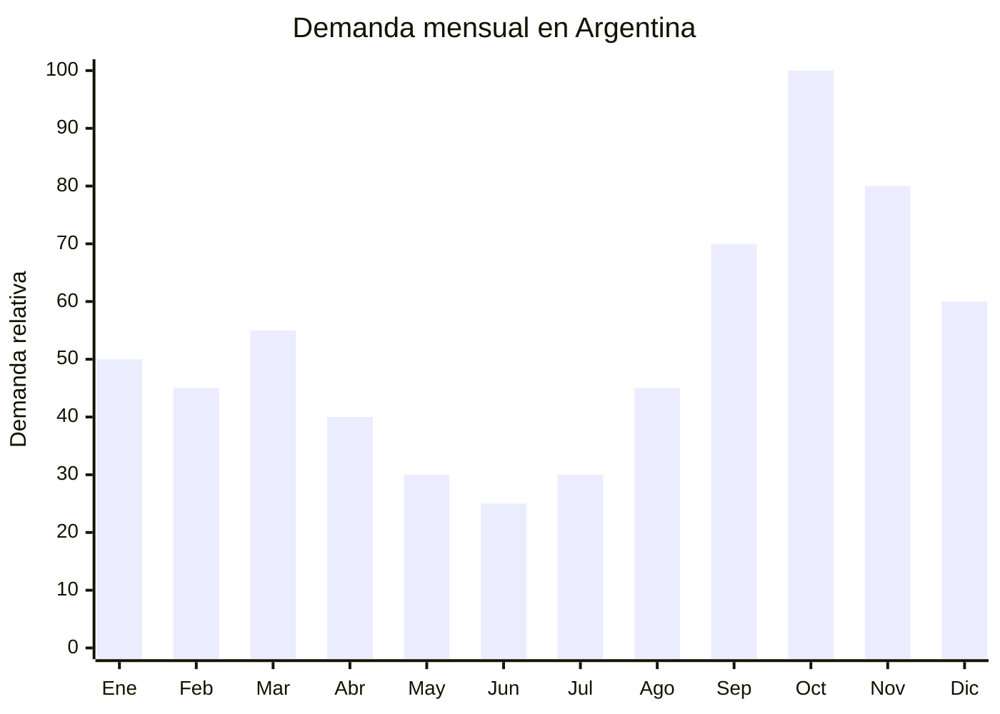

# Ropa deportiva mujer — Calzas, tops y conjuntos

> **Capítulo NCM 61** — Prendas y complementos de vestir, de punto | **Temporada:** Primavera (Sep–Nov)

<Warning>
**ANTIDUMPING VIGENTE sobre textiles Cap 61 de China.** Los derechos antidumping aplican sobre prendas de punto originarias de China y son **adicionales** al arancel base del 20% (post Decreto 236/2025). Calcular el impacto total antes de importar. Verificar NCM exacto en la [CNCE](https://www.argentina.gob.ar/cnce/investigaciones/medidasvigentes).
</Warning>

## Qué es y por qué importarlo

La ropa deportiva femenina (calzas, sports bras, tops y conjuntos) es uno de los segmentos de mayor crecimiento en Argentina. Dos factores convergen en primavera: el **Día de la Madre** (tercer domingo de octubre) que impulsa la compra como regalo, y el inicio de la **primavera activa** donde las mujeres retoman actividades al aire libre, running y gym.

El mercado de athleisure (ropa deportiva como vestimenta cotidiana) se ha consolidado como tendencia permanente. Marcas como Adidas, Nike y Under Armour son la referencia de precio alto, mientras que la importación desde China permite ofrecer conjuntos de calidad similar a un tercio del precio de marca.

China (Jinjiang, Fujian y Dongguan, Guangdong) es el centro global de producción de sportswear femenino, con telas técnicas (supplex, lycra, dry fit) y capacidad de producir sets coordinados con sublimación full print a costos competitivos.

## Datos clave

| Dato | Valor |
|------|-------|
| **FOB típico (China)** | USD 3.00 — 8.00/conjunto |
| **Precio venta Argentina** | ARS 12.000 — 35.000/conjunto |
| **Margen estimado** | 100% — 200% (variable por antidumping) |
| **MOQ habitual** | 100 — 500 unidades por diseño/talle |
| **Peso/volumen** | 0.25 — 0.40 kg/conjunto / 0.004 cbm aprox. |
| **Pico de demanda** | Octubre (Día de la Madre) — Noviembre |
| **Origen principal** | Jinjiang (Fujian) / Dongguan (Guangdong), China |

## Variantes y subtipos más comunes

| Variante | Descripción | FOB referencia |
|----------|-------------|----------------|
| Calza larga deportiva tiro alto | Supplex/poliéster+spandex, cintura ancha | USD 3.00 — 5.00 |
| Top deportivo / sports bra | Soporte medio, tiras cruzadas, con pad removible | USD 1.50 — 3.00 |
| Conjunto calza + top coordinado | Set 2 piezas, mismo diseño/color | USD 4.00 — 7.00 |
| Conjunto 3 piezas (calza + top + campera) | Set completo con campera liviana con cierre | USD 6.00 — 8.00 |
| Short deportivo + top | Set verano, tela liviana | USD 3.00 — 5.00 |

## Regulaciones y requisitos

<Tabs>
  <Tab title="Certificaciones">
    | Requisito | Obligatorio | Detalle |
    |-----------|-------------|---------|
    | Etiquetado textil IRAM 12560 | **Sí** | Composición de fibra (%), talle, origen, importador, lavado |
    | Antidumping CNCE | **Verificar NCM** | Posiciones 6112, 6114 y relacionadas |
    | Test de composición | Recomendado | Verificar que la tela sea realmente supplex/lycra declarada |
  </Tab>
  <Tab title="Etiquetado">
    **Obligatorio (Res. 287/2000):**
    - Composición exacta de fibras (ej: "82% Poliéster, 18% Elastano")
    - Talle en sistema argentino
    - Símbolos de conservación internacionales
    - País de origen
    - Datos completos del importador

    <Note>
    Los conjuntos de 2 o 3 piezas deben tener **cada prenda etiquetada individualmente**, no solo el packaging exterior.
    </Note>
  </Tab>
  <Tab title="Restricciones">
    **Antidumping Cap 61:**
    - Derechos antidumping vigentes sobre prendas de punto chinas
    - Aplican sobre calzas (6114), tops deportivos (6109/6112) y conjuntos
    - Decreto 236/2025 redujo DIE de 35% a 20%
    - El antidumping se suma al arancel reducido
    - **Estrategia:** Considerar proveedores en Vietnam o Bangladesh para evitar antidumping (sin antidumping vigente para esos orígenes)
  </Tab>
</Tabs>

## Logística de importación

| Aspecto | Detalle |
|---------|---------|
| **Método recomendado** | Marítimo LCL / Aéreo para pedidos urgentes Día de la Madre |
| **Tiempo total estimado** | 50 — 80 días (marítimo) / 15 — 25 días (aéreo) |
| **Embalaje típico** | Cada conjunto en bolsa individual con etiqueta, cajas de 50-100 sets |
| **Tip logístico** | Para Día de la Madre, el embarque aéreo es viable si el margen lo permite. Priorizar colores tendencia de temporada |

<Tip>
Si apuntás al **Día de la Madre** (tercer domingo de octubre), el pedido marítimo debe salir de China **a más tardar julio**. Alternativa: envío aéreo en septiembre (15-20 días) cuesta USD 4-6/kg pero el margen del conjunto lo absorbe. Ofrecer packaging de regalo (caja premium) aumenta el precio de venta un 30%.
</Tip>

## Estacionalidad y timing de compra

| Momento | Acción recomendada |
|---------|-------------------|
| Mayo — Junio | Seleccionar diseños tendencia, contactar proveedores |
| Julio | Confirmar orden y producción |
| Agosto — Septiembre | Embarque y recepción |
| Octubre | **Pico máximo — Día de la Madre** |
| Noviembre | Ventas sostenidas (primavera + CyberMonday) |
| Diciembre — Febrero | Continuidad verano (demanda alta) |

## Ventajas y riesgos

<CardGroup cols={2}>
  <Card title="Ventajas" icon="circle-check">
    - Doble driver: Día de la Madre + primavera activa
    - Tendencia athleisure consolidada y en crecimiento
    - Sets coordinados tienen mayor valor percibido
    - Producto liviano (flete eficiente)
    - Personalización con marca propia viable
  </Card>
  <Card title="Riesgos" icon="triangle-exclamation">
    - **Antidumping incrementa costos significativamente**
    - Tabla de talles asiáticos vs argentinos (diferencias importantes)
    - Etiquetado obligatorio por prenda individual
    - Calidad de tela variable (verificar composición real)
    - Competencia de marcas establecidas (Adidas como referencia)
  </Card>
</CardGroup>

## Palabras clave para buscar en Alibaba

> women yoga set, fitness leggings sports bra set, gym wear women wholesale, activewear set women, high waist leggings women, seamless yoga set, sports bra leggings set, workout clothing women bulk

## Fuentes

- [MercadoLibre Argentina — Conjuntos deportivos mujer](https://listado.mercadolibre.com.ar/conjunto-deportivo-mujer)
- [CNCE — Medidas antidumping vigentes](https://www.argentina.gob.ar/cnce/investigaciones/medidasvigentes)
- [Decreto 236/2025 — Reducción arancelaria](https://www.argentina.gob.ar/normativa)
- [Alibaba — Women yoga set](https://www.alibaba.com/showroom/women-yoga-set.html)
