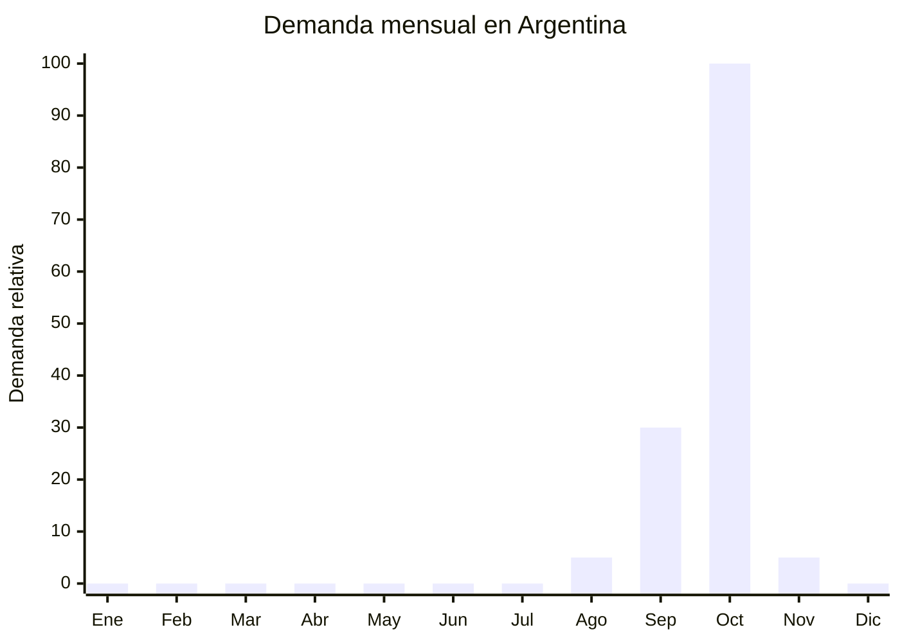

# Disfraces Halloween adultos y niños

> **Capítulo NCM 62** — Prendas y complementos de vestir, excepto los de punto | **Temporada:** Primavera (Sep–Nov)

## Qué es y por qué importarlo

Los disfraces de Halloween son un producto de temporada ultra-corta pero altamente rentable. En Argentina, la celebración de Halloween ha crecido exponencialmente: las búsquedas online registran un **incremento del +40% interanual**, especialmente entre jóvenes adultos (18-35 años) y familias con niños. La fiesta se concentra el 31 de octubre, pero la ventana de venta va de mediados de septiembre a fines de octubre.

El producto incluye disfraces completos (capa + máscara + accesorios), kits temáticos (vampiro, bruja, zombie, esqueleto, superhéroes) y accesorios sueltos (máscaras, pelucas, maquillaje FX, sangre falsa). Yiwu (China) es el epicentro mundial de producción de disfraces, con fábricas especializadas que producen a escala masiva para el mercado global.

La ventaja clave es que **no se consideran juguetes** (no requieren certificación IRAM de seguridad) y no tienen antidumping específico en el Capítulo 62 para disfraces. El margen es alto porque el consumidor paga por la experiencia/evento, no por el costo del material.

## Datos clave

| Dato | Valor |
|------|-------|
| **FOB típico (China)** | USD 2.00 — 10.00/disfraz |
| **Precio venta Argentina** | ARS 8.000 — 40.000 |
| **Margen estimado** | 200% — 400% |
| **MOQ habitual** | 50 — 200 unidades por modelo |
| **Peso/volumen** | 0.20 — 0.80 kg / 0.005 — 0.01 cbm aprox. |
| **Pico de demanda** | Octubre (concentrado en últimas 2 semanas) |
| **Origen principal** | Yiwu, Zhejiang, China |

## Variantes y subtipos más comunes

| Variante | Descripción | FOB referencia |
|----------|-------------|----------------|
| Disfraz adulto básico (capa + máscara) | Poliéster, talla única | USD 2.00 — 4.00 |
| Disfraz adulto completo premium | Múltiples piezas, detalles elaborados | USD 5.00 — 10.00 |
| Disfraz niño temático (3-12 años) | Superhéroe, princesa, animal, monstruo | USD 3.00 — 7.00 |
| Kit accesorios (máscara + peluca + maquillaje) | Complementos sueltos | USD 1.00 — 3.00 |
| Disfraz mascota | Perros pequeños/medianos, temática Halloween | USD 2.00 — 5.00 |

## Regulaciones y requisitos

<Tabs>
  <Tab title="Certificaciones">
    | Requisito | Obligatorio | Detalle |
    |-----------|-------------|---------|
    | Certificación IRAM (juguetes) | **No** | Los disfraces NO son juguetes, no requieren IRAM |
    | ANMAT | **No** | No aplica (excepto maquillaje FX, ver nota) |
    | Etiquetado textil | **Sí** | Composición, origen, importador |

    <Note>
    Si importás **maquillaje FX** (sangre falsa, pintura facial), esos productos **sí requieren registro ANMAT** como cosméticos. Los disfraces textiles por sí solos no lo requieren.
    </Note>
  </Tab>
  <Tab title="Etiquetado">
    - Composición textil del disfraz (ej: "100% Poliéster")
    - País de origen
    - Datos del importador
    - Talle o rango de talles (S/M/L o edad para niños)
    - **No se requiere** etiqueta IRAM de seguridad infantil
  </Tab>
  <Tab title="Restricciones">
    - Sin derechos antidumping específicos para disfraces en Cap 62
    - Arancel base (DIE): 20% (post Decreto 236/2025) + 3% tasa estadística
    - Sin cuotas de importación
    - **Atención:** Disfraces con luces LED pueden requerir homologación ENACOM si tienen componente electrónico
  </Tab>
</Tabs>

## Logística de importación

| Aspecto | Detalle |
|---------|---------|
| **Método recomendado** | **Aéreo** (temporada ultra-corta, no hay margen para demoras) |
| **Tiempo total estimado** | 15 — 25 días (aéreo) / 50 — 70 días marítimo (solo si planificás desde mayo) |
| **Embalaje típico** | Bolsa individual con header card, cajas surtidas por modelo/talle |
| **Tip logístico** | Producto voluminoso pero liviano. Negociar por peso volumétrico. Enviar comprimido al vacío reduce volumen 50% |

<Tip>
La ventana de venta es **extremadamente corta** (4-6 semanas). Si vas por marítimo, el pedido debe salir de China en julio-agosto como máximo. La opción más segura es **envío aéreo en septiembre** para tener stock a principios de octubre. El margen alto (200-400%) absorbe el costo aéreo sin problemas.
</Tip>

## Estacionalidad y timing de compra

| Momento | Acción recomendada |
|---------|-------------------|
| Mayo — Junio | Investigar tendencias (películas del año, temas virales), seleccionar modelos |
| Julio | Confirmar orden en Yiwu, producción rápida (15-20 días) |
| Agosto — Septiembre | Embarque aéreo / marítimo si planificaste con tiempo |
| Octubre 1-15 | **Lanzamiento ventas** — primeras compras |
| Octubre 15-31 | **Pico absoluto** — compras de último momento (mayor margen) |
| Noviembre | Liquidación de stock remanente (descuentos) |

## Ventajas y riesgos

<CardGroup cols={2}>
  <Card title="Ventajas" icon="circle-check">
    - Márgenes excepcionales (200-400%)
    - Halloween crece +40% interanual en Argentina
    - Sin certificación IRAM (no es juguete)
    - Sin antidumping en disfraces
    - Yiwu produce cualquier temática a escala
  </Card>
  <Card title="Riesgos" icon="triangle-exclamation">
    - Temporada ultra-corta (4-6 semanas efectivas)
    - Stock sobrante pierde 90% de valor post-Halloween
    - Requiere planificación logística precisa
    - Tendencias cambian cada año (película viral, meme del momento)
    - Productos voluminosos (costo flete por volumen)
  </Card>
</CardGroup>

## Palabras clave para buscar en Alibaba

> halloween costume wholesale, adult halloween costume, kids halloween costume set, halloween mask cape, scary costume cosplay, halloween accessories wholesale, pet halloween costume, halloween party supplies Yiwu

## Fuentes

- [MercadoLibre Argentina — Disfraces Halloween](https://listado.mercadolibre.com.ar/disfraces-halloween)
- [Google Trends Argentina — Halloween](https://trends.google.com.ar/trends/explore?q=halloween+disfraz)
- [Alibaba — Halloween costumes wholesale](https://www.alibaba.com/showroom/halloween-costume.html)
