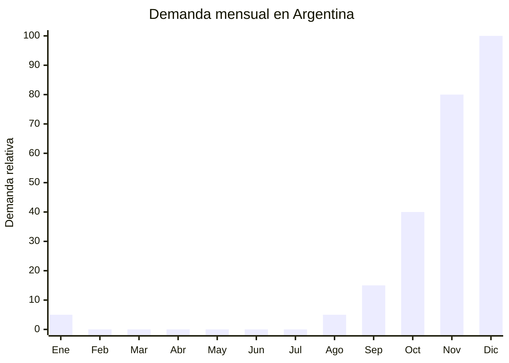

# Manteles y caminos de mesa navideños

> **Capítulo NCM 63** — Los demás artículos textiles confeccionados | **Temporada:** Primavera (Sep–Nov)

## Qué es y por qué importarlo

Los manteles y caminos de mesa con temática navideña son productos textiles de decoración estacional que incluyen manteles rectangulares/redondos, caminos de mesa (table runners), servilletas coordinadas e individuales, todos con estampados típicos: Papá Noel, renos, copos de nieve, acebo, árboles de Navidad, colores rojo/verde/dorado.

En Argentina, la decoración navideña para la mesa es una tradición arraigada. El **CyberMonday** (típicamente noviembre) impulsa fuertemente la categoría de Deco+Hogar, que según datos de la CACE crece **+5 puntos porcentuales** respecto al promedio del e-commerce durante el evento. Los consumidores aprovechan los descuentos para comprar decoración navideña anticipada.

La gran ventaja de este producto es que el Capítulo 63 (textil hogar) **no tiene derechos antidumping vigentes** contra China, a diferencia de los Capítulos 61 y 62 de indumentaria. Esto mejora significativamente la estructura de costos del importador.

## Datos clave

| Dato | Valor |
|------|-------|
| **FOB típico (China)** | USD 1.00 — 5.00/mantel |
| **Precio venta Argentina** | ARS 5.000 — 20.000 |
| **Margen estimado** | 200% — 350% |
| **MOQ habitual** | 100 — 500 unidades por diseño |
| **Peso/volumen** | 0.15 — 0.50 kg / 0.003 cbm aprox. por unidad |
| **Pico de demanda** | Noviembre — Diciembre |
| **Origen principal** | Shaoxing (Zhejiang) / Nantong (Jiangsu), China |

## Variantes y subtipos más comunes

| Variante | Descripción | FOB referencia |
|----------|-------------|----------------|
| Mantel rectangular navideño 150x200cm | Poliéster estampado, anti-manchas | USD 3.00 — 5.00 |
| Camino de mesa navideño 35x180cm | Estampado o bordado, bordes decorados | USD 1.00 — 3.00 |
| Set x4 individuales navideños | Poliéster estampado, 45x30cm | USD 1.50 — 3.00/set |
| Mantel redondo navideño 180cm | Para mesa redonda, borde festoneado | USD 3.00 — 5.00 |
| Set coordinado (mantel + camino + servilletas x6) | Pack completo para mesa navideña | USD 4.00 — 8.00/set |

## Regulaciones y requisitos

<Tabs>
  <Tab title="Certificaciones">
    | Requisito | Obligatorio | Detalle |
    |-----------|-------------|---------|
    | Certificación IRAM | No | No aplica a textil hogar decorativo |
    | ANMAT | No | No es producto alimentario ni sanitario |
    | Etiquetado textil básico | Sí | Composición, origen, importador |
  </Tab>
  <Tab title="Etiquetado">
    - Composición textil (ej: "100% Poliéster")
    - País de origen
    - Datos del importador
    - Instrucciones de lavado (recomendado)
    - Dimensiones del producto
  </Tab>
  <Tab title="Restricciones">
    **SIN antidumping para Cap 63 (textil hogar).**

    Esta es una ventaja significativa respecto a los Capítulos 61 y 62:
    - No hay derechos antidumping vigentes sobre artículos textiles de hogar de China
    - Arancel base (DIE): 20% (post Decreto 236/2025) + 3% tasa estadística
    - Sin cuotas ni restricciones adicionales
    - Producto de libre importación
  </Tab>
</Tabs>

## Logística de importación

| Aspecto | Detalle |
|---------|---------|
| **Método recomendado** | Marítimo LCL (volumen moderado) |
| **Tiempo total estimado** | 50 — 75 días (marítimo) |
| **Embalaje típico** | Doblados en bolsa de polietileno individual, cajas de 50-100 unidades |
| **Tip logístico** | Producto liviano y comprimible. Se puede combinar en contenedor con otros productos navideños (decoración, copas, adornos) para optimizar flete |

<Tip>
Combiná el embarque de manteles navideños con otros productos de la misma temporada (decoración navideña Cap 67, copas Cap 70) en un mismo contenedor LCL. Al compartir flete, el costo logístico por unidad baja significativamente. Pedí al forwarder un consolidado con salida en agosto para llegar en octubre.
</Tip>

## Estacionalidad y timing de compra

| Momento | Acción recomendada |
|---------|-------------------|
| Junio — Julio | Seleccionar diseños, confirmar orden con proveedor |
| Agosto | Embarque marítimo desde China |
| Septiembre — Octubre | Recepción, preparación de publicaciones, fotos de producto |
| Noviembre | **CyberMonday** — pico de ventas online (+5pp en Deco+Hogar) |
| Diciembre 1-20 | **Pico máximo** — compras de último momento para la mesa navideña |
| Enero | Liquidación de remanente (muy difícil vender post-fiestas) |

## Ventajas y riesgos

<CardGroup cols={2}>
  <Card title="Ventajas" icon="circle-check">
    - **Sin antidumping** (Cap 63 textil hogar)
    - CyberMonday impulsa categoría Deco+Hogar +5pp
    - Márgenes altos (200-350%)
    - Producto liviano y fácil de almacenar
    - Compra emocional (no se compara precio tanto)
  </Card>
  <Card title="Riesgos" icon="triangle-exclamation">
    - Producto estacional (nov-dic exclusivamente)
    - Stock sobrante solo sirve para la próxima Navidad
    - Diseños deben adaptarse al gusto argentino/latino
    - Competencia de bazares locales con producto similar
    - Requiere buenas fotos de producto (mesa armada completa)
  </Card>
</CardGroup>

## Palabras clave para buscar en Alibaba

> christmas tablecloth polyester, christmas table runner, holiday tablecloth printed, xmas placemat set, christmas table decoration textile, christmas table linen wholesale, red green tablecloth christmas, embroidered christmas runner

## Fuentes

- [CACE — Informe CyberMonday](https://www.cace.org.ar)
- [MercadoLibre Argentina — Manteles navideños](https://listado.mercadolibre.com.ar/mantel-navideno)
- [Alibaba — Christmas tablecloth](https://www.alibaba.com/showroom/christmas-tablecloth.html)
