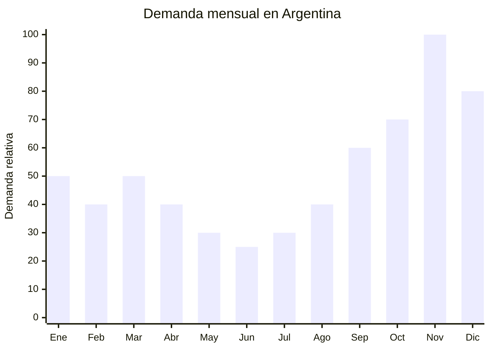

# Zapatillas deportivas running y urbanas

> **Capítulo NCM 64** — Calzado, polainas y artículos análogos | **Temporada:** Primavera (Sep–Nov)

<Warning>
**ANTIDUMPING VIGENTE — Resolución 915/2021.** Argentina aplica derechos antidumping sobre calzado deportivo de China con un **FOB mínimo de USD 15.70 por par**. Si tu precio FOB es inferior, la aduana ajustará el valor al mínimo para calcular derechos. Esto impacta directamente en la estructura de costos. Verificar siempre en la [CNCE](https://www.argentina.gob.ar/cnce/investigaciones/medidasvigentes).
</Warning>

## Qué es y por qué importarlo

Las zapatillas deportivas de running y uso urbano son uno de los productos más vendidos en Argentina durante el CyberMonday. Según datos del mercado, **Adidas fue la marca #1 en unidades vendidas** durante el evento, lo que demuestra la enorme demanda de calzado deportivo en la temporada primavera-verano.

El segmento incluye zapatillas de running con tecnología de amortiguación, zapatillas urbanas casuales tipo sneaker, y modelos de training/gym. Las marcas chinas como **Li-Ning** y **Anta** (esta última patrocinadora de la NBA) son alternativas reales con tecnología propia y precios FOB significativamente menores que las marcas occidentales.

China (Jinjiang, Fujian — la capital mundial del calzado deportivo) concentra la producción de las principales marcas globales y también de marcas locales con calidad comparable. Sin embargo, el antidumping (Res 915/2021) con FOB mínimo de USD 15.70/par es el factor determinante para calcular la rentabilidad.

## Datos clave

| Dato | Valor |
|------|-------|
| **FOB típico (China)** | USD 8.00 — 20.00/par |
| **Precio venta Argentina** | ARS 30.000 — 80.000 |
| **Margen estimado** | 80% — 150% (post antidumping) |
| **MOQ habitual** | 100 — 500 pares por modelo/talle |
| **Peso/volumen** | 0.70 — 1.00 kg / 0.008 cbm aprox. por par |
| **Pico de demanda** | Noviembre (CyberMonday) — Diciembre |
| **Origen principal** | Jinjiang / Quanzhou (Fujian), China |

## Variantes y subtipos más comunes

| Variante | Descripción | FOB referencia |
|----------|-------------|----------------|
| Running amortiguación básica | Mesh transpirable, suela EVA, unisex | USD 8.00 — 12.00 |
| Running premium (tipo Li-Ning/Anta) | Tecnología amortiguación avanzada, marca china | USD 15.00 — 20.00 |
| Sneaker urbano casual | Diseño streetwear, suela plana, hombre/mujer | USD 8.00 — 15.00 |
| Training/gym | Suela plana estable, refuerzo lateral | USD 10.00 — 15.00 |
| Zapatilla liviana trail/outdoor | Suela grip, resistente al agua | USD 12.00 — 18.00 |

## Regulaciones y requisitos

<Tabs>
  <Tab title="Certificaciones">
    | Requisito | Obligatorio | Detalle |
    |-----------|-------------|---------|
    | Etiquetado de calzado | **Sí** | Materiales (capellada, forro, suela), talle, origen |
    | Antidumping Res 915/2021 | **Sí** | FOB mínimo USD 15.70/par para calzado deportivo chino |
    | Certificado de origen | **Sí** | Obligatorio para cálculo de antidumping |
  </Tab>
  <Tab title="Etiquetado">
    **Obligatorio:**
    - Material de la capellada (ej: "Textil / Mesh")
    - Material del forro (ej: "Textil")
    - Material de la suela (ej: "Goma / EVA")
    - Talle en sistema argentino (AR 38-45)
    - País de origen
    - Datos del importador

    <Note>
    El sistema de talles chino difiere del argentino. Convertir **siempre** a talle AR/BR y verificar horma con muestras antes de producir. Un error de talles genera devoluciones masivas.
    </Note>
  </Tab>
  <Tab title="Restricciones">
    **Antidumping — Resolución 915/2021:**
    - Aplica a calzado deportivo (partidas 6402, 6403, 6404) de origen chino
    - **FOB mínimo: USD 15.70 por par** — si tu FOB real es menor, aduana ajusta al mínimo
    - Derecho antidumping: se calcula sobre el valor ajustado
    - DIE base: 20% (post Decreto 236/2025) + 3% tasa estadística + antidumping
    - **Impacto práctico:** Una zapatilla de USD 8 FOB real paga como si fuera de USD 15.70

    <Warning>
    **Cálculo obligatorio antes de importar:** Con FOB real de USD 8, la aduana valora a USD 15.70. El DIE (20%) se calcula sobre USD 15.70 = USD 3.14, más tasa estadística y antidumping adicional. El costo de internación puede superar el 50% del valor ajustado.
    </Warning>
  </Tab>
</Tabs>

## Logística de importación

| Aspecto | Detalle |
|---------|---------|
| **Método recomendado** | Marítimo FCL 20' (volumen alto por cajas de calzado) |
| **Tiempo total estimado** | 50 — 80 días (marítimo) |
| **Embalaje típico** | Caja individual por par, master carton de 10-12 pares, palletizado |
| **Tip logístico** | El calzado ocupa mucho volumen por las cajas. Un FCL 20' cabe ~5.000 pares. Considerar embalaje sin caja individual (bolsa) para reducir volumen 40% si el mercado lo acepta |

<Tip>
Las marcas chinas **Li-Ning** y **Anta** tienen precio FOB por encima de USD 15.70, por lo que el ajuste de antidumping no aplica sobre ellas. Además tienen reconocimiento de marca creciente. Considerar importar marcas chinas reconocidas en lugar de genéricas ultra-baratas que sufren el ajuste de valor mínimo.
</Tip>

## Estacionalidad y timing de compra

| Momento | Acción recomendada |
|---------|-------------------|
| Junio — Julio | Contactar fábricas en Jinjiang, pedir muestras de talles argentinos |
| Agosto | Confirmar orden, producción (30-45 días) |
| Septiembre | Embarque marítimo |
| Octubre | Recepción, preparación de inventario |
| Noviembre | **CyberMonday — pico máximo de ventas** |
| Diciembre — Enero | Ventas sostenidas (verano + regalos) |

## Ventajas y riesgos

<CardGroup cols={2}>
  <Card title="Ventajas" icon="circle-check">
    - Demanda masiva y creciente (athleisure + running)
    - CyberMonday potencia ventas exponencialmente
    - Marcas chinas (Li-Ning, Anta) ganan reconocimiento global
    - Alto ticket promedio (buen ingreso por venta)
    - Producto de uso cotidiano (recompra cada 6-12 meses)
  </Card>
  <Card title="Riesgos" icon="triangle-exclamation">
    - **Antidumping con FOB mínimo USD 15.70 destruye margen en gama baja**
    - Problemas de talles/horma (diferencia China vs Argentina)
    - Alta competencia de marcas globales y locales
    - Devoluciones por talle incorrecto (costo alto)
    - Requiere inversión inicial significativa (MOQ + flete)
  </Card>
</CardGroup>

## Palabras clave para buscar en Alibaba

> running shoes wholesale, sport shoes factory Jinjiang, Li-Ning running shoes, Anta sport shoes, mesh running shoes men, women running shoes wholesale, EVA sole sport shoes, athletic shoes OEM Fujian

## Fuentes

- [CNCE — Resolución 915/2021 antidumping calzado](https://www.argentina.gob.ar/cnce/investigaciones/medidasvigentes)
- [MercadoLibre Argentina — Zapatillas running](https://listado.mercadolibre.com.ar/zapatillas-running)
- [CACE — Informe CyberMonday](https://www.cace.org.ar)
- [Alibaba — Running shoes factory](https://www.alibaba.com/showroom/running-shoes-factory.html)
