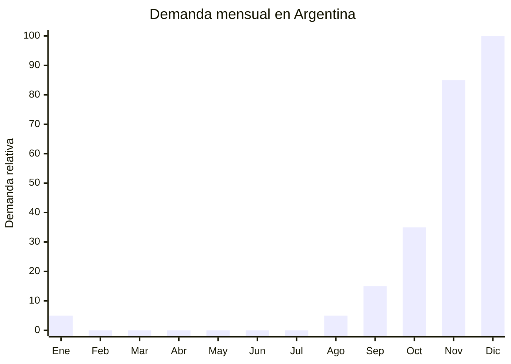

# Decoración navideña: guirnaldas, coronas y adornos

> **Capítulo NCM 67** — Plumas y plumón preparados; flores artificiales | **Temporada:** Primavera (Sep–Nov)

## Qué es y por qué importarlo

La decoración navideña artificial incluye guirnaldas de PVC con piñas y lazos rojos, coronas para puerta (wreaths), adornos colgantes para árbol, guirnaldas luminosas decorativas, ramas artificiales con nieve, y todo tipo de ornamentos navideños. Estos productos son esenciales para la temporada de fiestas en Argentina.

Yiwu (China) produce **más del 70% de la decoración navideña del mundo**. El distrito de Yiwu International Trade City tiene secciones enteras dedicadas exclusivamente a productos navideños, con cientos de fabricantes especializados que operan todo el año para surtir al mercado global. Esto significa variedad infinita, precios imbatibles y capacidad de producción para cualquier volumen.

La demanda en Argentina se concentra en noviembre (compra anticipada y CyberMonday) y las primeras tres semanas de diciembre. No existe regulación especial ni antidumping para estos productos, lo que simplifica enormemente la importación.

## Datos clave

| Dato | Valor |
|------|-------|
| **FOB típico (China)** | USD 0.50 — 5.00/pieza |
| **Precio venta Argentina** | ARS 3.000 — 25.000 |
| **Margen estimado** | 300% — 600% |
| **MOQ habitual** | 100 — 500 unidades por modelo |
| **Peso/volumen** | 0.10 — 1.50 kg / 0.005 — 0.03 cbm aprox. |
| **Pico de demanda** | Noviembre — Diciembre (primera quincena) |
| **Origen principal** | Yiwu (Zhejiang), China |

## Variantes y subtipos más comunes

| Variante | Descripción | FOB referencia |
|----------|-------------|----------------|
| Guirnalda PVC 2.7m con piñas y lazos | PVC verde, piñas naturales pintadas, lazos rojos | USD 2.00 — 5.00 |
| Corona puerta 40-50cm | PVC/rattan, con frutos, lazos y nieve artificial | USD 2.00 — 4.00 |
| Set adornos árbol x12-24 piezas | Bolas, estrellas, campanas en dorado/rojo/plateado | USD 1.00 — 3.00/set |
| Ramas decorativas con nieve artificial | PVC + flock, para centros de mesa | USD 0.50 — 1.50 |
| Guirnalda luminosa LED navideña | Luces cálidas + decoración PVC integrada | USD 3.00 — 5.00 |

## Regulaciones y requisitos

<Tabs>
  <Tab title="Certificaciones">
    | Requisito | Obligatorio | Detalle |
    |-----------|-------------|---------|
    | Certificación IRAM | No | No son juguetes ni artículos de seguridad |
    | ANMAT | No | No es producto sanitario |
    | ENACOM | **Solo si tiene LED** | Guirnaldas con luces LED pueden requerir homologación |

    <Note>
    Las guirnaldas **sin componente eléctrico** (solo PVC/rattan decorativo) no requieren ninguna certificación. Las que incluyen **luces LED con enchufe** pueden necesitar homologación ENACOM. Las que funcionan **a pilas** generalmente están exentas.
    </Note>
  </Tab>
  <Tab title="Etiquetado">
    - País de origen
    - Datos del importador
    - Materiales principales (ej: "PVC, poliéster, alambre galvanizado")
    - Si contiene luces: voltaje, potencia, tipo de enchufe
    - Advertencias de seguridad si tiene componentes eléctricos
  </Tab>
  <Tab title="Restricciones">
    **Sin restricciones especiales:**
    - Sin derechos antidumping
    - Arancel base (DIE): 18-20% según subpartida + 3% tasa estadística
    - Sin cuotas de importación
    - Producto de libre importación
  </Tab>
</Tabs>

## Logística de importación

| Aspecto | Detalle |
|---------|---------|
| **Método recomendado** | Marítimo FCL 20' (producto muy voluminoso) |
| **Tiempo total estimado** | 50 — 75 días (marítimo) |
| **Embalaje típico** | Cajas individuales con ventana, master carton, palletizado. Las guirnaldas se enrollan en aros |
| **Tip logístico** | Producto MUY voluminoso y liviano. El flete se calcula por volumen, no peso. Comprimir al máximo y negociar tarifa por CBM. Un FCL 20' puede cargar 10.000-15.000 piezas surtidas |

<Tip>
En Yiwu podés comprar de **múltiples fábricas** y consolidar todo en un solo contenedor a través de un agente de compras local. Esto permite armar un surtido variado (guirnaldas + coronas + adornos + manteles navideños Cap 63) en un solo embarque, optimizando el flete por pieza.
</Tip>

## Estacionalidad y timing de compra

| Momento | Acción recomendada |
|---------|-------------------|
| Mayo — Junio | Visitar Yiwu (si es posible) o seleccionar por catálogo, negociar precios |
| Julio | Confirmar orden, producción (20-30 días para estándar, 45 para personalizado) |
| Agosto | Embarque marítimo desde Ningbo/Shanghai |
| Octubre | Recepción en Argentina, preparación de stock |
| Noviembre | **Ventas masivas** — CyberMonday + anticipación navideña |
| Diciembre 1-20 | **Pico absoluto** — últimas compras antes de Navidad |

## Ventajas y riesgos

<CardGroup cols={2}>
  <Card title="Ventajas" icon="circle-check">
    - Márgenes excepcionales (300-600%)
    - Sin regulaciones ni antidumping
    - Yiwu ofrece variedad infinita y precios mínimos
    - Compra emocional/decorativa (menor sensibilidad al precio)
    - Se puede combinar múltiples productos en un embarque
  </Card>
  <Card title="Riesgos" icon="triangle-exclamation">
    - Temporada muy concentrada (nov-dic)
    - Producto voluminoso (flete alto por CBM)
    - Stock sobrante hay que guardarlo hasta la próxima Navidad
    - Calidad variable (verificar que el PVC no se desarme)
    - Guirnaldas con luces pueden requerir ENACOM
  </Card>
</CardGroup>

## Palabras clave para buscar en Alibaba

> christmas garland PVC, christmas wreath door, christmas ornaments wholesale, christmas decoration Yiwu, artificial christmas garland pine, christmas ball set wholesale, christmas tree decoration, holiday wreath with pinecones

## Fuentes

- [MercadoLibre Argentina — Decoración navideña](https://listado.mercadolibre.com.ar/decoracion-navidena)
- [Yiwu International Trade City — Christmas district](https://www.yiwugou.com)
- [Alibaba — Christmas decoration wholesale](https://www.alibaba.com/showroom/christmas-decoration.html)
