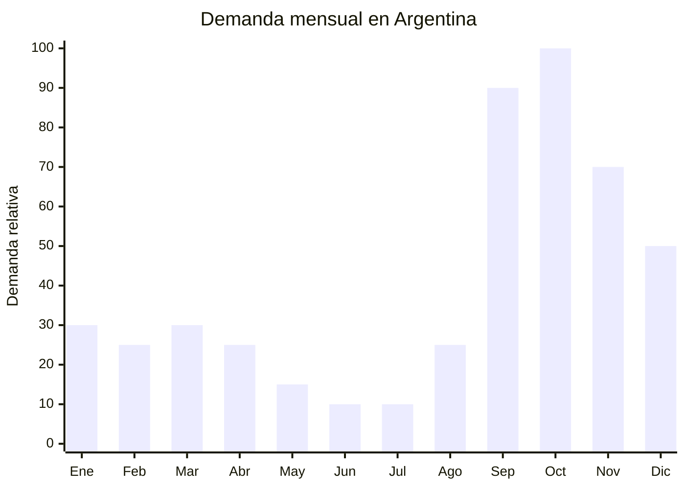

# Macetas cerámicas decorativas para plantas

> **Capítulo NCM 69** — Productos cerámicos | **Temporada:** Primavera (Sep–Nov)

## Qué es y por qué importarlo

Las macetas cerámicas decorativas son recipientes esmaltados con diseños estéticos para plantas de interior y exterior. Incluyen macetas con patrones geométricos, estilo boho/nórdico, terminaciones mates o brillantes, y formatos variados desde suculentas hasta plantas grandes. La tendencia de decoración con plantas ("plant parenthood") se ha consolidado como un movimiento permanente en Argentina.

La primavera es el **pico natural de la jardinería**: septiembre y octubre son los meses donde los argentinos renuevan sus plantas, transplantan, y decoran balcones y patios. Las macetas decorativas importadas se diferencian de las macetas plásticas locales por su valor estético y se venden como artículos de **decoración**, no como simple contenedor.

China es el mayor productor mundial de cerámica. Las ciudades de **Jingdezhen** (Jiangxi) — la capital histórica de la porcelana — y **Dehua** (Fujian) concentran miles de fábricas especializadas en cerámica decorativa con capacidad de producir esmaltados, patrones complejos y acabados premium a FOB extremadamente competitivos.

## Datos clave

| Dato | Valor |
|------|-------|
| **FOB típico (China)** | USD 1.00 — 5.00/maceta |
| **Precio venta Argentina** | ARS 4.000 — 20.000 |
| **Margen estimado** | 200% — 400% |
| **MOQ habitual** | 100 — 500 unidades por modelo |
| **Peso/volumen** | 0.30 — 2.00 kg / 0.003 — 0.015 cbm aprox. |
| **Pico de demanda** | Septiembre — Octubre (jardinería primaveral) |
| **Origen principal** | Jingdezhen (Jiangxi) / Dehua (Fujian), China |

## Variantes y subtipos más comunes

| Variante | Descripción | FOB referencia |
|----------|-------------|----------------|
| Maceta suculenta mini (6-8cm) | Cerámica esmaltada, colores pastel, set x3-6 | USD 0.50 — 1.50/unidad |
| Maceta mediana cilíndrica (12-15cm) | Patrón geométrico, mate, con plato | USD 1.50 — 3.00 |
| Maceta grande decorativa (20-25cm) | Estilo boho/nórdico, texturizada | USD 3.00 — 5.00 |
| Maceta colgante cerámica | Con cuerda macramé incluida | USD 2.00 — 4.00 |
| Set x3 macetas escalonadas | Tamaños graduados, mismo diseño | USD 3.00 — 5.00/set |

## Regulaciones y requisitos

<Tabs>
  <Tab title="Certificaciones">
    | Requisito | Obligatorio | Detalle |
    |-----------|-------------|---------|
    | Certificación IRAM | No | No aplica a macetas decorativas |
    | ANMAT | No | No es producto alimentario (si fuera vajilla, sí) |
    | Certificado de origen | Recomendado | Para beneficios arancelarios |

    <Note>
    Las macetas cerámicas decorativas **no contactan alimentos**, por lo que no requieren los análisis de migración de plomo/cadmio que sí aplican a vajilla cerámica. Esta distinción es importante al clasificar en aduana.
    </Note>
  </Tab>
  <Tab title="Etiquetado">
    - País de origen
    - Datos del importador
    - Material ("Cerámica esmaltada")
    - Precaución: "Producto frágil"
  </Tab>
  <Tab title="Restricciones">
    - Sin derechos antidumping sobre cerámica decorativa
    - Arancel base (DIE): 18-20% según subpartida + 3% tasa estadística
    - Sin cuotas de importación
    - Producto de libre importación
  </Tab>
</Tabs>

## Logística de importación

| Aspecto | Detalle |
|---------|---------|
| **Método recomendado** | Marítimo LCL o FCL (según volumen). **NUNCA aéreo** (peso/fragilidad) |
| **Tiempo total estimado** | 50 — 80 días (marítimo) |
| **Embalaje típico** | Cada maceta envuelta en burbuja + papel, separadores de cartón, cajas reforzadas con esquineros |
| **Tip logístico** | La cerámica es FRÁGIL y PESADA. Exigir embalaje doble caja (inner box + master carton) con relleno de espuma. Solicitar fotos del embalaje antes del embarque. La rotura típica es 3-5% con buen embalaje |

<Tip>
Pedí al proveedor que envíe las macetas **con orificio de drenaje** ya perforado. En Argentina, las macetas sin drenaje se venden peor porque los compradores las necesitan funcionales, no solo decorativas. Verificar en la muestra antes de producir.
</Tip>

## Estacionalidad y timing de compra

| Momento | Acción recomendada |
|---------|-------------------|
| Mayo — Junio | Seleccionar modelos, pedir muestras, verificar calidad de esmaltado |
| Julio | Confirmar orden, producción (30-45 días) |
| Agosto | Embarque marítimo, supervisar embalaje |
| Septiembre | **Inicio pico jardinería** — tener stock listo |
| Octubre | **Pico máximo** — primavera plena + Día de la Madre (combo maceta + planta) |
| Noviembre — Diciembre | Ventas sostenidas (regalo navideño + decoración) |

## Ventajas y riesgos

<CardGroup cols={2}>
  <Card title="Ventajas" icon="circle-check">
    - Márgenes altos (200-400%)
    - Sin regulación ni antidumping
    - Tendencia "plant parenthood" consolidada
    - Producto decorativo con compra emocional
    - China (Jingdezhen/Dehua) ofrece calidad excepcional a bajo costo
  </Card>
  <Card title="Riesgos" icon="triangle-exclamation">
    - **Producto frágil** — rotura en tránsito (3-5% con buen embalaje, hasta 15% con malo)
    - Producto pesado (flete por peso, no volumen)
    - Requiere embalaje especial costoso
    - Inspección pre-embarque recomendada (defectos de esmaltado)
    - Estacionalidad marcada (sep-oct pico, invierno bajo)
  </Card>
</CardGroup>

## Palabras clave para buscar en Alibaba

> ceramic flower pot decorative, glazed ceramic planter, succulent pot ceramic, geometric plant pot, boho ceramic planter, hanging ceramic pot, Jingdezhen flower pot, nordic style plant pot wholesale

## Fuentes

- [MercadoLibre Argentina — Macetas cerámicas decorativas](https://listado.mercadolibre.com.ar/macetas-ceramicas-decorativas)
- [Alibaba — Ceramic flower pot](https://www.alibaba.com/showroom/ceramic-flower-pot.html)
- [Dehua Ceramic Association](https://www.alibaba.com/showroom/dehua-ceramic.html)
