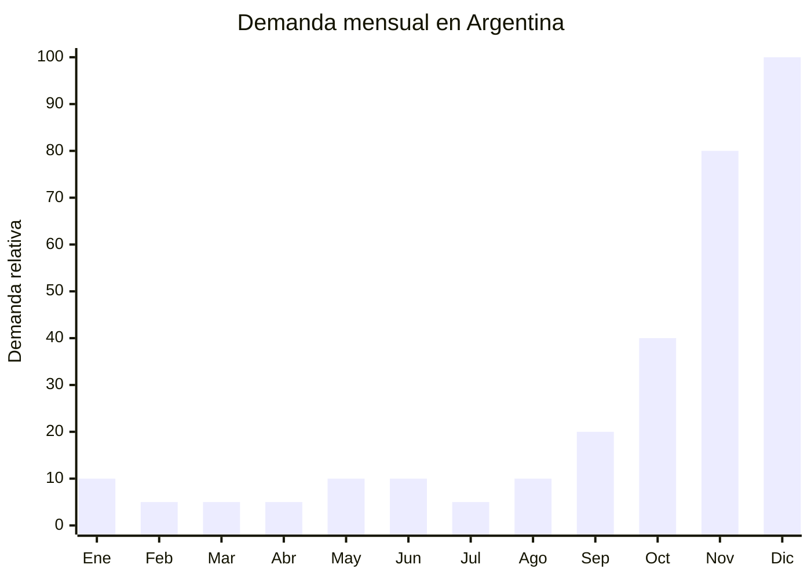

# Copas y vasos cristal para brindis Navidad/Año Nuevo

> **Capítulo NCM 70** — Vidrio y sus manufacturas | **Temporada:** Primavera (Sep–Nov)

## Qué es y por qué importarlo

Las copas y vasos de cristal para brindis son un producto esencial de la temporada navideña argentina. Incluyen sets de copas de champagne (flautas y coupé), copas de vino tinto y blanco, vasos de whisky (old fashioned), vasos largos (highball) y sets completos de cristalería para las fiestas. La tradición del brindis de medianoche en Nochebuena y Año Nuevo genera una demanda concentrada y predecible.

El pico de compra ocurre en **noviembre** (preparación anticipada + CyberMonday) y la primera quincena de diciembre. Los consumidores renuevan su cristalería antes de las fiestas, y los sets de copas son uno de los regalos más populares para Secret Santa / amigo invisible en empresas.

China produce cristalería de alta calidad a precios FOB muy competitivos. Si bien no alcanza la reputación del cristal de Bohemia (República Checa) o Murano (Italia), la relación calidad-precio es imbatible para el segmento masivo argentino. Las fábricas en Shanxi y Anhui producen desde vidrio soplado a máquina hasta cristal sin plomo con acabados premium.

## Datos clave

| Dato | Valor |
|------|-------|
| **FOB típico (China)** | USD 1.00 — 4.00/copa |
| **Precio venta Argentina** | ARS 3.000 — 15.000/copa (ARS 12.000 — 50.000/set x4-6) |
| **Margen estimado** | 200% — 350% |
| **MOQ habitual** | 200 — 1.000 unidades (o 100-200 sets) |
| **Peso/volumen** | 0.15 — 0.40 kg/copa / 0.005 cbm aprox. |
| **Pico de demanda** | Noviembre — Diciembre |
| **Origen principal** | Shanxi / Anhui / Shandong, China |

## Variantes y subtipos más comunes

| Variante | Descripción | FOB referencia |
|----------|-------------|----------------|
| Copa flauta champagne (set x6) | Vidrio cristalino, tallo largo, 200ml | USD 4.00 — 8.00/set |
| Copa vino tinto (set x4) | Boca ancha, 450ml, vidrio sin plomo | USD 3.00 — 6.00/set |
| Vaso whisky old fashioned (set x4) | Base pesada, 300ml, corte diamante | USD 3.00 — 6.00/set |
| Copa coupé champagne (set x4) | Estilo vintage/retro, 250ml | USD 3.00 — 5.00/set |
| Set mixto brindis (6 flautas + decanter) | Set regalo premium con caja | USD 6.00 — 12.00/set |

## Regulaciones y requisitos

<Tabs>
  <Tab title="Certificaciones">
    | Requisito | Obligatorio | Detalle |
    |-----------|-------------|---------|
    | Certificación IRAM | No | No aplica a cristalería decorativa/de mesa |
    | ANMAT | No | Las copas de vidrio no requieren registro ANMAT |
    | Análisis de plomo | Recomendado | Verificar que el cristal sea "lead-free" (sin plomo) para contacto con bebidas |

    <Note>
    Aunque no es obligatorio por regulación argentina, es fuertemente recomendable importar cristal **sin plomo** (lead-free crystal). El cristal con plomo (crystal glass con PbO) está siendo desplazado del mercado por preocupaciones de salud. Comercialmente, "cristal sin plomo" es un argumento de venta positivo.
    </Note>
  </Tab>
  <Tab title="Etiquetado">
    - País de origen
    - Datos del importador
    - Material ("Vidrio cristalino" o "Cristal sin plomo")
    - Capacidad en ml
    - Precaución: "Producto frágil / Lavado a mano recomendado"
  </Tab>
  <Tab title="Restricciones">
    - Sin derechos antidumping sobre cristalería de China
    - Arancel base (DIE): 18-20% según subpartida + 3% tasa estadística
    - Sin cuotas de importación
    - Producto de libre importación
  </Tab>
</Tabs>

## Logística de importación

| Aspecto | Detalle |
|---------|---------|
| **Método recomendado** | Marítimo LCL (fragilidad requiere embalaje cuidadoso, no aéreo) |
| **Tiempo total estimado** | 50 — 75 días (marítimo) |
| **Embalaje típico** | Cada copa en divisores de espuma/cartón corrugado, inner box + master carton, esquineros, FRAGILE visible |
| **Tip logístico** | Exigir **embalaje grado exportación** con prueba de caída (drop test). Solicitar video del proceso de empaque. La rotura típica es 2-5% con buen embalaje, pero puede llegar al 20% con embalaje deficiente |

<Tip>
Pedí al proveedor que incluya **1-2 copas extra por set** como reposición por posible rotura en tránsito. Muchos proveedores chinos aceptan esto si lo negociás al momento de la orden. Esto evita tener sets incompletos (un set x6 con 5 copas es invendible).
</Tip>

## Estacionalidad y timing de compra

| Momento | Acción recomendada |
|---------|-------------------|
| Junio — Julio | Seleccionar modelos, pedir muestras, verificar transparencia y acabado |
| Agosto | Confirmar orden, producción (25-35 días) |
| Septiembre | Embarque marítimo con embalaje reforzado |
| Octubre | Recepción, inspección de rotura, armado de sets |
| Noviembre | **CyberMonday + ventas anticipadas navideñas** |
| Diciembre 1-20 | **Pico máximo** — regalo y renovación de cristalería |

## Ventajas y riesgos

<CardGroup cols={2}>
  <Card title="Ventajas" icon="circle-check">
    - Sin regulación ni antidumping
    - Demanda predecible y concentrada (brindis navideño)
    - Márgenes altos (200-350%)
    - Sets regalo con packaging premium aumentan valor percibido
    - Compra emocional/celebratoria
  </Card>
  <Card title="Riesgos" icon="triangle-exclamation">
    - **Producto extremadamente frágil** — rotura en tránsito
    - Embalaje costoso y voluminoso
    - Sets incompletos por rotura = producto invendible
    - Estacionalidad concentrada (nov-dic)
    - Competencia de marcas reconocidas (Rigolleau, Cristar locales)
  </Card>
</CardGroup>

## Palabras clave para buscar en Alibaba

> champagne glass set wholesale, wine glass crystal, lead free crystal glass, whiskey glass set, champagne flute wholesale, crystal wine glass set gift box, cocktail glass wholesale, glassware set Christmas

## Fuentes

- [MercadoLibre Argentina — Copas champagne](https://listado.mercadolibre.com.ar/copas-champagne)
- [Alibaba — Crystal wine glass wholesale](https://www.alibaba.com/showroom/crystal-wine-glass.html)
- [CACE — Informe CyberMonday](https://www.cace.org.ar)
