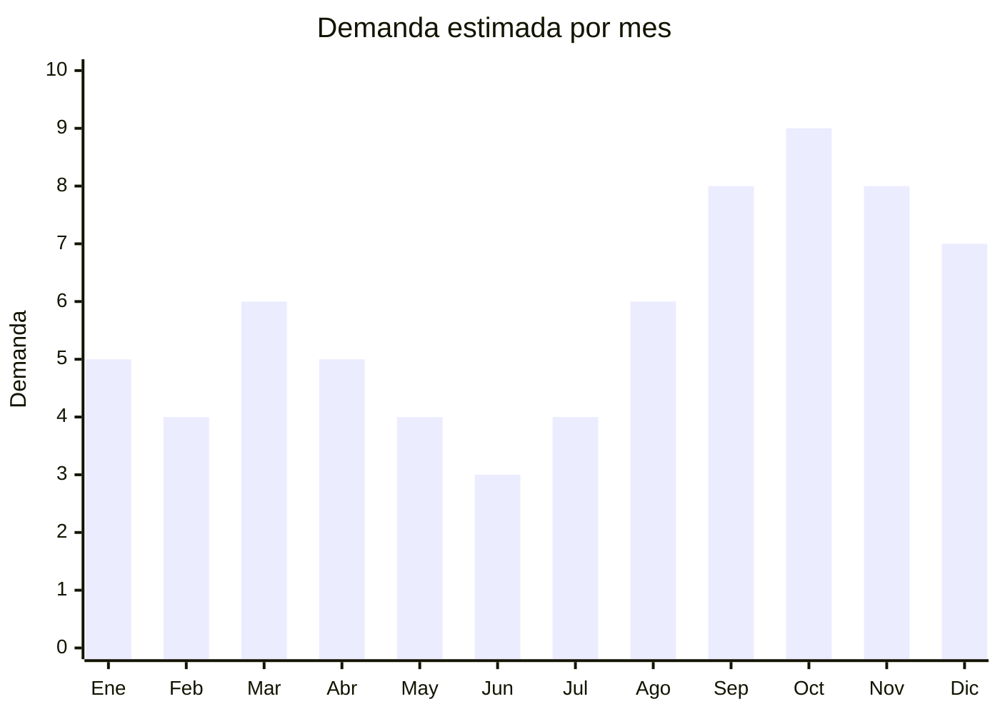

# Accesorios de pelo premium

> **Capitulo NCM 71** — Perlas finas, piedras preciosas, bisuteria y accesorios | **Temporada:** Primavera (Sep–Nov)

## Que es y por que importarlo

Los accesorios de pelo premium incluyen pinzas tipo garra (claw clips) en formato Y2K, vinchas acolchadas (padded headbands), sets de scrunchies de seda o satin, hebillas decorativas y broches con pedreria. Son productos que explotaron en redes sociales —especialmente TikTok con la tendencia "claw clip hairstyle"— y se mantienen como un segmento de altisima rotacion y margen en Argentina.

La primavera es el momento clave para estos productos: el buen tiempo impulsa recogidos, semirecogidos y peinados con accesorios visibles. Ademas, octubre trae el Dia de la Madre (regalo estrella en el rango de ARS 5.000-15.000) y noviembre el CyberMonday, donde los kits de accesorios de pelo se posicionan consistentemente entre los mas vendidos de la categoria belleza.

La ventaja competitiva principal es que son productos ultralivianos (un lote de 1.000 unidades pesa menos de 15 kg), sin regulacion sanitaria ni certificaciones obligatorias, con FOB desde USD 0.20 por pieza y precios de venta en Argentina que superan los ARS 3.000-8.000 por unidad. Esto genera margenes brutos superiores al 500%, convirtiendo a estos accesorios en uno de los productos mas rentables por kilo importado.

## Datos clave

| Dato | Valor |
|------|-------|
| **FOB tipico (China)** | USD 0.20 — 2.00/pieza |
| **Precio venta Argentina** | ARS 3.000 — 15.000 por pieza o set |
| **Margen estimado** | 500 — 800% |
| **MOQ habitual** | 100 — 500 unidades por modelo |
| **Peso/volumen** | 0.01 — 0.05 kg/pieza / 0.01 cbm aprox. por 100u |
| **Pico de demanda** | Octubre (Dia de la Madre) y Noviembre (CyberMonday) |
| **Origen principal** | Yiwu, Zhejiang, China |

## Demanda y mercado en Argentina

- **Volumen de mercado:** Miles de publicaciones activas en MercadoLibre con vendedores que superan las 5.000 unidades vendidas. Las pinzas garra son el subtipo de mayor volumen.
- **Tendencia:** Crecimiento sostenido, impulsado por contenido de TikTok e Instagram. La tendencia "claw clip" no muestra signos de desaceleracion.
- **Perfil del comprador:** Mujeres de 15-40 anos, tanto consumidoras finales como revendedoras (mayoristas en Once y Flores). Los kits regalo tienen demanda fuerte en octubre.
- **Canales de venta:** MercadoLibre (dominante), Instagram Shopping, ferias de emprendedores, mayoristas a peluquerias y perfumerias.

<Note>
Los precios en MercadoLibre varian enormemente segun la presentacion. Una pinza garra suelta se vende a ARS 3.000-5.000, pero un kit de 5 pinzas en caja regalo puede alcanzar ARS 12.000-15.000. La presentacion es clave para maximizar el ticket promedio.
</Note>

## Variantes y subtipos mas comunes

| Variante | Descripcion | FOB referencia |
|----------|-------------|----------------|
| Pinzas garra Y2K grandes (10-12 cm) | Acrilico transparente, carey, colores pastel. Tendencia TikTok | USD 0.30 — 0.80/u |
| Vinchas acolchadas (padded headbands) | Tela satin, terciopelo, tweed. Estilo Blair Waldorf | USD 0.50 — 1.50/u |
| Sets scrunchies seda/satin (x3-5) | Satin de morera o poliester satin. Anti-frizz, anti-rotura | USD 0.80 — 2.00/set |
| Hebillas minimalistas metalicas | Dorado, plateado, geometricas. Estilo Pinterest | USD 0.20 — 0.60/u |
| Pinzas banana grandes | Resina acetato, estampados carey y marmolado | USD 0.25 — 0.70/u |
| Broches perlas y pedreria | Clips decorativos para novias, eventos, regalo | USD 0.40 — 1.50/u |
| Kits combo regalo (5-10 piezas) | Mix de pinzas + scrunchies + vinchas en caja | USD 1.50 — 3.00/kit |

## Regulaciones y requisitos

<Tabs>
  <Tab title="Certificaciones">
    | Organismo | Requiere | Detalle |
    |-----------|----------|---------|
    | ARCA (Aduana) | Si siempre | Despacho de importacion estandar |
    | ANMAT | No | No es cosmetico ni producto sanitario |
    | ENACOM | No | No es dispositivo electronico |
    | INTI | No | No es textil ni calzado (es accesorio) |

    **Ventaja regulatoria:** Estos accesorios no requieren ninguna certificacion especial. Al clasificarse como bisuteria o accesorios (Cap. 71), evitan las barreras de ANMAT, ENACOM e INTI. Es uno de los productos con menor friccion regulatoria del mercado.
  </Tab>

  <Tab title="Etiquetado">
    | Requisito | Aplica |
    |-----------|--------|
    | Idioma espanol | Si |
    | Datos del importador | Si (razon social, CUIT, direccion) |
    | Composicion / materiales | Si (acrilico, satin, seda, metal) |
    | Pais de origen | Si |
    | Garantia legal 6 meses | Si |
    | Instrucciones de cuidado | Recomendado para scrunchies seda |
  </Tab>

  <Tab title="Restricciones">
    Sin restricciones significativas. No hay antidumping, no hay licencias previas, no hay cupos. Unico punto de atencion: si los accesorios contienen niquel en las partes metalicas, verificar que cumplan con limites de liberacion de niquel (norma EU EN 1811) para evitar reclamos por alergias, aunque esto no es exigido formalmente en Argentina.
  </Tab>
</Tabs>

## Logistica de importacion

| Dato | Valor |
|------|-------|
| **Peso tipico por lote (500u)** | 5 — 15 kg |
| **Volumen tipico** | Muy bajo (ultraliviano) |
| **Fragilidad** | Baja-Media (acrilico puede rayarse) |
| **Envio recomendado** | Aereo/Courier para primeros pedidos; Maritimo LCL para volumen |
| **Tiempo total estimado** | 10 — 20 dias (aereo) / 45 — 70 dias (maritimo) |
| **Baterias de litio** | No |
| **Empaque especial** | Bolsas individuales OPP para evitar rayaduras |

<Tip>
Por el peso ultraliviano, incluso el envio aereo resulta economico. Un pedido de 1.000 pinzas garra puede enviarse por courier express (DHL, FedEx) por aproximadamente USD 80-150 y llegar en 7-12 dias. Ideal para testear el mercado antes de hacer pedidos maritimos grandes.
</Tip>

## Estacionalidad y timing de compra

| Aspecto | Detalle |
|---------|---------|
| **Meses pico** | Septiembre-Octubre (primavera + Dia de la Madre) y Noviembre (CyberMonday) |
| **Meses valle** | Mayo-Junio (invierno, menos peinados con accesorios visibles) |
| **Cuando pedir** | Julio-Agosto para tener stock listo en septiembre. Pedido maritimo en junio si se quiere llegar a octubre |
| **Tendencia interanual** | Crecimiento sostenido impulsado por TikTok y reels de peinados |

## Ventajas y riesgos

<CardGroup cols={2}>
  <Card title="Ventajas" icon="circle-check">
    - Margen bruto superior al 500%
    - Ultraliviano: flete minimo incluso por avion
    - Sin regulaciones ni certificaciones
    - MOQ bajo para testear
    - Tendencia TikTok genera demanda organica
    - Ideal para marca propia y packaging premium
    - Multiple uso como regalo (Dia de la Madre, Navidad)
  </Card>
  <Card title="Riesgos" icon="triangle-exclamation">
    - Tendencias cambian rapido (vigilar redes sociales)
    - Acrilico barato puede romperse o decolorarse
    - Scrunchies de "seda" a veces son poliester puro (verificar)
    - Competencia creciente de vendedores locales que copian modelos
    - Colores y acabados pueden variar entre lotes
  </Card>
</CardGroup>

<Warning>
Pedir siempre muestras antes de un pedido grande. La calidad del acrilico varia enormemente: las pinzas garra baratas se quiebran al primer uso y generan devoluciones masivas. Verificar que el mecanismo de apertura tenga buen resorte y que los scrunchies de "seda" realmente sean satin de calidad y no poliester rigido.
</Warning>

## Palabras clave para buscar en Alibaba

> claw clip wholesale Y2K, hair claw clip large acetate, padded headband satin wholesale, silk scrunchie set bulk, hair accessories set gift box, acrylic hair clip wholesale, pearl hair clip bridal, banana clip wholesale, hair accessories private label

## Fuentes

- [MercadoLibre Argentina — Pinzas pelo](https://listado.mercadolibre.com.ar/pinzas-pelo)
- [Alibaba — Hair claw clips wholesale](https://www.alibaba.com/showroom/hair-claw-clips-wholesale.html)
- [TikTok Trend Report — Claw clip hairstyles](https://www.tiktok.com/tag/clawclip)
- [Nubimetrics — Tendencias accesorios de pelo Argentina](https://www.nubimetrics.com)
