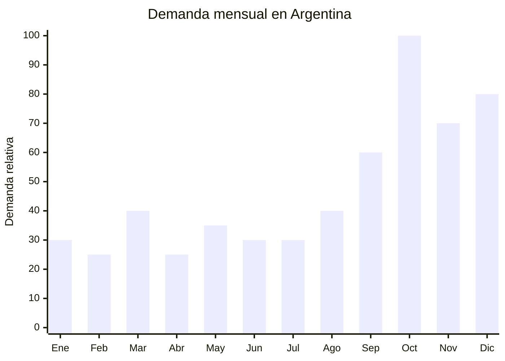

# Bijouterie femenina — Acero quirúrgico 316L

> **Capítulo NCM 71** — Perlas, piedras preciosas, metales preciosos y bisutería | **Temporada:** Primavera (Sep–Nov)

## Qué es y por qué importarlo

La bijouterie femenina en acero quirúrgico 316L incluye collares, pulseras, aros (aretes), anillos, tobilleras y sets coordinados. El acero quirúrgico 316L es el material estrella de la bijouterie actual porque es **hipoalergénico**, no se oxida, no mancha la piel y mantiene su brillo sin cuidados especiales. Esto lo diferencia de la bisutería tradicional en zamak o aleaciones que se ennegrecen rápidamente.

El **Día de la Madre** (tercer domingo de octubre en Argentina) es el evento comercial más importante para esta categoría. La bijouterie es el regalo por excelencia: accesible, elegante y con alto valor percibido. Las ventas se concentran en las dos semanas previas al Día de la Madre, con un segundo pico en noviembre-diciembre (CyberMonday + regalos navideños).

Yiwu (China) es el centro mundial de producción de bijouterie, con miles de fábricas especializadas en acero quirúrgico que producen a escala masiva. Los costos FOB son extraordinariamente bajos (USD 0.50-5.00 por pieza) y el margen de reventa en Argentina es de los más altos del mercado importador.

## Datos clave

| Dato | Valor |
|------|-------|
| **FOB típico (China)** | USD 0.50 — 5.00/pieza |
| **Precio venta Argentina** | ARS 5.000 — 25.000 |
| **Margen estimado** | 400% — 800% |
| **MOQ habitual** | 50 — 200 unidades por modelo |
| **Peso/volumen** | 0.01 — 0.05 kg / mínimo (producto tiny) |
| **Pico de demanda** | Octubre (Día de la Madre) — Diciembre |
| **Origen principal** | Yiwu (Zhejiang), China |

## Variantes y subtipos más comunes

| Variante | Descripción | FOB referencia |
|----------|-------------|----------------|
| Collar cadena acero 316L con dije | Cadena 45-50cm, dije corazón/infinito/inicial | USD 1.00 — 3.00 |
| Pulsera acero quirúrgico con dijes | Eslabones o cadena, charms colgantes | USD 0.80 — 2.50 |
| Aros argolla acero 316L | Argollas 2-4cm, cierre click, varios tamaños | USD 0.50 — 1.50/par |
| Set collar + aros + pulsera coordinado | Caja regalo, mismo diseño | USD 2.00 — 5.00/set |
| Anillo acero quirúrgico | Fino, medio o cúpula, con/sin piedra | USD 0.50 — 2.00 |

## Regulaciones y requisitos

<Tabs>
  <Tab title="Certificaciones">
    | Requisito | Obligatorio | Detalle |
    |-----------|-------------|---------|
    | Certificación IRAM | No | No aplica a bijouterie/bisutería |
    | ANMAT | No | No es dispositivo médico (a pesar del nombre "quirúrgico") |
    | Certificado de composición | Recomendado | Solicitar certificado 316L al proveedor (prueba de níquel) |

    <Note>
    El acero "quirúrgico" 316L es un término comercial, no médico. No requiere registro sanitario. Sin embargo, es recomendable solicitar al proveedor un **certificado de composición** que acredite que el material es efectivamente acero inoxidable AISI 316L (bajo contenido de níquel para evitar alergias).
    </Note>
  </Tab>
  <Tab title="Etiquetado">
    - País de origen
    - Datos del importador
    - Material ("Acero inoxidable 316L" o "Acero quirúrgico")
    - **No declarar como oro, plata o platino** si no lo es (esto es fraude)
  </Tab>
  <Tab title="Restricciones">
    - Sin derechos antidumping sobre bijouterie de China
    - Arancel base (DIE): 18-20% según subpartida + 3% tasa estadística
    - Sin cuotas de importación
    - Producto de libre importación

    <Warning>
    **Cuidado con la clasificación arancelaria.** La bijouterie de acero quirúrgico clasifica en el Cap 71 como bisutería (7117). No confundir con joyería de metales preciosos (oro, plata) que tiene tratamiento arancelario diferente y mayor escrutinio aduanero.
    </Warning>
  </Tab>
</Tabs>

## Logística de importación

| Aspecto | Detalle |
|---------|---------|
| **Método recomendado** | **Aéreo** (producto ultra-liviano, alto valor por gramo) |
| **Tiempo total estimado** | 10 — 20 días (aéreo) / 50 — 70 días (marítimo) |
| **Embalaje típico** | Cada pieza en bolsa zip individual o caja unitaria, master box compacta |
| **Tip logístico** | 1.000 piezas de bijouterie pesan aproximadamente 10-30 kg. El envío aéreo es la opción ideal por la relación peso/valor. Incluso courier (DHL/FedEx) puede ser viable para pedidos pequeños |

<Tip>
La bijouterie es ideal para **envío aéreo o courier** por su bajo peso y alto valor unitario. Un pedido de 500 piezas (aprox. 10-15 kg) puede llegar por courier en 7-10 días a un costo de USD 50-100 de flete total. Esto permite hacer reposiciones rápidas y testear modelos sin comprometer grandes volúmenes.
</Tip>

## Estacionalidad y timing de compra

| Momento | Acción recomendada |
|---------|-------------------|
| Julio — Agosto | Seleccionar modelos tendencia, pedir muestras, verificar calidad 316L |
| Septiembre | Primer pedido aéreo/courier (llega en 10-15 días) |
| Octubre | **Día de la Madre — pico absoluto de ventas** |
| Noviembre | Reposición rápida + CyberMonday |
| Diciembre | Ventas navideñas (segundo pico) |
| Febrero — Marzo | Tercer pico: San Valentín + Día de la Mujer (8 de marzo) |

## Ventajas y riesgos

<CardGroup cols={2}>
  <Card title="Ventajas" icon="circle-check">
    - **Márgenes excepcionales** (400-800%)
    - Sin regulación, sin antidumping
    - Producto ultra-liviano (flete mínimo, incluso courier)
    - Envío aéreo rápido permite reposición ágil
    - Múltiples picos de demanda al año (Madre, Navidad, San Valentín)
    - MOQ bajo (50-200 unidades por modelo)
  </Card>
  <Card title="Riesgos" icon="triangle-exclamation">
    - Calidad de material variable (verificar que sea realmente 316L)
    - Piezas con piedras/cristales pueden perderlas con el uso
    - Competencia alta (muchos vendedores importan lo mismo)
    - Tendencias cambian rápido (modelos virales efímeros)
    - Producto pequeño propenso a pérdida/robo en tránsito
  </Card>
</CardGroup>

## Palabras clave para buscar en Alibaba

> stainless steel 316L jewelry, surgical steel necklace, women bracelet stainless steel, 316L earrings wholesale, bijouterie wholesale Yiwu, stainless steel jewelry set, waterproof jewelry 316L, hypoallergenic steel jewelry wholesale

## Fuentes

- [MercadoLibre Argentina — Bijouterie acero quirúrgico](https://listado.mercadolibre.com.ar/bijouterie-acero-quirurgico)
- [Alibaba — Stainless steel 316L jewelry](https://www.alibaba.com/showroom/316l-stainless-steel-jewelry.html)
- [Google Trends Argentina — Bijouterie](https://trends.google.com.ar/trends/explore?q=bijouterie)
