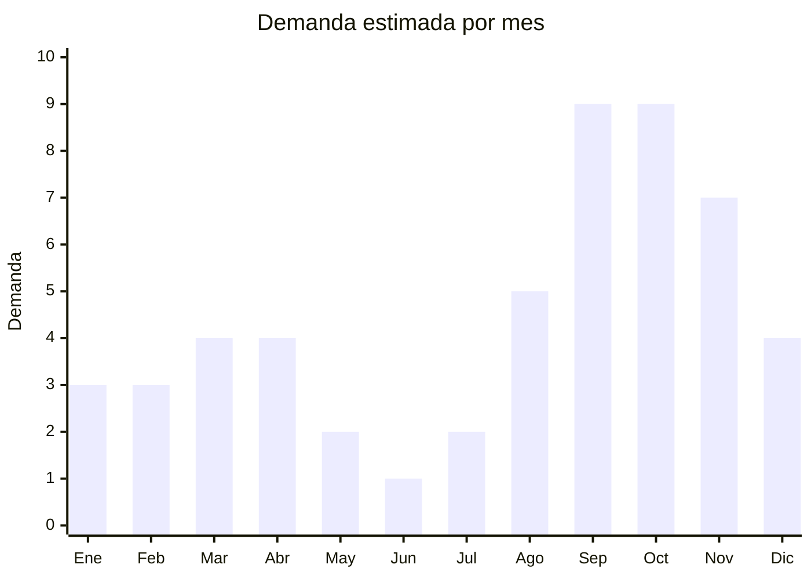

# Soportes y estructuras metalicas para jardin

> **Capitulo NCM 73** — Manufacturas de fundicion, hierro o acero | **Temporada:** Primavera (Sep–Nov)

## Que es y por que importarlo

Las estructuras y soportes metalicos para jardin incluyen arcos para plantas trepadoras (rosas, jazmines, glicinas), tutores metalicos para tomates y hortalizas, enrejados decorativos (trellises), bordes y ribetes para canteros, y soportes para macetas colgantes. Son productos de hierro o acero con recubrimiento anticorrosion (galvanizado, pintura epoxi o powder coating) disenados para uso exterior permanente.

La primavera (septiembre a noviembre) es la temporada pico absoluta para jardineria en Argentina. El clima templado impulsa la plantacion de trepadoras, la preparacion de huertas urbanas y la renovacion de jardines y balcones. Los arcos decorativos para trepadoras tienen un atractivo estetico que se potencia con las redes sociales, donde el concepto de "garden arch" y "cottage garden" genera miles de busquedas mensuales.

China es el principal proveedor mundial de estas estructuras, con precios FOB significativamente menores a la produccion local argentina. La ventaja competitiva radica en que un arco para trepadoras que en Argentina se vende a ARS 40.000-120.000 puede importarse a USD 3-12 FOB, y las herrerias locales no pueden competir en precio con la produccion industrializada china.

## Datos clave

| Dato | Valor |
|------|-------|
| **FOB tipico (China)** | USD 3 — 12/arco o estructura |
| **Precio venta Argentina** | ARS 15.000 — 120.000 |
| **Margen estimado** | 150 — 300% |
| **MOQ habitual** | 50 — 200 unidades |
| **Peso/volumen** | 2 — 15 kg/pieza / 0.03 — 0.15 cbm |
| **Pico de demanda** | Septiembre-Noviembre |
| **Origen principal** | Hebei y Zhejiang, China |

## Demanda y mercado en Argentina

- **Volumen de mercado:** Categoria en crecimiento, especialmente arcos decorativos y tutores para huerta. Vendedores con 500-2.000 unidades vendidas en MercadoLibre.
- **Tendencia:** En alza por la consolidacion de la huerta urbana y la estetica "garden cottage" impulsada por Pinterest e Instagram.
- **Perfil del comprador:** Propietarios de casas con jardin (GBA, Cordoba, Mendoza, Rosario), aficionados a la huerta urbana, paisajistas y viveristas.
- **Canales de venta:** MercadoLibre, viverios y garden centers, ferreterias, venta directa a paisajistas.

<Note>
Los arcos para trepadoras tienen un componente aspiracional fuerte: las fotos de jardines con arcos floridos generan miles de guardados en Pinterest. Este efecto visual impulsa la demanda de un producto que historicamente se vendia solo en herrerias locales a precios mucho mas altos.
</Note>

## Variantes y subtipos mas comunes

| Variante | Descripcion | FOB referencia |
|----------|-------------|----------------|
| Arco jardin clasico (2.2m alto) | Hierro tubular, pintura negra/blanca, para trepadoras | USD 8 — 12/u |
| Arco jardin compacto (1.5m) | Version para balcon o patio chico | USD 5 — 8/u |
| Tutores metalicos (pack x10) | Varillas 1.2-1.8m con espiral o anillo, para tomate/morron | USD 3 — 6/pack |
| Enrejado decorativo pared | Expandible tipo acordeon, hierro forjado look | USD 4 — 9/u |
| Bordes cantero metalicos (pack x5) | Piezas curvadas 60cm, enterrables, para delimitar | USD 3 — 7/pack |
| Soporte maceta colgante | Brazo de pared con gancho, hierro forjado decorativo | USD 1.50 — 4/u |
| Obelisco jardin (1.5-2m) | Estructura piramidal para trepadoras verticales | USD 6 — 10/u |

## Regulaciones y requisitos

<Tabs>
  <Tab title="Certificaciones">
    | Organismo | Requiere | Detalle |
    |-----------|----------|---------|
    | ARCA (Aduana) | Si siempre | Despacho estandar |
    | Certificacion especifica | No | No hay certificacion obligatoria para estructuras de jardin |
    | INTI | No | No es textil ni calzado |
    | Antidumping | Verificar | Algunos productos de acero tienen derechos antidumping. Consultar NCM especifica |

    **Nota importante:** Aunque el producto en si no requiere certificaciones especiales, verificar si la posicion NCM especifica tiene derechos antidumping vigentes. Argentina aplica antidumping a ciertos productos de acero de origen chino.
  </Tab>

  <Tab title="Etiquetado">
    | Requisito | Aplica |
    |-----------|--------|
    | Idioma espanol | Si |
    | Datos del importador | Si (razon social, CUIT, direccion) |
    | Material | Si (acero, hierro, tipo de recubrimiento) |
    | Pais de origen | Si |
    | Instrucciones de armado | Recomendado (muchos vienen desarmados) |
    | Peso maximo soportado | Recomendado para soportes de maceta |
  </Tab>

  <Tab title="Restricciones">
    Sin restricciones especificas para estructuras de jardin. Punto de atencion: si el recubrimiento contiene plomo (pinturas viejas), puede generar problemas en aduana. Solicitar certificado de pintura libre de plomo al proveedor.
  </Tab>
</Tabs>

## Logistica de importacion

| Dato | Valor |
|------|-------|
| **Peso tipico por unidad** | 2 — 15 kg segun estructura |
| **Volumen tipico** | Medio-Alto (estructuras voluminosas) |
| **Fragilidad** | Baja (metal resistente) |
| **Envio recomendado** | Maritimo LCL o FCL. Aereo no es viable por peso/volumen |
| **Tiempo total estimado** | 50 — 80 dias (maritimo) |
| **Requiere empaque especial** | Si: carton reforzado + esquineros para evitar abolladuras |

<Tip>
Muchos arcos y estructuras vienen desarmados en cajas planas (flat-pack), lo que reduce significativamente el volumen de envio. Consultar con el proveedor si ofrecen version KD (knock-down / desarmable). Un arco de 2.2m desarmado puede caber en una caja de 120x30x15 cm.
</Tip>

<Warning>
El peso es el factor critico en el flete. Un contenedor 20' puede llevar aproximadamente 300-500 arcos desarmados. Calcular cuidadosamente la relacion peso/volumen antes de cotizar flete porque estos productos suelen pagar por peso real, no por volumen.
</Warning>

## Estacionalidad y timing de compra

| Aspecto | Detalle |
|---------|---------|
| **Meses pico** | Septiembre-Octubre-Noviembre (primavera plena, plantacion de trepadoras) |
| **Meses valle** | Junio-Julio (invierno, minima actividad de jardineria) |
| **Cuando pedir** | Mayo-Junio para tener stock en septiembre (considerar 60-80 dias maritimo) |
| **Pre-temporada** | Agosto ya se notan las primeras busquedas. Tener stock listo |

## Ventajas y riesgos

<CardGroup cols={2}>
  <Card title="Ventajas" icon="circle-check">
    - Sin certificaciones obligatorias
    - Producto duradero (baja tasa de devolucion)
    - Herreria local no compite en precio
    - Tendencia "cottage garden" en redes sociales
    - Ticket promedio alto (ARS 40.000-120.000)
    - Producto no perecedero (se guarda para proxima temporada)
  </Card>
  <Card title="Riesgos" icon="triangle-exclamation">
    - Flete costoso por peso del hierro/acero
    - Posible antidumping en ciertas posiciones NCM
    - Recubrimiento de baja calidad se oxida rapido
    - Producto estacional (venta concentrada en 3-4 meses)
    - Almacenamiento requiere espacio considerable
    - Piezas faltantes en kits desarmados generan reclamos
  </Card>
</CardGroup>

<Warning>
Verificar siempre el tipo de recubrimiento anticorrosion. El galvanizado en caliente es superior al galvanizado electrolitico y a la simple pintura epoxi. Estructuras con recubrimiento pobre se oxidan en 6-12 meses a la intemperie en clima humedo (Buenos Aires, Litoral), generando reclamos y devoluciones.
</Warning>

## Palabras clave para buscar en Alibaba

> garden arch metal wholesale, iron garden trellis, metal plant support stake, garden border edging metal, decorative garden obelisk, wall trellis metal expandable, hanging plant bracket iron, garden arch for climbing plants, metal tomato cage wholesale

## Fuentes

- [MercadoLibre Argentina — Arcos jardin](https://listado.mercadolibre.com.ar/arco-jardin-metal)
- [Alibaba — Garden arch wholesale](https://www.alibaba.com/showroom/garden-arch-metal.html)
- [ARCA — Nomenclador Comun del Mercosur Cap. 73](https://www.arca.gob.ar)
