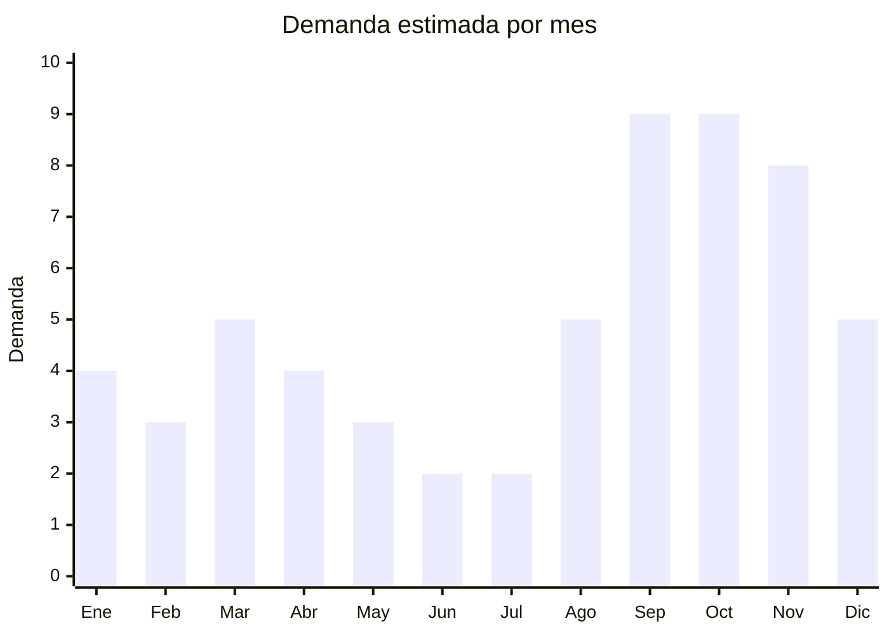

# Sets de herramientas de jardineria manual

> **Capitulo NCM 82** — Herramientas y utiles, articulos de cuchilleria | **Temporada:** Primavera (Sep–Nov)

## Que es y por que importarlo

Los sets de herramientas de jardineria manual incluyen combinaciones de pala de mano, rastrillo, transplantador, podadora, horquilla, deshierbador y pulverizador, generalmente presentados en kits de 3 a 10 piezas con bolso organizador o maletin. Son herramientas de acero inoxidable, acero al carbono o aluminio con mangos de madera, plastico o goma antideslizante.

La demanda de herramientas de jardineria manual en Argentina muestra un crecimiento interanual del +15% en septiembre segun datos de Nubimetrics, impulsada por la llegada de la primavera y la explosion del movimiento de huerta urbana que se consolido post-pandemia. Ademas, estas herramientas se posicionan consistentemente en el top 10 de categorias de CyberMonday en el rubro hogar y jardin.

China (principalmente Zhejiang y Guangdong) produce la gran mayoria de herramientas de jardineria manual del mundo. Los kits con bolso de lona o nylon tienen alto valor percibido como regalo (Dia de la Madre para madres jardineras, Navidad), y el packaging profesional permite venderlos a precios significativamente superiores a herramientas sueltas.

## Datos clave

| Dato | Valor |
|------|-------|
| **FOB tipico (China)** | USD 2 — 8/set |
| **Precio venta Argentina** | ARS 12.000 — 50.000 |
| **Margen estimado** | 200 — 400% |
| **MOQ habitual** | 200 — 1.000 sets |
| **Peso/volumen** | 0.5 — 2.5 kg/set / 0.005 — 0.02 cbm |
| **Pico de demanda** | Septiembre-Octubre (primavera) y Noviembre (CyberMonday) |
| **Origen principal** | Yongkang, Zhejiang, China |

## Demanda y mercado en Argentina

- **Volumen de mercado:** Categoria consolidada en MercadoLibre con vendedores que superan las 3.000 unidades vendidas. Los kits de 5-10 piezas con bolso dominan el ranking.
- **Tendencia:** Crecimiento sostenido +15% interanual en septiembre. La huerta urbana post-pandemia sigue expandiendose.
- **Perfil del comprador:** Adultos 30-60 anos con casa y jardin, nuevos aficionados a la huerta urbana, compradores de regalos para Dia de la Madre y Navidad.
- **Canales de venta:** MercadoLibre (principal), ferreterias, garden centers, viverios, venta mayorista.

<Note>
El kit de jardineria con bolso es uno de los regalos clasicos para el Dia de la Madre en el segmento ARS 15.000-30.000. Su presentacion atractiva y utilidad practica lo convierten en una opcion segura para quienes buscan un regalo no convencional.
</Note>

## Variantes y subtipos mas comunes

| Variante | Descripcion | FOB referencia |
|----------|-------------|----------------|
| Kit 3 piezas basico (pala+rastrillo+transplantador) | Acero inoxidable, mango madera. Presentacion basica | USD 2 — 3.50/set |
| Kit 5 piezas con bolso | Agrega podadora y horquilla. Bolso de lona con bolsillos | USD 3.50 — 5.50/set |
| Kit 10 piezas profesional con bolso | Set completo: palas, rastrillos, podadora, pulverizador, guantes, rodillera | USD 5 — 8/set |
| Kit infantil jardineria (3-5 piezas) | Herramientas chicas, colores, para ninos. Nicho en crecimiento | USD 1.50 — 3/set |
| Set podadora + guantes jardineria | Tijera bypass + guantes anticorte. Complemento popular | USD 2 — 4/set |
| Herramientas sueltas premium | Pala o transplantador individual, mango ergonomico, acero inox | USD 0.50 — 2/u |
| Kit huerta urbana | Palita + sustrato + macetas biodegradables + semillas | USD 3 — 6/kit |

## Regulaciones y requisitos

<Tabs>
  <Tab title="Certificaciones">
    | Organismo | Requiere | Detalle |
    |-----------|----------|---------|
    | ARCA (Aduana) | Si siempre | Despacho estandar |
    | Certificacion especifica | No | No hay certificacion obligatoria para herramientas manuales de jardineria |
    | INTI | No | No aplica para herramientas |
    | Antidumping | No | No hay antidumping vigente para herramientas manuales de jardineria |

    Producto sin barreras regulatorias significativas. Las herramientas manuales (no electricas) no requieren certificaciones de seguridad electrica ni homologaciones especiales.
  </Tab>

  <Tab title="Etiquetado">
    | Requisito | Aplica |
    |-----------|--------|
    | Idioma espanol | Si |
    | Datos del importador | Si (razon social, CUIT, direccion) |
    | Material de fabricacion | Si (acero inoxidable, acero carbono, aluminio) |
    | Pais de origen | Si |
    | Garantia legal 6 meses | Si |
    | Contenido del set | Si (detallar cantidad y tipo de piezas) |
  </Tab>

  <Tab title="Restricciones">
    Sin restricciones relevantes. Unico punto: si el set incluye tijeras de podar con hoja mayor a 6 cm, no genera problemas regulatorios pero conviene que el packaging indique claramente "herramienta de jardineria" para evitar demoras en revision aduanera.
  </Tab>
</Tabs>

## Logistica de importacion

| Dato | Valor |
|------|-------|
| **Peso tipico por set** | 0.5 — 2.5 kg |
| **Volumen tipico** | Bajo-Medio |
| **Fragilidad** | Muy baja (metal resistente) |
| **Envio recomendado** | Maritimo LCL para pedidos grandes; Courier para muestras |
| **Tiempo total estimado** | 50 — 75 dias (maritimo) / 15 — 25 dias (aereo) |
| **Baterias de litio** | No |
| **Empaque especial** | No necesario. Bolso protege las herramientas |

<Tip>
Los sets con bolso organizador tienen doble ventaja: el bolso protege las herramientas durante el envio (menor necesidad de embalaje adicional) y aumenta el valor percibido en un 40-60% respecto a herramientas sueltas. Priorizar siempre kits con presentacion completa.
</Tip>

## Estacionalidad y timing de compra

| Aspecto | Detalle |
|---------|---------|
| **Meses pico** | Septiembre-Octubre (primavera, plantacion) y Noviembre (CyberMonday) |
| **Meses valle** | Junio-Julio (invierno, minima actividad en jardin) |
| **Cuando pedir** | Junio-Julio para llegar con stock a septiembre |
| **Dato clave** | Crecimiento interanual +15% en septiembre (Nubimetrics). Tendencia huerta urbana consolida la demanda |

## Ventajas y riesgos

<CardGroup cols={2}>
  <Card title="Ventajas" icon="circle-check">
    - Sin certificaciones obligatorias
    - Crecimiento interanual +15% septiembre
    - Top 10 CyberMonday en hogar y jardin
    - Sets con bolso = alto valor percibido
    - Producto resistente (baja tasa de devolucion)
    - Ideal como regalo (Dia de la Madre, Navidad)
    - Facil de almacenar y despachar
  </Card>
  <Card title="Riesgos" icon="triangle-exclamation">
    - Demanda estacional concentrada (Sep-Nov)
    - Peso del acero encarece flete
    - Herramientas de baja calidad se oxidan rapidamente
    - Competencia con marcas locales e importadas establecidas
    - Mangos de madera pueden quebrarse si la calidad es mala
    - Necesidad de stock variado (distintos tamanos de set)
  </Card>
</CardGroup>

<Warning>
Verificar siempre la calidad del acero. Herramientas de acero bajo en carbono se doblan con el primer uso y generan devoluciones. Pedir muestras y probar con tierra real antes de hacer un pedido grande. El bolso tambien debe tener costuras reforzadas; bolsos de lona barata se descosen en semanas.
</Warning>

## Palabras clave para buscar en Alibaba

> garden tool set with bag, garden hand tool kit wholesale, stainless steel garden tools set, 10 piece garden tool set canvas bag, pruning shears wholesale, kids garden tool set, garden tool set gift box, ergonomic garden tools wholesale

## Fuentes

- [MercadoLibre Argentina — Set herramientas jardineria](https://listado.mercadolibre.com.ar/set-herramientas-jardineria)
- [Alibaba — Garden tool set wholesale](https://www.alibaba.com/showroom/garden-tool-set.html)
- [Nubimetrics — Tendencias jardineria Argentina](https://www.nubimetrics.com)
