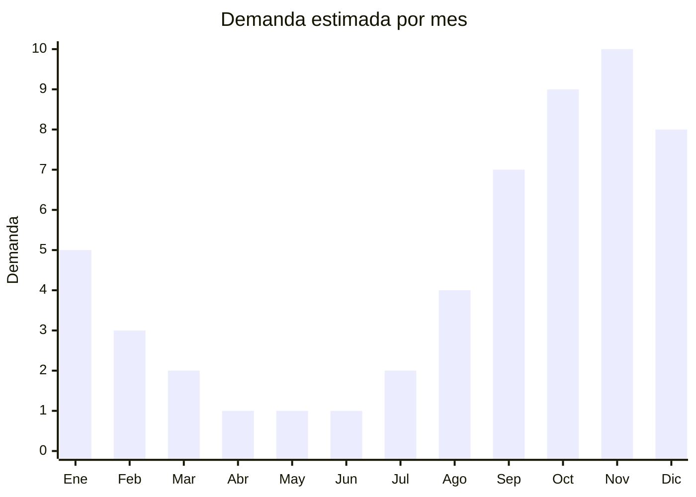

# Aires acondicionados split inverter frio/calor

> **Capitulo NCM 84** — Maquinas y aparatos mecanicos | **Temporada:** Primavera (Sep–Nov)

## Que es y por que importarlo

Los aires acondicionados split inverter frio/calor son el producto numero 1 en facturacion durante el CyberMonday en Argentina. Consisten en un sistema de climatizacion dividido en unidad interior (evaporadora) y unidad exterior (condensadora), con tecnologia inverter que regula la velocidad del compresor para mayor eficiencia energetica y menor consumo electrico. Las capacidades mas demandadas son 2.800 a 5.500 frigorias (3.200 W a 6.400 W).

La primavera es el momento critico de compra: los consumidores argentinos anticipan la temporada de calor (diciembre-febrero) comprando en octubre-noviembre, especialmente durante las promociones de CyberMonday. En el CyberMonday 2025, el modelo Philco PHIN35HA3BN fue el mas vendido de toda la plataforma, con facturacion record en la categoria.

Este producto tiene una barrera de entrada alta: requiere certificacion S-Mark (seguridad electrica), norma IRAM 62406 (eficiencia energetica), etiquetado energetico obligatorio y, si incluye conectividad WiFi, homologacion ENACOM. Sin embargo, los importadores que superan estas barreras acceden a margenes significativos y un mercado de alto ticket promedio.

## Datos clave

| Dato | Valor |
|------|-------|
| **FOB tipico (China)** | USD 150 — 400/unidad |
| **Precio venta Argentina** | ARS 500.000 — 1.800.000 |
| **Margen estimado** | 40 — 80% (alto ticket compensa margen porcentual menor) |
| **MOQ habitual** | 50 — 200 unidades (contenedor 20') |
| **Peso/volumen** | 35 — 70 kg/set (interior + exterior) / 0.15 — 0.30 cbm |
| **Pico de demanda** | Octubre-Noviembre (pre-verano, CyberMonday) |
| **Origen principal** | Guangdong (Midea, Gree, Haier, TCL), China |

## Demanda y mercado en Argentina

- **Volumen de mercado:** Producto estrella en facturacion. Vendedores top superan las 2.000 unidades en MercadoLibre durante la temporada. El split de 3.500 frigorias frio/calor es el mas demandado.
- **Tendencia:** Crecimiento sostenido por olas de calor mas intensas y frecuentes, y por la adopcion de inverter como estandar (reemplazando equipos on/off viejos).
- **Perfil del comprador:** Familias y propietarios de viviendas, inquilinos con autorizacion del propietario, oficinas y comercios.
- **Canales de venta:** MercadoLibre y Mercado Shops (dominante en electrodomesticos), cadenas de electronica (Fravega, Musimundo), venta directa con instalacion.

## Variantes y subtipos mas comunes

| Variante | Descripcion | FOB referencia |
|----------|-------------|----------------|
| Split 2.800 frig inverter (para 20-25 m2) | Modelo mas vendido. Frio/calor. Clase A | USD 150 — 220/u |
| Split 3.500 frig inverter (para 25-35 m2) | Uso residencial estandar. Mayor demanda | USD 180 — 280/u |
| Split 4.500 frig inverter (para 35-45 m2) | Ambientes grandes, oficinas | USD 250 — 350/u |
| Split 5.500 frig inverter (para 45-60 m2) | Comercial/oficinas grandes | USD 300 — 400/u |
| Split con WiFi integrado | Control por app, compatible Alexa/Google. Premium | USD 180 — 320/u (+ USD 10-20 vs sin WiFi) |
| Split solo frio | Menor precio, menor demanda en Argentina (se prefiere frio/calor) | USD 130 — 250/u |

## Regulaciones y requisitos

<Tabs>
  <Tab title="Certificaciones">
    | Organismo | Requiere | Detalle | Costo aprox. | Tiempo aprox. |
    |-----------|----------|---------|--------------|---------------|
    | S-Mark (seguridad electrica) | **Si, obligatorio** | Certificacion de seguridad electrica. Laboratorio acreditado (IRAM, TUV, Bureau Veritas) | USD 3.000 — 8.000 | 3 — 6 meses |
    | IRAM 62406 | **Si, obligatorio** | Eficiencia energetica. Determina clase A/B/C del etiquetado | Incluido en S-Mark generalmente | — |
    | Etiquetado energetico | **Si, obligatorio** | Etiqueta de eficiencia visible en el producto. Ley 27.191 | — | — |
    | ENACOM | **Si, si tiene WiFi/BT** | Homologacion de modulo de comunicacion inalambrica | USD 500 — 1.500 | 1 — 3 meses |
    | ARCA (Aduana) | Si siempre | Licencia no automatica (LNA) para electrodomesticos | — | Variable |

    **Barrera alta:** La combinacion de S-Mark + IRAM + ENACOM puede llevar 4-8 meses y USD 5.000-10.000 antes de poder importar la primera unidad. Este costo se amortiza en volumenes grandes.
  </Tab>

  <Tab title="Etiquetado">
    | Requisito | Aplica |
    |-----------|--------|
    | Idioma espanol | Si |
    | Datos del importador | Si (razon social, CUIT, direccion) |
    | Etiqueta de eficiencia energetica | **Obligatoria** (clase A a G, consumo anual kWh) |
    | Capacidad en frigorias y watts | Si |
    | Gas refrigerante utilizado | Si (R410A o R32 preferidos) |
    | Manual de instalacion en espanol | Obligatorio |
    | Garantia legal 6 meses | Si (muchos ofrecen 1-3 anos comercial) |
    | Pais de origen | Si |
    | Numero de certificado S-Mark | Si, visible en etiqueta |
  </Tab>

  <Tab title="Restricciones">
    - **Licencia no automatica (LNA):** Los aires acondicionados requieren licencia no automatica de importacion, lo que agrega tiempo al despacho aduanero.
    - **Gas refrigerante:** R22 esta prohibido (Protocolo de Montreal). Solo R410A o R32 son aceptables. R32 es la tendencia por menor impacto ambiental.
    - **Eficiencia minima:** Argentina esta migrando a estandares mas estrictos. Clase B o inferior puede tener restricciones futuras.
    - **Voltaje:** Debe ser 220V/50Hz (estandar argentino). Modelos de 110V o 60Hz no sirven.
    - **RAEE:** Aplica gestion de residuos de aparatos electricos y electronicos.
  </Tab>
</Tabs>

## Logistica de importacion

| Dato | Valor |
|------|-------|
| **Peso tipico por unidad (set)** | 35 — 70 kg |
| **Volumen tipico** | 0.15 — 0.30 cbm por set |
| **Fragilidad** | Media (gas refrigerante, componentes electronicos) |
| **Envio recomendado** | Maritimo FCL (contenedor completo 20' o 40') |
| **Tiempo total estimado** | 60 — 90 dias (maritimo) |
| **Unidades por contenedor 20'** | 80 — 150 unidades aprox. |
| **Empaque especial** | Carton reforzado con EPS (poliestireno expandido). Transporte vertical |

<Tip>
Negociar con el fabricante chino que la certificacion S-Mark se haga con un laboratorio que tenga convenio en Argentina (TUV, Bureau Veritas, SGS). Algunos fabricantes como Midea y Gree ya tienen modelos pre-certificados para el mercado argentino, lo que reduce drasticamente tiempos y costos de homologacion.
</Tip>

<Warning>
**No importar sin certificacion S-Mark.** La Aduana argentina retiene aires acondicionados sin certificacion de seguridad electrica vigente. El costo de almacenaje en deposito fiscal durante la gestion de certificacion puede superar el valor de la mercaderia. Resolver TODA la documentacion antes de embarcar.
</Warning>

## Estacionalidad y timing de compra

| Aspecto | Detalle |
|---------|---------|
| **Meses pico** | Octubre-Noviembre (pre-verano + CyberMonday) y Diciembre (inicio del calor fuerte) |
| **Meses valle** | Abril-Junio (otono-invierno, demanda minima) |
| **Cuando pedir** | Julio-Agosto para llegar a octubre. Considerar 60-90 dias maritimo + tramites aduaneros |
| **CyberMonday** | Producto estrella absoluto. Planificar stock para noviembre con antelacion |

## Ventajas y riesgos

<CardGroup cols={2}>
  <Card title="Ventajas" icon="circle-check">
    - Producto #1 en facturacion CyberMonday
    - Ticket altisimo (ARS 500K-1.8M por unidad)
    - Mercado en crecimiento por olas de calor mas frecuentes
    - Barrera regulatoria alta protege de competencia informal
    - Fabricantes chinos ofrecen marca blanca con certificacion
    - Demanda predecible y estacional (facil planificar)
  </Card>
  <Card title="Riesgos" icon="triangle-exclamation">
    - Inversion inicial muy alta (certificaciones + stock)
    - Certificacion S-Mark puede tardar 6+ meses
    - Flete costoso por peso y volumen
    - Requiere servicio tecnico post-venta (instalacion)
    - Competencia con marcas establecidas (BGH, Samsung, LG, Philco)
    - Garantia y servicio tecnico obligatorios generan costos operativos
    - LNA puede demorar despacho aduanero
  </Card>
</CardGroup>

## Palabras clave para buscar en Alibaba

> split air conditioner inverter wholesale, mini split AC R32 OEM, air conditioner 12000 BTU inverter, split AC 220V 50Hz South America, wall mounted air conditioner OEM factory, inverter air conditioner Guangdong manufacturer

## Fuentes

- [MercadoLibre Argentina — Aires acondicionados split](https://listado.mercadolibre.com.ar/aire-acondicionado-split-inverter)
- [IRAM — Norma 62406 eficiencia energetica](https://www.iram.org.ar)
- [ENACOM — Homologacion de equipos](https://www.enacom.gob.ar)
- [CyberMonday Argentina — Reportes](https://www.cybermonday.com.ar)
- [Nubimetrics — Categoria climatizacion](https://www.nubimetrics.com)
