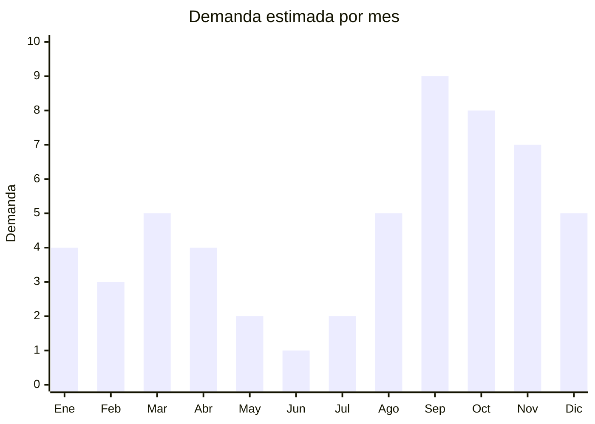

# Desmalezadoras electricas a bateria de litio

> **Capitulo NCM 84** — Maquinas y aparatos mecanicos | **Temporada:** Primavera (Sep–Nov)

## Que es y por que importarlo

Las desmalezadoras electricas a bateria de litio (tambien llamadas bordeadoras o cortabordes inalambricas) son herramientas de jardineria que utilizan un hilo de nylon giratorio para cortar pasto, malezas y yuyos en bordes, canteros y zonas de dificil acceso. Funcionan con baterias recargables de ion-litio de 20V o 40V, eliminando la necesidad de cable electrico o combustible.

La tendencia inalambrica (cordless) es una de las mas fuertes en herramientas de jardineria a nivel mundial. En Argentina, las desmalezadoras a bateria crecen un +15% interanual en septiembre segun Nubimetrics, impulsadas por la conveniencia del uso sin cable, la llegada de la primavera y la expansion de la huerta urbana en casas con jardines pequenos y medianos.

El FOB desde China es notablemente competitivo (USD 15-40/unidad), y el mercado argentino paga tickets de ARS 50.000-180.000 por unidad. La barrera de entrada es moderada: requiere certificacion S-Mark de seguridad electrica, pero al ser un producto de bateria de litio (no conectado a red), el proceso es menos complejo que para electrodomesticos de red.

## Datos clave

| Dato | Valor |
|------|-------|
| **FOB tipico (China)** | USD 15 — 40/unidad |
| **Precio venta Argentina** | ARS 50.000 — 180.000 |
| **Margen estimado** | 150 — 300% |
| **MOQ habitual** | 100 — 500 unidades |
| **Peso/volumen** | 2 — 4 kg/unidad / 0.02 — 0.05 cbm |
| **Pico de demanda** | Septiembre-Octubre (inicio primavera) |
| **Origen principal** | Guangdong y Zhejiang, China |

## Demanda y mercado en Argentina

- **Volumen de mercado:** Categoria en expansion con vendedores que alcanzan 1.000-5.000 unidades en MercadoLibre. Las versiones a bateria ganan terreno frente a las de nafta y electricas con cable.
- **Tendencia:** +15% interanual en septiembre. La migracion de herramientas con cable a inalambricas es una tendencia global irreversible.
- **Perfil del comprador:** Propietarios de casas con jardin pequeno-mediano, aficionados al mantenimiento del hogar, compradores de herramientas para country o quinta.
- **Canales de venta:** MercadoLibre (dominante), ferreterias, cadenas de mejoramiento del hogar, venta directa.

## Variantes y subtipos mas comunes

| Variante | Descripcion | FOB referencia |
|----------|-------------|----------------|
| Desmalezadora 20V basica | Bateria 2.0Ah, hilo nylon, uso domestico liviano | USD 15 — 22/u |
| Desmalezadora 20V con telescopico | Mango ajustable, ruedas guia, bateria 2.0-4.0Ah | USD 20 — 30/u |
| Desmalezadora 40V semi-pro | Bateria 4.0Ah, mayor autonomia, motor brushless | USD 28 — 40/u |
| Kit 2 en 1 (desmalezadora + soplador) | Misma bateria, dos cabezales intercambiables | USD 25 — 38/u |
| Desmalezadora con disco corte | Hilo nylon + disco metalico para maleza dura | USD 22 — 35/u |
| Bateria extra + cargador rapido | Accesorio complementario, venta recurrente | USD 8 — 15/set |

## Regulaciones y requisitos

<Tabs>
  <Tab title="Certificaciones">
    | Organismo | Requiere | Detalle | Costo aprox. | Tiempo aprox. |
    |-----------|----------|---------|--------------|---------------|
    | S-Mark (seguridad electrica) | **Si, obligatorio** | Seguridad de herramienta electrica portatil. IEC 62841-1 | USD 2.000 — 5.000 | 2 — 4 meses |
    | ARCA (Aduana) | Si siempre | Despacho estandar |  — | — |
    | ENACOM | No | No tiene modulo inalambrico WiFi/BT | — | — |
    | UN38.3 (bateria litio) | **Si, para transporte** | Certificado de pruebas de seguridad para baterias de litio (transporte aereo/maritimo) | USD 500 — 1.500 | Proporcionado por fabricante |
    | MSDS bateria | **Si, para transporte** | Hoja de seguridad del material (bateria de litio) para el envio | — | Proporcionado por fabricante |

    **Nota sobre baterias de litio:** El transporte de baterias de ion-litio requiere documentacion especifica (UN38.3 test report + MSDS). El fabricante debe proporcionarla. Sin esta documentacion, la naviera o aerolinea puede rechazar el embarque.
  </Tab>

  <Tab title="Etiquetado">
    | Requisito | Aplica |
    |-----------|--------|
    | Idioma espanol | Si |
    | Datos del importador | Si (razon social, CUIT, direccion) |
    | Voltaje y potencia | Si (20V/40V, watts) |
    | Instrucciones de seguridad | Si (uso de proteccion ocular, guantes) |
    | Pais de origen | Si |
    | Garantia legal 6 meses | Si |
    | Advertencias bateria litio | Si (no exponer a calor, no perforar) |
    | Numero certificado S-Mark | Si |
  </Tab>

  <Tab title="Restricciones">
    - **Transporte baterias litio:** Regulaciones IATA/IMDG para transporte de baterias. Deben ir empaquetadas con el equipo o por separado con embalaje especifico.
    - **Clase de peligro:** Baterias de litio clasifican como mercancia peligrosa Clase 9. Esto puede generar recargos de flete.
    - **Voltaje:** No aplica restriccion de red electrica (es bateria), pero verificar compatibilidad del cargador con 220V/50Hz argentino.
  </Tab>
</Tabs>

## Logistica de importacion

| Dato | Valor |
|------|-------|
| **Peso tipico por unidad** | 2 — 4 kg (con bateria) |
| **Volumen tipico** | Bajo-Medio |
| **Fragilidad** | Media (bateria de litio requiere cuidado) |
| **Envio recomendado** | Maritimo LCL/FCL. Aereo posible pero con restricciones por bateria |
| **Tiempo total estimado** | 50 — 75 dias (maritimo) / 15 — 25 dias (aereo, con documentacion correcta) |
| **Baterias de litio** | Si — requiere UN38.3 + MSDS |
| **Empaque especial** | Carton con aislamiento para bateria. Separacion bateria-equipo segun normativa |

<Tip>
Para el primer pedido, solicitar al fabricante que envie las baterias instaladas en el equipo (packed with equipment) en lugar de por separado. Esto simplifica los requisitos de embalaje y documentacion de transporte de litio, y generalmente reduce los recargos de la naviera.
</Tip>

## Estacionalidad y timing de compra

| Aspecto | Detalle |
|---------|---------|
| **Meses pico** | Septiembre (explosion primaveral, +15% interanual) y Octubre |
| **Meses valle** | Junio-Julio (invierno, jardin inactivo) |
| **Cuando pedir** | Junio-Julio para stock en septiembre. Considerar demoras por documentacion de bateria litio |
| **Tendencia** | Crecimiento sostenido. La migracion de nafta a bateria es irreversible en el segmento residencial |

## Ventajas y riesgos

<CardGroup cols={2}>
  <Card title="Ventajas" icon="circle-check">
    - Crecimiento +15% interanual sostenido
    - Tendencia inalambrica en expansion
    - Margen bruto 150-300%
    - Producto diferenciable (voltaje, autonomia, accesorios)
    - Venta cruzada de baterias y accesorios
    - Menor competencia que herramientas a nafta
    - Peso moderado (flete razonable)
  </Card>
  <Card title="Riesgos" icon="triangle-exclamation">
    - S-Mark obligatorio (barrera de entrada)
    - Baterias litio complican logistica y flete
    - Autonomia real puede diferir de lo anunciado
    - Recambios de hilo nylon deben ser compatibles
    - Servicio tecnico post-venta necesario
    - Recargos de flete por mercancia peligrosa Clase 9
  </Card>
</CardGroup>

<Warning>
Las baterias de litio de baja calidad son un riesgo real de seguridad (hinchamiento, sobrecalentamiento). Exigir al fabricante certificado UN38.3 vigente y verificar que las celdas sean de marcas reconocidas (Samsung SDI, LG Chem, CATL, EVE). Baterias con celdas sin marca generan riesgo de reclamos y problemas legales.
</Warning>

## Palabras clave para buscar en Alibaba

> cordless string trimmer 20V wholesale, battery grass trimmer lithium, electric weed eater 40V OEM, brushless string trimmer wholesale, 2 in 1 trimmer blower kit, cordless garden trimmer factory, lithium battery trimmer 20V manufacturer

## Fuentes

- [MercadoLibre Argentina — Desmalezadoras a bateria](https://listado.mercadolibre.com.ar/desmalezadora-bateria)
- [Alibaba — Cordless string trimmer](https://www.alibaba.com/showroom/cordless-string-trimmer.html)
- [Nubimetrics — Herramientas jardin Argentina](https://www.nubimetrics.com)
- [IATA — Lithium battery transport regulations](https://www.iata.org/en/programs/cargo/dgr/lithium-batteries/)
