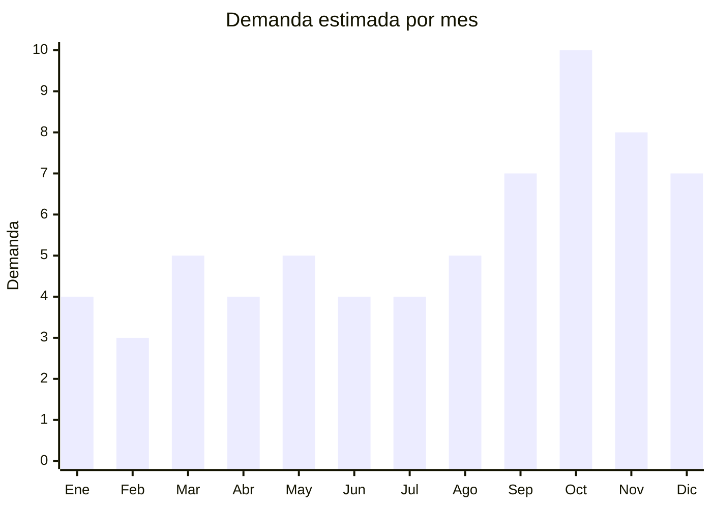

# Planchitas de pelo y rizadoras

> **Capitulo NCM 84** — Maquinas y aparatos mecanicos (clasifica como aparato termico, no electrico Cap. 85) | **Temporada:** Primavera (Sep–Nov)

## Que es y por que importarlo

Las planchitas de pelo (alisadoras), rizadoras (curling irons) y cepillos alisadores son herramientas de styling capilar que utilizan calor para alisar, ondular o rizar el cabello. Incluyen planchas de titanio, ceramica o turmalina, rizadoras automaticas rotativas, cepillos electricos alisadores y tenazas de diferentes diametros. Son el producto estrella absoluto del Dia de la Madre en Argentina: 7 de cada 10 productos top de venta en la categoria belleza son planchitas o rizadoras.

Las marcas de referencia en el mercado argentino son Ga.ma Italy y BaBylissPRO, que establecen el benchmark de precio y calidad. Sin embargo, la mayoria de los productos vendidos en MercadoLibre son de origen chino, importados con marca propia o como marca blanca, con precios significativamente menores que las marcas premium.

El FOB desde China es extremadamente competitivo: USD 5.90-9.50 por unidad para planchas de calidad media-alta con placas de ceramica/turmalina, mientras que el precio de venta en Argentina supera los ARS 25.000-80.000. La barrera regulatoria es moderada-alta: requiere S-Mark + IRAM de seguridad electrica, lo cual implica una inversion inicial de certificacion pero protege a los importadores certificados de la competencia informal.

## Datos clave

| Dato | Valor |
|------|-------|
| **FOB tipico (China)** | USD 5.90 — 9.50/unidad |
| **Precio venta Argentina** | ARS 25.000 — 80.000 |
| **Margen estimado** | 200 — 400% |
| **MOQ habitual** | 200 — 1.000 unidades |
| **Peso/volumen** | 0.3 — 0.8 kg/unidad / 0.003 — 0.008 cbm |
| **Pico de demanda** | Octubre (Dia de la Madre) y Noviembre (CyberMonday) |
| **Origen principal** | Shenzhen y Dongguan, Guangdong, China |

## Demanda y mercado en Argentina

- **Volumen de mercado:** Categoria masiva en MercadoLibre. Los vendedores top superan 10.000 unidades vendidas. Planchitas de pelo estan entre los 20 productos mas buscados de la plataforma en octubre.
- **Tendencia:** Estable-creciente. La demanda no depende de modas pasajeras sino de un habito de cuidado personal consolidado.
- **Perfil del comprador:** Mujeres de 15-55 anos, tanto consumidoras finales como peluqueras profesionales. Pico enorme como regalo de Dia de la Madre.
- **Canales de venta:** MercadoLibre (dominante), tiendas de cosmetica, perfumerias, peluquerias, Instagram.

## Variantes y subtipos mas comunes

| Variante | Descripcion | FOB referencia |
|----------|-------------|----------------|
| Plancha clasica ceramica | Placas ceramica 25mm, 230C, cable giratorio | USD 5.90 — 7.00/u |
| Plancha titanio profesional | Placas titanio, calentamiento rapido, regulacion digital | USD 7.00 — 9.50/u |
| Rizadora automatica rotativa | Riza sin esfuerzo, barril giratorio, anti-quemadura | USD 7.50 — 9.50/u |
| Cepillo alisador electrico | Forma de cepillo, alisado rapido, menos dano | USD 5.90 — 8.00/u |
| Tenaza conica (para ondas) | Sin pinza, para ondas tipo playa | USD 5.50 — 7.50/u |
| Kit 2 en 1 (plancha + rizadora) | Placas intercambiables o doble funcion | USD 7.00 — 9.50/u |
| Mini plancha viaje | Compacta, bivolt, con estuche | USD 3.50 — 5.50/u |

## Regulaciones y requisitos

<Tabs>
  <Tab title="Certificaciones">
    | Organismo | Requiere | Detalle | Costo aprox. | Tiempo aprox. |
    |-----------|----------|---------|--------------|---------------|
    | S-Mark (seguridad electrica) | **Si, obligatorio** | Norma IEC 60335-2-23 (aparatos de cuidado de piel/cabello) | USD 2.000 — 4.000 | 2 — 4 meses |
    | IRAM | **Si, obligatorio** | Cumplimiento de norma IRAM para electrodomesticos termicos | Incluido en S-Mark | — |
    | ARCA (Aduana) | Si siempre | Puede requerir LNA segun posicion NCM | — | Variable |
    | ENACOM | No | No tiene modulo inalambrico (salvo modelos BT, poco comunes) | — | — |

    **Estrategia:** Muchos fabricantes chinos grandes (como los que producen para Ga.ma y Remington) ya tienen matrices de certificacion. Consultar si el fabricante puede facilitar reportes de laboratorio previos para acelerar el proceso S-Mark.
  </Tab>

  <Tab title="Etiquetado">
    | Requisito | Aplica |
    |-----------|--------|
    | Idioma espanol | Si |
    | Datos del importador | Si (razon social, CUIT, direccion) |
    | Voltaje y potencia | Si (220V, watts) |
    | Temperatura maxima | Si |
    | Instrucciones de seguridad | Si (riesgo quemadura, no usar con manos mojadas) |
    | Pais de origen | Si |
    | Garantia legal 6 meses | Si |
    | Numero certificado S-Mark | Si |
    | Material de las placas | Recomendado (ceramica, titanio, turmalina) |
  </Tab>

  <Tab title="Restricciones">
    - **Voltaje obligatorio 220V/50Hz:** Los modelos de 110V no funcionan en Argentina. Verificar que el fabricante configure correctamente.
    - **Cable y enchufe:** Debe venir con enchufe tipo I (tres patas) o adaptador. Muchos fabricantes pueden poner el enchufe argentino directamente.
    - **Prohibicion de materiales toxicos:** El recubrimiento de las placas no debe contener sustancias toxicas que se liberen con el calor (verificar con MSDS).
  </Tab>
</Tabs>

## Logistica de importacion

| Dato | Valor |
|------|-------|
| **Peso tipico por unidad** | 0.3 — 0.8 kg |
| **Volumen tipico** | Muy bajo |
| **Fragilidad** | Media (placas ceramica son fragiles al impacto) |
| **Envio recomendado** | Maritimo LCL para lotes grandes; Aereo para urgencias pre-Dia Madre |
| **Tiempo total estimado** | 45 — 70 dias (maritimo) / 10 — 20 dias (aereo) |
| **Baterias de litio** | No (funciona conectado a red) |
| **Empaque especial** | Caja individual con foam. Embalar vertical para proteger placas |

<Tip>
Hacer el pedido con tiempo suficiente para octubre (Dia de la Madre). Si se embarca en agosto por maritimo, se llega justo en octubre. Para mayor seguridad, embarcar en julio. El costo de quedarse sin stock en la semana previa al Dia de la Madre es mucho mayor que el costo de tener stock adelantado.
</Tip>

## Estacionalidad y timing de compra

| Aspecto | Detalle |
|---------|---------|
| **Meses pico** | Octubre (Dia de la Madre — pico absoluto) y Noviembre (CyberMonday) |
| **Meses valle** | Febrero (post-verano, menos uso de calor en pelo) |
| **Cuando pedir** | Julio para maritimo, Septiembre para aereo de emergencia |
| **Dato clave** | 7 de 10 productos top en belleza para Dia Madre son planchitas/rizadoras |

## Ventajas y riesgos

<CardGroup cols={2}>
  <Card title="Ventajas" icon="circle-check">
    - Producto estrella Dia de la Madre (pico predecible)
    - Margenes 200-400% sobre FOB
    - Ultraliviano (flete economico)
    - Marca propia viable con packaging premium
    - Demanda base todo el ano (no solo estacional)
    - Variedad de subtipos permite cubrir diferentes segmentos
    - Venta cruzada con accesorios (protector termico, estuche)
  </Card>
  <Card title="Riesgos" icon="triangle-exclamation">
    - S-Mark obligatorio (inversion inicial USD 2.000-4.000)
    - Competencia con Ga.ma Italy y BaBylissPRO (marcas fuertes)
    - Placas de baja calidad no deslizan bien y danan el pelo
    - Reclamos por cable corto o fragilidad del cable giratorio
    - Riesgo de quemaduras genera potenciales reclamos legales
    - Control de temperatura impreciso en modelos baratos
  </Card>
</CardGroup>

<Warning>
**No escatimar en calidad de placas.** Las planchas con placas de ceramica de baja calidad generan puntos de calor desiguales que queman el cabello, provocando devoluciones masivas y criticas negativas en MercadoLibre. Pedir muestras y probar con mechones de cabello real antes de importar. Verificar que la temperatura real coincida con la indicada en el display.
</Warning>

## Palabras clave para buscar en Alibaba

> hair straightener wholesale OEM, flat iron titanium ceramic, automatic hair curler factory, hair brush straightener wholesale, curling iron private label, 2 in 1 hair straightener curler, professional hair iron 230C, mini travel flat iron wholesale

## Fuentes

- [MercadoLibre Argentina — Planchitas de pelo](https://listado.mercadolibre.com.ar/planchita-pelo)
- [Alibaba — Hair straightener wholesale](https://www.alibaba.com/showroom/hair-straightener-wholesale.html)
- [Nubimetrics — Categoria belleza Argentina](https://www.nubimetrics.com)
- [IRAM — Normas de seguridad electrodomesticos](https://www.iram.org.ar)
