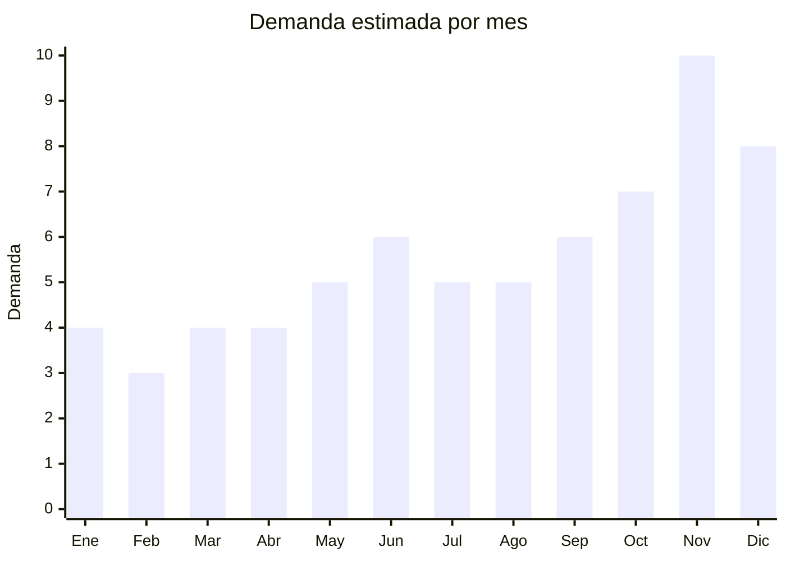

# Dispositivos de streaming

> **Capitulo NCM 85** — Maquinas, aparatos y material electrico | **Temporada:** Primavera (Sep–Nov)

## Que es y por que importarlo

Los dispositivos de streaming son equipos que se conectan al televisor via HDMI para convertirlo en smart TV o potenciar sus capacidades de contenido en streaming. Incluyen sticks tipo Roku (sistema operativo propietario con acceso a Netflix, Disney+, YouTube, etc.), TV boxes con Android TV (procesador Amlogic o Allwinner, con acceso a Google Play Store) y dongles HDMI tipo Chromecast (casting desde celular). Roku se posiciono consistentemente en el top 5 de productos mas vendidos durante CyberMonday en Argentina.

La demanda de estos dispositivos crece impulsada por la expansion de plataformas de streaming en Argentina (Netflix, Disney+, Star+, HBO Max, Amazon Prime, Paramount+) y por el parque de televisores no-smart o smart TV con sistemas operativos obsoletos que necesitan actualizacion. Un TV box de USD 8-15 FOB resuelve el problema por una fraccion del costo de comprar un smart TV nuevo.

El mercado argentino tiene un ticket de ARS 30.000-80.000 para estos dispositivos, lo que genera margenes atractivos de 150-350% sobre el FOB. La barrera regulatoria es moderada: requiere ENACOM (WiFi y Bluetooth obligatorios) y S-Mark (seguridad electrica), pero una vez certificado, el producto tiene demanda sostenida todo el ano con picos fuertes en CyberMonday y fiestas.

## Datos clave

| Dato | Valor |
|------|-------|
| **FOB tipico (China)** | USD 8 — 25/unidad |
| **Precio venta Argentina** | ARS 30.000 — 80.000 |
| **Margen estimado** | 150 — 350% |
| **MOQ habitual** | 100 — 500 unidades |
| **Peso/volumen** | 0.1 — 0.4 kg/unidad / 0.002 — 0.005 cbm |
| **Pico de demanda** | Noviembre (CyberMonday) y Diciembre (Navidad) |
| **Origen principal** | Shenzhen, Guangdong, China |

## Demanda y mercado en Argentina

- **Volumen de mercado:** Categoria consolidada y en crecimiento. Vendedores top superan 5.000 unidades en MercadoLibre. Roku y TV boxes Android dominan las busquedas.
- **Tendencia:** Crecimiento sostenido, impulsado por la expansion de plataformas de streaming y la obsolescencia de smart TVs viejos con sistemas operativos sin soporte.
- **Perfil del comprador:** Familias con TV sin smart o smart TV desactualizado, jovenes que quieren acceso a streaming en cualquier TV, personas que buscan cortar el cable (cord-cutting).
- **Canales de venta:** MercadoLibre (dominante), tiendas de electronica, venta online directa, mayoristas de electronica.

## Variantes y subtipos mas comunes

| Variante | Descripcion | FOB referencia |
|----------|-------------|----------------|
| TV Box Android 4K (2GB+16GB) | Amlogic S905, Android 11/12, WiFi dual band, BT 5.0 | USD 8 — 12/u |
| TV Box Android 4K (4GB+32GB) | Amlogic S905X4, Android 12, mayor fluidez | USD 12 — 18/u |
| TV Box Android 4K (4GB+64GB) | Gama alta, Amlogic S928X, Android 13, gaming liviano | USD 18 — 25/u |
| Stick HDMI Android TV | Formato pendrive, compacto, Android TV certificado | USD 10 — 18/u |
| Dongle casting (estilo Chromecast) | Solo casting desde celular, sin control remoto | USD 5 — 10/u |
| TV Box con teclado aereo | Incluye control con giroscopio y teclado QWERTY | USD 10 — 15/u |
| Control remoto repuesto | Accesorio, venta recurrente | USD 1 — 3/u |

## Regulaciones y requisitos

<Tabs>
  <Tab title="Certificaciones">
    | Organismo | Requiere | Detalle | Costo aprox. | Tiempo aprox. |
    |-----------|----------|---------|--------------|---------------|
    | ENACOM | **Si, obligatorio** | Homologacion WiFi + Bluetooth. Todos los dispositivos de streaming tienen WiFi | USD 800 — 2.500 | 1 — 3 meses |
    | S-Mark (seguridad electrica) | **Si, obligatorio** | Seguridad del adaptador de corriente y dispositivo. IEC 62368-1 | USD 1.500 — 3.000 | 2 — 4 meses |
    | ARCA (Aduana) | Si siempre | Puede requerir LNA | — | Variable |

    **Nota sobre Android TV certificado:** Los TV boxes con Android TV certificado por Google (con Play Store oficial y Netflix nativo) tienen mayor valor percibido. Los TV boxes con Android AOSP (sin certificacion Google) son mas baratos pero no incluyen Play Store ni Netflix de forma nativa, aunque se pueden instalar manualmente. El mercado argentino valora la certificacion Google.
  </Tab>

  <Tab title="Etiquetado">
    | Requisito | Aplica |
    |-----------|--------|
    | Idioma espanol | Si |
    | Datos del importador | Si |
    | Numero homologacion ENACOM | Si |
    | Numero certificado S-Mark | Si |
    | Voltaje del adaptador | Si (debe ser 220V/50Hz) |
    | Especificaciones tecnicas | Si (RAM, almacenamiento, resolucion, conectividad) |
    | Pais de origen | Si |
    | Garantia legal 6 meses | Si |
    | Manual en espanol | Si |
  </Tab>

  <Tab title="Restricciones">
    - **ENACOM es ineludible:** Todos los dispositivos de streaming usan WiFi, lo que hace obligatoria la homologacion ENACOM.
    - **Voltaje adaptador:** El adaptador de corriente debe ser 220V/50Hz. Muchos fabricantes chinos configuran por defecto 100-240V (universal), lo que no genera problema.
    - **DRM y contenido:** Widevine L1 es necesario para Netflix en HD/4K. TV boxes sin Widevine L1 solo reproducen Netflix en SD (480p), lo que genera reclamos. Verificar con el fabricante.
    - **Marcas registradas:** No importar cajas que usen logos de Netflix, Google, YouTube sin autorizacion en el packaging.
  </Tab>
</Tabs>

## Logistica de importacion

| Dato | Valor |
|------|-------|
| **Peso tipico por unidad** | 0.1 — 0.4 kg |
| **Volumen tipico** | Muy bajo |
| **Fragilidad** | Media (componentes electronicos, puerto HDMI) |
| **Envio recomendado** | Aereo/Courier para lotes chicos; Maritimo LCL para volumen |
| **Tiempo total estimado** | 10 — 20 dias (aereo) / 45 — 70 dias (maritimo) |
| **Baterias de litio** | No (algunos controles remotos usan pilas AAA) |
| **Empaque especial** | Caja individual con foam. Proteger puertos HDMI y USB |

<Tip>
Negociar con el fabricante que el adaptador de corriente ya venga con enchufe argentino (tipo I, tres patas). Esto evita la necesidad de incluir adaptadores y mejora la experiencia del usuario. La mayoria de fabricantes de Shenzhen pueden producir con enchufe argentino sin costo adicional en pedidos de 200+ unidades.
</Tip>

## Estacionalidad y timing de compra

| Aspecto | Detalle |
|---------|---------|
| **Meses pico** | Noviembre (CyberMonday, producto estrella) y Diciembre (Navidad/regalos) |
| **Meses valle** | Febrero-Marzo |
| **Cuando pedir** | Agosto-Septiembre para maritimo pre-CyberMonday |
| **Demanda base** | Sostenida todo el ano. Invierno tiene demanda razonable (mas tiempo en casa) |

## Ventajas y riesgos

<CardGroup cols={2}>
  <Card title="Ventajas" icon="circle-check">
    - Top 5 CyberMonday (demanda probada)
    - Ultraliviano y compacto (flete bajo)
    - Margenes 150-350%
    - Demanda todo el ano con picos fuertes
    - Producto tecnologico con alto valor percibido
    - Mercado en crecimiento por expansion de plataformas streaming
    - Venta cruzada de accesorios (teclado, control, cable HDMI)
  </Card>
  <Card title="Riesgos" icon="triangle-exclamation">
    - Doble certificacion ENACOM + S-Mark
    - TV boxes sin Google certificado generan reclamos
    - Widevine L1 ausente = Netflix en SD (reclamos)
    - Software puede quedar desactualizado (sin updates OTA)
    - Competencia con Roku oficial y Google Chromecast
    - Control remoto de baja calidad (boton que no funciona = devolucion)
    - Calentamiento en uso prolongado (fabricante debe garantizar disipacion)
  </Card>
</CardGroup>

<Warning>
**Verificar Widevine L1 antes de importar.** El 90% de los reclamos en TV boxes de MercadoLibre son por Netflix que "no anda en HD". Esto se debe a la ausencia de certificacion Widevine L1 (DRM de Google). Sin Widevine L1, Netflix, Disney+ y otras plataformas solo reproducen en calidad SD (480p). Pedir al fabricante confirmacion escrita de Widevine L1 y testear con la muestra antes del pedido.
</Warning>

## Palabras clave para buscar en Alibaba

> Android TV box 4K wholesale, Amlogic S905X4 TV box OEM, HDMI streaming stick Android, TV box 4GB 32GB factory, Android TV certified box, Widevine L1 TV box wholesale, casting dongle HDMI wholesale, smart TV box Shenzhen manufacturer

## Fuentes

- [MercadoLibre Argentina — TV Box](https://listado.mercadolibre.com.ar/tv-box)
- [Alibaba — Android TV box wholesale](https://www.alibaba.com/showroom/android-tv-box.html)
- [ENACOM — Homologacion equipos WiFi](https://www.enacom.gob.ar)
- [CyberMonday Argentina — Reportes electronica](https://www.cybermonday.com.ar)
