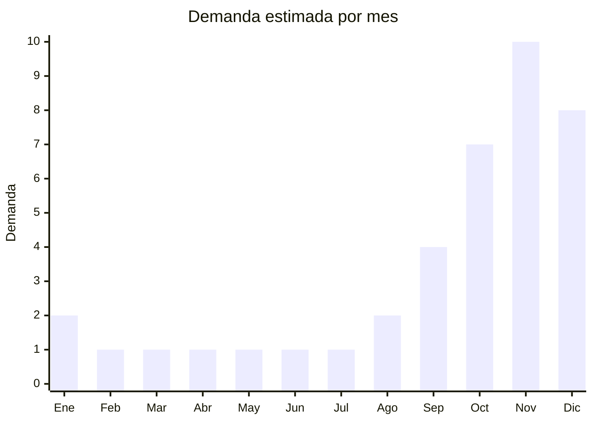

# Luces LED para arbol de Navidad

> **Capitulo NCM 85** — Maquinas, aparatos y material electrico | **Temporada:** Primavera (Sep–Nov)

## Que es y por que importarlo

Las luces LED para arbol de Navidad abarcan tiras y guirnaldas de 100 a 500 LEDs en configuraciones de hilo (string lights), cascada (waterfall), cortina (curtain lights), lluvia de meteoritos (meteor shower) y red (net lights). Se ofrecen en colores blanco calido, blanco frio, multicolor RGB y combinaciones programables con multiples modos de iluminacion (fijo, intermitente, onda, fade).

Argentina celebra Navidad en pleno verano, y la decoracion navidena comienza a venderse masivamente desde octubre-noviembre. Las luces LED han desplazado completamente a las luces incandescentes por su bajo consumo, durabilidad, seguridad (no calientan) y variedad de efectos. Yiwu (China) es la capital mundial de productos navidenos, con miles de fabricantes especializados que operan a escalas enormes con precios FOB desde USD 0.50 por tira.

La combinacion de producto ultraliviano, sin regulacion pesada (baja tension, generalmente 24V o 31V con transformador), alto margen (300-600%) y demanda estacional predecible convierte a las luces LED navidenas en uno de los productos mas rentables para importar en primavera.

## Datos clave

| Dato | Valor |
|------|-------|
| **FOB tipico (China)** | USD 0.50 — 3.00/tira |
| **Precio venta Argentina** | ARS 5.000 — 25.000 |
| **Margen estimado** | 300 — 600% |
| **MOQ habitual** | 500 — 5.000 tiras |
| **Peso/volumen** | 0.05 — 0.25 kg/tira / 0.001 — 0.005 cbm |
| **Pico de demanda** | Noviembre-Diciembre |
| **Origen principal** | Yiwu, Zhejiang, China |

## Demanda y mercado en Argentina

- **Volumen de mercado:** Demanda masiva y concentrada. Vendedores top mueven 10.000-50.000 tiras por temporada en MercadoLibre. El blanco calido es el color mas vendido, seguido por multicolor.
- **Tendencia:** Estable con leve crecimiento. La migracion de incandescentes a LED es practicamente completa. La tendencia actual es hacia luces inteligentes (controladas por app) y formas creativas (cortina, cascada).
- **Perfil del comprador:** Familias que renuevan decoracion navidena, comercios que decoran vidrieras, organizadores de eventos.
- **Canales de venta:** MercadoLibre (dominante), bazares, librerias, supermercados mayoristas, ferias navidenas.

## Variantes y subtipos mas comunes

| Variante | Descripcion | FOB referencia |
|----------|-------------|----------------|
| Guirnalda hilo 100 LEDs (10m) | Basica, blanco calido o multicolor, 8 modos | USD 0.50 — 0.80/tira |
| Guirnalda hilo 200 LEDs (20m) | Para arboles medianos-grandes | USD 0.80 — 1.50/tira |
| Guirnalda hilo 500 LEDs (50m) | Para arboles grandes o decoracion exterior | USD 1.50 — 3.00/tira |
| Cortina LED (3x3m) | Para ventanas, paredes, fondo de fiestas | USD 1.50 — 2.50/tira |
| Cascada LED (waterfall) | Efecto agua cayendo, para balcones y terrazas | USD 1.00 — 2.00/tira |
| Lluvia de meteoritos (8 tubos) | Efecto lluvia de luz, para arboles de jardin | USD 1.50 — 3.00/set |
| Luces solares exterior | Panel solar integrado, sin enchufe. Jardin/patio | USD 1.00 — 2.50/tira |
| Luces a pilas (alambre cobre) | Micro LED tipo fairy lights, decoracion interior | USD 0.30 — 0.80/tira |

## Regulaciones y requisitos

<Tabs>
  <Tab title="Certificaciones">
    | Organismo | Requiere | Detalle |
    |-----------|----------|---------|
    | ARCA (Aduana) | Si siempre | Despacho estandar |
    | S-Mark | **Depende** | Si la tira incluye transformador/adaptador conectado a red 220V, el transformador requiere S-Mark. Las luces a pilas o solares no requieren |
    | ENACOM | No | No tienen comunicacion inalambrica |
    | INTI | No | No es textil ni calzado |

    **Ventaja regulatoria:** Las luces LED de baja tension (alimentadas por transformador de 24V o 31V) tienen requisitos minimos. El transformador puede requerir S-Mark, pero si se importa como "luces decorativas de baja tension" la barrera es significativamente menor que otros productos electricos. Las versiones a pilas o solares no requieren ninguna certificacion electrica.
  </Tab>

  <Tab title="Etiquetado">
    | Requisito | Aplica |
    |-----------|--------|
    | Idioma espanol | Si |
    | Datos del importador | Si |
    | Voltaje de alimentacion | Si (indicar si es 220V con transformador, pilas o solar) |
    | Cantidad de LEDs | Si |
    | Longitud | Si |
    | Uso interior/exterior (IP rating) | Recomendado |
    | Pais de origen | Si |
    | Garantia legal 6 meses | Si |
    | Instrucciones de seguridad | Si (no cubrir, no sumergir si no es IP65+) |
  </Tab>

  <Tab title="Restricciones">
    Sin restricciones significativas. Punto de atencion: las luces que se conectan directamente a 220V sin transformador (modelos viejos o baratos) pueden generar riesgo electrico. Preferir siempre modelos con transformador a baja tension (24V o 31V) por seguridad y para minimizar requisitos regulatorios.
  </Tab>
</Tabs>

## Logistica de importacion

| Dato | Valor |
|------|-------|
| **Peso tipico por tira** | 0.05 — 0.25 kg |
| **Volumen tipico** | Muy bajo (ultraliviano y compacto) |
| **Fragilidad** | Baja (LED es resistente, cuidar conectores) |
| **Envio recomendado** | Maritimo LCL para lotes grandes desde Yiwu; Courier para muestras |
| **Tiempo total estimado** | 45 — 70 dias (maritimo) / 10 — 15 dias (aereo) |
| **Baterias de litio** | No (salvo modelos a pilas recargables, poco comun) |
| **Empaque especial** | No necesario. Vienen en blister o caja individual |

<Tip>
Yiwu tiene agentes de sourcing especializados en productos navidenos que pueden consolidar multiples productos (luces + adornos + guirnaldas) en un solo envio. Esto reduce significativamente el costo de flete por unidad. La Feria de Yiwu (octubre) es el evento clave para encontrar proveedores, pero los pedidos para Navidad deben hacerse antes de agosto para llegar a tiempo.
</Tip>

<Warning>
**Timing critico:** La ventana de venta de luces navidenas es muy corta (octubre a diciembre). Si la mercaderia llega despues de mediados de diciembre, se pierde la temporada y el stock queda varado 10 meses. Embarcar en agosto como maximo para asegurar llegada en octubre-noviembre.
</Warning>

## Estacionalidad y timing de compra

| Aspecto | Detalle |
|---------|---------|
| **Meses pico** | Noviembre (pico absoluto) y Diciembre (cierre de temporada) |
| **Meses valle** | Febrero-Agosto (demanda casi nula) |
| **Cuando pedir** | Julio-Agosto para maritimo. No hay segunda oportunidad |
| **Riesgo** | Producto 100% estacional. Stock no vendido queda hasta octubre del ano siguiente |

## Ventajas y riesgos

<CardGroup cols={2}>
  <Card title="Ventajas" icon="circle-check">
    - Margenes 300-600%
    - Ultraliviano (flete minimo)
    - Sin regulacion pesada (baja tension)
    - Yiwu ofrece FOB ultracompetitivo
    - Demanda masiva y predecible
    - Producto no perecedero (se puede guardar)
    - Combinable con otros productos navidenos
    - MOQ accesible (desde 500 tiras)
  </Card>
  <Card title="Riesgos" icon="triangle-exclamation">
    - Estacionalidad extrema (venta solo Oct-Dic)
    - Timing de importacion critico (no hay margen de error)
    - LEDs de baja calidad fallan rapidamente
    - Controladores baratos pueden fallar (modos no funcionan)
    - Competencia alta con vendedores establecidos
    - Stock no vendido queda 10 meses
    - Cambios de tendencia en colores ano a ano
  </Card>
</CardGroup>

## Palabras clave para buscar en Alibaba

> christmas lights LED wholesale, string lights 100 200 500 LED, fairy lights warm white wholesale, curtain lights LED 3x3m, waterfall LED lights christmas, meteor shower LED lights, solar string lights outdoor, christmas lights Yiwu factory

## Fuentes

- [MercadoLibre Argentina — Luces LED Navidad](https://listado.mercadolibre.com.ar/luces-led-navidad)
- [Alibaba — Christmas LED lights wholesale](https://www.alibaba.com/showroom/christmas-led-lights.html)
- [Yiwu International Trade City — Christmas products](https://www.yiwugou.com)
