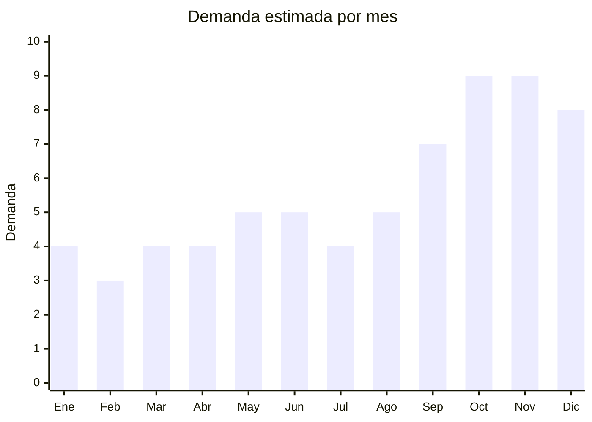

# Smartwatches y smart bands para regalo

> **Capitulo NCM 85** — Maquinas, aparatos y material electrico | **Temporada:** Primavera (Sep–Nov)

## Que es y por que importarlo

Los smartwatches y smart bands (pulseras inteligentes) son dispositivos wearable que combinan funciones de reloj con monitoreo de salud (frecuencia cardiaca, oximetro, pasos, sueno), notificaciones del celular (llamadas, WhatsApp, redes sociales) y seguimiento deportivo. Los modelos de referencia en el mercado argentino incluyen Xiaomi Smart Band 9, Garmin Forerunner y Redmi Watch.

Este producto registra un crecimiento interanual del +90% segun datos del mercado, impulsado por la masificacion del interes en salud y fitness, y por su consolidacion como regalo ideal para el Dia de la Madre (octubre). El rango de precio lo posiciona perfecto como obsequio: ni demasiado caro ni demasiado barato, con un ticket de ARS 20.000-120.000 segun el segmento.

China es el epicentro mundial de fabricacion de wearables, con Shenzhen concentrando tanto las marcas globales (Xiaomi, Huawei, Amazfit) como cientos de fabricantes OEM/ODM que producen smartwatches con especificaciones similares a marcas reconocidas a un FOB de USD 5-25. La barrera de entrada es moderada: requiere ENACOM (por Bluetooth) y S-Mark (seguridad electrica).

## Datos clave

| Dato | Valor |
|------|-------|
| **FOB tipico (China)** | USD 5 — 25/unidad |
| **Precio venta Argentina** | ARS 20.000 — 120.000 |
| **Margen estimado** | 200 — 500% |
| **MOQ habitual** | 100 — 500 unidades |
| **Peso/volumen** | 0.05 — 0.15 kg/unidad / 0.001 — 0.003 cbm |
| **Pico de demanda** | Octubre (Dia de la Madre) y Noviembre-Diciembre (CyberMonday, Navidad) |
| **Origen principal** | Shenzhen, Guangdong, China |

## Demanda y mercado en Argentina

- **Volumen de mercado:** Categoria en plena explosion. Vendedores top con 5.000-15.000 unidades vendidas en MercadoLibre. Smartwatches estan entre las 10 categorias de mayor crecimiento.
- **Tendencia:** +90% interanual. El interes en salud, fitness y tecnologia wearable impulsa la adopcion masiva.
- **Perfil del comprador:** Adultos 20-50 anos, entusiastas del fitness, compradores de regalos tecnologicos accesibles. Publico femenino fuerte para modelos elegantes.
- **Canales de venta:** MercadoLibre (dominante), tiendas de tecnologia, Instagram, venta mayorista a relojerias.

## Variantes y subtipos mas comunes

| Variante | Descripcion | FOB referencia |
|----------|-------------|----------------|
| Smart band basica (estilo Mi Band) | Pantalla AMOLED 0.96-1.1", HR, pasos, notificaciones | USD 5 — 8/u |
| Smartwatch redondo deportivo | Pantalla 1.3-1.4" AMOLED, GPS, 100+ modos deporte | USD 10 — 18/u |
| Smartwatch cuadrado (estilo Apple Watch) | Pantalla 1.7-1.9", llamadas BT, NFC, corona digital | USD 12 — 22/u |
| Smartwatch femenino elegante | Diseno delgado, colores rosa/dorado, ciclo menstrual, joyeria | USD 8 — 15/u |
| Smartwatch con llamadas (altavoz + mic) | Permite hablar desde el reloj via BT | USD 12 — 25/u |
| Smart band infantil | GPS tracking, llamadas SOS, para ninos | USD 8 — 15/u |
| Correas y accesorios repuesto | Mallas metalicas, siliconas colores, protectores pantalla | USD 0.30 — 2/u |

## Regulaciones y requisitos

<Tabs>
  <Tab title="Certificaciones">
    | Organismo | Requiere | Detalle | Costo aprox. | Tiempo aprox. |
    |-----------|----------|---------|--------------|---------------|
    | ENACOM | **Si, obligatorio** | Homologacion Bluetooth (y WiFi si aplica). Todos los smartwatches usan BT | USD 500 — 2.000 | 1 — 3 meses |
    | S-Mark (seguridad electrica) | **Si, obligatorio** | Seguridad del cargador y del dispositivo. IEC 62368-1 | USD 1.500 — 3.000 | 2 — 4 meses |
    | ARCA (Aduana) | Si siempre | Puede requerir LNA segun posicion NCM | — | Variable |
    | UN38.3 (bateria litio) | **Si, para transporte** | Certificado pruebas bateria litio (integrada en el reloj) | — | Proporcionado por fabricante |

    **Estrategia recomendada:** Iniciar el tramite de ENACOM y S-Mark en paralelo antes de embarcar la mercaderia. El tramite ENACOM es mas rapido (1-3 meses) que S-Mark (2-4 meses). Algunos agentes de homologacion gestionan ambos simultaneamente.
  </Tab>

  <Tab title="Etiquetado">
    | Requisito | Aplica |
    |-----------|--------|
    | Idioma espanol | Si |
    | Datos del importador | Si |
    | Numero homologacion ENACOM | Si (visible en caja o producto) |
    | Numero certificado S-Mark | Si |
    | Especificaciones tecnicas | Si (bateria, conectividad, resistencia al agua) |
    | Pais de origen | Si |
    | Garantia legal 6 meses | Si |
    | Manual en espanol | Si |
    | Advertencia bateria litio | Si |
  </Tab>

  <Tab title="Restricciones">
    - **Bluetooth obligatorio = ENACOM obligatorio:** No existe smartwatch funcional sin Bluetooth, por lo que ENACOM es inevitable.
    - **Resistencia al agua:** Verificar que el IP rating (IP67, IP68, 5ATM) sea real y no solo declarativo. Reclamos por agua son frecuentes.
    - **App companion:** Muchos smartwatches OEM usan apps genericas (FitPro, Da Fit, GloryFit). Verificar que la app funcione correctamente en iOS y Android en Argentina.
    - **Cargador magnetico propietario:** Cada modelo usa su propio cargador. Importar repuestos para post-venta.
  </Tab>
</Tabs>

## Logistica de importacion

| Dato | Valor |
|------|-------|
| **Peso tipico por unidad** | 0.05 — 0.15 kg (con caja) |
| **Volumen tipico** | Muy bajo (ultracompacto) |
| **Fragilidad** | Media (pantalla de vidrio) |
| **Envio recomendado** | Aereo/Courier para primeros lotes; Maritimo LCL para volumen |
| **Tiempo total estimado** | 10 — 20 dias (aereo) / 45 — 70 dias (maritimo) |
| **Baterias de litio** | Si (integrada, baja capacidad < 100Wh) |
| **Empaque especial** | Caja individual con espuma. No requiere embalaje extra |

<Tip>
Los smartwatches son tan livianos que incluso 500 unidades pesan menos de 80 kg con embalaje. El envio aereo es viable y permite llegar rapido al mercado. Para el Dia de la Madre, si no se llego con maritimo, un envio aereo de emergencia en septiembre resuelve el stock para octubre.
</Tip>

## Estacionalidad y timing de compra

| Aspecto | Detalle |
|---------|---------|
| **Meses pico** | Octubre (Dia de la Madre), Noviembre (CyberMonday) y Diciembre (Navidad) |
| **Meses valle** | Febrero-Marzo |
| **Cuando pedir** | Julio-Agosto para maritimo; Septiembre para aereo pre-Dia Madre |
| **Crecimiento** | +90% interanual. Categoria en plena expansion |

## Ventajas y riesgos

<CardGroup cols={2}>
  <Card title="Ventajas" icon="circle-check">
    - Crecimiento +90% interanual
    - Triple pico: Dia Madre + CyberMonday + Navidad
    - Ultraliviano (flete minimo)
    - Margenes 200-500%
    - Producto tecnologico con alto valor percibido
    - Venta de accesorios complementarios (correas, protectores)
    - Regalo ideal en rango de precio medio
  </Card>
  <Card title="Riesgos" icon="triangle-exclamation">
    - ENACOM + S-Mark obligatorios (doble certificacion)
    - App companion puede fallar o descontinuarse
    - Reclamos por resistencia al agua no real
    - Autonomia de bateria variable (marketing vs realidad)
    - Competencia de Xiaomi oficial (precios agresivos)
    - Cargadores propietarios: si se pierde, se inutiliza el reloj
    - Actualizaciones de firmware pueden ser inexistentes en OEM
  </Card>
</CardGroup>

<Warning>
Verificar la app companion antes de importar. Muchos smartwatches OEM chinos usan apps genericas que pueden desaparecer de las app stores o funcionar mal. Descargar la app, conectar el reloj de muestra, y testear todas las funciones durante al menos una semana antes de hacer el pedido grande. Reclamos por "no conecta" o "app no funciona" son la principal causa de devolucion.
</Warning>

## Palabras clave para buscar en Alibaba

> smartwatch wholesale OEM, smart band AMOLED wholesale, fitness tracker Bluetooth factory, smartwatch 1.9 inch calling, smart watch women elegant wholesale, smartwatch IP68 OEM Shenzhen, wearable fitness band factory, kids GPS smartwatch wholesale

## Fuentes

- [MercadoLibre Argentina — Smartwatches](https://listado.mercadolibre.com.ar/smartwatch)
- [Alibaba — Smartwatch OEM wholesale](https://www.alibaba.com/showroom/smartwatch-oem.html)
- [ENACOM — Homologacion dispositivos Bluetooth](https://www.enacom.gob.ar)
- [Nubimetrics — Categoria wearables Argentina](https://www.nubimetrics.com)
