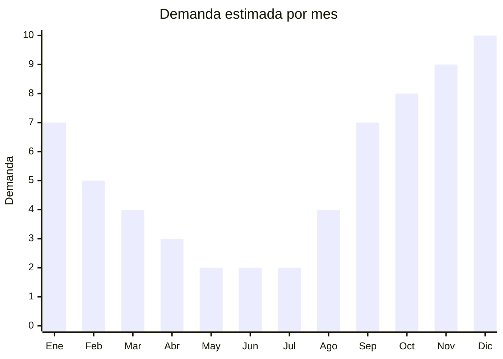

# Anteojos de sol tendencia primavera

> **Capitulo NCM 90** — Instrumentos y aparatos de optica | **Temporada:** Primavera (Sep–Nov)

## Que es y por que importarlo

Los anteojos de sol de tendencia para primavera 2025 abarcan estilos como degradado claro (lentes con transicion suave de color), oversize y XXL (monturas grandes que cubren mas rostro), aviador translucido (clasico aviador con montura de acetato transparente o semi-transparente), monturas metalicas minimalistas (estilo clean girl / quiet luxury) y prints coloridos (carey moderno, marmolado, bicolor). Son accesorios de moda no correctivos, clasificados en el Capitulo NCM 90.

La primavera marca el inicio de la temporada de sol en Argentina: los dias se alargan, las actividades al aire libre aumentan, y la demanda de anteojos de sol crece sostenidamente desde septiembre hasta su pico en diciembre-enero. Ademas, octubre (Dia de la Madre) y noviembre (CyberMonday) generan picos puntuales de venta donde los anteojos de sol son regalo clasico.

El atractivo de importar este producto radica en el margen extraordinario: un par de anteojos con proteccion UV400 y montura de acetato o metal tiene un FOB de USD 1-5 y se vende en Argentina a ARS 8.000-40.000. Al no ser anteojos correctivos (con receta), no requieren registro sanitario ni habilitacion optica, eliminando la barrera regulatoria mas compleja de la categoria.

## Datos clave

| Dato | Valor |
|------|-------|
| **FOB tipico (China)** | USD 1 — 5/par |
| **Precio venta Argentina** | ARS 8.000 — 40.000 |
| **Margen estimado** | 300 — 700% |
| **MOQ habitual** | 50 — 300 pares por modelo |
| **Peso/volumen** | 0.03 — 0.05 kg/par / 0.001 cbm aprox. |
| **Pico de demanda** | Noviembre-Diciembre (pre-verano, CyberMonday, Navidad) |
| **Origen principal** | Wenzhou y Shenzhen, China |

## Demanda y mercado en Argentina

- **Volumen de mercado:** Categoria masiva con miles de vendedores activos en MercadoLibre. Los vendedores top superan 20.000 unidades vendidas. Es una de las categorias con mayor volumen en accesorios.
- **Tendencia:** Renovacion constante de estilos por temporada. Los modelos oversize y degradado claro lideran la tendencia primavera 2025.
- **Perfil del comprador:** Universal, con enfasis en mujeres 18-45 anos para modelos de moda y hombres 20-40 para deportivos. Fuerte componente de regalo.
- **Canales de venta:** MercadoLibre (dominante), opticas, locales de accesorios, ferias, Instagram, venta callejera (cuidado con la informalidad).

## Variantes y subtipos mas comunes

| Variante | Descripcion | FOB referencia |
|----------|-------------|----------------|
| Degradado claro (gradient lens) | Lentes con transicion suave de color. Estetica Instagram | USD 1.50 — 3.00/par |
| Oversize / XXL | Monturas grandes, lentes amplios. Proteccion total. Estilo celebrity | USD 2.00 — 4.00/par |
| Aviador translucido | Forma aviador clasica con montura acetato transparente | USD 1.50 — 3.50/par |
| Monturas metalicas minimalistas | Alambre fino, estilo quiet luxury, colores dorado/plateado | USD 1.00 — 3.00/par |
| Prints coloridos (carey moderno) | Acetato multicolor, carey actualizado, bicolor, marmolado | USD 1.50 — 3.50/par |
| Cat eye retro | Forma felina, acetato grueso, estilo vintage | USD 1.50 — 3.00/par |
| Sport wrap (envolventes) | Para ciclismo, running, outdoor. Lente curva unica | USD 2.00 — 5.00/par |
| Packs x3 o x5 modelos surtidos | Mix de estilos para reventa o regalo | USD 3.00 — 8.00/pack |

## Regulaciones y requisitos

<Tabs>
  <Tab title="Certificaciones">
    | Organismo | Requiere | Detalle |
    |-----------|----------|---------|
    | ARCA (Aduana) | Si siempre | Despacho estandar |
    | ANMAT | **No** | Solo se requiere para anteojos correctivos (con receta). Los de sol no correctivos estan exentos |
    | INTI | No | No es textil ni calzado |
    | ENACOM | No | No es dispositivo electronico |

    **Ventaja regulatoria clave:** Los anteojos de sol no correctivos no requieren habilitacion ANMAT ni registro como producto medico. Esto simplifica enormemente la importacion comparado con anteojos de receta o lentes de contacto. Solo se requiere que cumplan con proteccion UV400 (filtro ultravioleta).
  </Tab>

  <Tab title="Etiquetado">
    | Requisito | Aplica |
    |-----------|--------|
    | Idioma espanol | Si |
    | Datos del importador | Si (razon social, CUIT, direccion) |
    | Proteccion UV | **Si** (indicar UV400 o categoria de filtro 1-4) |
    | Material de montura | Si (acetato, metal, policarbonato) |
    | Material de lente | Si (policarbonato, TAC, CR39) |
    | Pais de origen | Si |
    | Garantia legal 6 meses | Si |
    | Categoria de filtro solar | Recomendado (Cat. 2 uso general, Cat. 3 sol intenso) |
  </Tab>

  <Tab title="Restricciones">
    - **Proteccion UV real:** Aunque no hay regulacion estricta en Argentina para anteojos de sol, vender anteojos sin proteccion UV real (que solo tengan lente oscura sin filtro) puede generar reclamos legales por dano a la salud visual. Exigir siempre certificado UV400 al fabricante.
    - **Marcas registradas:** No importar anteojos con logos de Ray-Ban, Oakley, Gucci, etc. sin licencia. La Aduana retiene falsificaciones.
    - **Lentes polarizados:** Si se publicitan como "polarizados", deben realmente tener lente polarizada (verificar con polarimetro). Publicidad enganosa genera sanciones.
  </Tab>
</Tabs>

## Logistica de importacion

| Dato | Valor |
|------|-------|
| **Peso tipico por par** | 0.03 — 0.05 kg |
| **Volumen tipico** | Muy bajo |
| **Fragilidad** | Media (lentes pueden rayarse, monturas de acetato pueden deformarse con calor) |
| **Envio recomendado** | Aereo/Courier para lotes chicos; Maritimo LCL para volumen |
| **Tiempo total estimado** | 10 — 18 dias (aereo) / 45 — 65 dias (maritimo) |
| **Baterias de litio** | No |
| **Empaque especial** | Cada anteojo con funda rigida o semi-rigida + pano limpiador |

<Tip>
Incluir funda rigida y pano de microfibra con el logo de tu marca. El costo adicional es minimo (USD 0.20-0.50 por set) pero eleva dramaticamente el valor percibido. En MercadoLibre, las publicaciones con "incluye estuche rigido" tienen 30-40% mas de conversion que las que muestran solo el anteojo.
</Tip>

## Estacionalidad y timing de compra

| Aspecto | Detalle |
|---------|---------|
| **Meses pico** | Noviembre-Diciembre (pre-verano + CyberMonday + Navidad) y Enero (verano pleno) |
| **Meses valle** | Mayo-Julio (invierno, minima exposicion solar) |
| **Cuando pedir** | Agosto para maritimo pre-temporada; Septiembre para aereo |
| **Tendencia** | Los estilos cambian cada temporada. Seguir tendencias de Fashion Weeks y TikTok para seleccionar modelos |

## Ventajas y riesgos

<CardGroup cols={2}>
  <Card title="Ventajas" icon="circle-check">
    - Margenes 300-700% (uno de los mas altos)
    - Sin regulacion (no correctivos = sin ANMAT)
    - Ultraliviano (flete minimo)
    - Producto aspiracional (moda, estilo de vida)
    - MOQ bajo para testear modelos
    - Marca propia viable con costo minimo
    - Multiples canales: ML, Instagram, ferias, opticas
    - Regalo clasico (Dia Madre, Navidad, cumpleanos)
  </Card>
  <Card title="Riesgos" icon="triangle-exclamation">
    - Tendencias cambian cada temporada (riesgo de stock obsoleto)
    - Lentes sin UV real = riesgo legal y reputacional
    - Falsificacion de marcas genera retencion aduanera
    - Calidad variable (bisagras flojas, pintura que se descascara)
    - Necesidad de cubrir muchos modelos y colores
    - Competencia intensa en MercadoLibre
    - Reclamos por "color diferente al de la foto" (pantallas distorsionan colores)
  </Card>
</CardGroup>

<Warning>
**Exigir siempre certificado UV400 al fabricante.** Anteojos con lentes oscuras sin proteccion UV son mas peligrosos que no usar nada: la pupila se dilata por la oscuridad y recibe mas radiacion ultravioleta. Pedir informe de laboratorio que certifique bloqueo de UV hasta 400nm. El costo del test es USD 50-100 por modelo y protege de responsabilidad legal.
</Warning>

## Palabras clave para buscar en Alibaba

> sunglasses wholesale UV400, oversized sunglasses women wholesale, aviator sunglasses acetate, gradient lens sunglasses, minimalist metal sunglasses, cat eye sunglasses wholesale, polarized sunglasses bulk, sunglasses private label OEM, fashion sunglasses 2025 trend

## Fuentes

- [MercadoLibre Argentina — Anteojos de sol](https://listado.mercadolibre.com.ar/anteojos-sol)
- [Alibaba — Sunglasses wholesale](https://www.alibaba.com/showroom/sunglasses-wholesale.html)
- [Wenzhou Eyewear Industry — Suppliers](https://www.made-in-china.com/products-search/hot-china-products/Sunglasses.html)
- [Nubimetrics — Categoria anteojos Argentina](https://www.nubimetrics.com)
