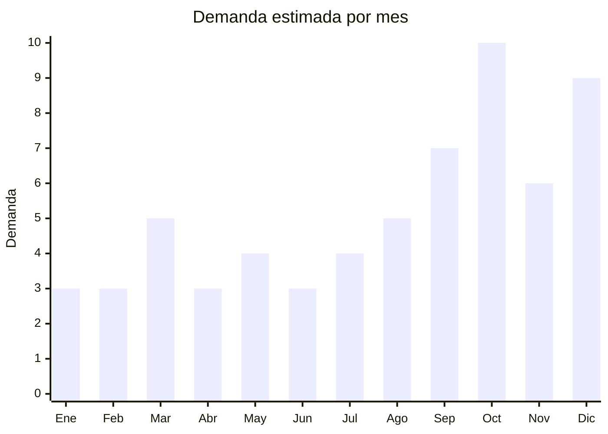

# Relojes pulsera femeninos — regalo Día de la Madre

> **Capítulo NCM 91** — Relojería | **Temporada:** Primavera (Sep–Nov)

## Qué es y por qué importarlo

Los relojes de pulsera femeninos de gama media-baja constituyen uno de los productos regalo más vendidos para el **Día de la Madre** (tercer domingo de octubre en Argentina). El formato ideal para importación incluye relojes analógicos con caja de aleación, maquinaria de cuarzo y correa intercambiable, presentados en cajas regalo atractivas. El segmento no compite con relojería de lujo sino con el concepto de **accesorio de moda + packaging regalo**.

China concentra más del 80% de la producción mundial de relojes de cuarzo de gama media-baja. Shenzhen (distrito de Luohu) es el epicentro de la industria relojera china, con miles de fábricas y trading companies especializadas. Guangzhou también alberga un cluster importante. Los movimientos de cuarzo japoneses (Miyota, Seiko/TMI) o chinos (Sunon, Tongji) permiten ofrecer calidad confiable a costos muy bajos.

El atractivo de este producto para el importador argentino radica en su combinación de bajo costo FOB, alto valor percibido (un reloj siempre se percibe como un regalo significativo), packaging que suma valor sin sumar costo real, y márgenes muy interesantes. Los sets de reloj + pulseras en caja regalo pueden venderse entre 3x y 5x su costo de importación.

## Demanda y mercado en Argentina

- **Volumen de mercado:** El Día de la Madre es el segundo evento de regalos más importante del año en Argentina (después de Navidad). Los relojes de pulsera representan una de las categorías top en regalos femeninos, con miles de publicaciones activas en MercadoLibre.
- **Tendencia:** Estable-Creciente. El reloj como accesorio de moda (no funcional) gana terreno frente a smartwatches entre público femenino que prioriza estética sobre tecnología.
- **Perfil del comprador:** Hombres y mujeres de 20-50 años comprando regalo para madre, pareja o amiga. Los sets en caja regalo tienen la mayor conversión.
- **Canales de venta principales:** MercadoLibre (dominante), Instagram shopping, tiendas web propias, ferias y showrooms.

<Note>
El formato **set reloj + pulsera en caja regalo** tiene el mejor rendimiento en ventas. El packaging premium (caja forrada, moño, tarjeta) agrega apenas USD 0.50-1.00 al costo FOB pero permite subir el precio de venta un 30-50%.
</Note>

## Datos clave

| Dato | Valor |
|------|-------|
| **FOB típico (China)** | USD 3 — 12/reloj (según acabado y packaging) |
| **Precio venta Argentina** | ARS 15.000 — 55.000 |
| **Margen estimado** | 150% — 300% |
| **MOQ habitual** | 100 — 500 unidades |
| **Peso/volumen** | 0.08 — 0.15 kg/unidad / 0.001 cbm aprox. |
| **Pico de demanda** | Octubre (Día de la Madre), Diciembre (Navidad) |
| **Origen principal** | Shenzhen (Luohu), Guangzhou, China |

## Variantes y subtipos más comunes

| Variante | Descripción | FOB referencia |
|----------|-------------|----------------|
| Analógico minimalista oro rosa | Caja 32-36mm, correa mesh acero, esfera limpia | USD 3 — 6 |
| Set reloj + pulseras intercambiables | 1 reloj + 3-5 correas de distintos colores/materiales | USD 5 — 10 |
| Set reloj + pulsera en caja regalo | Reloj + pulsera complementaria en caja premium | USD 4 — 8 |
| Reloj con piedras/cristales decorativos | Caja con incrustaciones de circón, look elegante | USD 5 — 12 |
| Reloj cerámica look premium | Correa cerámica blanca o negra, aspecto sofisticado | USD 8 — 12 |

## Regulaciones y requisitos

<Tabs>
  <Tab title="Certificaciones">
    | Organismo | Requiere | Detalle |
    |-----------|----------|---------|
    | ARCA (Aduana) | Sí siempre | Despacho de importación estándar |
    | ANMAT | No | No es producto sanitario ni cosmético |
    | ENACOM | No | Los relojes analógicos de cuarzo no requieren homologación. Solo aplica si el reloj tiene Bluetooth/smartwatch |
    | INTI | No | No es textil ni calzado |

    <Warning>
    Si el reloj tiene funcionalidad **Bluetooth o conectividad inalámbrica** (smartwatch), pasa a requerir homologación ENACOM. Los relojes analógicos de cuarzo puros **no** requieren ninguna certificación especial.
    </Warning>
  </Tab>

  <Tab title="Etiquetado">
    | Requisito | Aplica |
    |-----------|--------|
    | Idioma español | Sí |
    | Datos del importador | Sí (razón social, CUIT, dirección) |
    | País de origen | Sí ("Made in China" o "Industria China") |
    | Material de la caja y correa | Recomendado (aleación, acero, cuero sintético) |
    | Garantía legal 6 meses | Sí |
    | Tipo de movimiento | Recomendado (cuarzo, movimiento japonés/chino) |
  </Tab>

  <Tab title="Restricciones">
    Sin restricciones especiales para relojes analógicos de cuarzo. No hay antidumping vigente, no hay licencias previas ni cupos de importación. Es un producto con barrera regulatoria mínima siempre que no incorpore tecnología inalámbrica.
  </Tab>
</Tabs>

## Logística de importación

| Dato | Valor |
|------|-------|
| **Peso típico por unidad** | 0.08 — 0.15 kg (con caja regalo) |
| **Volumen** | Muy bajo — producto compacto |
| **Fragilidad** | Media (cristal del reloj) |
| **Envío recomendado** | Aéreo/courier para pedidos chicos (< 500 uds). Marítimo LCL para volúmenes mayores |
| **Tiempo total estimado** | 45 — 70 días (marítimo) / 12 — 20 días (aéreo) |
| **Baterías** | Sí — batería de botón (SR626SW o similar). Revisar regulación IATA para envío aéreo |

<Tip>
Los relojes son productos de **alto valor por kilo**, lo que hace que el flete aéreo sea viable económicamente incluso para pedidos medianos. Un pedido de 500 relojes pesa apenas 40-75 kg y cabe en 2-3 cajas. Ideal para reposición rápida antes del Día de la Madre.
</Tip>

## Estacionalidad y timing de compra

| Aspecto | Detalle |
|---------|---------|
| **Meses pico** | Octubre (Día de la Madre), Diciembre (Navidad/regalos) |
| **Meses valle** | Enero-Febrero, Abril, Junio |
| **Cuándo pedir para Día de la Madre** | Julio-Agosto (marítimo) o Septiembre temprano (aéreo) |
| **Cuándo pedir para Navidad** | Septiembre (marítimo) o Noviembre temprano (aéreo) |

## Ventajas y riesgos

<CardGroup cols={2}>
  <Card title="Ventajas" icon="circle-check">
    - Sin regulación especial (barrera mínima)
    - Producto liviano y compacto (flete bajo)
    - Alto valor percibido como regalo
    - Márgenes amplios (200-300%)
    - MOQ accesible para primer importación
    - Packaging premium a bajo costo extra
    - Ideal para marca propia (private label)
  </Card>
  <Card title="Riesgos" icon="triangle-exclamation">
    - Calidad de movimiento variable (pedir muestras siempre)
    - Movimientos baratos pueden fallar en 3-6 meses
    - El cristal puede rayarse fácilmente en gama baja
    - Competencia con relojería de moda local (Swatch, Casio)
    - Batería puede agotarse en tránsito si el reloj viene en marcha
    - Temporada corta: si no llega a tiempo para octubre, el stock queda para diciembre
  </Card>
</CardGroup>

<Warning>
Solicitar siempre que los relojes vengan con **pull tab** (lengüeta plástica) que impide contacto de la batería durante el transporte. Esto evita que la batería se agote antes de la venta. Verificar con el proveedor que el movimiento tenga al menos 2 años de vida útil de batería.
</Warning>

## Palabras clave para buscar en Alibaba

> `women quartz watch gift set, ladies watch bracelet set gift box, rose gold minimalist women watch, interchangeable strap watch set, mother's day watch gift set, mesh strap women watch wholesale, women watch private label OEM`

## Fuentes

- [MercadoLibre Argentina — Relojes mujer](https://listado.mercadolibre.com.ar/relojes-joyas-accesorios/relojes-pulsera/mujer/)
- [Alibaba — Women watch gift set](https://www.alibaba.com/showroom/women-watch-gift-set.html)
- [AFIP — Nomenclador NCM Cap. 91](https://www.afip.gob.ar)
