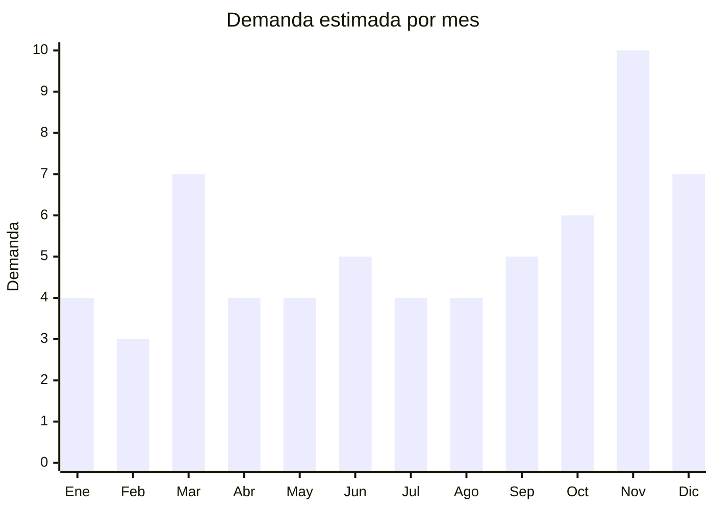

# Colchones y sommiers — CyberMonday

> **Capítulo NCM 94** — Muebles, artículos de cama y similares | **Temporada:** Primavera (Sep–Nov)

## Qué es y por qué importarlo

Los colchones y sommiers son consistentemente uno de los productos **top 10 en facturación** durante el CyberMonday argentino (generalmente en noviembre). La categoría Hogar/Descanso mueve millones de pesos en esos días, impulsada por descuentos agresivos y financiación en cuotas. Los formatos más importables desde China son los **colchones de memory foam enrollados al vacío** (bed-in-a-box) y los colchones de **resortes pocket** (resortes independientes embolsados).

La tecnología de **empaque roll-packed** (enrollado y comprimido al vacío) revolucionó la logística de colchones: un colchón queen (140x190cm) que normalmente ocupa 0.3 cbm se comprime a 0.05 cbm, reduciendo el flete drásticamente. China lidera esta tecnología, con fábricas especializadas en Foshan (Guangdong), Nantong (Jiangsu) y Hangzhou (Zhejiang).

El modelo de negocio más exitoso para importadores argentinos es la **marca propia** (private label) con venta directa online, replicando el modelo de las marcas DTC (Direct-to-Consumer) como Calm, Piero Online o SleepBox. El CyberMonday es el evento clave para captar volumen con publicidad y posicionamiento en marketplaces.

## Demanda y mercado en Argentina

- **Volumen de mercado:** Los colchones figuran consistentemente en el top 10 de facturación del CyberMonday argentino. La categoría Hogar/Descanso supera los miles de millones de pesos en ventas anuales online.
- **Tendencia:** Creciente. El modelo bed-in-a-box (compra online con envío a domicilio) crece año a año, replicando la tendencia internacional de marcas como Casper, Purple o Emma.
- **Perfil del comprador:** Parejas jóvenes (25-40 años) que buscan calidad a precio competitivo, familias en mudanza, y consumidores que aprovechan cuotas sin interés del CyberMonday.
- **Competencia local:** Piero, Cannon, Simmons, La Cardeuse dominan el mercado, pero las marcas DTC importadas ganan terreno por precio y modelo de venta directo.

## Datos clave

| Dato | Valor |
|------|-------|
| **FOB típico (China)** | USD 50 — 150/colchón memory foam 140x190 (roll-packed) |
| **Precio venta Argentina** | ARS 150.000 — 650.000 |
| **Margen estimado** | 80% — 180% |
| **MOQ habitual** | 50 — 200 colchones (primer pedido) |
| **Peso/volumen** | 18 — 30 kg / 0.04 — 0.06 cbm (roll-packed) |
| **Pico de demanda** | Noviembre (CyberMonday), Marzo (mudanzas) |
| **Origen principal** | Foshan (Guangdong), Nantong (Jiangsu), China |

## Variantes y subtipos más comunes

| Variante | Descripción | FOB referencia |
|----------|-------------|----------------|
| Memory foam 20cm — 140x190 | Espuma viscoelástica, densidad 40-50 kg/m3, roll-packed | USD 50 — 80 |
| Memory foam 25cm — 140x190 | Mayor grosor, capas diferenciadas (soporte + confort) | USD 70 — 100 |
| Resortes pocket + foam top — 140x190 | 500-800 resortes independientes + capa memory foam | USD 80 — 130 |
| Híbrido premium 30cm — 160x200 | Resortes pocket + gel memory foam + pillow top | USD 100 — 150 |
| Colchón individual 80x190 memory foam | Tamaño individual, ideal estudiantes | USD 30 — 50 |
| Sommier base — 140x190 | Base tapizada con estructura madera/metal | USD 40 — 70 |

## Regulaciones y requisitos

<Tabs>
  <Tab title="Certificaciones">
    | Organismo | Requiere | Detalle |
    |-----------|----------|---------|
    | ARCA (Aduana) | Sí siempre | Despacho de importación estándar |
    | ANMAT | No | No es producto sanitario |
    | INTI | Posible | Norma ignífuga puede aplicar según regulación vigente |

    <Warning>
    Argentina tiene normativa sobre **resistencia al fuego** para colchones (basada en norma IRAM). Verificar con el despachante si aplica declaración jurada de cumplimiento de norma ignífuga. Algunos colchones importados requieren tratamiento retardante de llama (FR) en la tela exterior. Consultar regulación actualizada antes de importar.
    </Warning>
  </Tab>

  <Tab title="Etiquetado">
    | Requisito | Aplica |
    |-----------|--------|
    | Idioma español | Sí |
    | Datos del importador | Sí (razón social, CUIT, dirección) |
    | País de origen | Sí |
    | Composición de materiales | Sí (tipo de espuma, densidad, tela) |
    | Medidas exactas | Sí (largo x ancho x alto en cm) |
    | Instrucciones de desempaque y uso | Sí (especialmente para roll-packed: tiempo de expansión) |
    | Garantía legal 6 meses | Sí (muchas marcas ofrecen garantía extendida como diferencial) |
  </Tab>

  <Tab title="Restricciones">
    - Verificar normativa ignífuga vigente (puede requerir certificado de laboratorio)
    - No hay antidumping vigente sobre colchones de China
    - Las espumas deben cumplir con densidad mínima declarada (control INTI posible)
    - Tener en cuenta que las medidas argentinas difieren de las internacionales (140x190 vs 150x200 europeo)
  </Tab>
</Tabs>

## Logística de importación

| Dato | Valor |
|------|-------|
| **Peso típico por unidad** | 18 — 30 kg (colchón 140x190 memory foam) |
| **Volumen roll-packed** | 0.04 — 0.06 cbm (comprimido al vacío) |
| **Volumen sin comprimir** | 0.25 — 0.35 cbm (el triple o más) |
| **Fragilidad** | Baja (producto blando) |
| **Envío recomendado** | Marítimo FCL o LCL. Roll-packed optimiza espacio |
| **Tiempo total estimado** | 55 — 85 días (marítimo, puerta a puerta) |
| **Contenedor 20ft** | Aprox. 200-400 colchones roll-packed 140x190 |
| **Contenedor 40ft HC** | Aprox. 450-800 colchones roll-packed 140x190 |

<Tip>
El formato **roll-packed** (enrollado al vacío) es fundamental para la viabilidad económica del flete. Un contenedor 40ft puede transportar 500+ colchones comprimidos, versus solo 100-150 colchones sin comprimir. Exigir siempre empaque roll-packed al proveedor y verificar que el colchón recupera su forma completa en 48-72 horas máximo.
</Tip>

<Warning>
Los colchones roll-packed tienen un **límite de tiempo comprimidos** (generalmente 3-6 meses). Si permanecen comprimidos más de 6 meses, la espuma puede no recuperar su forma original. Planificar la logística para que el producto no quede demasiado tiempo en tránsito + almacén comprimido.
</Warning>

## Estacionalidad y timing de compra

| Aspecto | Detalle |
|---------|---------|
| **Meses pico** | Noviembre (CyberMonday), Marzo (mudanzas inicio año lectivo), Diciembre |
| **Meses valle** | Febrero, Abril |
| **Cuándo pedir para CyberMonday** | Julio — Agosto (marítimo, para llegar en octubre y preparar stock) |
| **Estrategia CyberMonday** | Participar oficialmente en CACE requiere inscripción previa. Preparar stock 30 días antes del evento |

## Ventajas y riesgos

<CardGroup cols={2}>
  <Card title="Ventajas" icon="circle-check">
    - Top 10 en facturación CyberMonday (demanda comprobada)
    - Roll-packed optimiza logística enormemente
    - Ideal para marca propia DTC (direct-to-consumer)
    - Ticket alto (ARS 200.000+) genera facturación relevante
    - Demanda base todo el año (no solo CyberMonday)
    - Modelo bed-in-a-box es tendencia creciente en Argentina
  </Card>
  <Card title="Riesgos" icon="triangle-exclamation">
    - Producto pesado y voluminoso (flete significativo)
    - Norma ignífuga puede complicar el despacho
    - Garantía y postventa complejos (devoluciones de colchones son caras)
    - Competencia con marcas nacionales establecidas (Piero, Cannon, Simmons)
    - Logística de última milla complicada (producto grande)
    - Colchones comprimidos por más de 6 meses pierden calidad
  </Card>
</CardGroup>

## Palabras clave para buscar en Alibaba

> `memory foam mattress roll packed, bed in a box mattress wholesale, pocket spring mattress vacuum packed, gel memory foam mattress OEM, mattress manufacturer Foshan, roll up mattress 140x190, mattress private label manufacturer`

## Fuentes

- [MercadoLibre Argentina — Colchones](https://listado.mercadolibre.com.ar/colchones/)
- [CACE — CyberMonday Argentina](https://www.cace.org.ar)
- [Alibaba — Memory foam mattress roll packed](https://www.alibaba.com/showroom/memory-foam-mattress.html)
- [IRAM — Normas de seguridad para colchones](https://www.iram.org.ar)
