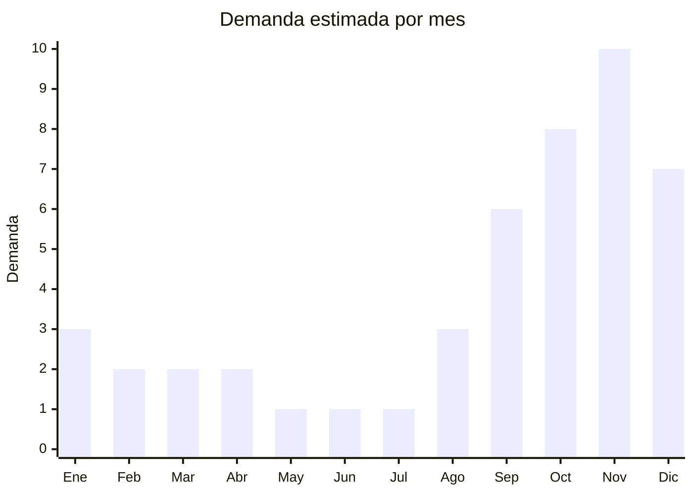

# Muebles de exterior y jardín

> **Capítulo NCM 94** — Muebles; mobiliario médico-quirúrgico | **Temporada:** Primavera (Sep–Nov)

## Qué es y por qué importarlo

Los muebles de exterior y jardín experimentan un pico de demanda entre septiembre y diciembre en Argentina, coincidiendo con la llegada del clima cálido y los eventos CyberMonday/HotSale donde la categoría Hogar/Muebles/Jardín se ubica consistentemente en el **top 5 de facturación**. Los productos más importables incluyen juegos de mesa + sillas de ratán sintético (poly-rattan), conjuntos de aluminio con textilene, y muebles de madera (acacia, teca, eucalipto).

China es el mayor exportador mundial de muebles de exterior, con clusters de producción en **Foshan** (Guangdong) para ratán sintético y aluminio, **Anji** (Zhejiang) para muebles de bambú/madera, y **Linhai** (Zhejiang) para muebles plásticos tipo ratán. Los precios FOB son altamente competitivos comparados con la fabricación local argentina, especialmente en ratán sintético donde la diferencia puede ser de 3x a 5x.

El principal desafío de este producto es la logística: los muebles de jardín son **muy voluminosos** y pesados, lo que encarece significativamente el flete marítimo. La solución más eficiente es importar muebles **desarmables** (KD — knock-down) que se arman en destino, reduciendo el volumen hasta un 60-70%.

## Demanda y mercado en Argentina

- **Volumen de mercado:** La categoría Hogar/Muebles/Jardín se ubica en el top 5 de facturación del CyberMonday y HotSale argentinos. La demanda de muebles de exterior crece con la expansión de viviendas con patio/jardín en GBA y ciudades del interior.
- **Tendencia:** Creciente. La pandemia aceleró la inversión en espacios exteriores del hogar. El ratán sintético desplazó progresivamente al plástico inyectado por su estética superior.
- **Perfil del comprador:** Propietarios con jardín, terraza o balcón amplio (35-55 años). También gastronómicos que equipan patios de restaurantes y bares.
- **Canales de venta:** MercadoLibre, tiendas web propias, mayorista a mueblerías y corralones. Los locales de decoración y jardín son canal clave.

## Datos clave

| Dato | Valor |
|------|-------|
| **FOB típico (China)** | USD 30 — 80/juego (mesa + 4 sillas, KD) |
| **Precio venta Argentina** | ARS 200.000 — 800.000 |
| **Margen estimado** | 80% — 150% |
| **MOQ habitual** | 50 — 200 juegos |
| **Peso/volumen** | 25 — 50 kg / 0.3 — 0.8 cbm por juego (armado) / 0.1 — 0.3 cbm (KD) |
| **Pico de demanda** | Octubre — Diciembre |
| **Origen principal** | Foshan (Guangdong), Anji (Zhejiang), China |

## Variantes y subtipos más comunes

| Variante | Descripción | FOB referencia |
|----------|-------------|----------------|
| Juego ratán sintético 4 sillas + mesa (KD) | Estructura acero, trenzado PE ratán, cojines incluidos | USD 40 — 80 |
| Juego aluminio + textilene 4 sillas + mesa | Ligero, resistente óxido, plegable | USD 50 — 90 |
| Set balcón 2 sillas + mesa ratán | Formato pequeño para departamento | USD 20 — 40 |
| Sillón individual ratán con cojín | Tipo butaca jardín o galería | USD 15 — 30 |
| Reposera/tumbona aluminio textilene | Plegable, reclinable, para pileta | USD 15 — 35 |
| Juego madera acacia 4 sillas + mesa (KD) | Madera maciza plegable, estilo clásico | USD 50 — 90 |
| Sombrilla/parasol 2.5-3m con base | Complemento indispensable | USD 10 — 25 |

## Regulaciones y requisitos

<Tabs>
  <Tab title="Certificaciones">
    | Organismo | Requiere | Detalle |
    |-----------|----------|---------|
    | ARCA (Aduana) | Sí siempre | Despacho de importación estándar |
    | ANMAT | No | No es producto sanitario |
    | INTI | No | No es textil ni calzado (los cojines podrían requerir etiquetado textil si se venden por separado) |
    | SENASA | Posible | Si los muebles son de **madera maciza**, puede requerir certificado fitosanitario |

    <Note>
    Los muebles de **ratán sintético** (PE/PVC) y **aluminio** no requieren ninguna certificación especial. Los muebles de **madera** pueden requerir certificado fitosanitario y tratamiento contra plagas (norma NIMF-15 para embalajes de madera). Consultar con el despachante.
    </Note>
  </Tab>

  <Tab title="Etiquetado">
    | Requisito | Aplica |
    |-----------|--------|
    | Idioma español | Sí |
    | Datos del importador | Sí (razón social, CUIT, dirección) |
    | País de origen | Sí |
    | Materiales | Sí (tipo de ratán, metal, madera, tela de cojines) |
    | Instrucciones de armado | Sí, en español (para muebles KD) |
    | Peso máximo soportado | Recomendado (dato clave para el consumidor) |
    | Garantía legal 6 meses | Sí |
  </Tab>

  <Tab title="Restricciones">
    - No hay antidumping vigente sobre muebles de exterior de China
    - Muebles de madera maciza pueden requerir documentación de origen (trazabilidad forestal)
    - Los cojines de tela podrían requerir etiquetado de composición textil
    - Verificar que los herrajes y tornillos estén incluidos y sean de calidad (punto débil frecuente)
  </Tab>
</Tabs>

## Logística de importación

| Dato | Valor |
|------|-------|
| **Peso típico por juego** | 25 — 50 kg (mesa + 4 sillas + cojines) |
| **Volumen KD (desarmado)** | 0.10 — 0.30 cbm por juego |
| **Volumen armado** | 0.30 — 0.80 cbm por juego (NO recomendado) |
| **Fragilidad** | Media (vidrio de mesa, estructura ratán) |
| **Envío recomendado** | Marítimo FCL. Un 40ft HC cabe aprox. 80-150 juegos KD |
| **Tiempo total estimado** | 55 — 85 días (marítimo) |

<Tip>
**Siempre importar en formato KD (knock-down / desarmable)**. Un juego de ratán armado ocupa 0.5-0.8 cbm, pero desarmado baja a 0.15-0.25 cbm. Esto puede triplicar la cantidad de juegos por contenedor. Verificar que el proveedor incluya tornillería completa, instrucciones claras y herramientas básicas (llave Allen). Los muebles que se venden como "fácil armado" tienen mejor recepción del consumidor.
</Tip>

<Warning>
El **vidrio de las mesas** es el punto más frágil del envío. Solicitar al proveedor empaque reforzado con espuma de polietileno y esquineros de cartón. Considerar importar mesas con tapa de vidrio templado (más resistente) o directamente con tapa de ratán sintético para eliminar el riesgo de rotura.
</Warning>

## Estacionalidad y timing de compra

| Aspecto | Detalle |
|---------|---------|
| **Meses pico** | Octubre — Noviembre (CyberMonday + preparación verano) |
| **Meses valle** | Mayo — Julio (invierno, sin demanda de exterior) |
| **Cuándo pedir** | Junio — Julio (para llegar en septiembre/octubre) |
| **Ventana crítica** | Stock debe estar disponible antes de noviembre. Después de diciembre la demanda cae |

## Ventajas y riesgos

<CardGroup cols={2}>
  <Card title="Ventajas" icon="circle-check">
    - Top 5 CyberMonday en categoría Hogar
    - Ticket alto (ARS 300.000+) genera buena facturación
    - Diferencia de precio vs. producción local significativa
    - Variedad enorme de diseños y materiales
    - Complemento natural con parasoles, cojines, decoración exterior
    - Marca propia viable con MOQ relativamente bajo
  </Card>
  <Card title="Riesgos" icon="triangle-exclamation">
    - **MUY voluminoso** — flete es componente clave del costo
    - Logística de última milla complicada (producto grande y pesado)
    - Rotura de vidrios en tránsito es frecuente
    - Estacionalidad marcada — stock sobrante queda hasta próximo año
    - Calidad de herrajes puede ser deficiente (sillas que se aflojan)
    - Cojines pueden llegar con humedad/moho si el container no tiene ventilación
  </Card>
</CardGroup>

## Palabras clave para buscar en Alibaba

> `rattan garden furniture set wholesale, outdoor patio furniture 4 seater, KD outdoor furniture knock down, aluminum textilene outdoor chair, poly rattan dining set, garden furniture set Foshan, outdoor furniture manufacturer China`

## Fuentes

- [MercadoLibre Argentina — Muebles de jardín](https://listado.mercadolibre.com.ar/muebles-jardin-exterior/)
- [Alibaba — Outdoor rattan furniture](https://www.alibaba.com/showroom/rattan-outdoor-furniture.html)
- [CACE — CyberMonday Argentina datos categorías](https://www.cace.org.ar)
