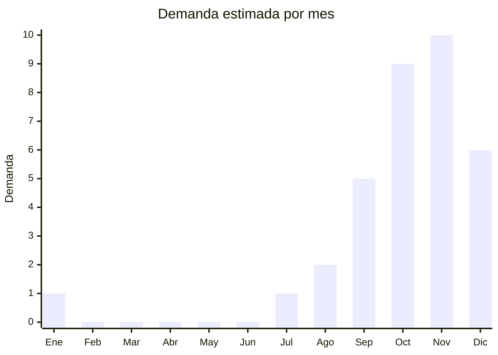

# Adornos de árbol de Navidad artesanales

> **Capítulo NCM 95** — Juguetes, juegos y artículos para recreo o deporte; artículos para fiestas | **Temporada:** Primavera (Sep–Nov)

## Qué es y por qué importarlo

Los adornos de árbol de Navidad con acabado artesanal (handmade/hand-painted) incluyen bolas pintadas a mano, figuras de resina (Papá Noel, ángeles, renos, casitas), adornos de fieltro, estrellas de metal/madera, campanas decorativas y colgantes temáticos. Son productos de **alta demanda estacional** con una ventana de ventas concentrada entre octubre y diciembre.

**Yiwu** (Zhejiang, China) es el epicentro mundial absoluto de la producción navideña. El mercado mayorista de Yiwu (Yiwu International Trade City) tiene distritos enteros dedicados exclusivamente a decoración navideña, con miles de proveedores que ofrecen desde adornos masivos a USD 0.10/pieza hasta piezas artesanales premium de resina pintada a mano a USD 2-3/pieza. Se estima que Yiwu produce más del 60% de los adornos navideños del mundo.

Para el importador argentino, el atractivo es la combinación de costo unitario extremadamente bajo, alto valor percibido (especialmente los adornos "handmade" y de resina), ausencia total de regulaciones especiales, y la posibilidad de armar sets/colecciones con marca propia. El margen por pieza individual es bajo, pero el volumen de venta compensa ampliamente. Los sets de 6-12 adornos en caja regalo premium tienen el mejor ratio margen/esfuerzo.

## Datos clave

| Dato | Valor |
|------|-------|
| **FOB típico (China)** | USD 0.10 — 1/adorno básico, USD 0.50 — 3/figura resina |
| **Precio venta Argentina** | ARS 800 — 5.000/adorno, ARS 5.000 — 25.000/set |
| **Margen estimado** | 200% — 500% |
| **MOQ habitual** | 500 — 5.000 piezas (adornos), 200 — 1.000 (figuras resina) |
| **Peso/volumen** | 0.01 — 0.15 kg/pieza / muy bajo por unidad |
| **Pico de demanda** | Octubre — Noviembre |
| **Origen principal** | Yiwu (Zhejiang), Quanzhou (Fujian), China |

## Variantes y subtipos más comunes

| Variante | Descripción | FOB referencia |
|----------|-------------|----------------|
| Bolas plástico pintadas a mano (6cm) | PS/PET, diseños variados, pack x6-12 | USD 0.10 — 0.30/unidad |
| Bolas vidrio soplado pintadas | Cristal, acabado premium, frágiles | USD 0.30 — 1.00/unidad |
| Figuras resina colgantes (Papá Noel, ángel, reno) | 5-10cm, pintadas a mano, con gancho | USD 0.50 — 2.00/unidad |
| Figuras resina decorativas (no colgante) | 10-20cm, para estante/mesa, detalladas | USD 1.00 — 3.00/unidad |
| Adornos fieltro hechos a mano | Muñeco nieve, árbol, estrella, cosidos | USD 0.15 — 0.50/unidad |
| Estrellas/campanas metal/madera | Colgantes, estilo rústico/vintage | USD 0.10 — 0.40/unidad |
| Set 12 adornos surtidos en caja regalo | Mix de tipos en caja presentación | USD 1.50 — 5.00/set |
| Puntero estrella para copa árbol | LED o sin luz, 20-30cm | USD 0.50 — 2.00/unidad |

## Regulaciones y requisitos

<Tabs>
  <Tab title="Certificaciones">
    | Organismo | Requiere | Detalle |
    |-----------|----------|---------|
    | ARCA (Aduana) | Sí siempre | Despacho de importación estándar |
    | ANMAT | No | No es producto sanitario ni cosmético |
    | ENACOM | No | No es dispositivo electrónico (las luces LED tipo guirnalda van aparte) |
    | INTI | No | No es textil ni calzado |
    | IRAM | No | No es juguete |

    <Note>
    Los adornos navideños no requieren **ninguna certificación especial** en Argentina. Son uno de los productos con la barrera regulatoria más baja posible. Solo se requiere el despacho aduanero estándar, etiquetado correcto y garantía legal.
    </Note>
  </Tab>

  <Tab title="Etiquetado">
    | Requisito | Aplica |
    |-----------|--------|
    | Idioma español | Sí |
    | Datos del importador | Sí (razón social, CUIT, dirección) |
    | País de origen | Sí |
    | Material | Recomendado (resina, vidrio, plástico, fieltro, metal) |
    | Advertencia "no es juguete" | Recomendado (si tiene apariencia infantil, para evitar confusión regulatoria) |
    | Garantía legal 6 meses | Sí |
  </Tab>

  <Tab title="Restricciones">
    Sin restricciones especiales. No hay antidumping, licencias previas ni cupos de importación. Producto de importación completamente libre.

    <Tip>
    Para evitar que aduana reclasifique un adorno con forma de muñeco como "juguete" (lo que activaría IRAM 3583), etiquetar claramente como **"Adorno decorativo navideño — No es un juguete"** en el packaging y en la factura comercial. Incluir en la descripción de despacho: "artículo decorativo para festividades".
    </Tip>
  </Tab>
</Tabs>

## Logística de importación

| Dato | Valor |
|------|-------|
| **Peso típico** | 0.01 — 0.15 kg por pieza |
| **Volumen** | Bajo por pieza, pero alto en volumen total por cantidad |
| **Fragilidad** | **Alta** para bolas de vidrio y figuras de resina |
| **Envío recomendado** | Marítimo LCL o FCL según volumen. Empaque reforzado obligatorio |
| **Tiempo total estimado** | 50 — 80 días (marítimo) / 12 — 20 días (aéreo) |
| **Baterías** | No (salvo estrellas/punteros con LED, batería de botón) |

<Tip>
Los adornos navideños tienen un **ratio valor/volumen excelente** cuando se importan en grandes cantidades. Un pallet de 2.000-3.000 adornos de plástico/fieltro ocupa poco espacio y pesa poco. Los adornos de **vidrio** requieren empaque individual con separadores de espuma o cartón corrugado — solicitar al proveedor empaque especial antiroturas.
</Tip>

<Warning>
Las **bolas de vidrio soplado** tienen una tasa de rotura del 5-10% en tránsito marítimo, incluso con buen empaque. Calcular esta merma en el presupuesto. Considerar asegurar la carga o pedir al proveedor un 10% adicional como reposición por rotura. Las figuras de **resina** son más resistentes pero pueden astillarse en puntas y detalles finos.
</Warning>

## Estacionalidad y timing de compra

| Aspecto | Detalle |
|---------|---------|
| **Meses pico** | Octubre — Noviembre (armado de árbol, decoración hogares y comercios) |
| **Meses valle** | Enero — Julio (demanda prácticamente nula) |
| **Cuándo pedir** | Mayo — Junio (marítimo, para llegar en septiembre) |
| **Ventana crítica** | Si el embarque no llega antes de noviembre, se pierde la temporada |
| **Remate** | El stock sobrante de diciembre se puede liquidar en enero a precio reducido, o guardar para el año siguiente (no perecedero) |

## Ventajas y riesgos

<CardGroup cols={2}>
  <Card title="Ventajas" icon="circle-check">
    - **Cero regulaciones** (barrera mínima absoluta)
    - Costo unitario extremadamente bajo (desde USD 0.10)
    - Márgenes altísimos (300-500% en sets regalo)
    - Producto no perecedero (stock sobrante se guarda para próximo año)
    - Yiwu ofrece variedad infinita de diseños
    - Ideal para marca propia con packaging personalizado
    - Complemento perfecto con árboles artificiales (Cap. 94)
    - Sets en caja regalo elevan el ticket promedio
  </Card>
  <Card title="Riesgos" icon="triangle-exclamation">
    - Temporada de venta extremadamente corta (2-3 meses)
    - Adornos de vidrio con tasa de rotura del 5-10% en tránsito
    - Competencia con adornos de bazares y grandes superficies
    - Pinturas de baja calidad pueden desprenderse o decolorarse
    - Flete estacional alto (agosto-octubre desde China)
    - Almacenamiento del stock sobrante tiene costo anual
  </Card>
</CardGroup>

<Warning>
Verificar que las **pinturas de los adornos** no contengan plomo ni metales pesados, especialmente en productos que puedan tener apariencia infantil. Aunque no son juguetes, un adorno con pintura tóxica puede generar problemas legales si un niño lo manipula. Solicitar al proveedor certificado SGS o test report de pinturas.
</Warning>

## Palabras clave para buscar en Alibaba

> `christmas ornaments wholesale Yiwu, hand painted christmas balls, resin christmas figurines wholesale, felt christmas ornaments handmade, christmas tree decorations set, glass christmas ball ornaments, christmas star tree topper, christmas decoration set gift box, handmade christmas hanging ornaments`

## Fuentes

- [MercadoLibre Argentina — Adornos Navidad](https://listado.mercadolibre.com.ar/adornos-navidad)
- [Alibaba — Christmas ornaments wholesale](https://www.alibaba.com/showroom/christmas-ornaments.html)
- [Yiwu Market Guide — Christmas products](https://www.yiwu-market-guide.com)
