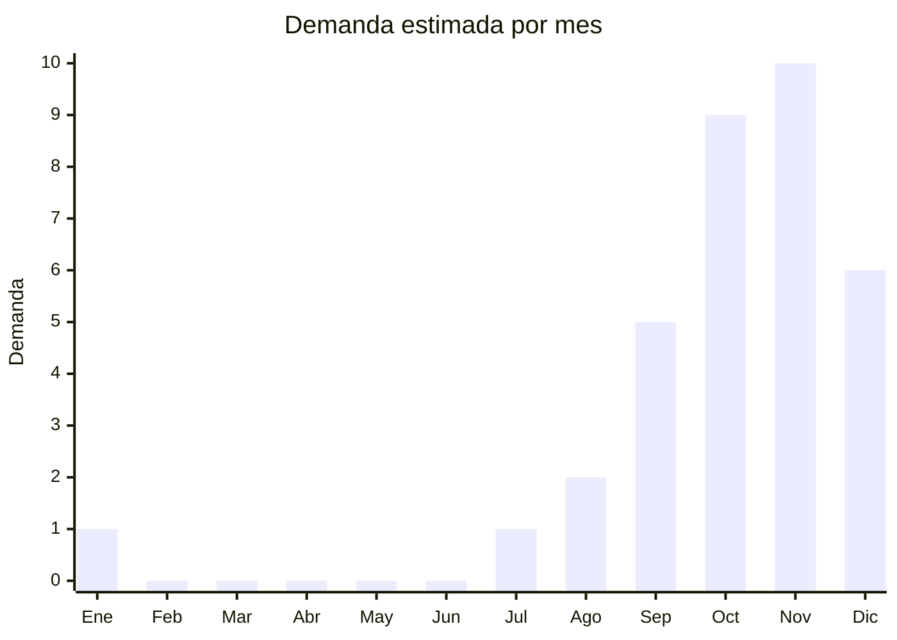

# Árboles de Navidad artificiales

> **Capítulo NCM 95** — Juguetes, juegos y artículos para recreo o deporte; artículos para fiestas | **Temporada:** Primavera (Sep–Nov)

## Qué es y por qué importarlo

Los árboles de Navidad artificiales son uno de los productos estacionales con mayor volumen de ventas en Argentina entre octubre y diciembre. Se fabrican principalmente en **PVC** (Polyvinyl Chloride, el material clásico de hojas planas) y **PE** (Polietileno, que imita ramas naturales con aspecto más realista). Las versiones premium combinan ambos materiales y pueden incluir luces LED integradas, nieve artificial o piñas decorativas.

La ciudad de **Yiwu** (provincia de Zhejiang) es la capital mundial indiscutida de la producción navideña, concentrando más del 70% de la fabricación global de árboles artificiales y adornos navideños. Hangzhou también alberga fábricas importantes. La ventaja de Yiwu es su ecosistema completo: fábricas, mercados mayoristas (Yiwu International Trade City) y logística integrada para exportación.

Para el importador argentino, los árboles de Navidad representan un producto de **alta demanda estacional** con márgenes interesantes, pero con un desafío logístico importante: son productos **muy voluminosos** que ocupan mucho espacio en contenedor respecto a su valor. La clave es optimizar cantidades, negociar empaque comprimido (vacuum-packed) y planificar con anticipación para aprovechar tarifas de flete favorables fuera de temporada alta de envíos.

## Datos clave

| Dato | Valor |
|------|-------|
| **FOB típico (China)** | USD 8 — 25 (sin luces) / USD 15 — 40 (con LEDs) |
| **Precio venta Argentina** | ARS 35.000 — 180.000 |
| **Margen estimado** | 100% — 200% |
| **MOQ habitual** | 100 — 500 unidades (según tamaño) |
| **Peso/volumen** | 3 — 12 kg / 0.03 — 0.12 cbm por árbol |
| **Pico de demanda** | Octubre — Noviembre (compra anticipada Navidad) |
| **Origen principal** | Yiwu, Hangzhou (Zhejiang), China |

## Variantes y subtipos más comunes

| Variante | Descripción | FOB referencia |
|----------|-------------|----------------|
| PVC clásico 1.5m sin luces | Hojas planas PVC, 300-400 puntas, trípode metálico | USD 8 — 12 |
| PVC clásico 1.8m sin luces | 500-700 puntas, aspecto tradicional | USD 10 — 16 |
| PE realista 1.8m sin luces | Hojas moldeadas PE, aspecto natural premium | USD 15 — 22 |
| PVC/PE mixto 2.1m sin luces | Combinación, 900-1200 puntas, fullness premium | USD 18 — 25 |
| PVC 1.8m con LEDs integradas (200 luces) | Luces cálidas pre-instaladas, plug 220V | USD 18 — 30 |
| PE premium 2.1m con LEDs (300+ luces) | Tope de gama, aspecto ultra-realista | USD 30 — 40 |
| Mini árbol decorativo 60-90cm | Para escritorio o espacio reducido | USD 3 — 6 |

## Regulaciones y requisitos

<Tabs>
  <Tab title="Certificaciones">
    | Organismo | Requiere | Detalle |
    |-----------|----------|---------|
    | ARCA (Aduana) | Sí siempre | Despacho de importación estándar |
    | ANMAT | No | No es producto sanitario |
    | ENACOM | No | No es dispositivo electrónico (las luces LED integradas son componente, no producto principal) |
    | INTI | No | No es textil ni calzado |

    <Note>
    Los árboles de Navidad artificiales **sin luces** no requieren ninguna certificación especial. Los modelos **con luces LED integradas** podrían requerir verificación de seguridad eléctrica según normativa vigente. Consultar con el despachante si aplica declaración jurada de producto eléctrico.
    </Note>
  </Tab>

  <Tab title="Etiquetado">
    | Requisito | Aplica |
    |-----------|--------|
    | Idioma español | Sí |
    | Datos del importador | Sí (razón social, CUIT, dirección) |
    | País de origen | Sí |
    | Material (PVC, PE, metal) | Recomendado |
    | Altura y cantidad de puntas | Recomendado (dato de venta clave) |
    | Instrucciones de armado | Sí (en español) |
    | Voltaje (si tiene luces) | Sí — debe ser compatible 220V/50Hz Argentina |
    | Garantía legal 6 meses | Sí |
  </Tab>

  <Tab title="Restricciones">
    Sin restricciones especiales. No hay antidumping vigente sobre árboles de Navidad artificiales, no hay licencias previas ni cupos de importación.

    <Warning>
    Si el árbol incluye **luces LED integradas**, verificar que estén configuradas para **220V/50Hz** (voltaje argentino). Muchos proveedores producen por defecto para 110V (mercado norteamericano). Un árbol con luces de 110V conectado a 220V se quema inmediatamente.
    </Warning>
  </Tab>
</Tabs>

## Logística de importación

| Dato | Valor |
|------|-------|
| **Peso típico por unidad** | 3 — 12 kg (según altura y tipo) |
| **Volumen** | **MUY ALTO** — producto voluminoso. Un árbol 1.8m en caja ocupa 0.05-0.08 cbm |
| **Fragilidad** | Baja (material plástico resistente) |
| **Envío recomendado** | Marítimo FCL (contenedor completo) para volúmenes grandes. LCL es poco eficiente por la relación volumen/valor |
| **Tiempo total estimado** | 50 — 80 días (marítimo) |
| **Contenedor 20ft** | Aprox. 200-350 árboles de 1.8m (depende del empaque) |
| **Contenedor 40ft HC** | Aprox. 500-800 árboles de 1.8m |

<Tip>
Solicitar al proveedor empaque **vacuum-packed** (al vacío) para reducir volumen hasta un 40%. Las ramas se comprimen y se expanden al desempacar. También preguntar por empaque **flat-pack** donde el tronco se desarma en 2-3 secciones. Esto puede duplicar la cantidad de árboles por contenedor.
</Tip>

<Warning>
El flete marítimo entre agosto y octubre sube significativamente por ser temporada alta de envíos navideños desde China. Negociar tarifas y reservar espacio en contenedor **antes de julio** para obtener mejores precios y asegurar disponibilidad.
</Warning>

## Estacionalidad y timing de compra

| Aspecto | Detalle |
|---------|---------|
| **Meses pico** | Octubre — Noviembre (armado del árbol, compra anticipada) |
| **Meses valle** | Febrero — Julio (demanda casi nula) |
| **Cuándo pedir** | Mayo — Junio (para llegar en septiembre/octubre por marítimo) |
| **Riesgo de stock** | Si no llega antes de noviembre, se pierde la temporada entera |

<Warning>
Este es un producto con **ventana de venta muy estrecha** (2-3 meses). Si el embarque se atrasa y llega en diciembre, la demanda ya cayó abruptamente. Planificar con margen y tener un plan B (venta a mayoristas) en caso de atraso.
</Warning>

## Ventajas y riesgos

<CardGroup cols={2}>
  <Card title="Ventajas" icon="circle-check">
    - Demanda garantizada todos los años
    - Sin regulación especial (barrera mínima)
    - Producto reutilizable pero muchos compradores renuevan cada 2-3 años
    - Alto ticket de venta (ARS 50.000+)
    - Amplia variedad de tamaños y precios
    - Complemento perfecto con adornos, luces y otros productos navideños
  </Card>
  <Card title="Riesgos" icon="triangle-exclamation">
    - **MUY voluminoso** — costo de flete alto por relación volumen/valor
    - Temporada de venta muy corta (Oct-Nov-Dic)
    - Stock sobrante queda inmovilizado hasta el año siguiente
    - Competencia de marcas ya instaladas en grandes superficies
    - Flete marítimo sube en temporada alta (ago-oct)
    - Almacenamiento del stock sobrante tiene costo
  </Card>
</CardGroup>

## Palabras clave para buscar en Alibaba

> `artificial christmas tree wholesale, PVC christmas tree 180cm, PE christmas tree realistic, pre-lit christmas tree LED 220V, christmas tree factory Yiwu, collapsible christmas tree wholesale, vacuum packed christmas tree`

## Fuentes

- [MercadoLibre Argentina — Árboles de Navidad](https://listado.mercadolibre.com.ar/arbol-navidad)
- [Alibaba — Artificial Christmas Trees](https://www.alibaba.com/showroom/artificial-christmas-tree.html)
- [Yiwu Christmas Products Market](https://www.yiwu-market-guide.com)
