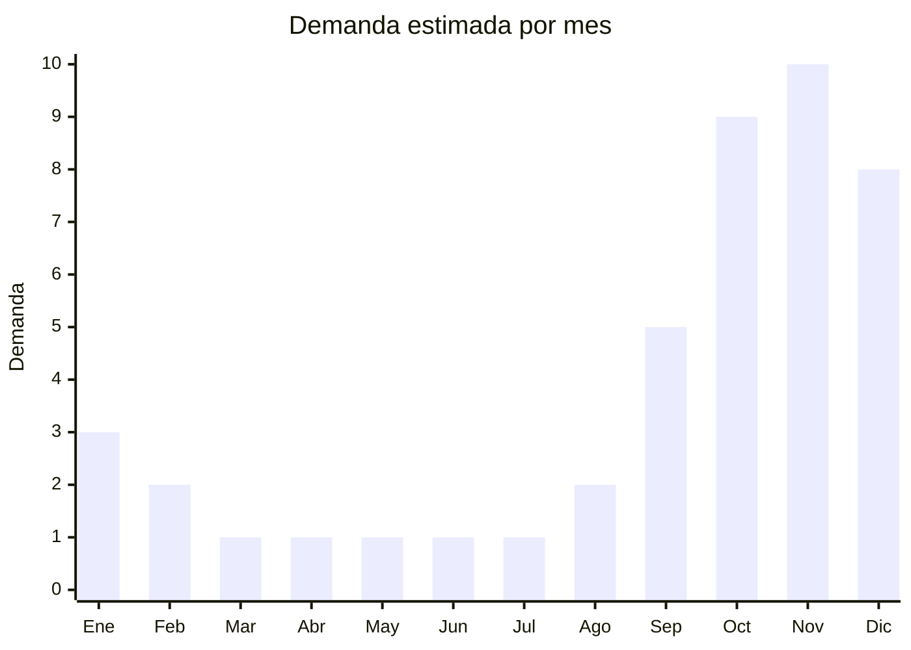

# Camas elásticas y trampolines de jardín

> **Capítulo NCM 95** — Juguetes, juegos y artículos para recreo o deporte | **Temporada:** Primavera (Sep–Nov)

## Qué es y por qué importarlo

Las camas elásticas (trampolines) de jardín se han convertido en uno de los productos de exterior más vendidos en Argentina para el segmento familiar. Disponibles en tamaños desde **1.4m** (infantil) hasta **3m o más** (familiar), todas las versiones modernas incluyen red de seguridad perimetral, acolchado de protección para los resortes y estructura de acero galvanizado.

El pico de ventas se concentra entre **octubre y noviembre**, cuando las familias preparan los jardines para el verano y buscan regalos anticipados de Navidad. La demanda crece año a año, impulsada por la tendencia de juego al aire libre post-pandemia y la búsqueda de actividades físicas recreativas para niños.

China es el principal fabricante mundial de trampolines, con centros de producción en **Nantong** (Jiangsu), **Ningbo** (Zhejiang) y **Qingdao** (Shandong). Estas fábricas producen tanto para marcas internacionales conocidas como para exportación OEM/ODM. El desafío logístico principal es que los trampolines son productos **muy voluminosos y pesados**, especialmente los modelos de 2.4m y 3m, lo que impacta significativamente en el costo de flete.

## Demanda y mercado en Argentina

- **Volumen de mercado:** Las camas elásticas se posicionan como uno de los productos de exterior más buscados en MercadoLibre entre septiembre y diciembre. El modelo de 2.4m (8ft) con red de seguridad es el más vendido.
- **Tendencia:** Creciente. El juego al aire libre y la actividad física recreativa para niños ganaron relevancia post-pandemia. Los trampolines son uno de los regalos de Navidad más solicitados.
- **Perfil del comprador:** Familias con niños de 4-14 años que cuentan con jardín o espacio exterior. También quintas, clubes y emprendedores de salones de fiestas.
- **Competencia:** Mercado semi-concentrado. Pocas marcas importadas establecidas, lo que deja espacio para nuevos entrantes con precio competitivo.

## Datos clave

| Dato | Valor |
|------|-------|
| **FOB típico (China)** | USD 30 — 80 (modelo 2.4m con red de seguridad) |
| **Precio venta Argentina** | ARS 150.000 — 500.000 |
| **Margen estimado** | 100% — 180% |
| **MOQ habitual** | 50 — 200 unidades |
| **Peso/volumen** | 25 — 55 kg / 0.15 — 0.40 cbm por unidad (empacado KD) |
| **Pico de demanda** | Octubre — Noviembre |
| **Origen principal** | Nantong (Jiangsu), Ningbo (Zhejiang), Qingdao (Shandong), China |

## Variantes y subtipos más comunes

| Variante | Descripción | FOB referencia |
|----------|-------------|----------------|
| Trampolín 1.4m (55") infantil con red | 2-8 años, carga máx 45 kg, red interior | USD 20 — 35 |
| Trampolín 1.8m (6ft) con red | Intermedio, carga máx 80 kg | USD 25 — 45 |
| Trampolín 2.4m (8ft) con red | **Más vendido**, familiar, carga 100-120 kg | USD 30 — 55 |
| Trampolín 3.0m (10ft) con red | Grande, carga 150 kg, requiere jardín amplio | USD 45 — 80 |
| Trampolín 3.6m (12ft) con red | Extra grande, gama premium | USD 60 — 100 |
| Mini trampolín fitness 1m | Para ejercicio indoor, adultos, con barra | USD 15 — 30 |

## Regulaciones y requisitos

<Tabs>
  <Tab title="Certificaciones">
    | Organismo | Requiere | Detalle | Costo aprox. | Tiempo aprox. |
    |-----------|----------|---------|-------------|--------------|
    | ARCA (Aduana) | Sí siempre | Despacho de importación estándar | — | — |
    | IRAM 3583 | **Posible** | Si se comercializa como juguete para menores de 14 años, aplica IRAM 3583. Si se presenta como equipamiento deportivo/recreativo, podría no aplicar | USD 500 — 2.000 | 30 — 60 días |
    | ANMAT | No | No es producto sanitario | — | — |

    <Warning>
    La aplicación de **IRAM 3583** depende de cómo se clasifique y comercialice el producto. Los trampolines infantiles (1.4m, para menores de 14 años) muy probablemente requieran IRAM. Los trampolines familiares de 2.4m+ presentados como equipamiento recreativo/deportivo podrían estar exentos. **Consultar con el despachante de aduanas antes de importar** para confirmar la clasificación NCM y requisitos aplicables.
    </Warning>
  </Tab>

  <Tab title="Etiquetado">
    | Requisito | Aplica |
    |-----------|--------|
    | Idioma español | Sí |
    | Datos del importador | Sí (razón social, CUIT, dirección) |
    | País de origen | Sí |
    | Peso máximo soportado | **Sí** (dato de seguridad crítico) |
    | Rango de edad (si aplica IRAM) | Sí |
    | Advertencias de seguridad | **Sí** (uso bajo supervisión adulta, un usuario a la vez) |
    | Instrucciones de armado | Sí, detalladas en español |
    | Garantía legal 6 meses | Sí |
  </Tab>

  <Tab title="Restricciones">
    - Consultar clasificación NCM específica con despachante (posición 9506 deportivo vs. 9503 juguete)
    - Verificar que la estructura soporte condiciones climáticas argentinas (viento, lluvia)
    - Los resortes de acero deben ser galvanizados para resistir oxidación
    - La red de seguridad debe estar unida a postes acolchados (estándar de seguridad actual)
    - Tener en cuenta responsabilidad civil: incluir siempre advertencias de uso

    <Note>
    El mini trampolín fitness (1m, para adultos) tiene clasificación deportiva clara (9506) y **no** requiere IRAM 3583.
    </Note>
  </Tab>
</Tabs>

## Logística de importación

| Dato | Valor |
|------|-------|
| **Peso típico** | 25 — 55 kg (modelo 2.4m completo con red) |
| **Volumen empacado (KD)** | 0.15 — 0.40 cbm (en 2-3 cajas) |
| **Fragilidad** | Baja (estructura metálica, lona, red) |
| **Envío recomendado** | Marítimo FCL. Muy voluminoso para LCL |
| **Tiempo total estimado** | 55 — 85 días (marítimo) |
| **Contenedor 40ft HC** | Aprox. 80-150 trampolines 2.4m (KD, 2-3 cajas cada uno) |

<Tip>
Los trampolines usualmente vienen en **2 o 3 cajas** separadas: Caja 1 (estructura metálica + resortes), Caja 2 (lona de salto + acolchado + red), Caja 3 (postes de red + herrajes). Verificar con el proveedor que **todas las cajas estén numeradas y vinculadas** con el mismo número de serie para evitar mezclas en destino. Una caja faltante deja todo el trampolín invendible.
</Tip>

<Warning>
Los trampolines son productos **pesados y voluminosos**. El costo de flete por unidad puede representar el 15-25% del precio FOB. Negociar con el proveedor empaque optimizado y considerar mezclar en contenedor con productos más livianos/compactos para optimizar el espacio.
</Warning>

## Estacionalidad y timing de compra

| Aspecto | Detalle |
|---------|---------|
| **Meses pico** | Octubre — Noviembre (compra anticipada Navidad, preparación verano) |
| **Meses valle** | Marzo — Julio (invierno, demanda casi nula) |
| **Cuándo pedir** | Mayo — Junio (marítimo, para llegar en septiembre) |
| **Nota IRAM** | Si aplica IRAM 3583, iniciar certificación en paralelo con la producción (30-60 días extra) |

## Ventajas y riesgos

<CardGroup cols={2}>
  <Card title="Ventajas" icon="circle-check">
    - Alta demanda estacional, producto aspiracional para familias
    - Ticket alto (ARS 200.000+) genera facturación significativa
    - Pocos competidores directos en importación (mercado semi-concentrado)
    - Producto con alto engagement en redes sociales (contenido UGC)
    - Demanda creciente post-pandemia (juego al aire libre)
    - Complemento con accesorios (escalera, lona de protección lluvia)
  </Card>
  <Card title="Riesgos" icon="triangle-exclamation">
    - **MUY voluminoso y pesado** — flete significativo
    - IRAM 3583 puede aplicar (costo y tiempo de certificación)
    - Responsabilidad civil ante accidentes (seguro recomendado)
    - Estacionalidad marcada (stock sobrante queda 8-10 meses)
    - Logística de última milla complicada (cajas de 30+ kg)
    - Resortes de baja calidad pierden elasticidad en 1-2 años
    - Red de seguridad económica se degrada con UV en 1 temporada
  </Card>
</CardGroup>

## Palabras clave para buscar en Alibaba

> `trampoline with safety net wholesale, 8ft trampoline enclosure, garden trampoline manufacturer, kids trampoline outdoor, large trampoline 10ft 12ft, trampoline factory Nantong, mini fitness trampoline rebounder, trampoline spring pad replacement`

## Fuentes

- [MercadoLibre Argentina — Camas elásticas](https://listado.mercadolibre.com.ar/cama-elastica)
- [Alibaba — Trampoline with safety net](https://www.alibaba.com/showroom/trampoline-with-safety-net.html)
- [IRAM — Norma 3583 Seguridad de Juguetes](https://www.iram.org.ar)
