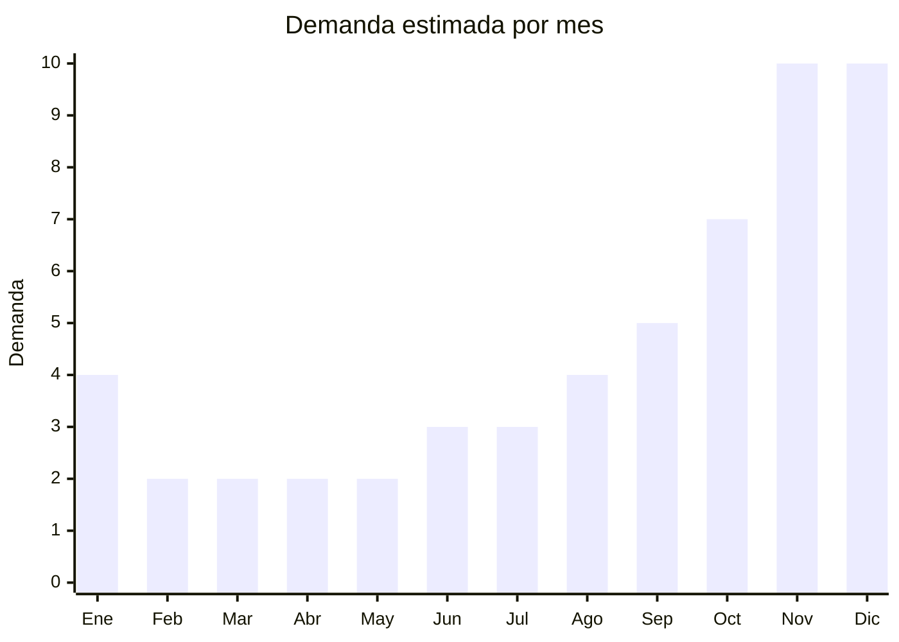

# Juguetes top CyberMonday — compra anticipada Navidad

> **Capítulo NCM 95** — Juguetes, juegos y artículos para recreo o deporte | **Temporada:** Primavera (Sep–Nov)

## Qué es y por qué importarlo

El CyberMonday argentino (generalmente en noviembre) se ha consolidado como el momento clave de **compra anticipada de juguetes para Navidad**. Con 12.1 millones de unidades vendidas en el total del evento y los juguetes posicionados consistentemente en el top de categorías, este canal representa una oportunidad masiva para importadores. Las consolas como PS5 aparecen en el top 5 de productos más vendidos, pero los juguetes tradicionales importables desde China también mueven volúmenes enormes.

Los productos estrella incluyen **sets de bloques de construcción** (compatibles con LEGO), **drones infantiles** de cámara básica, **peluches grandes** (50-120cm) y **juegos de mesa premium** con componentes de calidad. La estrategia es importar con anticipación (julio-agosto) para tener stock disponible semanas antes del evento, aprovechando que los compradores buscan descuentos significativos para adelantar la compra navideña.

China produce la mayoría de estos juguetes a precios que permiten ofrecer descuentos CyberMonday y aún mantener márgenes rentables. Shantou (Guangdong) lidera en juguetes plásticos y electrónicos, Yangzhou (Jiangsu) en peluches, y Yiwu (Zhejiang) en juegos de mesa y artículos surtidos. La **certificación IRAM 3583** es obligatoria para todos estos productos, lo cual es un requisito ineludible que debe planificarse con anticipación.

## Datos clave

| Dato | Valor |
|------|-------|
| **FOB típico (China)** | USD 2 — 30/unidad (según tipo de juguete) |
| **Precio venta Argentina** | ARS 10.000 — 150.000 |
| **Margen estimado** | 100% — 250% |
| **MOQ habitual** | 200 — 1.000 unidades (según producto) |
| **Peso/volumen** | 0.2 — 5 kg / 0.002 — 0.05 cbm por unidad |
| **Pico de demanda** | Noviembre (CyberMonday) — Diciembre (Navidad) |
| **Origen principal** | Shantou (Guangdong), Yangzhou (Jiangsu), Yiwu (Zhejiang), China |

## Variantes y subtipos más comunes

| Variante | Descripción | FOB referencia |
|----------|-------------|----------------|
| Sets bloques construcción 500+ piezas | Compatibles con LEGO, temáticos (city, military, space) | USD 5 — 15 |
| Sets bloques construcción 1000+ piezas | Sets grandes, arquitectura, vehículos complejos | USD 10 — 25 |
| Drone infantil con cámara HD | Cámara 720p/1080p, control remoto, headless mode | USD 15 — 30 |
| Drone mini para niños | Sin cámara, control sencillo, interior/exterior | USD 5 — 12 |
| Peluche grande 60-80cm | Oso, unicornio, personajes, polyester relleno PP | USD 3 — 8 |
| Peluche gigante 100-120cm | Impacto visual alto, regalo estrella | USD 6 — 15 |
| Juego de mesa premium | Tablero grueso, fichas de calidad, 2-6 jugadores | USD 3 — 10 |
| Set STEM / ciencia infantil | Robótica, electrónica, experimentos, 8+ años | USD 5 — 15 |

## Regulaciones y requisitos

<Tabs>
  <Tab title="Certificaciones">
    | Organismo | Requiere | Detalle | Costo aprox. | Tiempo aprox. |
    |-----------|----------|---------|-------------|--------------|
    | ARCA (Aduana) | Sí siempre | Despacho de importación estándar | — | — |
    | INTI / Lab acreditado | **Sí** | **IRAM 3583** — Obligatoria para todos los juguetes | USD 500 — 2.000/producto | 30 — 60 días |
    | Sello S (Seguridad) | **Sí** | Obligatorio en producto y packaging | Incluido en certificación | — |
    | ENACOM | **Posible** | Drones con señal de radio (2.4GHz) requieren homologación | USD 200 — 500 | 30 — 60 días |

    <Warning>
    **Todos los juguetes** comercializados en Argentina deben cumplir **IRAM 3583**. Los **drones** además pueden requerir homologación **ENACOM** por usar frecuencia de radio (2.4GHz). Planificar ambas certificaciones en paralelo para no demorar el ingreso del producto.
    </Warning>
  </Tab>

  <Tab title="Etiquetado">
    | Requisito | Aplica |
    |-----------|--------|
    | Idioma español | Sí |
    | Datos del importador | Sí (razón social, CUIT, dirección) |
    | País de origen | Sí |
    | Rango de edad recomendado | **Sí** (obligatorio) |
    | Advertencias de seguridad | **Sí** ("No apto para menores de 3 años" si contiene piezas pequeñas) |
    | Sello S de seguridad | **Sí** |
    | Contenido del set | Sí (listado de piezas/componentes) |
    | Instrucciones de uso | Sí, en español |
    | Garantía legal 6 meses | Sí |
  </Tab>

  <Tab title="Restricciones">
    - **IRAM 3583 es excluyente**: sin certificación no se puede importar ni comercializar
    - Sets de bloques: verificar que piezas pequeñas lleven advertencia "no apto menores 3 años"
    - Drones: pueden requerir ENACOM (frecuencia radio) y ANAC (si superan 250g, regulación aeronáutica)
    - Peluches: relleno debe ser material no tóxico, ojos/nariz cosidos (no pegados) para evitar desprendimiento
    - Pinturas y materiales deben ser libres de plomo, ftalatos y cadmio
    - Baterías de litio en drones: regulación IATA para transporte aéreo
  </Tab>
</Tabs>

## Logística de importación

| Dato | Valor |
|------|-------|
| **Peso típico** | 0.2 — 5 kg por unidad (variable según producto) |
| **Volumen** | Variable — peluches grandes son voluminosos, bloques son compactos |
| **Fragilidad** | Baja-Media (drones con partes frágiles) |
| **Envío recomendado** | Marítimo LCL o FCL según volumen. Aéreo para reposición urgente |
| **Tiempo total estimado** | 50 — 80 días (marítimo) / 12 — 20 días (aéreo) |
| **Baterías de litio** | Sí en drones — requiere empaque DG (dangerous goods) para aéreo |

<Tip>
Armar **pedidos mixtos** combinando diferentes tipos de juguetes en un mismo contenedor. Mezclar productos compactos (bloques, juegos de mesa) con productos voluminosos (peluches) para optimizar el espacio. Solicitar al proveedor que embale los peluches al vacío para reducir volumen hasta un 60%.
</Tip>

<Warning>
Los **drones con baterías de litio** tienen restricciones para transporte aéreo (clasificación DG — Dangerous Goods). Para envío marítimo no hay problema, pero si se envían por aéreo, el proveedor debe preparar la documentación MSDS (Material Safety Data Sheet) y empaque conforme a regulación IATA. Esto puede incrementar el costo de flete aéreo un 20-30%.
</Warning>

## Estacionalidad y timing de compra

| Aspecto | Detalle |
|---------|---------|
| **Meses pico** | Noviembre (CyberMonday), Diciembre (Navidad) |
| **Meses secundarios** | Agosto (Día del Niño, segundo domingo), Junio (regalos cumpleaños invierno) |
| **Meses valle** | Febrero — Abril |
| **Cuándo pedir para CyberMonday** | Julio (marítimo), dando margen para IRAM + ENACOM |
| **Nota IRAM** | Iniciar certificación con muestras previas, en paralelo con producción |

## Ventajas y riesgos

<CardGroup cols={2}>
  <Card title="Ventajas" icon="circle-check">
    - CyberMonday + Navidad = pico de demanda máximo del año
    - 12.1 millones de unidades vendidas en CyberMonday (dato macro)
    - Variedad de productos permite diversificar riesgo
    - Márgenes altos en bloques y peluches (200%+)
    - Ideal para venta en marketplaces (MercadoLibre, tiendas propias)
    - Posibilidad de marca propia en sets de bloques y juegos de mesa
  </Card>
  <Card title="Riesgos" icon="triangle-exclamation">
    - **IRAM 3583 obligatoria** para todos los juguetes (costo + tiempo)
    - Drones requieren ENACOM adicional
    - Competencia con marcas globales (LEGO, Mattel, Hasbro)
    - Estacionalidad concentrada (nov-dic)
    - Stock de juguetes navideños sin vender pierde relevancia en enero
    - Propiedad intelectual: NO copiar diseños de marcas registradas (LEGO, Star Wars, Marvel)
  </Card>
</CardGroup>

<Warning>
**Propiedad intelectual**: NO importar juguetes que copien diseños, marcas o personajes con licencia (LEGO, Disney, Marvel, Star Wars, etc.). China produce masivamente copias que pueden ser retenidas en aduana argentina por infracción de propiedad intelectual. Optar por **diseños genéricos** o temáticas no licenciadas (city, military, robots genéricos).
</Warning>

## Palabras clave para buscar en Alibaba

> `building blocks set wholesale compatible, construction bricks 500 pcs, mini drone kids camera wholesale, large stuffed animal wholesale, plush toy giant, board game manufacturer OEM, STEM toy kit wholesale, educational toy set children, RC drone 2.4GHz kids`

## Fuentes

- [CACE — CyberMonday Argentina resultados](https://www.cace.org.ar)
- [MercadoLibre Argentina — Juguetes](https://listado.mercadolibre.com.ar/juguetes-y-juegos/)
- [Alibaba — Building blocks wholesale](https://www.alibaba.com/showroom/building-blocks.html)
- [IRAM — Norma 3583 Seguridad de Juguetes](https://www.iram.org.ar)
- [ENACOM — Homologación de equipos](https://www.enacom.gob.ar)
