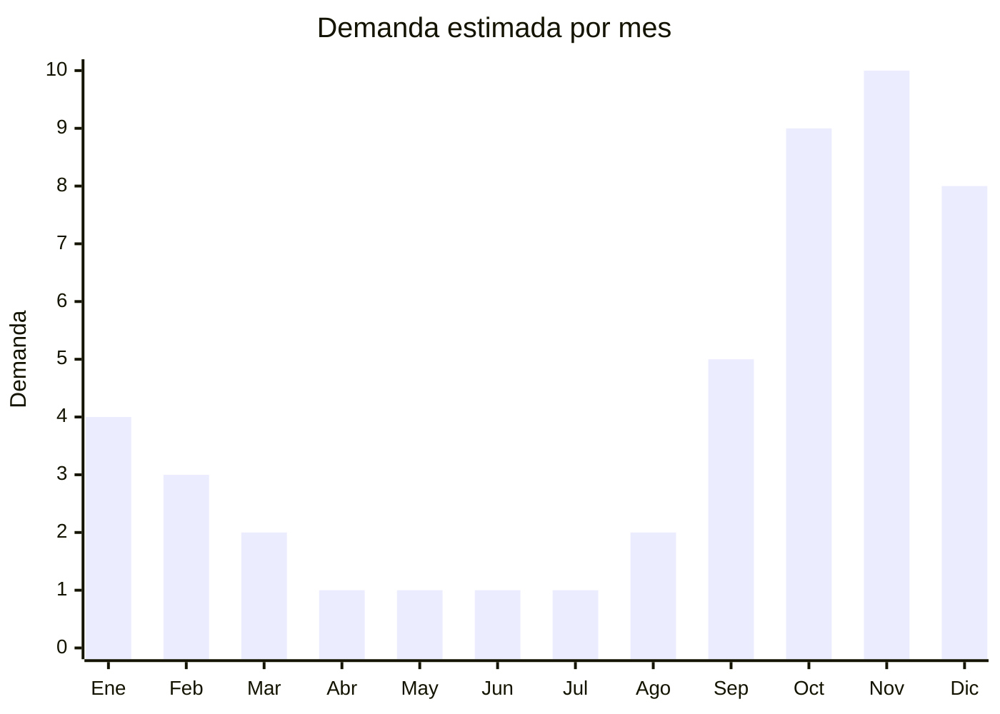

# Juguetes de exterior y jardín

> **Capítulo NCM 95** — Juguetes, juegos y artículos para recreo o deporte | **Temporada:** Primavera (Sep–Nov)

## Qué es y por qué importarlo

Los juguetes de exterior y jardín para niños incluyen toboganes de plástico HDPE, hamacas infantiles, sets de trepadoras, areneros y casitas de jardín. Son productos de **alta demanda estacional** en Argentina entre octubre y diciembre, cuando las familias preparan los espacios exteriores para el verano y buscan opciones de juego al aire libre para los niños.

China domina la fabricación de juguetes plásticos de exterior, con centros de producción en **Shantou** (Guangdong), históricamente la capital juguetera de China, y **Ningbo/Taizhou** (Zhejiang) para productos de plástico rotomoldeado y soplado. Los toboganes de HDPE (polietileno de alta densidad) son el producto estrella por su relación costo-beneficio: resistentes a UV, duraderos y con colores vibrantes que no destiñen.

El desafío principal de estos productos es doble: por un lado son **muy voluminosos** (un tobogán de 1.5m armado puede ocupar 0.5 cbm o más), y por otro lado requieren cumplimiento de la **norma IRAM 3583** de seguridad de juguetes, que implica ensayos de laboratorio y certificación obligatoria. Sin embargo, los márgenes y la demanda sostenida justifican la inversión en certificación.

## Demanda y mercado en Argentina

- **Volumen de mercado:** Los juguetes de exterior para jardín son un segmento en crecimiento dentro de la categoría de juguetes. Toboganes y hamacas figuran entre los productos más buscados en MercadoLibre entre septiembre y diciembre.
- **Tendencia:** Creciente. La tendencia post-pandemia de juego al aire libre y la mayor conciencia sobre la importancia de la actividad física infantil impulsan este segmento.
- **Perfil del comprador:** Familias con niños de 2-10 años y vivienda con espacio exterior (casa con jardín, country, club de campo). También instituciones educativas y guarderías.
- **Competencia:** Marcas locales como Rondi y Vegui tienen presencia, pero los productos importados de China ofrecen precios significativamente menores y mayor variedad de diseños.

## Datos clave

| Dato | Valor |
|------|-------|
| **FOB típico (China)** | USD 15 — 50/tobogán (según tamaño) |
| **Precio venta Argentina** | ARS 80.000 — 350.000 |
| **Margen estimado** | 100% — 200% |
| **MOQ habitual** | 50 — 200 unidades (según producto) |
| **Peso/volumen** | 5 — 25 kg / 0.1 — 0.5 cbm por unidad |
| **Pico de demanda** | Octubre — Noviembre |
| **Origen principal** | Shantou (Guangdong), Ningbo/Taizhou (Zhejiang), China |

## Variantes y subtipos más comunes

| Variante | Descripción | FOB referencia |
|----------|-------------|----------------|
| Tobogán infantil 1.2m HDPE | Para interior/exterior, 2-6 años, desarmable | USD 15 — 25 |
| Tobogán con columpio combinado | Estructura metálica + tobogán plástico + hamaca | USD 30 — 50 |
| Hamaca infantil individual | Estructura metal galvanizado + asiento plástico/caucho | USD 12 — 25 |
| Set trepadora multijuego | Tobogán + escalera + plataforma + columpio | USD 40 — 80 |
| Arenero con tapa | Plástico rotomoldeado, con cubierta protectora | USD 10 — 20 |
| Casita jardín infantil | Plástico rotomoldeado, 120x110x130cm aprox. | USD 25 — 50 |
| Pelotero inflable con tobogán | PVC reforzado, incluye inflador | USD 30 — 60 |

## Regulaciones y requisitos

<Tabs>
  <Tab title="Certificaciones">
    | Organismo | Requiere | Detalle | Costo aprox. | Tiempo aprox. |
    |-----------|----------|---------|-------------|--------------|
    | ARCA (Aduana) | Sí siempre | Despacho de importación estándar | — | — |
    | INTI / Laboratorio acreditado | **Sí** | **IRAM 3583** — Seguridad de juguetes (aplica a todos los juguetes para menores de 14 años) | USD 500 — 2.000 por producto | 30 — 60 días |
    | Sello S (Seguridad) | **Sí** | Obligatorio para comercialización | Incluido en certificación | — |

    <Warning>
    La **norma IRAM 3583** es **obligatoria** para todos los juguetes comercializados en Argentina. Incluye ensayos de estabilidad, resistencia mecánica, bordes y puntas, sustancias tóxicas (pintura, plástico) y partes pequeñas (riesgo de asfixia). Sin esta certificación, el producto **no puede despacharse en aduana** ni venderse legalmente.
    </Warning>
  </Tab>

  <Tab title="Etiquetado">
    | Requisito | Aplica |
    |-----------|--------|
    | Idioma español | Sí |
    | Datos del importador | Sí (razón social, CUIT, dirección) |
    | País de origen | Sí |
    | Rango de edad recomendado | **Sí** (obligatorio para juguetes) |
    | Advertencias de seguridad | **Sí** ("No apto para menores de 3 años" si aplica, peso máximo soportado) |
    | Instrucciones de armado y uso | Sí, en español |
    | Sello S de seguridad | **Sí** (visible en producto y packaging) |
    | Garantía legal 6 meses | Sí |
  </Tab>

  <Tab title="Restricciones">
    - **IRAM 3583 es excluyente**: sin certificación no se puede importar ni vender
    - Ensayos de laboratorio deben hacerse en laboratorio acreditado por OAA (Organismo Argentino de Acreditación)
    - Los plásticos deben ser libres de ftalatos (DEHP, DBP, BBP) y metales pesados (plomo, cadmio)
    - Los inflables deben cumplir estándares adicionales de resistencia y advertencias de supervisión adulta
    - Partes pequeñas desmontables deben ser evaluadas como riesgo de asfixia
  </Tab>
</Tabs>

## Logística de importación

| Dato | Valor |
|------|-------|
| **Peso típico** | 5 — 25 kg (según producto) |
| **Volumen** | **MUY ALTO** — producto voluminoso incluso desarmado |
| **Fragilidad** | Baja (plástico HDPE resistente) |
| **Envío recomendado** | Marítimo FCL. LCL ineficiente por volumen |
| **Tiempo total estimado** | 55 — 85 días (marítimo) |
| **Contenedor 40ft HC** | Aprox. 150-300 toboganes individuales (KD) |

<Tip>
Solicitar al proveedor que los productos vengan **completamente desarmados** (KD) y **anidados** (nested) cuando sea posible. Por ejemplo, los toboganes pueden apilarse uno dentro de otro, reduciendo volumen un 50%. Las estructuras metálicas (columpio, trepadora) deben venir desarmadas con tornillería embolsada y numerada.
</Tip>

<Warning>
Coordinar el embarque para que llegue **antes de octubre**. La temporada de venta de juguetes de exterior es septiembre-diciembre. Si el contenedor llega en diciembre, se pierde el grueso de la temporada y el stock queda hasta el año siguiente.
</Warning>

## Estacionalidad y timing de compra

| Aspecto | Detalle |
|---------|---------|
| **Meses pico** | Octubre — Noviembre (preparación verano + CyberMonday + anticipación Navidad) |
| **Meses valle** | Abril — Julio (invierno, demanda mínima) |
| **Cuándo pedir** | Mayo — Junio (para llegar en septiembre) |
| **Considerar** | IRAM 3583 puede demorar 30-60 días. Iniciar trámite con muestras mientras se produce el pedido |

## Ventajas y riesgos

<CardGroup cols={2}>
  <Card title="Ventajas" icon="circle-check">
    - Alta demanda estacional comprobada
    - Ticket alto (ARS 100.000+) genera buena facturación
    - Productos durables (HDPE resiste UV e intemperie)
    - Complemento con otros juguetes de exterior (pelotas, redes)
    - Diferencial de precio vs. marcas locales/importadas establecidas
    - Producto de recompra cuando los hijos crecen
  </Card>
  <Card title="Riesgos" icon="triangle-exclamation">
    - **IRAM 3583 obligatoria** (costo y tiempo de certificación)
    - **MUY voluminosos** — costo de flete alto
    - Estacionalidad marcada (stock sobrante difícil de liquidar)
    - Logística de última milla complicada (cajas grandes y pesadas)
    - Competencia con marcas como Rondi, Vegui, Playmobil
    - Responsabilidad civil si hay accidentes (seguridad estructural)
  </Card>
</CardGroup>

## Palabras clave para buscar en Alibaba

> `kids outdoor playground slide HDPE, children swing set wholesale, plastic slide for kids outdoor, garden playhouse children, sandbox with cover kids, outdoor playground equipment kids, children climbing frame set, kids slide swing combo`

## Fuentes

- [MercadoLibre Argentina — Juegos de jardín](https://listado.mercadolibre.com.ar/juegos-aire-libre-deportes/juegos-jardin/)
- [Alibaba — Kids outdoor playground](https://www.alibaba.com/showroom/kids-outdoor-playground.html)
- [IRAM — Norma 3583 Seguridad de Juguetes](https://www.iram.org.ar)
- [INTI — Certificación de juguetes](https://www.inti.gob.ar)
