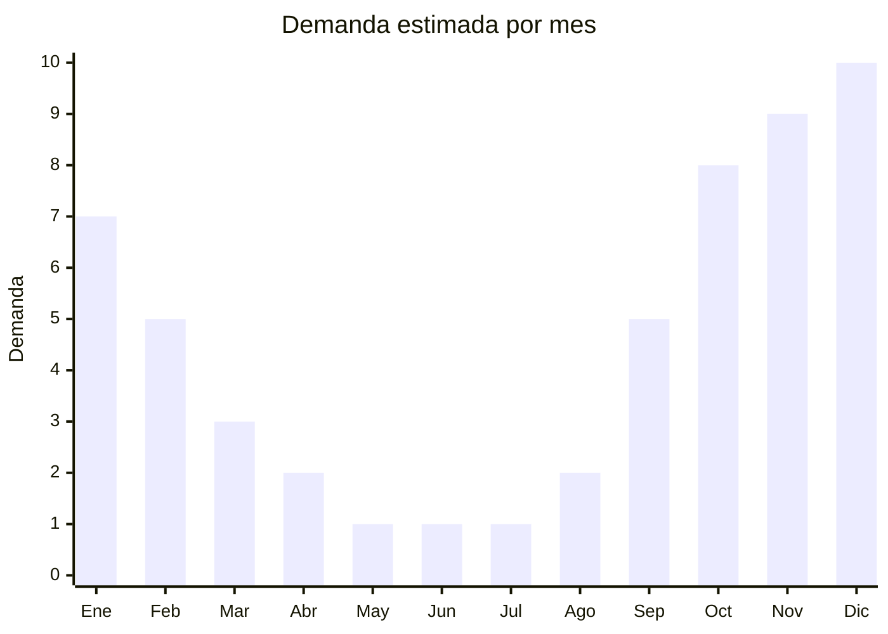

# Pelotas y redes — vóley playa, fútbol tenis, bádminton

> **Capítulo NCM 95** — Juguetes, juegos y artículos para recreo o deporte | **Temporada:** Primavera (Sep–Nov)

## Qué es y por qué importarlo

Los sets de pelotas y redes para deportes de exterior al aire libre son productos de **alta rotación estacional** en primavera y verano argentino. Incluyen sets portátiles de vóley playa (red + pelota + estacas), kits de fútbol tenis (red + parantes portátiles), sets de bádminton (raquetas + plumas + red) y accesorios complementarios. Son ideales para playa, parque, jardín y camping.

La ventaja regulatoria clave de este producto es que al ser clasificado como **artículo deportivo** (no juguete), **no requiere certificación IRAM 3583**. La norma IRAM de juguetes aplica solo a productos destinados a menores de 14 años como fin principal. Los artículos deportivos para uso general están exentos, lo que simplifica enormemente la importación.

China concentra la producción mundial de equipamiento deportivo recreativo, con centros en **Yiwu** (Zhejiang) para sets económicos y accesorios, **Xiamen** (Fujian) para pelotas de PVC/PU de mayor calidad, y **Dongguan** (Guangdong) para raquetas y equipamiento más técnico. Los precios FOB extremadamente competitivos permiten márgenes atractivos incluso en sets económicos.

## Demanda y mercado en Argentina

- **Volumen de mercado:** Los sets deportivos de exterior tienen demanda creciente en Argentina, impulsados por la popularidad del vóley playa, el fútbol tenis (muy popular en camping y quintas) y el bádminton como actividad recreativa familiar.
- **Tendencia:** Creciente. Las actividades al aire libre en grupo ganan popularidad, especialmente en campings, clubes y reuniones familiares.
- **Perfil del comprador:** Familias (25-50 años) que buscan actividades de exterior, grupos de amigos, campings, clubes deportivos, colonias de vacaciones y hoteles con áreas recreativas.
- **Canales de venta:** MercadoLibre, tiendas deportivas online, mayorista a campings y clubes. Buena rotación en tiendas de playa durante diciembre-febrero.

## Datos clave

| Dato | Valor |
|------|-------|
| **FOB típico (China)** | USD 3 — 10/set (red + pelotas o raquetas) |
| **Precio venta Argentina** | ARS 15.000 — 60.000 |
| **Margen estimado** | 150% — 300% |
| **MOQ habitual** | 200 — 1.000 sets |
| **Peso/volumen** | 0.5 — 3 kg / 0.005 — 0.02 cbm por set |
| **Pico de demanda** | Octubre — Enero |
| **Origen principal** | Yiwu (Zhejiang), Xiamen (Fujian), China |

## Variantes y subtipos más comunes

| Variante | Descripción | FOB referencia |
|----------|-------------|----------------|
| Set vóley playa portátil | Red 6m + pelota PVC + estacas + bolsa transporte | USD 5 — 10 |
| Set fútbol tenis portátil | Red 3-4m + parantes telescópicos + pelota | USD 5 — 10 |
| Set bádminton 4 raquetas | 4 raquetas + 6 plumas + red + bolsa | USD 4 — 8 |
| Set bádminton 2 raquetas | 2 raquetas + 3 plumas + bolsa (sin red) | USD 2 — 5 |
| Pelota vóley playa PVC | Tamaño oficial 5, PVC cosido a máquina | USD 2 — 4 |
| Pelota vóley playa PU | Tamaño oficial 5, PU laminado mayor durabilidad | USD 4 — 8 |
| Red vóley playa individual | Red sola 6-9m, malla reforzada | USD 3 — 6 |
| Set paletas playa + pelota | 2 paletas madera/plástico + pelota goma | USD 1 — 3 |

## Regulaciones y requisitos

<Tabs>
  <Tab title="Certificaciones">
    | Organismo | Requiere | Detalle |
    |-----------|----------|---------|
    | ARCA (Aduana) | Sí siempre | Despacho de importación estándar |
    | IRAM 3583 | **No** | Artículo deportivo, no juguete. Exento de norma de seguridad de juguetes |
    | ANMAT | No | No es producto sanitario |
    | INTI | No | No es textil ni calzado |

    <Note>
    La clave regulatoria es la **clasificación como artículo deportivo** (posición NCM 9506) y no como juguete (9503). Los artículos deportivos para uso general no requieren IRAM 3583. Sin embargo, si el producto se presenta explícitamente como "juguete para niños" en su packaging, podría reclasificarse. Mantener la presentación como equipamiento deportivo/recreativo.
    </Note>
  </Tab>

  <Tab title="Etiquetado">
    | Requisito | Aplica |
    |-----------|--------|
    | Idioma español | Sí |
    | Datos del importador | Sí (razón social, CUIT, dirección) |
    | País de origen | Sí |
    | Materiales y composición | Recomendado (PVC, PU, nylon, aluminio) |
    | Medidas de red/pelota | Recomendado |
    | Garantía legal 6 meses | Sí |
  </Tab>

  <Tab title="Restricciones">
    Sin restricciones especiales. No hay antidumping, no hay licencias previas. Producto de importación libre con barrera regulatoria mínima.

    <Tip>
    La ausencia de IRAM 3583 convierte a estos productos en una de las opciones más simples de importar dentro del Capítulo 95. No confundir con juguetes deportivos para niños (ej: mini arco de fútbol para niños de 3 años), que sí podrían requerir IRAM.
    </Tip>
  </Tab>
</Tabs>

## Logística de importación

| Dato | Valor |
|------|-------|
| **Peso típico por set** | 0.5 — 3 kg |
| **Volumen** | Bajo — sets compactos en bolsa o caja chica |
| **Fragilidad** | Baja (pelotas, redes, raquetas son resistentes) |
| **Envío recomendado** | Marítimo LCL para pedidos medianos. FCL si se combina con otros productos. Aéreo viable para urgencias |
| **Tiempo total estimado** | 45 — 75 días (marítimo) / 12 — 20 días (aéreo) |
| **Baterías** | No |

<Tip>
Los sets de pelotas y redes son productos **livianos y compactos**, lo que los convierte en excelentes complementos para completar un contenedor junto con otros productos más voluminosos (ej: muebles de jardín, juguetes de exterior). Aprovechar el espacio sobrante en contenedores mixtos para maximizar la rentabilidad del flete.
</Tip>

## Estacionalidad y timing de compra

| Aspecto | Detalle |
|---------|---------|
| **Meses pico** | Noviembre — Enero (primavera/verano, vacaciones, regalos Navidad) |
| **Meses valle** | Mayo — Julio (invierno) |
| **Cuándo pedir** | Julio — Agosto (para llegar en octubre por marítimo) |
| **Nota** | La demanda de enero/febrero es por vacaciones de verano — playa y camping |

## Ventajas y riesgos

<CardGroup cols={2}>
  <Card title="Ventajas" icon="circle-check">
    - **Sin IRAM 3583** (barrera regulatoria mínima)
    - Producto liviano y compacto (flete bajo)
    - Márgenes altos (200%+)
    - MOQ accesible
    - Ideal para completar contenedores mixtos
    - Amplia variedad de sets y combinaciones
    - Demanda extendida (oct-ene, 4 meses)
  </Card>
  <Card title="Riesgos" icon="triangle-exclamation">
    - Competencia de marcas deportivas establecidas (Wilson, Drb)
    - Calidad variable en pelotas PVC baratas (se deforman con calor)
    - Redes económicas pueden deshilacharse rápido
    - Raquetas de bádminton baratas se quiebran con facilidad
    - Precio bajo por unidad requiere volumen para rentabilizar flete
  </Card>
</CardGroup>

<Warning>
Las pelotas de PVC de muy baja calidad pueden **deformarse con la exposición al sol** (temperaturas superiores a 40 grados). Para uso en playa/exterior, preferir pelotas de PU (poliuretano) o PVC de grosor mínimo 2mm. Solicitar especificación técnica al proveedor y pedir muestras para testeo.
</Warning>

## Palabras clave para buscar en Alibaba

> `beach volleyball set portable, futsal tennis net set, badminton racket set wholesale, portable volleyball net beach, PU volleyball ball wholesale, outdoor sports set beach, portable net stand sports, beach paddle set wholesale`

## Fuentes

- [MercadoLibre Argentina — Vóley playa](https://listado.mercadolibre.com.ar/voley-playa)
- [Alibaba — Beach volleyball set](https://www.alibaba.com/showroom/beach-volleyball-set.html)
- [AFIP — Nomenclador NCM posición 9506](https://www.afip.gob.ar)
