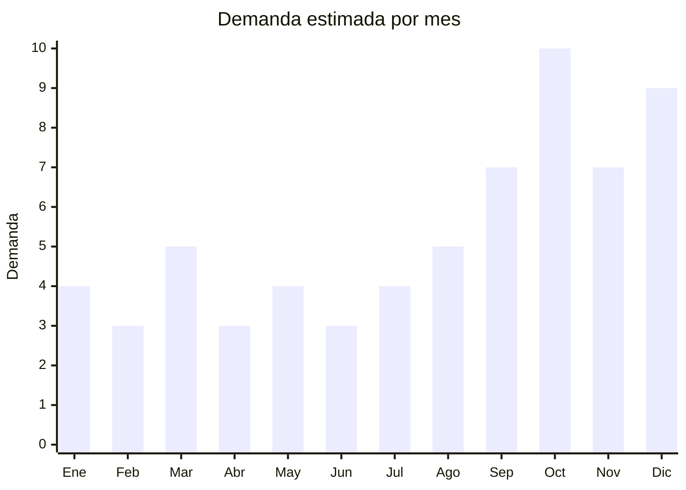

# Sets de brochas y accesorios maquillaje — regalo Día de la Madre

> **Capítulo NCM 96** — Manufacturas diversas (cepillos, brochas, botones) | **Temporada:** Primavera (Sep–Nov)

## Qué es y por qué importarlo

Los sets de brochas de maquillaje profesional, espejos con luz LED y organizadores de cosmética son productos estrella para **regalo del Día de la Madre** (tercer domingo de octubre en Argentina). La ventaja estratégica de estos productos es su clasificación aduanera bajo el **Capítulo 96** (cepillos y brochas, NCM 9603.29) y no bajo el Capítulo 33 (cosmética), lo que significa que **no requieren registro ANMAT** al no ser cosméticos en sí mismos, sino herramientas y accesorios.

Estos productos funcionan como **complemento perfecto** de los productos cosméticos del Capítulo 33 (maquillaje, bases, labiales), permitiendo armar combos regalo sin las complicaciones regulatorias del registro sanitario. Un set de 12 brochas en estuche de cuero sintético con un espejo LED puede venderse a precio premium como kit regalo, con un costo FOB de apenas USD 2-8.

China concentra la producción mundial de brochas de maquillaje, con **Tianjin** como la capital histórica de fabricación, y **Shenzhen/Dongguan** como hubs de trading companies y ensambladores. El pelo sintético (taklon, fibra PBT) domina el mercado, facilitando la comercialización como producto "cruelty-free" — un atributo de venta cada vez más valorado.

## Demanda y mercado en Argentina

- **Volumen de mercado:** Miles de publicaciones activas en MercadoLibre. Los sets de brochas son uno de los productos de belleza más vendidos online, con vendedores que acumulan miles de unidades vendidas.
- **Tendencia:** Estable-Creciente. La cultura de maquillaje impulsada por redes sociales (Instagram, TikTok) y el crecimiento del maquillaje profesional freelance sostienen la demanda.
- **Perfil del comprador:** Hombres comprando regalo Día de la Madre (octubre), mujeres comprando para sí mismas o como regalo, maquilladoras profesionales reponiendo herramientas.
- **Competencia:** Alta en rango bajo, media en rango medio-alto. Diferenciarse con packaging premium, marca propia y calidad de fibra verificable.

## Datos clave

| Dato | Valor |
|------|-------|
| **FOB típico (China)** | USD 2 — 8/set (brochas 12-24 pzas con estuche) |
| **Precio venta Argentina** | ARS 12.000 — 65.000 |
| **Margen estimado** | 200% — 350% |
| **MOQ habitual** | 50 — 500 sets |
| **Peso/volumen** | 0.15 — 0.50 kg / 0.001 — 0.003 cbm por set |
| **Pico de demanda** | Octubre (Día de la Madre), Diciembre (Navidad) |
| **Origen principal** | Tianjin, Shenzhen, Dongguan, China |

## Variantes y subtipos más comunes

| Variante | Descripción | FOB referencia |
|----------|-------------|----------------|
| Set 12 brochas + estuche PU roll-up | Fibra sintética, estuche enrollable cuero sintético | USD 2 — 4 |
| Set 15-18 brochas + estuche rígido | Formato caja, presentación regalo | USD 3 — 6 |
| Set 24 brochas profesional completo | Full set MUA (makeup artist), estuche premium | USD 5 — 8 |
| Espejo maquillaje con luz LED | Aumento 5x/10x, táctil, recargable USB | USD 3 — 8 |
| Organizador maquillaje acrílico | Cajones, compartimentos, giratorio 360 grados | USD 2 — 6 |
| Organizador maquillaje PU/cuero sintético | Formato neceser viaje con divisiones | USD 2 — 5 |
| Kit combo: brochas + espejo LED + esponjas | Pack regalo completo | USD 5 — 12 |

## Regulaciones y requisitos

<Tabs>
  <Tab title="Certificaciones">
    | Organismo | Requiere | Detalle |
    |-----------|----------|---------|
    | ARCA (Aduana) | Sí siempre | Despacho de importación estándar |
    | ANMAT | **No** | Brochas son herramientas/accesorios (Cap. 96), no cosméticos. Solo aplica si el set incluye productos cosméticos (sombras, labiales) |
    | ENACOM | No | No aplica (el espejo LED es alimentado por USB/batería interna, no es equipo de comunicaciones) |
    | INTI | No | No es textil ni calzado |

    <Note>
    Esta es la **principal ventaja regulatoria**: al no ser cosméticos, evitan el proceso de registro ANMAT que cuesta entre USD 500 y USD 2.000 por producto y demora 3 a 6 meses. Si se incluyen cosméticos en el set (sombras, rubor), el set completo pasa a requerir ANMAT Grado 1.
    </Note>
  </Tab>

  <Tab title="Etiquetado">
    | Requisito | Aplica |
    |-----------|--------|
    | Idioma español | Sí |
    | Datos del importador | Sí (razón social, CUIT, dirección) |
    | País de origen | Sí |
    | Material de las brochas | Sí (fibra sintética, taklon, PBT) |
    | Instrucciones de limpieza | Recomendado |
    | Contenido del set | Sí (cantidad de piezas y descripción) |
    | Garantía legal 6 meses | Sí |
    | "Cruelty-free" (si aplica) | Solo si es verificable (fibra 100% sintética) |
  </Tab>

  <Tab title="Restricciones">
    Sin restricciones especiales para brochas, espejos y organizadores. No hay antidumping, no hay licencias previas, no hay cupos de importación. Es uno de los productos con **menor barrera regulatoria** dentro de la categoría de belleza y cuidado personal.

    <Warning>
    Si el espejo LED incluye **batería de litio recargable**, tener en cuenta regulación de transporte para baterías de litio (IATA para aéreo). Para envío marítimo generalmente no hay restricción adicional. Las baterías de botón (CR2032) no tienen restricción.
    </Warning>
  </Tab>
</Tabs>

## Logística de importación

| Dato | Valor |
|------|-------|
| **Peso típico por set** | 0.15 — 0.50 kg |
| **Volumen** | Muy bajo — productos compactos |
| **Fragilidad** | Baja (espejos con cristal requieren empaque reforzado) |
| **Envío recomendado** | Marítimo LCL para pedidos medianos. Aéreo/courier para muestras o urgencias |
| **Tiempo total estimado** | 45 — 70 días (marítimo) / 12 — 20 días (aéreo) |
| **Baterías** | Posible — espejos LED con batería de litio o botón |

<Tip>
Los sets de brochas son productos de **alto valor por kilo**: un pedido de 500 sets pesa apenas 75-250 kg y cabe en pocas cajas. Esto hace que el **flete aéreo sea económicamente viable** para reposición de urgencia antes del Día de la Madre. Para primer pedido por marítimo, pedir en julio-agosto.
</Tip>

## Estacionalidad y timing de compra

| Aspecto | Detalle |
|---------|---------|
| **Meses pico** | Octubre (Día de la Madre), Diciembre (Navidad/regalos) |
| **Meses secundarios** | Marzo (vuelta a actividades), Septiembre (preparación Día Madre) |
| **Meses valle** | Febrero, Abril, Junio |
| **Cuándo pedir para Día de la Madre** | Julio-Agosto (marítimo) o Septiembre temprano (aéreo) |
| **Cuándo pedir para Navidad** | Septiembre (marítimo) o Noviembre temprano (aéreo) |

## Ventajas y riesgos

<CardGroup cols={2}>
  <Card title="Ventajas" icon="circle-check">
    - **Sin ANMAT** (barrera regulatoria mínima)
    - Producto liviano y compacto (flete muy bajo)
    - Márgenes excelentes (200-350%)
    - Packaging regalo suma valor percibido sin costo real significativo
    - Ideal para marca propia (private label)
    - Complemento perfecto con cosméticos (Cap. 33) para combos
    - MOQ bajo para primer pedido
    - "Cruelty-free" como diferencial de marketing
  </Card>
  <Card title="Riesgos" icon="triangle-exclamation">
    - Calidad variable entre proveedores (fibras que se desprenden)
    - Brochas baratas pierden pelo al primer lavado (reclamos)
    - Competencia alta en MercadoLibre con precios agresivos
    - Si se incluyen cosméticos en set, se activa requisito ANMAT
    - Espejos LED de baja calidad pueden tener problemas eléctricos
  </Card>
</CardGroup>

<Warning>
La calidad de las brochas varía enormemente. **Siempre pedir muestras** antes de hacer un pedido grande. Verificar que la fibra no se desprenda al frotar, que los casquillos (férulas) estén bien prensados y que los mangos no se aflojen. Las brochas de mala calidad generan devoluciones masivas y destruyen la reputación en MercadoLibre.
</Warning>

## Palabras clave para buscar en Alibaba

> `makeup brush set gift box, professional makeup brush set 12pcs, makeup brush set PU case, LED makeup mirror wholesale, cosmetic organizer acrylic, makeup brush set private label, cruelty free makeup brush set, mother's day gift set beauty, makeup tool set wholesale`

## Fuentes

- [MercadoLibre Argentina — Sets de brochas](https://listado.mercadolibre.com.ar/set-de-brochas-maquillaje)
- [Alibaba — Makeup brush set gift](https://www.alibaba.com/showroom/makeup-brush-set-gift.html)
- [ACAVIR — Notas explicativas partida 96.03](https://www.acavir.com/comercio-exterior/sistema-armonizado/notas-explicativas/partida-9603)
