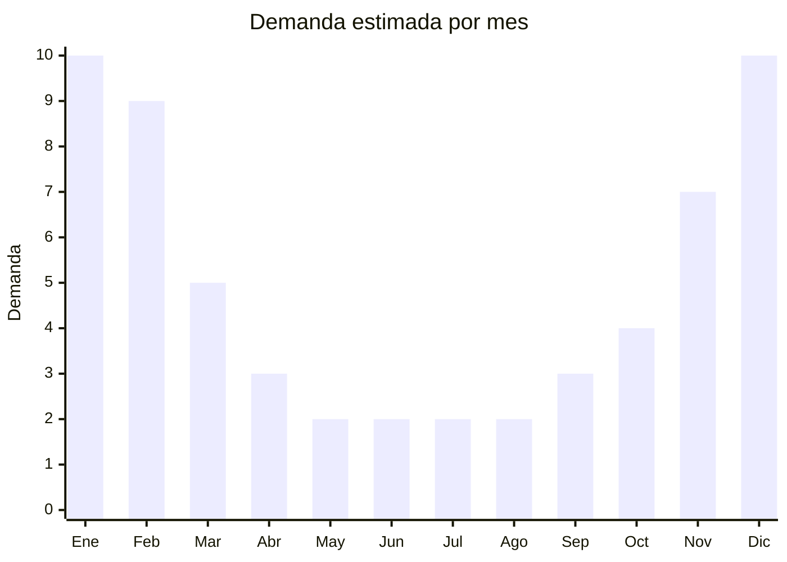

# After Sun y Gel de Aloe Vera

> **Capitulo NCM 33** — Perfumeria y cosmetica | **Temporada:** Verano (Dic-Feb)

## Que es y por que importarlo

Los productos after sun y geles de aloe vera son cosmeticos disenados para calmar, hidratar y reparar la piel despues de la exposicion solar. El gel de aloe vera al 99% se ha convertido en un bestseller durante el verano argentino, tanto por su efecto calmante sobre quemaduras solares como por sus multiples usos en cuidado de la piel (hidratacion, acne, irritaciones). Se presentan en formatos de gel, crema, spray y locion, y su principal ingrediente activo es el extracto de la planta Aloe barbadensis miller.

China, particularmente la provincia de Hainan (isla tropical al sur del pais), es uno de los mayores productores mundiales de aloe vera. Las fabricas chinas especializadas producen geles de aloe vera de alta concentracion (92-99%) a precios FOB extremadamente competitivos, desde USD 0.50 por unidad para envases de 250ml. Esto genera margenes potenciales superiores al 200%. Marcas coreanas como Nature Republic y Holika Holika popularizaron el gel de aloe vera en el mercado global, y este formato ya tiene aceptacion en Argentina.

Sin embargo, al ser un producto cosmetico que se aplica sobre la piel, ANMAT lo clasifica como grado 2, lo que impone la misma barrera regulatoria que protectores solares y bronceadores: establecimiento habilitado, Director Tecnico y registro del producto. A pesar de que el gel de aloe vera pueda parecer un producto "natural" simple, la regulacion argentina no distingue y exige el proceso completo. La demanda es fuertemente estacional, con pico en diciembre-febrero cuando las quemaduras solares son habituales.

## Datos clave

| Dato | Valor |
|------|-------|
| **Posiciones NCM tipicas** | 3304.99.90 |
| **Derecho de importacion** | 18% (DIE) + 3% tasa estadistica |
| **Rango FOB tipico** | USD 0.50 — USD 3 por unidad |
| **Precio de venta en Argentina** | ARS 3,000 — ARS 12,000 |
| **Margen bruto estimado** | 200% — 500% (teorico) |
| **MOQ tipico** | 500 — 5,000 unidades |
| **Demanda en MercadoLibre** | Alta (estacional + uso todo el ano como hidratante) |
| **Competencia en MercadoLibre** | Media-alta |
| **Dificultad para importar** | Muy alta (ANMAT grado 2 obligatorio) |
| **Certificaciones necesarias** | ANMAT grado 2, Director Tecnico |
| **Antidumping** | **No** |

<Warning>
Aunque el gel de aloe vera parece un producto "natural" simple, ANMAT lo clasifica igualmente como cosmético de grado 2. Requiere establecimiento habilitado, Director Tecnico y registro completo ante ANMAT. No existe excepcion para productos "naturales" u "organicos".
</Warning>

## Variantes y subtipos mas comunes

| Subtipo / Variante | FOB aprox. | Venta AR aprox. | Nota |
|--------------------|-----------|-----------------|------|
| Gel aloe vera 99% (250-300ml) | USD 0.50 — 1.50 | ARS 3,000 — 8,000 | Bestseller absoluto, producto estrella del verano |
| Crema post-solar hidratante | USD 1 — 3 | ARS 5,000 — 12,000 | Formulacion mas compleja, mayor valor percibido |
| Spray calmante post-solar | USD 1 — 2.50 | ARS 4,000 — 10,000 | Formato practico, aplicacion sin contacto |
| Gel con vitamina E | USD 1 — 2 | ARS 4,000 — 9,000 | Valor agregado por ingrediente adicional |

## Regulaciones y requisitos

<Tabs>
  <Tab title="Certificaciones">
    | Organismo | Requiere | Detalle | Costo aprox. | Tiempo aprox. |
    |-----------|----------|---------|-------------|--------------|
    | ANMAT | **Si — Grado 2** | Registro obligatorio como cosmético de grado 2 | USD 500 — 1,500+ | 3 — 6 meses |
    | ARCA (Aduana) | Si | Despacho de importacion estandar | Variable | — |

    <Warning>
    El registro ANMAT aplica por cada formula/variante. Si importas gel aloe vera 99% y gel aloe vera con vitamina E, son dos registros separados. Cada registro tiene su costo y tiempo de tramitacion. Planificar el portfolio de productos cuidadosamente para optimizar costos regulatorios.
    </Warning>
  </Tab>

  <Tab title="Etiquetado">
    | Requisito | Aplica |
    |-----------|--------|
    | Idioma espanol | Si |
    | Datos del importador | Si |
    | Composicion / ingredientes INCI | Si (lista completa) |
    | Numero de registro ANMAT | Si |
    | Concentracion de aloe vera | Recomendado (claim del producto) |
    | Instrucciones de uso | Si |
    | Fecha de vencimiento | Si |
    | Lote de fabricacion | Si |
    | Pais de origen | Si |

    Si el producto se comercializa como "99% aloe vera", la concentracion real debe estar respaldada por analisis de laboratorio. Claims como "100% natural" u "organico" requieren certificacion adicional. Incluir instrucciones de aplicacion y advertencias sobre posibles reacciones alergicas.
  </Tab>

  <Tab title="Restricciones">
    - Misma regulacion ANMAT grado 2 que otros cosmeticos aplicados sobre la piel
    - La concentracion de aloe vera declarada debe ser verificable por laboratorio
    - Claims de "organico" o "100% natural" requieren certificacion de organismos reconocidos (USDA Organic, Ecocert, etc.)
    - No se pueden hacer claims medicinales (ej: "cura quemaduras") — solo cosmeticos
    - Conservantes utilizados deben estar en la lista positiva de ANMAT
    - El pH del producto debe estar dentro de rangos seguros para aplicacion cutanea
  </Tab>
</Tabs>

## Logistica

| Dato | Valor |
|------|-------|
| **Peso tipico por unidad** | 0.25 — 0.40 kg (gel en envase de 250-300ml) |
| **Volumen tipico** | Medio |
| **Fragilidad** | Baja (envases plasticos flexibles) |
| **Envio recomendado** | Maritimo (consolidado o FCL) |
| **Tiempo total estimado** (pedido a deposito) | 6 — 10 semanas (maritimo) + 3-6 meses registro ANMAT |
| **Temperatura** | Mantener por debajo de 35C — el calor puede degradar el aloe vera |
| **Requiere empaque especial** | Proteccion contra aplastamiento, envases con sello hermetico |

<Tip>
El gel de aloe vera de alta concentracion (99%) es sensible al calor prolongado, lo que puede degradar las propiedades del aloe y cambiar la textura del producto. Si el envio maritimo atraviesa zonas tropicales en verano, solicitar contenedor con control de temperatura o planificar el envio para meses con temperaturas moderadas (abril-agosto). Los principales proveedores estan en Hainan, Guangzhou y Zhejiang.
</Tip>

## Estacionalidad



| Aspecto | Detalle |
|---------|---------|
| **Meses pico** | Diciembre — Febrero (verano, quemaduras solares, uso post-playa) |
| **Meses valle** | Mayo — Agosto (demanda baja pero no nula: uso como hidratante facial) |
| **Cuando pedir para llegar a tiempo** | Abril — Junio (considerando proceso ANMAT + envio maritimo) |

## Ventajas y riesgos

<CardGroup cols={2}>
  <Card title="Ventajas" icon="circle-check">
    - FOB extremadamente bajo (desde USD 0.50/u): margenes potenciales superiores al 200%
    - Producto multiuso: no es exclusivamente after sun, sirve como hidratante todo el ano
    - Hainan (China) es productor mundial de aloe vera: materia prima de alta calidad disponible
    - Formato gel de aloe vera ya aceptado en el mercado argentino por influencia coreana
    - Producto liviano, facil de transportar y almacenar
    - Menor riesgo sanitario que protectores solares (no depende de FPS)
  </Card>
  <Card title="Riesgos" icon="triangle-exclamation">
    - Barrera regulatoria ANMAT grado 2 identica a protectores solares
    - Claims de concentracion de aloe vera dificiles de verificar sin laboratorio
    - Sensibilidad al calor: el producto puede degradarse durante el transporte maritimo
    - Competencia creciente de marcas coreanas ya posicionadas (Nature Republic, etc.)
    - Riesgo de productos con aloe vera diluido o con concentraciones menores a las declaradas
    - Necesidad de Director Tecnico encarece la operacion para volumenes bajos
  </Card>
</CardGroup>

## Palabras clave para buscar en Alibaba

```
aloe vera gel 99% OEM, aloe vera soothing gel factory, after sun gel manufacturer,
aloe vera gel 300ml private label, Hainan aloe vera gel wholesale,
post sun care lotion OEM, aloe vera gel bulk, soothing gel sunburn relief,
aloe vera moisturizing gel factory, aloe vera gel with vitamin E manufacturer
```

## Fuentes

- [ANMAT - Disposicion 6830/2018 - Cosmeticos](https://www.argentina.gob.ar/anmat/cosmeticos)
- [Nomenclador NCM - ARCA (ex-AFIP)](https://www.arca.gob.ar)
- [MercadoLibre Argentina - Gel Aloe Vera](https://www.mercadolibre.com.ar/gel-aloe-vera)
- [Alibaba - Aloe vera gel OEM suppliers](https://www.alibaba.com/trade/search?SearchText=aloe+vera+gel+99+OEM)
- [Ministerio de Economia - Arancel externo comun](https://www.argentina.gob.ar/economia)
