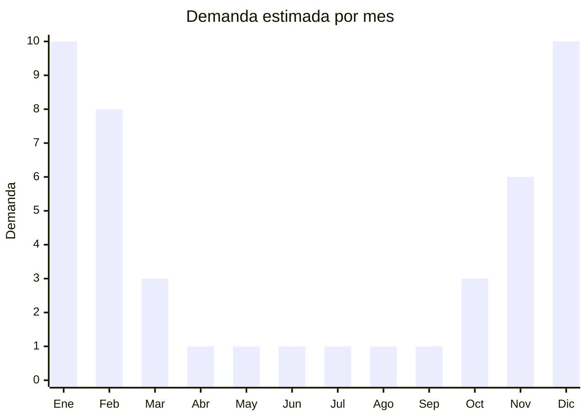

# Bronceadores

> **Capitulo NCM 33** — Perfumeria y cosmetica | **Temporada:** Verano (Dic-Feb)

## Que es y por que importarlo

Los bronceadores son productos cosmeticos disenados para acelerar, intensificar o simular el bronceado de la piel. Se dividen en dos grandes categorias: los bronceadores solares (aceites y lociones que potencian el bronceado durante la exposicion al sol, generalmente con FPS bajo o nulo) y los autobronceantes (productos que colorean la piel sin necesidad de exposicion solar, mediante ingredientes como DHA — dihidroxiacetona). Se presentan en formatos de aceite, locion, gel, spray y mousse.

En Argentina, la cultura del bronceado esta profundamente arraigada, especialmente durante el verano. Los destinos de playa como Mar del Plata, Pinamar, Carlos Paz y la costa atlantica generan una demanda estacional muy marcada de estos productos. El mercado esta dominado por marcas como Hawaiian Tropic, Banana Boat y L'Oreal, pero existe un segmento creciente de autobronceantes que permite cierta diferenciacion. La demanda esta 100% concentrada entre octubre y febrero, con pico absoluto en diciembre y enero.

Al igual que los protectores solares, los bronceadores estan clasificados por ANMAT como cosmeticos de grado 2, lo que impone la misma barrera regulatoria alta: establecimiento habilitado, Director Tecnico, registro ante ANMAT y, en el caso de productos con FPS declarado, pruebas de laboratorio. Esto hace que la importacion desde China sea viable solo para empresas con estructura regulatoria ya montada. Las marcas chinas no tienen presencia relevante en esta categoria en el mercado argentino.

## Datos clave

| Dato | Valor |
|------|-------|
| **Posiciones NCM tipicas** | 3304.99.90 |
| **Derecho de importacion** | 18% (DIE) + 3% tasa estadistica |
| **Rango FOB tipico** | USD 1 — USD 4 por unidad |
| **Precio de venta en Argentina** | ARS 5,000 — ARS 15,000 |
| **Margen bruto estimado** | 150% — 350% (teorico) |
| **MOQ tipico** | 500 — 3,000 unidades |
| **Demanda en MercadoLibre** | Media-alta (100% estacional) |
| **Competencia en MercadoLibre** | Alta (marcas internacionales dominantes) |
| **Dificultad para importar** | Muy alta (ANMAT grado 2 obligatorio) |
| **Certificaciones necesarias** | ANMAT grado 2, Director Tecnico |
| **Antidumping** | **No** |

<Warning>
**BARRERA DE ENTRADA MUY ALTA.** Al igual que los protectores solares, ANMAT clasifica los bronceadores como cosmeticos de grado 2. Se requiere establecimiento habilitado, Director Tecnico farmaceutico/quimico y registro del producto. El proceso puede demorar 3 a 6 meses y costar USD 500 a USD 1,500+. No es viable para importadores sin estructura regulatoria previa.
</Warning>

## Variantes y subtipos mas comunes

| Subtipo / Variante | FOB aprox. | Venta AR aprox. | Nota |
|--------------------|-----------|-----------------|------|
| Aceite bronceador | USD 1 — 3 | ARS 5,000 — 10,000 | Clasico de playa, bajo FPS o sin FPS |
| Locion bronceadora con color | USD 1.50 — 3.50 | ARS 6,000 — 12,000 | Efecto bronceado inmediato temporal |
| Autobronceante (DHA) | USD 2 — 4 | ARS 8,000 — 15,000 | Sin exposicion solar, nicho creciente |
| Gel bronceador | USD 1 — 3 | ARS 5,000 — 10,000 | Textura ligera, popular en jovenes |

## Regulaciones y requisitos

<Tabs>
  <Tab title="Certificaciones">
    | Organismo | Requiere | Detalle | Costo aprox. | Tiempo aprox. |
    |-----------|----------|---------|-------------|--------------|
    | ANMAT | **Si — Grado 2** | Registro obligatorio como cosmético de grado 2 | USD 500 — 1,500+ | 3 — 6 meses |
    | Laboratorio (si declara FPS) | Condicional | Pruebas FPS en laboratorio acreditado solo si el producto declara factor de proteccion | USD 300 — 800 | 4 — 8 semanas |
    | ARCA (Aduana) | Si | Despacho de importacion estandar | Variable | — |

    <Warning>
    Los bronceadores que NO declaran FPS igualmente requieren registro ANMAT grado 2 por ser productos cosmeticos que interactuan con la piel y la radiacion solar. No existe excepcion para aceites bronceadores sin FPS. El Director Tecnico es obligatorio en todos los casos.
    </Warning>
  </Tab>

  <Tab title="Etiquetado">
    | Requisito | Aplica |
    |-----------|--------|
    | Idioma espanol | Si |
    | Datos del importador | Si |
    | Composicion / ingredientes INCI | Si (lista completa) |
    | Numero de registro ANMAT | Si |
    | Advertencias sobre exposicion solar | Si |
    | Instrucciones de uso | Si |
    | Fecha de vencimiento | Si |
    | Lote de fabricacion | Si |
    | Pais de origen | Si |

    Obligatorio incluir advertencias sobre exposicion solar responsable. Si el producto NO contiene filtros solares, debe indicarlo claramente: "Este producto no protege contra la radiacion UV". Los autobronceantes deben indicar que no proporcionan proteccion solar.
  </Tab>

  <Tab title="Restricciones">
    - Mismas restricciones que protectores solares: establecimiento habilitado ANMAT obligatorio
    - Los autobronceantes con DHA tienen limite maximo de concentracion de DHA del 10%
    - No se puede publicitar como "bronceado seguro" o "bronceado sin riesgo"
    - Ingredientes deben estar en la lista positiva de ANMAT
    - Prohibido el uso de ciertos colorantes y fragancias alergenas sin declaracion
    - Si el producto contiene aceites minerales, debe declarar "contiene aceite mineral" en el envase
  </Tab>
</Tabs>

## Logistica

| Dato | Valor |
|------|-------|
| **Peso tipico por unidad** | 0.15 — 0.30 kg (con envase) |
| **Volumen tipico** | Bajo — medio |
| **Fragilidad** | Media (envases plasticos) |
| **Envio recomendado** | Maritimo (FCL o consolidado) |
| **Tiempo total estimado** (pedido a deposito) | 6 — 10 semanas (maritimo) + 3-6 meses registro ANMAT |
| **Temperatura** | Evitar exposicion prolongada a temperaturas superiores a 40C |
| **Requiere empaque especial** | Si: proteccion contra fugas (aceites pueden derramarse) |

<Tip>
Los aceites bronceadores requieren atencion especial al empaque: los envases deben tener doble sello para evitar derrames durante el transporte maritimo. Solicitar al proveedor envases con tapa flip-top con sello de seguridad. Considerar que los aceites pueden expandirse con el calor, por lo que los envases no deben llenarse al 100% de su capacidad.
</Tip>

## Estacionalidad



| Aspecto | Detalle |
|---------|---------|
| **Meses pico** | Diciembre — Febrero (verano, temporada de playa) |
| **Meses valle** | Abril — Septiembre (demanda practicamente nula) |
| **Cuando pedir para llegar a tiempo** | Abril — Junio (considerando proceso ANMAT + envio maritimo) |

## Ventajas y riesgos

<CardGroup cols={2}>
  <Card title="Ventajas" icon="circle-check">
    - Margenes brutos teoricos del 150% al 350%
    - Producto de consumo recurrente durante todo el verano
    - Nicho de autobronceantes en crecimiento con menor competencia de marcas globales
    - Cultura del bronceado muy arraigada en Argentina
    - Posibilidad de marca propia con formulaciones OEM desde China
  </Card>
  <Card title="Riesgos" icon="triangle-exclamation">
    - Barrera regulatoria ANMAT grado 2: misma complejidad que protectores solares
    - Demanda 100% estacional: stock no vendido queda inmovilizado 8-9 meses
    - Marcas chinas sin presencia ni reconocimiento en Argentina
    - Riesgo sanitario: reacciones alergicas, manchas en piel por productos defectuosos
    - Competencia de marcas internacionales con fuerte posicionamiento
    - Tendencia creciente al "no bronceado" por concientizacion sobre cancer de piel
  </Card>
</CardGroup>

## Palabras clave para buscar en Alibaba

```
tanning oil OEM, self tanner lotion factory, bronze body lotion private label,
tanning cream DHA manufacturer, sun tanning oil wholesale, instant bronzer lotion,
self-tanning mousse OEM, Guangzhou tanning product factory,
bronzing gel manufacturer, sunless tanner spray bulk
```

## Fuentes

- [ANMAT - Disposicion 6830/2018 - Cosmeticos](https://www.argentina.gob.ar/anmat/cosmeticos)
- [Nomenclador NCM - ARCA (ex-AFIP)](https://www.arca.gob.ar)
- [MercadoLibre Argentina - Bronceadores](https://www.mercadolibre.com.ar/bronceador)
- [Alibaba - Tanning oil OEM suppliers](https://www.alibaba.com/trade/search?SearchText=tanning+oil+OEM)
- [Ministerio de Economia - Arancel externo comun](https://www.argentina.gob.ar/economia)
