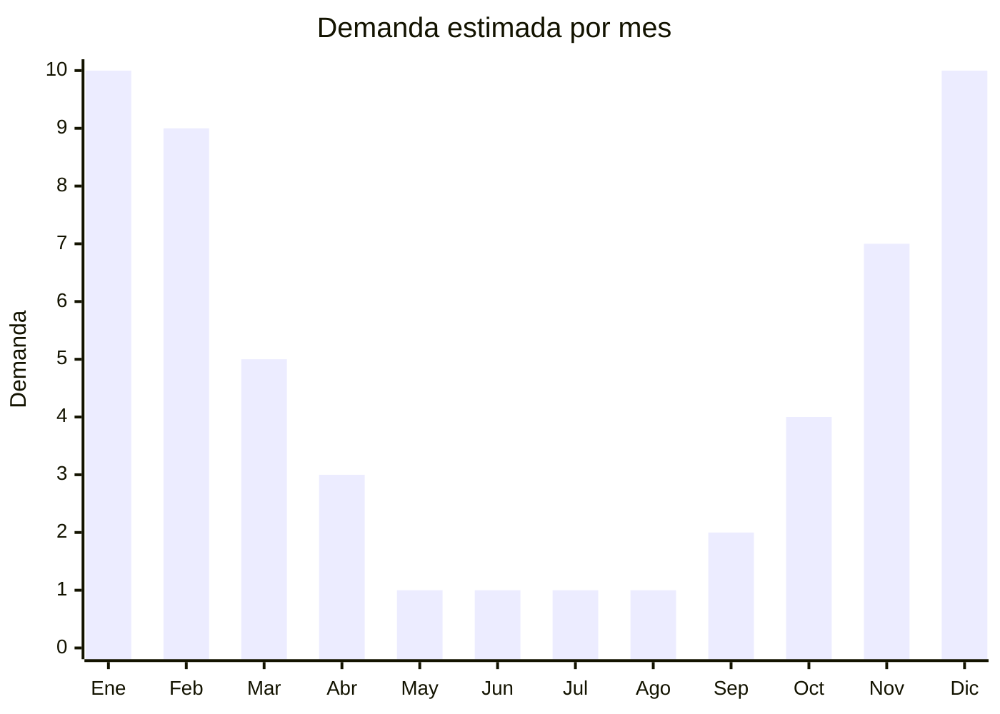

# Protectores Solares

> **Capitulo NCM 33** — Perfumeria y cosmetica | **Temporada:** Verano (Dic-Feb)

## Que es y por que importarlo

Los protectores solares son productos cosmeticos disenados para proteger la piel de la radiacion ultravioleta (UVA y UVB). Se presentan en diversas formas: crema, locion, spray, gel y aceite. Contienen filtros solares quimicos (como avobenzona, octinoxato) o fisicos (dioxido de titanio, oxido de zinc) que absorben o reflejan la radiacion solar. En Argentina, su uso se intensifica dramaticamente durante los meses de verano (diciembre a febrero), cuando las temperaturas superan los 30 grados y la poblacion acude masivamente a playas, piletas y actividades al aire libre.

China es un productor importante de protectores solares a nivel mundial, con fabricas concentradas en Guangzhou y Shanghai que producen tanto para marcas globales como para marcas white-label. Los precios FOB son significativamente mas bajos que los de marcas internacionales establecidas. Sin embargo, la importacion de protectores solares a Argentina enfrenta una barrera regulatoria extremadamente alta: ANMAT los clasifica como productos cosmeticos de grado 2, lo que exige habilitacion de establecimiento, Director Tecnico farmaceutico, pruebas de FPS en laboratorio argentino y un proceso de registro que puede tomar entre 3 y 6 meses con un costo de USD 500 a USD 1,500 o mas.

Es importante destacar que las marcas chinas practicamente no tienen presencia en el mercado argentino de proteccion solar. El mercado esta dominado por marcas internacionales reconocidas como La Roche-Posay, Neutrogena, Nivea, Hawaiian Tropic y Dermagloss. El consumidor argentino prioriza la confianza en la marca cuando se trata de proteccion solar, lo que hace extremadamente dificil posicionar un producto nuevo de origen chino. Por estas razones, este producto NO es recomendable para importadores pequenos o medianos.

## Datos clave

| Dato | Valor |
|------|-------|
| **Posiciones NCM tipicas** | 3304.99.90 |
| **Derecho de importacion** | 18% (DIE) + 3% tasa estadistica |
| **Rango FOB tipico** | USD 1 — USD 5 por unidad |
| **Precio de venta en Argentina** | ARS 5,000 — ARS 25,000 |
| **Margen bruto estimado** | 150% — 400% (teorico, dificil de concretar) |
| **MOQ tipico** | 500 — 3,000 unidades |
| **Demanda en MercadoLibre** | Alta (pero concentrada en marcas conocidas) |
| **Competencia en MercadoLibre** | Muy alta (marcas internacionales dominantes) |
| **Dificultad para importar** | Muy alta (ANMAT grado 2 obligatorio) |
| **Certificaciones necesarias** | ANMAT grado 2, Director Tecnico, pruebas FPS |
| **Antidumping** | **No** |

<Warning>
**BARRERA DE ENTRADA MUY ALTA.** ANMAT clasifica los protectores solares como cosmeticos de grado 2. Esto significa que necesitas: (1) un establecimiento habilitado por ANMAT, (2) un Director Tecnico farmaceutico o quimico, (3) pruebas de FPS realizadas en un laboratorio argentino acreditado, (4) registro del producto ante ANMAT. El costo total del proceso regulatorio puede superar los USD 1,500 y demorar 3 a 6 meses. **Este producto NO es recomendable para importadores pequenos o medianos.**
</Warning>

## Variantes y subtipos mas comunes

| Subtipo / Variante | FOB aprox. | Venta AR aprox. | Nota |
|--------------------|-----------|-----------------|------|
| FPS 30 crema | USD 1 — 3 | ARS 5,000 — 12,000 | Proteccion basica, menor demanda que FPS 50+ |
| FPS 50+ crema | USD 2 — 5 | ARS 8,000 — 20,000 | El mas demandado, estandar del mercado |
| FPS 50+ spray | USD 3 — 5 | ARS 12,000 — 25,000 | Formato premium, mayor margen |
| Gel transparente | USD 2 — 4 | ARS 8,000 — 18,000 | Popular para rostro, no deja residuo blanco |
| Facial oil-free | USD 2 — 5 | ARS 10,000 — 22,000 | Nicho dermatologico, alto valor percibido |

## Regulaciones y requisitos

<Tabs>
  <Tab title="Certificaciones">
    | Organismo | Requiere | Detalle | Costo aprox. | Tiempo aprox. |
    |-----------|----------|---------|-------------|--------------|
    | ANMAT | **Si — Grado 2** | Registro obligatorio como cosmético de grado 2. Requiere establecimiento habilitado y Director Tecnico | USD 500 — 1,500+ | 3 — 6 meses |
    | Laboratorio FPS | **Si** | Pruebas de factor de proteccion solar en laboratorio argentino acreditado (ISO 24444) | USD 300 — 800 por formula | 4 — 8 semanas |
    | ARCA (Aduana) | Si | Despacho de importacion estandar | Variable | — |

    <Warning>
    Sin el registro ANMAT grado 2, la mercaderia sera retenida y decomisada en aduana. El Director Tecnico debe ser un profesional farmaceutico o quimico habilitado por ANMAT. No es posible importar protectores solares sin cumplir con todos estos requisitos. Cada formula/variante requiere su propio registro.
    </Warning>
  </Tab>

  <Tab title="Etiquetado">
    | Requisito | Aplica |
    |-----------|--------|
    | Idioma espanol | Si |
    | Datos del importador | Si |
    | Composicion / ingredientes INCI | Si (lista completa) |
    | Numero de registro ANMAT | Si |
    | FPS comprobado | Si |
    | Instrucciones de uso y reaplicacion | Si |
    | Fecha de vencimiento | Si |
    | Lote de fabricacion | Si |
    | Pais de origen | Si |
    | Advertencias sobre exposicion solar | Si |

    El etiquetado debe cumplir con la Disposicion ANMAT 6830/2018. Debe incluir la lista completa de ingredientes en nomenclatura INCI, el FPS demostrado en laboratorio, instrucciones de reaplicacion cada 2 horas, y advertencias sobre exposicion solar prolongada. No se permiten claims de "proteccion total" o "bloqueador solar".
  </Tab>

  <Tab title="Restricciones">
    - ANMAT exige que el establecimiento importador este habilitado especificamente para productos cosmeticos de grado 2
    - No se permite la venta sin numero de registro ANMAT visible en el envase
    - Los claims de FPS deben estar respaldados por pruebas in vivo segun ISO 24444
    - No se puede publicitar como "bloqueador solar" (termino prohibido)
    - Los filtros solares utilizados deben estar en la lista positiva de ingredientes permitidos por ANMAT
    - Mercurio, plomo y otros metales pesados estan prohibidos: se requieren analisis de metales pesados
  </Tab>
</Tabs>

## Logistica

| Dato | Valor |
|------|-------|
| **Peso tipico por unidad** | 0.15 — 0.30 kg (con envase) |
| **Volumen tipico** | Bajo — medio |
| **Fragilidad** | Media (envases plasticos) — Alta (envases vidrio) |
| **Envio recomendado** | Maritimo (FCL o consolidado) |
| **Tiempo total estimado** (pedido a deposito) | 6 — 10 semanas (maritimo) + 3-6 meses registro ANMAT |
| **Temperatura** | Evitar exposicion a temperaturas superiores a 40C |
| **Requiere empaque especial** | Si: proteccion contra calor y aplastamiento |

<Tip>
Al ser un producto cosmético regulado, el tiempo total desde la decision de importar hasta la primera venta puede superar los 6 meses si se considera el proceso ANMAT. La mercaderia no puede comercializarse hasta obtener el numero de registro. Planificar con al menos 8 meses de anticipacion respecto a la temporada de verano. Los envios maritimos desde Guangzhou o Shanghai tardan 4-6 semanas hasta Buenos Aires.
</Tip>

## Estacionalidad



| Aspecto | Detalle |
|---------|---------|
| **Meses pico** | Diciembre — Febrero (verano, vacaciones, playas) |
| **Meses valle** | Mayo — Agosto (invierno, demanda casi nula) |
| **Cuando pedir para llegar a tiempo** | Abril — Junio (considerando 3-6 meses de proceso ANMAT + 6-10 semanas de envio) |

## Ventajas y riesgos

<CardGroup cols={2}>
  <Card title="Ventajas" icon="circle-check">
    - Margenes brutos teoricos del 150% al 400%
    - Demanda masiva en verano: millones de unidades se consumen en Argentina entre diciembre y febrero
    - Mercado en crecimiento por mayor concientizacion sobre proteccion solar
    - Posibilidad de crear marca propia con formulaciones white-label
    - Productos de consumo recurrente (se reaaplican varias veces al dia)
  </Card>
  <Card title="Riesgos" icon="triangle-exclamation">
    - Barrera regulatoria ANMAT grado 2: proceso costoso, largo y complejo
    - Necesidad de Director Tecnico habilitado (costo mensual adicional)
    - Marcas chinas sin presencia ni confianza en el mercado argentino
    - Competencia feroz de marcas internacionales establecidas
    - Riesgo sanitario alto: un producto defectuoso puede causar quemaduras solares y demandas legales
    - Temporalidad extrema: stock no vendido en verano queda inmovilizado hasta el proximo ano
  </Card>
</CardGroup>

<Warning>
**NO RECOMENDABLE PARA IMPORTADORES PEQUENOS O MEDIANOS.** La combinacion de barrera regulatoria ANMAT, necesidad de Director Tecnico, pruebas de laboratorio FPS, y la falta de confianza del consumidor argentino en marcas chinas de proteccion solar hace que este producto sea viable solo para empresas con experiencia en el rubro cosmetico y estructura regulatoria ya establecida.
</Warning>

## Palabras clave para buscar en Alibaba

```
sunscreen SPF 50+ OEM, sun protection cream factory, sunblock lotion private label,
SPF 30 sunscreen bulk, spray sunscreen manufacturer, facial sunscreen oil-free,
Guangzhou sunscreen OEM factory, sun cream white label, UV protection cream wholesale,
waterproof sunscreen SPF 50, sun gel transparent manufacturer
```

## Fuentes

- [ANMAT - Disposicion 6830/2018 - Cosmeticos](https://www.argentina.gob.ar/anmat/cosmeticos)
- [Nomenclador NCM - ARCA (ex-AFIP)](https://www.arca.gob.ar)
- [MercadoLibre Argentina - Protectores Solares](https://www.mercadolibre.com.ar/protector-solar)
- [Alibaba - Sunscreen OEM suppliers](https://www.alibaba.com/trade/search?SearchText=sunscreen+OEM+SPF50)
- [Ministerio de Economia - Arancel externo comun](https://www.argentina.gob.ar/economia)
