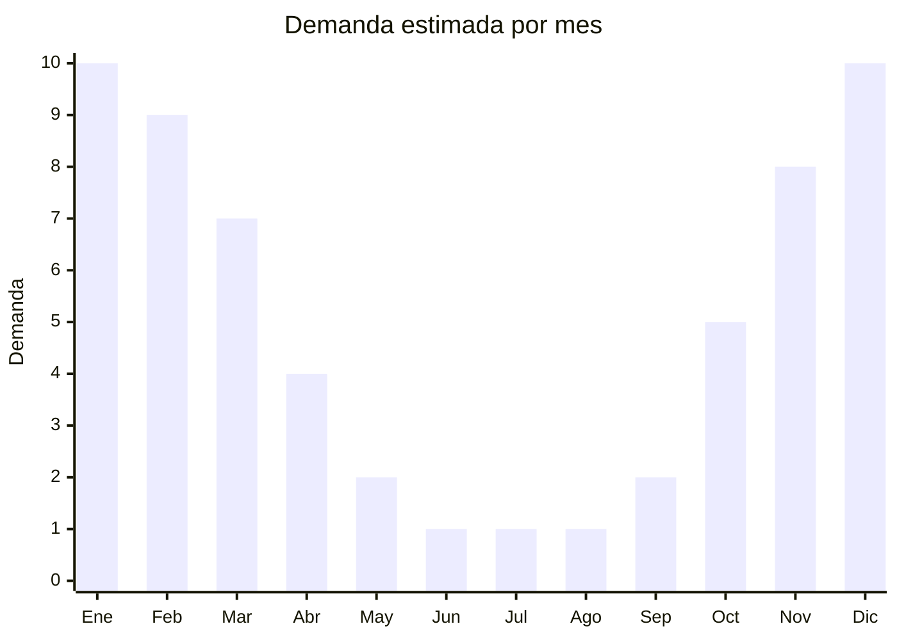

# Repelentes de Insectos

> **Capitulo NCM 33** — Perfumeria y cosmetica | **Temporada:** Verano (Dic-Feb)

## Que es y por que importarlo

Los repelentes de insectos son productos quimicos disenados para ahuyentar mosquitos, jejenes y otros insectos que pican. Se clasifican en dos grandes categorias: repelentes de uso humano (aplicados sobre la piel o la ropa) y repelentes ambientales (difusores, velas, espirales). Los repelentes de uso humano se presentan en formatos de spray, crema, locion, roll-on, pulseras y parches adhesivos. Los ingredientes activos mas comunes son DEET (N,N-dietil-meta-toluamida), icaridina (picaridina), citronella, eucalipto limon y IR3535.

En Argentina, la demanda de repelentes se multiplica entre 4 y 6 veces durante los meses de verano (diciembre a marzo), coincidiendo con la temporada de mosquitos. Las epidemias recurrentes de dengue en el pais — con picos historicos en 2023-2024 que superaron los 500,000 casos — han generado una conciencia publica extraordinaria sobre la importancia de la proteccion contra mosquitos, elevando la demanda a niveles sin precedentes. En temporadas de brotes de dengue, los repelentes literalmente se agotan en farmacias y supermercados, creando una oportunidad de mercado significativa.

Sin embargo, los repelentes de uso humano estan altamente regulados en Argentina. ANMAT los clasifica como cosmeticos de grado 2, y aquellos con DEET o icaridina estan sujetos a controles adicionales como producto con accion especifica. El proceso de registro es costoso y prolongado. Los repelentes "naturales" como pulseras de citronella y parches adhesivos ocupan una zona gris regulatoria: si bien no se aplican directamente sobre la piel, ANMAT puede exigir registro si se comercializan como "repelentes de mosquitos". Las marcas dominantes en Argentina son OFF!, Repelex, Fuyi y Stay Off, todas con fuerte posicionamiento y distribucion.

## Datos clave

| Dato | Valor |
|------|-------|
| **Posiciones NCM tipicas** | 3808.91 (insecticidas/repelentes) / 3304.99 (cosmeticos sobre la piel) |
| **Derecho de importacion** | 14% — 18% (DIE) + 3% tasa estadistica |
| **Rango FOB tipico** | USD 0.50 — USD 3 por unidad |
| **Precio de venta en Argentina** | ARS 3,000 — ARS 8,000 |
| **Margen bruto estimado** | 150% — 400% |
| **MOQ tipico** | 500 — 5,000 unidades |
| **Demanda en MercadoLibre** | Muy alta (se multiplica x4-6 en verano y brotes de dengue) |
| **Competencia en MercadoLibre** | Alta (marcas dominantes: OFF!, Repelex, Fuyi) |
| **Dificultad para importar** | Alta a muy alta (ANMAT obligatorio para uso humano) |
| **Certificaciones necesarias** | ANMAT grado 2 (uso humano), SENASA (plaguicida domestico) |
| **Antidumping** | **No** |

<Warning>
**CATEGORIA ALTAMENTE REGULADA.** Los repelentes de uso humano requieren registro ANMAT como cosmético de grado 2. Los repelentes ambientales (espirales, tabletas) se clasifican como plaguicidas domesticos y requieren registro ante SENASA/ANMAT. Las pulseras y parches de citronella estan en una zona gris regulatoria: si se comercializan con claims de "repelente de mosquitos", pueden requerir registro. Consultar con un agente regulatorio antes de importar.
</Warning>

## Variantes y subtipos mas comunes

| Subtipo / Variante | FOB aprox. | Venta AR aprox. | Nota |
|--------------------|-----------|-----------------|------|
| Spray DEET (15-25%) | USD 1 — 3 | ARS 4,000 — 8,000 | Formato mas vendido, regulacion estricta |
| Crema repelente | USD 1 — 2.50 | ARS 3,000 — 7,000 | Aplicacion directa sobre piel, ANMAT obligatorio |
| Roll-on repelente | USD 0.80 — 2 | ARS 3,000 — 6,000 | Formato practico para viaje |
| Pulsera repelente citronella | USD 0.10 — 0.50 | ARS 500 — 2,500 | Zona gris regulatoria, FOB muy bajo, margen alto |
| Parches adhesivos repelentes | USD 0.05 — 0.30/pack | ARS 500 — 2,000 | Popular para ninos, zona gris regulatoria |

<Note>
Las **pulseras de citronella** y **parches adhesivos** representan la mayor oportunidad para importadores pequenos debido a su FOB extremadamente bajo y la zona gris regulatoria (no se aplican directamente sobre la piel). Sin embargo, existe riesgo de que ANMAT exija registro si se comercializan con claims de eficacia como repelente. Se recomienda comercializarlos como "accesorio aromatico con citronella" en lugar de "repelente de mosquitos".
</Note>

## Regulaciones y requisitos

<Tabs>
  <Tab title="Certificaciones">
    | Organismo | Requiere | Detalle | Costo aprox. | Tiempo aprox. |
    |-----------|----------|---------|-------------|--------------|
    | ANMAT (uso humano) | **Si — Grado 2** | Repelentes aplicados sobre la piel: registro como cosmético grado 2 | USD 500 — 1,500+ | 3 — 6 meses |
    | SENASA (plaguicida domestico) | **Condicional** | Si se clasifica como plaguicida domestico (NCM 3808.91) | Variable | 3 — 8 meses |
    | ARCA (Aduana) | Si | Despacho de importacion — puede requerir intervención previa ANMAT/SENASA | Variable | — |

    <Warning>
    La clasificacion entre ANMAT y SENASA depende de la formulacion y el uso declarado. Repelentes sobre la piel: ANMAT. Repelentes ambientales (para espacios): SENASA/ANMAT como plaguicida domestico. La incorrecta clasificacion puede resultar en decomiso de la mercaderia. Contratar un despachante de aduanas con experiencia en productos regulados.
    </Warning>
  </Tab>

  <Tab title="Etiquetado">
    | Requisito | Aplica |
    |-----------|--------|
    | Idioma espanol | Si |
    | Datos del importador | Si |
    | Ingrediente activo y concentracion | Si (DEET %, icaridina %, citronella %) |
    | Numero de registro ANMAT/SENASA | Si |
    | Instrucciones de uso | Si |
    | Advertencias de seguridad | Si (no aplicar en heridas, no ingerir, mantener lejos de ninos) |
    | Edad minima de uso | Si (muchos repelentes DEET no aptos para menores de 2 anos) |
    | Fecha de vencimiento | Si |
    | Pais de origen | Si |

    El etiquetado para repelentes es mas estricto que para cosmeticos convencionales. Debe incluir la concentracion exacta del ingrediente activo, instrucciones detalladas de aplicacion, frecuencia de reaplicacion, y advertencias especificas (ej: "No usar en ninos menores de 2 anos", "Evitar contacto con ojos").
  </Tab>

  <Tab title="Restricciones">
    - DEET esta restringido en concentracion maxima para uso pediatrico (generalmente maximo 10% para ninos de 2-12 anos)
    - No se permiten claims de "100% natural" sin certificacion
    - Los repelentes con icaridina tienen restricciones similares a DEET
    - Las pulseras y parches no estan explicitamente regulados como repelentes, pero ANMAT puede intervenir si se comercializan con claims de eficacia
    - Prohibido el uso de ciertos ingredientes considerados toxicos por ANMAT
    - En temporadas de dengue, ANMAT puede endurecer controles y exigir registros a productos en zona gris
  </Tab>
</Tabs>

## Logistica

| Dato | Valor |
|------|-------|
| **Peso tipico por unidad** | 0.10 — 0.25 kg (spray/crema) / 0.01 — 0.05 kg (pulseras/parches) |
| **Volumen tipico** | Bajo |
| **Fragilidad** | Baja (envases plasticos) |
| **Envio recomendado** | Aereo (pulseras/parches por bajo peso) / Maritimo (sprays en volumen) |
| **Tiempo total estimado** (pedido a deposito) | 3 — 6 semanas (aereo) / 8 — 12 semanas (maritimo) + registro ANMAT |
| **Restricciones aereas** | Sprays aerosol son mercancia peligrosa (DGR) — restricciones aereas aplican |
| **Requiere empaque especial** | Si para sprays: embalaje segun normas de mercancia peligrosa |

<Tip>
Las pulseras y parches de citronella son ideales para envio aereo por su peso minimo: 1,000 unidades pueden pesar menos de 10 kg. Los sprays aerosol estan clasificados como mercancia peligrosa y requieren documentacion DGR (Dangerous Goods Regulations) para envio aereo, lo que encarece significativamente el flete. Para sprays, priorizar envio maritimo. Proveedores principales en Guangzhou, Yiwu y Zhejiang.
</Tip>

## Estacionalidad



| Aspecto | Detalle |
|---------|---------|
| **Meses pico** | Diciembre — Marzo (verano + temporada de mosquitos + brotes de dengue) |
| **Meses valle** | Junio — Agosto (invierno, sin mosquitos) |
| **Cuando pedir para llegar a tiempo** | Julio — Septiembre (considerando registro ANMAT + 8-12 semanas maritimo) |

<Note>
La demanda de repelentes puede tener **picos imprevistos** fuera de temporada debido a brotes de dengue. Las epidemias de 2023-2024 generaron desabastecimiento en pleno otono (marzo-abril). Mantener un stock de seguridad si ya se tiene el producto registrado puede ser una ventaja competitiva significativa.
</Note>

## Ventajas y riesgos

<CardGroup cols={2}>
  <Card title="Ventajas" icon="circle-check">
    - Demanda que se multiplica x4-6 en verano, con picos adicionales por brotes de dengue
    - Pulseras y parches de citronella tienen FOB extremadamente bajo (USD 0.05-0.50) con margenes enormes
    - Producto de primera necesidad: la gente paga lo que sea en temporada de mosquitos
    - Desabastecimiento frecuente en temporada alta crea oportunidad para nuevos actores
    - Mercado en expansion por aumento de enfermedades transmitidas por mosquitos
  </Card>
  <Card title="Riesgos" icon="triangle-exclamation">
    - Regulacion ANMAT/SENASA compleja y costosa para repelentes quimicos
    - Marcas dominantes (OFF!, Repelex) con posicionamiento muy fuerte
    - Pulseras y parches en zona gris regulatoria: riesgo de decomiso si ANMAT interviene
    - Sprays con DEET clasificados como mercancia peligrosa para transporte aereo
    - Eficacia cuestionable de repelentes de citronella: menor duracion que DEET/icaridina
    - Riesgo reputacional alto si el producto no funciona y el usuario sufre picaduras o dengue
  </Card>
</CardGroup>

## Palabras clave para buscar en Alibaba

```
mosquito repellent bracelet citronella, insect repellent patch sticker,
DEET mosquito repellent spray OEM, mosquito repellent cream factory,
citronella bracelet wholesale, anti mosquito patch for kids,
insect repellent roll-on manufacturer, mosquito repellent lotion private label,
natural citronella oil repellent, Yiwu mosquito bracelet factory
```

## Fuentes

- [ANMAT - Productos cosmeticos regulados](https://www.argentina.gob.ar/anmat/cosmeticos)
- [SENASA - Registro de plaguicidas domesticos](https://www.argentina.gob.ar/senasa)
- [Nomenclador NCM - ARCA (ex-AFIP)](https://www.arca.gob.ar)
- [MercadoLibre Argentina - Repelentes](https://www.mercadolibre.com.ar/repelente-insectos)
- [Alibaba - Mosquito repellent suppliers](https://www.alibaba.com/trade/search?SearchText=mosquito+repellent+bracelet)
- [Ministerio de Salud - Boletin epidemiologico dengue](https://www.argentina.gob.ar/salud/epidemiologia)
