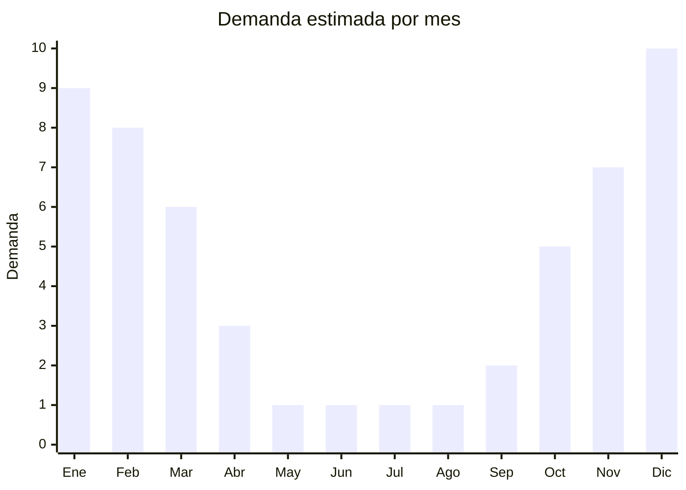

# Espirales Antimosquitos

> **Capitulo NCM 34** — Jabones, ceras y velas | **Temporada:** Verano (Dic-Feb)

## Que es y por que importarlo

Los espirales antimosquitos (tambien llamados "espirales para mosquitos" o "espirales insecticidas") son productos insecticidas de uso domestico que, al encenderse, liberan humo con sustancias activas que repelen y/o matan mosquitos y otros insectos voladores. El ingrediente activo mas comun es la aletrina (d-trans-aletrina o d-aletrina), una piretrina sintetica. La categoria tambien incluye tabletas para aparato electrico (pastillas que se calientan en un dispositivo enchufable) y liquidos para aparato electrico, que funcionan con el mismo principio pero sin humo. Son productos de uso masivo en Argentina durante los meses calidos.

El mercado argentino de insecticidas domesticos antimosquitos esta fuertemente consolidado en torno a tres marcas dominantes: Fuyi (S.C. Johnson), Raid (S.C. Johnson) y OFF! (S.C. Johnson). Estas marcas controlan la distribucion en supermercados, farmacias y almacenes de todo el pais, con decadas de posicionamiento y confianza del consumidor. Entrar a competir contra estas marcas es extremadamente dificil para un importador independiente.

Ademas, los espirales y tabletas antimosquitos estan clasificados como plaguicidas de uso domestico en Argentina, lo que los somete a una regulacion estricta de SENASA y ANMAT. El proceso de registro requiere ensayos de eficacia biologica, estudios toxicologicos, analisis quimicos del producto formulado, y certificacion de Buenas Practicas de Manufactura de la fabrica de origen. Este proceso puede tomar entre 6 y 12 meses y costar varios miles de dolares. Por estas razones, este producto NO es recomendable para importadores chicos.

## Datos clave

| Dato | Valor |
|------|-------|
| **Posiciones NCM tipicas** | 3808.91 (insecticidas para uso domestico) |
| **Derecho de importacion** | 14% — 18% (DIE) + 3% tasa estadistica |
| **Rango FOB tipico** | USD 0.30 — USD 1.50 por pack |
| **Precio de venta en Argentina** | ARS 1,500 — ARS 4,000 |
| **Margen bruto estimado** | 150% — 300% (teorico, muy dificil de concretar) |
| **MOQ tipico** | 1,000 — 10,000 packs |
| **Demanda en MercadoLibre** | Alta (estacional + picos por dengue) |
| **Competencia en MercadoLibre** | Muy alta (Fuyi, Raid, OFF! dominantes) |
| **Dificultad para importar** | Muy alta (SENASA/ANMAT como plaguicida domestico) |
| **Certificaciones necesarias** | Registro SENASA como plaguicida domestico, ANMAT, GMP de fabrica |
| **Antidumping** | **No** |

<Warning>
**NO RECOMENDABLE PARA IMPORTADORES CHICOS.** Los espirales antimosquitos estan clasificados como **plaguicidas domesticos**, lo que requiere un proceso de registro ante SENASA/ANMAT extremadamente complejo y costoso (USD 3,000 — USD 10,000+, 6-12 meses). Las marcas Fuyi, Raid y OFF! (todas de S.C. Johnson) dominan el mercado con distribucion en supermercados, farmacias y almacenes en todo el pais. Competir contra estas marcas como importador independiente es practicamente inviable.
</Warning>

## Variantes y subtipos mas comunes

| Subtipo / Variante | FOB aprox. | Venta AR aprox. | Nota |
|--------------------|-----------|-----------------|------|
| Espiral clasico (pack x10-12) | USD 0.30 — 0.80 | ARS 1,500 — 3,000 | Formato tradicional, mayor volumen de ventas |
| Tabletas para aparato electrico (pack x12-24) | USD 0.50 — 1.50 | ARS 2,000 — 4,000 | Requiere aparato electrico, sin humo |
| Liquido para aparato electrico | USD 0.80 — 1.50 | ARS 2,500 — 4,000 | Mayor duracion, sin humo ni residuos |
| Espiral premium sin humo | USD 0.50 — 1.20 | ARS 2,000 — 3,500 | Formula mejorada, menor olor |

## Regulaciones y requisitos

<Tabs>
  <Tab title="Certificaciones">
    | Organismo | Requiere | Detalle | Costo aprox. | Tiempo aprox. |
    |-----------|----------|---------|-------------|--------------|
    | SENASA | **Si** | Registro como plaguicida de uso domestico — Resolucion SENASA 350/99 | USD 3,000 — 10,000+ | 6 — 12 meses |
    | ANMAT | **Si** | Intervencion ANMAT como co-regulador de productos con accion insecticida | Incluido en proceso SENASA | — |
    | Laboratorio acreditado | **Si** | Ensayos de eficacia biologica, toxicologia y analisis quimico | USD 1,000 — 5,000 | 2 — 6 meses |
    | GMP fabrica de origen | **Si** | Certificado de Buenas Practicas de Manufactura de la fabrica china | Variable | — |
    | ARCA (Aduana) | Si | Despacho con intervencion previa SENASA/ANMAT obligatoria | Variable | — |

    <Warning>
    El proceso de registro de un plaguicida domestico ante SENASA es significativamente mas complejo y costoso que el registro ANMAT de un cosmético. Requiere: (1) informe toxicologico completo, (2) ensayos de eficacia biologica contra mosquitos Aedes aegypti, (3) analisis fisicoquimicos del producto formulado, (4) certificado GMP de la fabrica de origen, (5) etiquetado aprobado por SENASA. El costo total puede superar los USD 10,000.
    </Warning>
  </Tab>

  <Tab title="Etiquetado">
    | Requisito | Aplica |
    |-----------|--------|
    | Idioma espanol | Si |
    | Numero de registro SENASA | Si (visible y prominente) |
    | Ingrediente activo y concentracion | Si (nombre quimico y porcentaje exacto) |
    | Instrucciones de uso detalladas | Si |
    | Advertencias toxicologicas | Si (pictogramas de peligro, frases de riesgo) |
    | Primeros auxilios | Si |
    | Telefono de emergencia toxicologica | Si |
    | Datos del importador y fabricante | Si |
    | Fecha de fabricacion y vencimiento | Si |
    | Lote | Si |
    | Banda de color toxicologica | Si (generalmente banda verde: poco peligroso) |

    El etiquetado de plaguicidas domesticos sigue normas estrictas establecidas por SENASA. Debe incluir la banda de color toxicologica (verde, amarilla, azul o roja), pictogramas de peligro internacionales, instrucciones de primeros auxilios, y el numero del Centro Nacional de Intoxicaciones (0800-333-0160). No se permite ninguna modificacion al etiquetado aprobado sin autorizacion previa de SENASA.
  </Tab>

  <Tab title="Restricciones">
    - La fabrica de origen debe contar con certificacion GMP verificable por SENASA
    - Cada formula/variante requiere su propio registro (un registro para espiral, otro para tabletas, etc.)
    - Los ingredientes activos deben estar en la lista de principios activos aprobados por SENASA
    - Esta prohibida la publicidad que minimice los riesgos toxicologicos del producto
    - Los aparatos electricos para tabletas/liquidos pueden requerir certificacion de seguridad electrica adicional (INTI/S-Mark)
    - La importacion requiere intervencion aduanera previa (no se puede despachar sin el OK de SENASA)
    - SENASA puede inspeccionar la mercaderia en aduana y tomar muestras para analisis
  </Tab>
</Tabs>

## Logistica

| Dato | Valor |
|------|-------|
| **Peso tipico por pack** | 0.10 — 0.30 kg (espirales) / 0.05 — 0.15 kg (tabletas) |
| **Volumen tipico** | Bajo — medio |
| **Fragilidad** | Media (espirales son fragiles, se quiebran facilmente) |
| **Envio recomendado** | Maritimo (FCL o consolidado) |
| **Tiempo total estimado** (pedido a deposito) | 8 — 12 semanas (maritimo) + 6-12 meses registro SENASA |
| **Requiere empaque especial** | Si: espirales requieren proteccion rigida contra aplastamiento |
| **Clasificacion de mercancia** | Puede requerir documentacion especial por contenido insecticida |

<Tip>
Los espirales clasicos son extremadamente fragiles durante el transporte: se quiebran facilmente si no tienen empaque rigido individual. Exigir al proveedor cajas con divisores internos de carton que mantengan cada espiral en posicion horizontal y separado. Las tabletas y liquidos son menos fragiles pero igualmente requieren empaque resistente. Principales fabricantes en Fujian, Guangdong y Zhejiang.
</Tip>

## Estacionalidad



| Aspecto | Detalle |
|---------|---------|
| **Meses pico** | Diciembre — Marzo (verano + temporada de mosquitos) |
| **Meses valle** | Mayo — Agosto (invierno, sin mosquitos) |
| **Cuando pedir para llegar a tiempo** | Enero — Marzo del ano anterior (considerando 6-12 meses de registro SENASA + envio) |

<Note>
El tiempo total desde la decision de importar hasta la primera venta puede superar los **12-18 meses** si se considera el proceso completo de registro SENASA. Esto significa que para vender en el verano 2026-2027, el proceso de registro deberia haber comenzado a principios de 2025. Solo es viable para empresas que planifican a largo plazo.
</Note>

## Ventajas y riesgos

<CardGroup cols={2}>
  <Card title="Ventajas" icon="circle-check">
    - Producto de consumo masivo con demanda garantizada en verano
    - FOB extremadamente bajo (desde USD 0.30/pack): margenes teoricos del 150-300%
    - China es el mayor productor mundial de espirales antimosquitos
    - Demanda adicional imprevista por brotes de dengue (desabastecimiento frecuente)
    - Producto de reposicion constante durante toda la temporada calida
  </Card>
  <Card title="Riesgos" icon="triangle-exclamation">
    - Barrera regulatoria SENASA extremadamente alta: proceso de 6-12 meses, costo USD 3,000-10,000+
    - Marcas dominantes (Fuyi, Raid, OFF!) con posicionamiento inalcanzable a corto plazo
    - Producto fragil (espirales se quiebran) con alta tasa de rotura en transporte si el empaque es deficiente
    - Requiere certificacion GMP de la fabrica china: no todas las fabricas la tienen
    - Intervencion aduanera obligatoria SENASA: demoras y costos adicionales en despacho
    - Riesgo toxicologico: un producto defectuoso puede causar intoxicaciones y demandas legales
  </Card>
</CardGroup>

<Warning>
**NO RECOMENDABLE PARA IMPORTADORES CHICOS.** La combinacion de: (1) barrera regulatoria SENASA con proceso de 6-12 meses y costos de USD 3,000 a USD 10,000+, (2) dominacion absoluta del mercado por S.C. Johnson (Fuyi/Raid/OFF!), y (3) clasificacion como plaguicida domestico con requisitos toxicologicos, hace que este producto sea viable unicamente para grandes distribuidores o empresas con experiencia previa en registro de plaguicidas.
</Warning>

## Palabras clave para buscar en Alibaba

```
mosquito coil factory, mosquito repellent coil wholesale, aletrina mosquito coil,
electric mosquito tablet vaporizer, mosquito liquid refill manufacturer,
smokeless mosquito coil premium, Fujian mosquito coil manufacturer,
electric mosquito killer tablet, mosquito coil GMP certified factory,
anti mosquito incense coil bulk
```

## Fuentes

- [SENASA - Registro de productos fitosanitarios y plaguicidas](https://www.argentina.gob.ar/senasa/programas-sanitarios/productos-veterinarios-fitosanitarios-y-fertilizantes)
- [ANMAT - Productos domisanitarios](https://www.argentina.gob.ar/anmat)
- [Nomenclador NCM - ARCA (ex-AFIP)](https://www.arca.gob.ar)
- [MercadoLibre Argentina - Espirales Antimosquitos](https://www.mercadolibre.com.ar/espiral-mosquitos)
- [Alibaba - Mosquito coil suppliers](https://www.alibaba.com/trade/search?SearchText=mosquito+coil+factory)
- [Ministerio de Economia - Arancel externo comun](https://www.argentina.gob.ar/economia)
