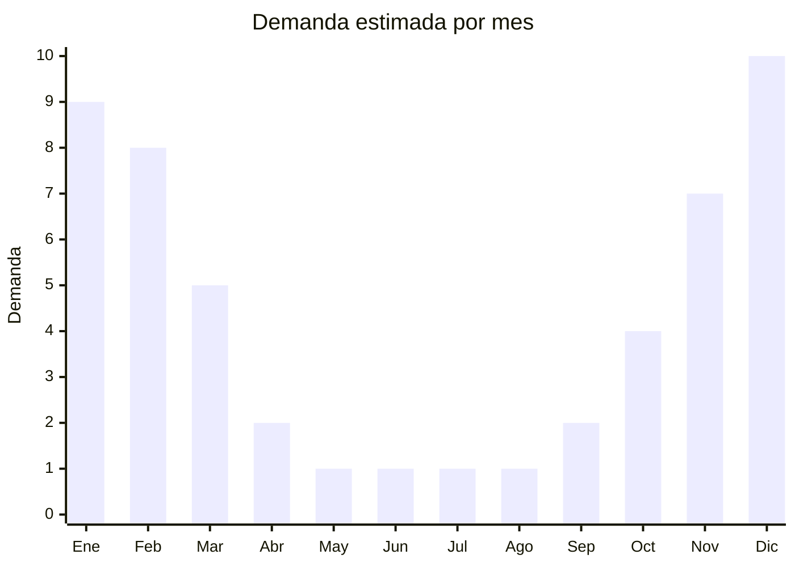

# Velas de Citronella

> **Capitulo NCM 34** — Jabones, ceras y velas | **Temporada:** Verano (Dic-Feb)

## Que es y por que importarlo

Las velas de citronella son velas aromaticas fabricadas con cera (parafina, soja o mezcla) impregnada con aceite esencial de citronella (Cymbopogon nardus o Cymbopogon winterianus), una planta cuyo aroma actua como repelente natural de mosquitos. Se utilizan en exteriores — patios, jardines, terrazas, balcones y campings — para crear una zona de proteccion aromatica contra mosquitos y otros insectos voladores. Se presentan en diversos formatos: latas metalicas pequenas, baldes grandes para exterior, antorchas de jardin, y sets decorativos.

Este producto representa una de las mejores oportunidades para importadores de verano porque, a diferencia de los repelentes de uso humano, las velas de citronella NO requieren registro ante ANMAT. Al no ser un cosmetico (no se aplica sobre la piel) ni un plaguicida domestico (no contiene ingredientes insecticidas quimicos como DEET o piretrinas), las velas de citronella se clasifican simplemente como "velas" bajo la posicion NCM 3406.00.00 y no estan sujetas a controles sanitarios especiales. La barrera de entrada es BAJA, similar a importar cualquier otro producto de decoracion o hogar.

China es el mayor productor mundial de velas, con fabricas concentradas en Zhejiang (Ningbo y Hangzhou) que ofrecen precios FOB desde USD 0.50 por unidad para velas en lata, con MOQ accesibles (desde 200-500 unidades). El margen bruto puede superar el 200% facilmente. La demanda en Argentina esta concentrada entre octubre y marzo, con pico absoluto en diciembre-febrero (temporada de mosquitos y actividades al aire libre). En MercadoLibre hay competencia moderada y no existe una marca dominante en el segmento, lo que abre espacio para nuevos actores.

## Datos clave

| Dato | Valor |
|------|-------|
| **Posiciones NCM tipicas** | 3406.00.00 |
| **Derecho de importacion** | 18% (DIE) + 3% tasa estadistica |
| **Rango FOB tipico** | USD 0.50 — USD 3 por unidad |
| **Precio de venta en Argentina** | ARS 1,500 — ARS 5,000 |
| **Margen bruto estimado** | 200% — 400% |
| **MOQ tipico** | 200 — 1,000 unidades |
| **Demanda en MercadoLibre** | Media (estacional, pico en verano) |
| **Competencia en MercadoLibre** | Moderada (sin marca dominante) |
| **Dificultad para importar** | Baja (sin regulacion ANMAT) |
| **Certificaciones necesarias** | Ninguna especifica (despacho aduanero estandar) |
| **Antidumping** | **No** |

<Note>
**BARRERA DE ENTRADA BAJA.** A diferencia de los otros productos de verano de este capitulo (protectores solares, bronceadores, repelentes), las velas de citronella NO requieren registro ANMAT, SENASA ni ninguna certificacion especial. Solo necesitas el despacho aduanero estandar. Esto las convierte en una excelente opcion para importadores que recien comienzan.
</Note>

## Variantes y subtipos mas comunes

| Subtipo / Variante | FOB aprox. | Venta AR aprox. | Nota |
|--------------------|-----------|-----------------|------|
| Lata metalica pequena (100-150g) | USD 0.50 — 1.50 | ARS 1,500 — 3,000 | Formato mas popular, portatil, ideal para balcon |
| Balde grande exterior (300-500g) | USD 1.50 — 3 | ARS 3,000 — 5,000 | Mayor duracion (8-15 horas), uso en patio/jardin |
| Antorcha jardin con citronella | USD 2 — 5 | ARS 3,500 — 7,000 | Decorativa + funcional, mayor valor percibido |
| Set x3 velas variadas | USD 2 — 4 | ARS 3,500 — 6,000 | Pack combo, mayor ticket promedio |

## Regulaciones y requisitos

<Tabs>
  <Tab title="Certificaciones">
    | Organismo | Requiere | Detalle | Costo aprox. | Tiempo aprox. |
    |-----------|----------|---------|-------------|--------------|
    | ARCA (Aduana) | Si | Despacho de importacion estandar | Variable | — |
    | ANMAT | **No** | No aplica: no es cosmético ni plaguicida | — | — |
    | SENASA | **No** | No se clasifica como plaguicida domestico | — | — |
    | INTI (seguridad) | No obligatorio | No hay norma IRAM especifica para velas de citronella | — | — |

    <Tip>
    Al no requerir certificaciones especiales, el proceso de importacion se simplifica enormemente. El tiempo desde la orden de compra hasta tener el producto disponible para la venta se reduce a solo el tiempo de produccion + envio + despacho aduanero (6-10 semanas en total).
    </Tip>
  </Tab>

  <Tab title="Etiquetado">
    | Requisito | Aplica |
    |-----------|--------|
    | Idioma espanol | Si |
    | Datos del importador | Si |
    | Composicion basica (tipo de cera) | Recomendado |
    | Instrucciones de uso | Si (seguridad contra incendios) |
    | Advertencias de seguridad | Si ("No dejar sin vigilancia", "Mantener lejos de materiales inflamables") |
    | Pais de origen | Si |
    | Duracion estimada de quemado | Recomendado |

    El etiquetado es minimo comparado con cosmeticos. Incluir instrucciones basicas de seguridad contra incendios, datos del importador y pais de origen. Agregar duracion estimada de quemado y area de cobertura (metros cuadrados) como valor agregado para el consumidor.
  </Tab>

  <Tab title="Restricciones">
    - No hay restricciones especificas para velas de citronella
    - Si la vela contiene ingredientes insecticidas quimicos (piretrinas, permetrina), pasaria a clasificarse como plaguicida domestico y requeriria registro SENASA/ANMAT
    - Las velas deben cumplir normas basicas de seguridad contra incendios para su comercializacion
    - No se pueden hacer claims de "repelente de mosquitos" con eficacia comprobada sin estudios que lo respalden — se recomienda usar "vela aromatica con citronella"
    - Ceras con alto contenido de plomo estan prohibidas
  </Tab>
</Tabs>

## Logistica

| Dato | Valor |
|------|-------|
| **Peso tipico por unidad** | 0.15 — 0.50 kg (segun tamano) |
| **Volumen tipico** | Medio |
| **Fragilidad** | Baja (latas metalicas) a Media (vidrio o ceramica) |
| **Envio recomendado** | Maritimo (consolidado o FCL) |
| **Tiempo total estimado** (pedido a deposito) | 6 — 10 semanas (maritimo) |
| **Temperatura** | Evitar exposicion a temperaturas superiores a 50C (la cera puede derretirse) |
| **Requiere empaque especial** | Proteccion basica contra aplastamiento, separadores entre unidades |

<Tip>
Las velas son pesadas para su valor FOB, por lo que el flete maritimo es la unica opcion economicamente viable. Un contenedor de 20 pies puede cargar aproximadamente 10,000-15,000 velas en lata, dependiendo del tamano. Solicitar al proveedor empaque con divisores de carton entre capas para evitar que las latas se abolle. Los principales fabricantes estan en Ningbo y Hangzhou (Zhejiang), que tienen puertos maritimos directos, lo que reduce costos de flete interno en China.
</Tip>

## Estacionalidad



| Aspecto | Detalle |
|---------|---------|
| **Meses pico** | Diciembre — Febrero (verano, mosquitos, actividades al aire libre) |
| **Meses valle** | Mayo — Agosto (invierno, sin mosquitos) |
| **Cuando pedir para llegar a tiempo** | Agosto — Septiembre (considerando 6-10 semanas de envio maritimo) |

## Ventajas y riesgos

<CardGroup cols={2}>
  <Card title="Ventajas" icon="circle-check">
    - Sin regulacion ANMAT ni SENASA: barrera de entrada baja, proceso simple
    - FOB muy bajo (desde USD 0.50/u) con margenes superiores al 200%
    - MOQ accesible (desde 200-500 unidades): ideal para primeras importaciones
    - Sin marca dominante en MercadoLibre: espacio para posicionar marca propia
    - Producto complementario a repelentes: venta cruzada facil
    - Formato decorativo + funcional: doble apelacion al consumidor
  </Card>
  <Card title="Riesgos" icon="triangle-exclamation">
    - Producto pesado para su valor: el flete maritimo impacta el costo final significativamente
    - Demanda 100% estacional: stock no vendido se inmoviliza 6-8 meses
    - Eficacia real del citronella como repelente es limitada (radio de accion pequeno, solo en exteriores)
    - La cera puede derretirse si se almacena en depositos sin control de temperatura en verano
    - Si la temporada de mosquitos es leve, la demanda cae drasticamente
    - Producto fragil si es en envase de vidrio o ceramica
  </Card>
</CardGroup>

## Palabras clave para buscar en Alibaba

```
citronella candle tin, outdoor candle citronella factory, mosquito candle wholesale,
citronella garden candle bucket, soy wax citronella candle OEM,
citronella candle set gift, Ningbo candle manufacturer, anti mosquito candle bulk,
citronella torch candle outdoor, citronella candle private label
```

## Fuentes

- [Nomenclador NCM - ARCA (ex-AFIP)](https://www.arca.gob.ar)
- [MercadoLibre Argentina - Velas Citronella](https://www.mercadolibre.com.ar/vela-citronella)
- [Alibaba - Citronella candle suppliers](https://www.alibaba.com/trade/search?SearchText=citronella+candle+tin)
- [Ministerio de Economia - Arancel externo comun](https://www.argentina.gob.ar/economia)
