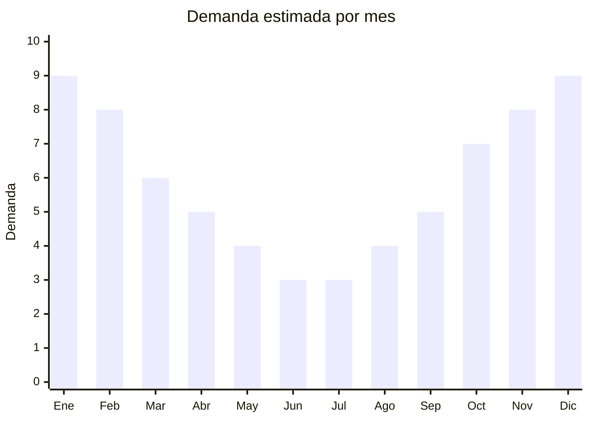

# Botellas deportivas de verano

> **Capítulo NCM 39** — Plástico y sus manufacturas | **Temporada:** Verano (Dic–Feb)

## Qué es y por qué importarlo

Las botellas deportivas de verano son variantes especializadas de las botellas reutilizables que experimentan un pico marcado de demanda durante los meses cálidos. A diferencia de las botellas básicas reutilizables (que son atemporales), estas variantes se caracterizan por funcionalidades específicas para el calor: infusor de frutas para saborizar agua fría, spray nebulizador facial integrado, gran capacidad (1L o más) con marcas motivacionales de hora, y botellas plegables de silicona ideales para playa y viaje.

En verano la actividad deportiva outdoor se multiplica: running, ciclismo, fútbol, tenis, natación y entrenamiento al aire libre generan una demanda puntual de botellas con mayor capacidad y funcionalidades específicas para el calor. Las botellas con infusor de frutas permiten preparar "aguas saborizadas caseras" (limón, pepino, frutos rojos), una tendencia fuerte en redes sociales que impulsa ventas entre público joven y fitness.

China (Yongkang, Zhejiang) es el hub mundial de producción de botellas deportivas de plástico. Los proveedores ofrecen personalización completa (color, logo, capacidad) con MOQ bajos desde 100 unidades. El material Tritan libre de BPA es el estándar de calidad esperado por el consumidor argentino.

<Note>
Las botellas deportivas básicas reutilizables se documentan en la sección [Atemporales — Botellas reutilizables](/app/productos/atemporales/cap-39/botellas-reutilizables). Este archivo cubre específicamente las variantes con demanda estacional de verano que se diferencian por funcionalidades relacionadas al calor.
</Note>

## Datos clave

| Dato | Valor |
|------|-------|
| **Posiciones NCM típicas** | 3924.10.00 (artículos para servicio de mesa/cocina de plástico), 3923.30.00 (botellones/frascos plásticos) |
| **Derecho de importación** | 18% (DIE) + 3% tasa estadística |
| **Rango FOB típico** | USD 0.80 — USD 3.00 por unidad |
| **Precio de venta en Argentina** | ARS 5.000 — ARS 15.000 |
| **Margen bruto estimado** | 200% — 400% |
| **MOQ típico** | 100 — 500 unidades |
| **Demanda en MercadoLibre** | Alta (pico verano) |
| **Competencia en MercadoLibre** | Alta |
| **Dificultad para importar** | Fácil |
| **Certificaciones necesarias** | Recomendable certificación "BPA Free" del proveedor |
| **Antidumping** | No |

## Variantes y subtipos más comunes

| Subtipo / Variante | FOB aprox. | Venta AR aprox. | Nota |
|--------------------|-----------|-----------------|------|
| Botella con infusor de frutas 700ml | USD 1.50 — 3.00 | ARS 7.000 — 13.000 | **Tendencia verano** |
| Botella motivacional con marcas de hora 1L | USD 1.00 — 2.50 | ARS 6.000 — 12.000 | **Más vendido** |
| Shaker deportivo gran capacidad 1.5-2L | USD 1.50 — 3.00 | ARS 8.000 — 15.000 | Gym + outdoor |
| Botella plegable silicona 500-750ml | USD 1.00 — 2.50 | ARS 6.000 — 12.000 | Viajeros, playa |
| Botella con spray nebulizador | USD 1.50 — 3.00 | ARS 7.000 — 14.000 | Novedad verano |

## Regulaciones y requisitos

<Tabs>
  <Tab title="Certificaciones">
    | Organismo | Requiere | Detalle |
    |-----------|----------|---------|
    | ARCA (Aduana) | Sí siempre | Despacho estándar |
    | ANMAT | No obligatorio | Idealmente tener certificado "Food Grade" del proveedor |
    | ENACOM | No | No es electrónico |

    **Recomendación:** Solicitar al proveedor certificado de material "BPA Free" y "Food Grade" (test FDA o equivalente). Es un argumento de venta clave, especialmente para las botellas con infusor donde el agua tiene contacto prolongado con el plástico interior.
  </Tab>

  <Tab title="Etiquetado">
    | Requisito | Aplica |
    |-----------|--------|
    | Idioma español | Sí |
    | Datos del importador | Sí |
    | Composición / materiales | Sí ("Tritan libre de BPA", "Silicona food grade") |
    | Capacidad en ml | Sí |
    | Instrucciones de limpieza | Recomendado |
    | País de origen | Sí |
    | Garantía legal 6 meses | Sí |
  </Tab>

  <Tab title="Restricciones">
    Sin restricciones especiales. No hay antidumping ni licencias previas.

    **Atención:** Las botellas con spray nebulizador usan un mecanismo de presión manual simple (no aerosol). No clasifican como envase a presión ni requieren regulación especial.
  </Tab>
</Tabs>

## Logística

| Dato | Valor |
|------|-------|
| **Peso típico por unidad** | 0.10 — 0.35 kg |
| **Volumen típico** | Medio (botellas son huecas, volumen mayor que su peso) |
| **Fragilidad** | Baja (Tritan, PP y silicona son resistentes) |
| **Envío recomendado** | Marítimo LCL |
| **Tiempo total estimado** | 45 — 75 días (marítimo) |
| **Baterías de litio** | No |
| **Requiere empaque especial** | No |

<Tip>
Armar **kits de verano** combinando botellas con infusor + botella motivacional + shaker en un packaging atractivo. Los kits tienen mayor ticket promedio y se venden bien como regalos en diciembre (Navidad/Fin de Año). En MercadoLibre, las publicaciones con kits tienen mejor conversión que las unidades sueltas.
</Tip>

## Estacionalidad



| Aspecto | Detalle |
|---------|---------|
| **Meses pico** | Noviembre-Febrero (verano, actividad deportiva outdoor, hidratación) |
| **Meses valle** | Mayo-Julio (invierno, menor actividad al aire libre) |
| **Cuándo pedir** | Agosto para tener stock en noviembre (inicio temporada + regalos Navidad) |

## Ventajas y riesgos

<CardGroup cols={2}>
  <Card title="Ventajas" icon="circle-check">
    - Alto margen (200-400%)
    - Producto liviano, flete económico
    - Sin regulación compleja
    - Múltiples variantes para diferenciarse
    - Ideal para marca propia y kits combo
  </Card>
  <Card title="Riesgos" icon="triangle-exclamation">
    - Competencia alta con precios agresivos
    - Fugas en tapas = devoluciones (verificar hermeticidad)
    - Infusores de baja calidad se rompen/manchan
    - Spray nebulizador puede fallar con uso intenso
    - Estacionalidad: stock remanente pierde impulso post-verano
  </Card>
</CardGroup>

## Palabras clave para buscar en Alibaba

```
fruit infuser water bottle wholesale, motivational water bottle time marker,
spray mist water bottle sport, collapsible silicone water bottle,
large capacity sports bottle 1.5L, BPA free Tritan bottle summer,
water bottle with fruit infuser 700ml, gym shaker bottle large
```

## Fuentes

- [MercadoLibre Argentina — Botellas deportivas con infusor](https://listado.mercadolibre.com.ar/botella-infusor-frutas)
- [Alibaba — Fruit infuser water bottle](https://www.alibaba.com/showroom/fruit-infuser-water-bottle.html)
