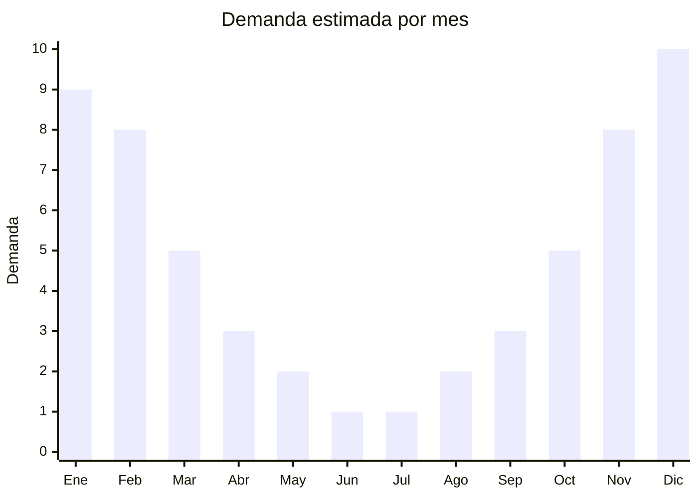

# Conservadoras y heladeritas portátiles

> **Capítulo NCM 39** — Plástico y sus manufacturas | **Temporada:** Verano (Dic–Feb)

## Qué es y por qué importarlo

Las conservadoras portátiles (también llamadas heladeritas, coolers o neveras portátiles) son recipientes térmicos de plástico con aislamiento de poliuretano o poliestireno expandido, diseñados para mantener bebidas y alimentos fríos durante horas. Son un producto esencial para actividades al aire libre: playa, camping, picnics, asados y viajes en auto. En Argentina, donde el verano se vive intensamente al aire libre, la demanda de conservadoras se dispara entre noviembre y febrero.

El mercado argentino ofrece desde modelos personales de 5 litros (ideales para llevar al trabajo o la playa individual) hasta grandes coolers de 45 litros con ruedas para camping familiar. China concentra la producción mundial de conservadoras plásticas, con fábricas en Taizhou (Zhejiang) y Guangdong que fabrican para marcas globales como Coleman, Igloo y marcas blancas. Los modelos genéricos chinos ofrecen prestaciones similares a las marcas premium a una fracción del costo FOB.

La ventaja de importar conservadoras es que no requieren certificaciones especiales (no hay contacto directo con alimentos si se usan con bolsas de hielo), el producto es robusto y resistente al transporte, y los márgenes son atractivos especialmente en temporada alta. El principal desafío es el volumen: las conservadoras son productos huecos que ocupan mucho espacio (alto CBM) en relación a su peso.

## Datos clave

| Dato | Valor |
|------|-------|
| **Posiciones NCM típicas** | 3923.10.90 (cajas, cajones y recipientes similares de plástico), 3924.10.00 (artículos para servicio de mesa/cocina de plástico) |
| **Derecho de importación** | 18% (DIE) + 3% tasa estadística |
| **Rango FOB típico** | USD 3.00 — USD 15.00 por unidad (según tamaño 5-45L) |
| **Precio de venta en Argentina** | ARS 15.000 — ARS 60.000 |
| **Margen bruto estimado** | 150% — 300% |
| **MOQ típico** | 100 — 500 unidades |
| **Demanda en MercadoLibre** | Muy Alta (estacional) |
| **Competencia en MercadoLibre** | Media-Alta |
| **Dificultad para importar** | Fácil-Media (volumen alto) |
| **Certificaciones necesarias** | No requiere certificaciones especiales |
| **Antidumping** | No |

## Variantes y subtipos más comunes

| Subtipo / Variante | FOB aprox. | Venta AR aprox. | Nota |
|--------------------|-----------|-----------------|------|
| Cooler personal 5L | USD 3.00 — 5.00 | ARS 15.000 — 22.000 | Playa individual, almuerzo |
| Cooler familiar 15L | USD 5.00 — 8.00 | ARS 22.000 — 35.000 | **Más vendido** |
| Cooler camping 28L | USD 8.00 — 12.00 | ARS 35.000 — 50.000 | Camping/pesca |
| Cooler gran capacidad 45L | USD 12.00 — 15.00 | ARS 50.000 — 60.000 | Eventos, familias grandes |
| Cooler con ruedas 28-45L | USD 10.00 — 18.00 | ARS 40.000 — 70.000 | Premium, fácil transporte |

## Regulaciones y requisitos

<Tabs>
  <Tab title="Certificaciones">
    | Organismo | Requiere | Detalle |
    |-----------|----------|---------|
    | ARCA (Aduana) | Sí siempre | Despacho estándar |
    | ANMAT | No | No hay contacto directo con alimentos (se usan con bolsas/hielo) |
    | ENACOM | No | No es electrónico |
    | SENASA | No | No aplica |

    **Recomendación:** Si bien no es obligatorio, solicitar al proveedor certificado de material "food grade" para el interior de la conservadora refuerza la confianza del comprador. Los modelos con aislamiento de poliuretano inyectado mantienen mejor la temperatura que los de poliestireno expandido.
  </Tab>

  <Tab title="Etiquetado">
    | Requisito | Aplica |
    |-----------|--------|
    | Idioma español | Sí |
    | Datos del importador | Sí |
    | Composición / materiales | Sí (indicar tipo de plástico exterior e interior) |
    | Capacidad en litros | Sí |
    | País de origen | Sí |
    | Garantía legal 6 meses | Sí |
    | Instrucciones de uso | Recomendado |
  </Tab>

  <Tab title="Restricciones">
    Sin restricciones especiales de importación. No hay antidumping ni licencias previas para conservadoras plásticas.

    **Atención:** Si la conservadora incluye baterías (ej: cooler eléctrico 12V) clasifica diferente y puede requerir intervención de ENACOM. Las conservadoras pasivas (sin electricidad) no tienen restricción alguna.
  </Tab>
</Tabs>

## Logística

| Dato | Valor |
|------|-------|
| **Peso típico por unidad** | 0.8 — 4.0 kg (según tamaño) |
| **Volumen típico** | Alto (productos huecos, gran CBM) |
| **Fragilidad** | Baja (plástico resistente a impactos) |
| **Envío recomendado** | Marítimo LCL o FCL según volumen |
| **Tiempo total estimado** | 50 — 80 días (marítimo) |
| **Baterías de litio** | No (modelos pasivos) |
| **Requiere empaque especial** | No |

<Tip>
Negociar con el proveedor que las conservadoras se envíen **anidadas** (una dentro de otra) para reducir el CBM total hasta un 40%. Los modelos de 5L caben dentro de los de 15L, y estos dentro de los de 28L. Esto puede significar la diferencia entre un LCL y un FCL.
</Tip>

## Estacionalidad



| Aspecto | Detalle |
|---------|---------|
| **Meses pico** | Noviembre-Febrero (verano, vacaciones, playa, camping) |
| **Meses valle** | Mayo-Agosto (invierno, sin uso outdoor) |
| **Cuándo pedir** | Julio-Agosto para tener stock en noviembre (inicio temporada) |

## Ventajas y riesgos

<CardGroup cols={2}>
  <Card title="Ventajas" icon="circle-check">
    - Demanda masiva y predecible en verano
    - Sin barreras regulatorias
    - Producto robusto, no se rompe en transporte
    - Ideal para marca propia (serigrafía/sticker)
    - Compra recurrente (se deterioran, se pierden, se regalan)
  </Card>
  <Card title="Riesgos" icon="triangle-exclamation">
    - Muy estacional: stock no vendido queda hasta siguiente verano
    - Alto CBM en relación al peso (flete costoso)
    - Competencia con marcas posicionadas (Mor, Coleman)
    - Calidad del aislamiento variable (verificar retención de frío)
    - Tapas y cierres pueden ser punto débil
  </Card>
</CardGroup>

## Palabras clave para buscar en Alibaba

```
portable cooler box wholesale, ice chest plastic cooler, camping cooler box,
beach cooler box, insulated cooler box PU foam, plastic ice box picnic,
cooler box with wheels wholesale, mini cooler box 5L personal
```

## Fuentes

- [MercadoLibre Argentina — Conservadoras portátiles](https://listado.mercadolibre.com.ar/conservadora-portatil)
- [Alibaba — Portable cooler box wholesale](https://www.alibaba.com/showroom/portable-cooler-box.html)
