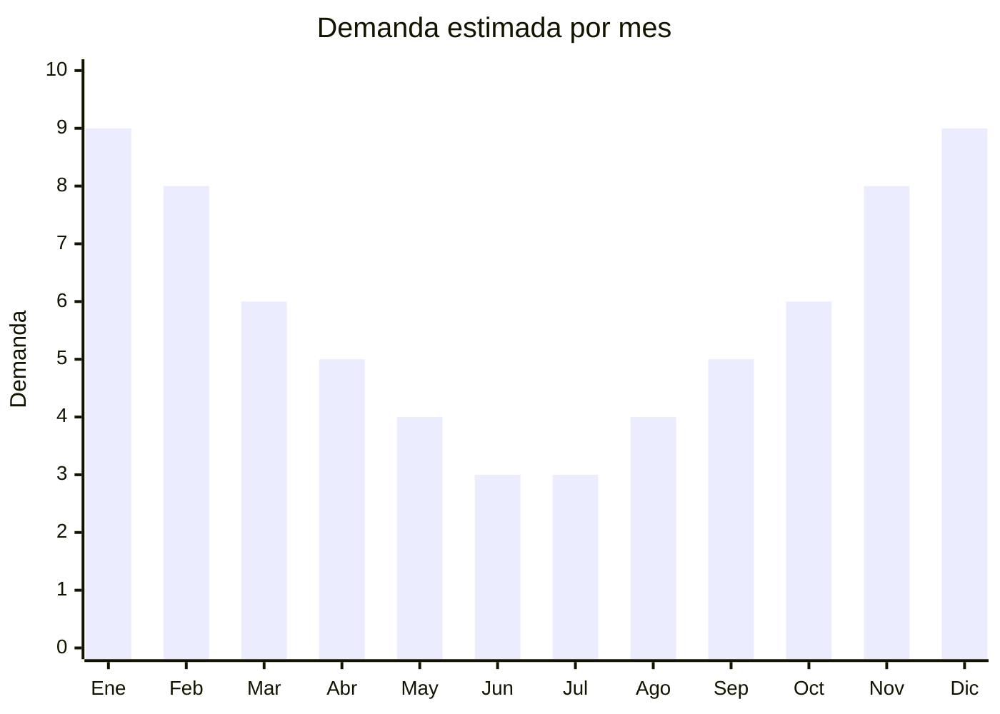

# Dispensers y bidones de agua

> **Capítulo NCM 39** — Plástico y sus manufacturas | **Temporada:** Verano (Dic–Feb)

## Qué es y por qué importarlo

Los dispensers de agua de plástico abarcan dispensers de mesa para bidón (tipo bomba manual o soporte), porta-bidones para heladera, jarras con filtro integrado y dispensers con grifo para bebidas (tipo garrafa de eventos). En verano, el consumo de agua se multiplica: el calor argentino con temperaturas que superan los 35°C genera una necesidad constante de hidratación accesible en hogares, oficinas y eventos al aire libre.

El producto más vendido es el dispenser de mesa con bomba manual para bidones de 10-20 litros, que permite servir agua sin levantar el bidón pesado. Las jarras con filtro tipo Brita (genéricas) están en crecimiento como alternativa al agua embotellada, especialmente en ciudades donde el agua de red tiene sabor a cloro. Los dispensers con grifo para bebidas son populares para eventos, fiestas de verano y gastronomía.

China (especialmente Shantou y Ningbo) produce la mayor parte de los dispensers plásticos del mundo, con precios FOB muy competitivos que permiten márgenes atractivos en Argentina. La importación es sencilla: no requiere certificaciones complejas, el producto es liviano y los volúmenes son manejables.

## Datos clave

| Dato | Valor |
|------|-------|
| **Posiciones NCM típicas** | 3924.10.00 (artículos para servicio de mesa o cocina, de plástico) |
| **Derecho de importación** | 18% (DIE) + 3% tasa estadística |
| **Rango FOB típico** | USD 2.00 — USD 8.00 por unidad |
| **Precio de venta en Argentina** | ARS 5.000 — ARS 20.000 |
| **Margen bruto estimado** | 150% — 250% |
| **MOQ típico** | 200 — 1,000 unidades |
| **Demanda en MercadoLibre** | Alta (estacional) |
| **Competencia en MercadoLibre** | Media |
| **Dificultad para importar** | Fácil |
| **Certificaciones necesarias** | Recomendable certificado "Food Grade" del proveedor |
| **Antidumping** | No |

## Variantes y subtipos más comunes

| Subtipo / Variante | FOB aprox. | Venta AR aprox. | Nota |
|--------------------|-----------|-----------------|------|
| Dispenser de mesa para bidón 10-20L (bomba manual) | USD 2.00 — 4.00 | ARS 5.000 — 12.000 | **Más vendido** |
| Porta-bidón para heladera | USD 2.00 — 3.50 | ARS 5.000 — 10.000 | Práctico para espacios chicos |
| Jarra con filtro tipo Brita (genérica) | USD 3.00 — 6.00 | ARS 8.000 — 18.000 | Tendencia eco/salud |
| Dispenser con grifo para bebidas (3-8L) | USD 4.00 — 8.00 | ARS 10.000 — 20.000 | Eventos y fiestas |

## Regulaciones y requisitos

<Tabs>
  <Tab title="Certificaciones">
    | Organismo | Requiere | Detalle |
    |-----------|----------|---------|
    | ARCA (Aduana) | Sí siempre | Despacho estándar |
    | ANMAT | No obligatorio | Recomendable tener certificado "Food Grade" del proveedor para partes en contacto con agua |
    | ENACOM | No | No es electrónico (modelos sin bomba eléctrica) |

    **Recomendación:** Solicitar al proveedor certificado de material apto para contacto con alimentos/agua (FDA o equivalente). Las jarras con filtro deben incluir especificaciones del filtro (carbón activado, vida útil).
  </Tab>

  <Tab title="Etiquetado">
    | Requisito | Aplica |
    |-----------|--------|
    | Idioma español | Sí |
    | Datos del importador | Sí |
    | Composición / materiales | Sí ("PP grado alimentario", "libre de BPA") |
    | Capacidad en litros | Sí |
    | Instrucciones de uso | Sí |
    | País de origen | Sí |
    | Garantía legal 6 meses | Sí |
  </Tab>

  <Tab title="Restricciones">
    Sin restricciones especiales. No hay antidumping ni licencias previas.

    **Atención:** Los dispensers eléctricos (con bomba eléctrica USB o a pilas) podrían requerir intervención de ENACOM. Verificar la clasificación arancelaria si incluyen componente eléctrico. Los modelos manuales no tienen restricción alguna.
  </Tab>
</Tabs>

## Logística

| Dato | Valor |
|------|-------|
| **Peso típico por unidad** | 0.3 — 1.5 kg |
| **Volumen típico** | Medio (dispensers son huecos pero apilables) |
| **Fragilidad** | Baja (plástico resistente) |
| **Envío recomendado** | Marítimo LCL |
| **Tiempo total estimado** | 45 — 75 días (marítimo) |
| **Baterías de litio** | No (modelos manuales) |
| **Requiere empaque especial** | No |

<Tip>
Las **jarras con filtro** tienen un modelo de negocio recurrente: se vende la jarra a precio competitivo y se gana con la **venta de repuestos de filtro** (cada 2-3 meses el usuario necesita un filtro nuevo). Importar jarras + stock de filtros de repuesto genera ingresos continuos más allá de la temporada de verano.
</Tip>

## Estacionalidad



| Aspecto | Detalle |
|---------|---------|
| **Meses pico** | Noviembre-Febrero (calor intenso, mayor consumo de agua) |
| **Meses valle** | Junio-Julio (invierno, menor consumo de agua fría) |
| **Cuándo pedir** | Agosto-Septiembre para tener stock en noviembre |

## Ventajas y riesgos

<CardGroup cols={2}>
  <Card title="Ventajas" icon="circle-check">
    - Demanda creciente por tendencia salud e hidratación
    - Sin regulación compleja
    - Producto liviano, flete económico
    - Modelo de negocio recurrente (filtros de repuesto)
    - Baja competencia de marcas premium
  </Card>
  <Card title="Riesgos" icon="triangle-exclamation">
    - Material de baja calidad puede dar sabor/olor al agua
    - Bombas manuales de baja calidad se rompen rápido
    - Jarras con filtro compiten con marcas como Brita (percepción)
    - Estacionalidad moderada (menos marcada que piletas)
  </Card>
</CardGroup>

## Palabras clave para buscar en Alibaba

```
water dispenser plastic manual pump, water jug dispenser desk,
water filter pitcher wholesale, beverage dispenser with tap plastic,
water bottle pump dispenser, fridge water jug with tap, water cooler manual
```

## Fuentes

- [MercadoLibre Argentina — Dispensers de agua](https://listado.mercadolibre.com.ar/dispenser-agua-plastico)
- [Alibaba — Water dispenser plastic wholesale](https://www.alibaba.com/showroom/plastic-water-dispenser.html)
