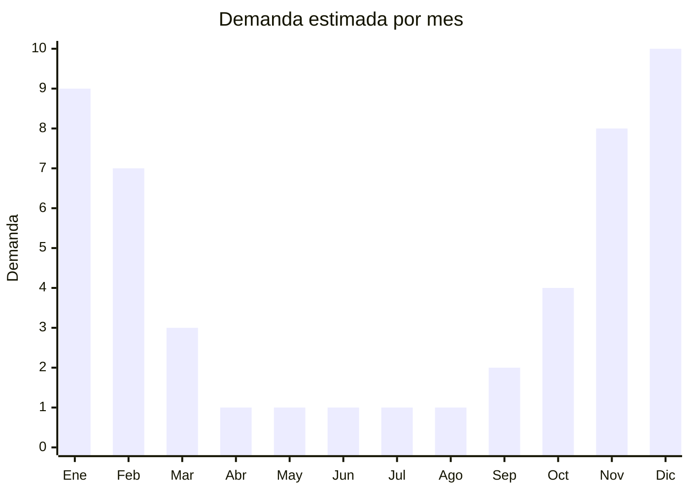

# Juguetes de agua plásticos

> **Capítulo NCM 39** — Plástico y sus manufacturas | **Temporada:** Verano (Dic–Feb)

## Qué es y por qué importarlo

Los juguetes de agua plásticos incluyen pistolas de agua (desde modelos básicos hasta tipo Super Soaker de gran alcance), rociadores de jardín infantiles, regaderas de juguete, sets de juguetes para baño/pileta, y splash pads (alfombras acuáticas con chorros para jardín). Son productos 100% estacionales con demanda concentrada exclusivamente en los meses de verano (diciembre a febrero en Argentina), con un pico fuerte en la temporada navideña cuando se regalan para las vacaciones de verano.

El mercado de juguetes de agua en Argentina es masivo: cada familia con niños compra al menos un juguete de agua por temporada. Las pistolas de agua tipo Super Soaker son un clásico que no pasa de moda, mientras que los splash pads (alfombras con chorros de agua para conectar a la manguera del jardín) son tendencia creciente importada de Estados Unidos que está ganando tracción en Argentina. Los rociadores con formas de animales o personajes son otro segmento con alta rotación.

China (Shantou, Guangdong — conocida como la "capital del juguete") concentra la producción mundial de juguetes de agua. Los precios FOB son extremadamente competitivos (desde USD 1 por unidad) y los márgenes en Argentina son muy atractivos. El principal requisito regulatorio es la certificación IRAM 3583 obligatoria para juguetes destinados a menores de 14 años, que debe gestionarse antes de la importación.

<Warning>
**Certificación IRAM 3583 obligatoria** para juguetes destinados a menores de 14 años. Sin este certificado, la Aduana no liberará la mercadería. El trámite toma 30-60 días y tiene un costo de aproximadamente USD 500-1,500 por modelo. Planificar con anticipación.
</Warning>

## Datos clave

| Dato | Valor |
|------|-------|
| **Posiciones NCM típicas** | 9503.00.99 (juguetes diversos) — puede clasificar Cap. 39 (3926.90) o Cap. 95 según composición y función |
| **Derecho de importación** | 20% (DIE) + 3% tasa estadística |
| **Rango FOB típico** | USD 1.00 — USD 5.00 por unidad |
| **Precio de venta en Argentina** | ARS 3.000 — ARS 15.000 |
| **Margen bruto estimado** | 200% — 400% |
| **MOQ típico** | 200 — 1,000 unidades |
| **Demanda en MercadoLibre** | Muy Alta (100% estacional) |
| **Competencia en MercadoLibre** | Alta |
| **Dificultad para importar** | Media (requiere IRAM) |
| **Certificaciones necesarias** | **IRAM 3583 obligatoria** si menores de 14 años |
| **Antidumping** | No |

## Variantes y subtipos más comunes

| Subtipo / Variante | FOB aprox. | Venta AR aprox. | Nota |
|--------------------|-----------|-----------------|------|
| Pistola de agua básica (30-40cm) | USD 1.00 — 2.00 | ARS 3.000 — 6.000 | Alta rotación, compra impulsiva |
| Pistola de agua tipo Super Soaker (50cm+) | USD 2.50 — 5.00 | ARS 8.000 — 15.000 | **Más vendido** |
| Rociador de jardín infantil (forma animal) | USD 2.00 — 4.00 | ARS 5.000 — 12.000 | Tendencia creciente |
| Set juguetes de baño/pileta (5-10 pcs) | USD 1.50 — 3.00 | ARS 4.000 — 10.000 | Público bebés/niños |
| Splash pad (alfombra acuática jardín) | USD 3.00 — 6.00 | ARS 8.000 — 18.000 | Novedad en Argentina |

## Regulaciones y requisitos

<Tabs>
  <Tab title="Certificaciones">
    | Organismo | Requiere | Detalle |
    |-----------|----------|---------|
    | ARCA (Aduana) | Sí siempre | Despacho con canal verificación por ser juguete |
    | IRAM 3583 | **Sí, obligatorio** | Seguridad de juguetes para menores de 14 años |
    | ANMAT | No | No aplica |
    | ENACOM | No | No es electrónico (modelos sin pilas) |

    **Proceso IRAM 3583:** Enviar muestras a laboratorio acreditado IRAM en Argentina. Se verifica: materiales no tóxicos, partes pequeñas (riesgo asfixia), bordes cortantes, resistencia mecánica. Costo aproximado: USD 500 — USD 1,500 por modelo. Tiempo: 30-60 días.
  </Tab>

  <Tab title="Etiquetado">
    | Requisito | Aplica |
    |-----------|--------|
    | Idioma español | Sí |
    | Datos del importador | Sí |
    | Rango de edad recomendado | **Sí, obligatorio** |
    | Advertencias de seguridad | **Sí, obligatorio** ("No apto menores de 3 años" si corresponde) |
    | Composición / materiales | Sí |
    | País de origen | Sí |
    | Sello IRAM | Sí, en el packaging |
    | Garantía legal 6 meses | Sí |
  </Tab>

  <Tab title="Restricciones">
    **Restricción principal:** Certificación IRAM 3583 obligatoria para juguetes destinados a menores de 14 años. Sin certificación, la Aduana retiene la mercadería.

    **Partes pequeñas:** Juguetes con piezas menores a 3cm no deben comercializarse para menores de 3 años. Verificar con el proveedor el cumplimiento antes de iniciar el trámite IRAM.

    **Juguetes con pilas:** Si el juguete incluye luces LED o sonido (a pilas), también requiere intervención de ENACOM. Preferir modelos sin componente eléctrico para simplificar la importación.
  </Tab>
</Tabs>

## Logística

| Dato | Valor |
|------|-------|
| **Peso típico por unidad** | 0.15 — 0.50 kg |
| **Volumen típico** | Bajo-Medio (packaging irregular por formas variadas) |
| **Fragilidad** | Baja (plástico resistente) |
| **Envío recomendado** | Marítimo LCL |
| **Tiempo total estimado** | 60 — 90 días (marítimo + trámite IRAM) |
| **Baterías de litio** | No (modelos manuales) |
| **Requiere empaque especial** | No |

<Tip>
Iniciar el trámite IRAM en **mayo-junio** (enviando muestras por courier) para tener la certificación lista antes de agosto. Luego hacer el pedido grande en agosto para que llegue en octubre-noviembre, justo antes de la temporada. No subestimar los tiempos de certificación IRAM: un retraso puede significar perder toda la temporada.
</Tip>

## Estacionalidad



| Aspecto | Detalle |
|---------|---------|
| **Meses pico** | Diciembre (regalos Navidad) y Enero (uso pleno vacaciones verano) |
| **Meses valle** | Abril-Septiembre (sin demanda, producto 100% estacional) |
| **Cuándo pedir** | Agosto-Septiembre (con IRAM ya aprobado) para stock en noviembre |

## Ventajas y riesgos

<CardGroup cols={2}>
  <Card title="Ventajas" icon="circle-check">
    - Márgenes muy altos (200-400%)
    - Producto liviano, flete económico
    - Demanda predecible y masiva en verano
    - Compra impulsiva (bajo ticket, decisión rápida)
    - Splash pads como novedad con poca competencia
  </Card>
  <Card title="Riesgos" icon="triangle-exclamation">
    - **IRAM 3583 obligatorio** (costo y tiempo)
    - 100% estacional: stock no vendido queda un año
    - Competencia con juguetes nacionales (Ditoys, etc.)
    - Pistolas de agua económicas pueden tener fugas
    - Packaging puede dañarse en transporte marítimo
  </Card>
</CardGroup>

## Palabras clave para buscar en Alibaba

```
water gun toy wholesale, super soaker water gun, water sprinkler toy kids,
splash pad mat wholesale, bath toys set wholesale, garden sprinkler kids,
water pistol plastic toy, water play toys summer, water blaster gun
```

## Fuentes

- [MercadoLibre Argentina — Pistolas de agua juguetes](https://listado.mercadolibre.com.ar/pistola-agua-juguete)
- [Alibaba — Water gun toy wholesale](https://www.alibaba.com/showroom/water-gun-toy.html)
- [IRAM — Norma IRAM 3583 Seguridad de juguetes](https://www.iram.org.ar)
