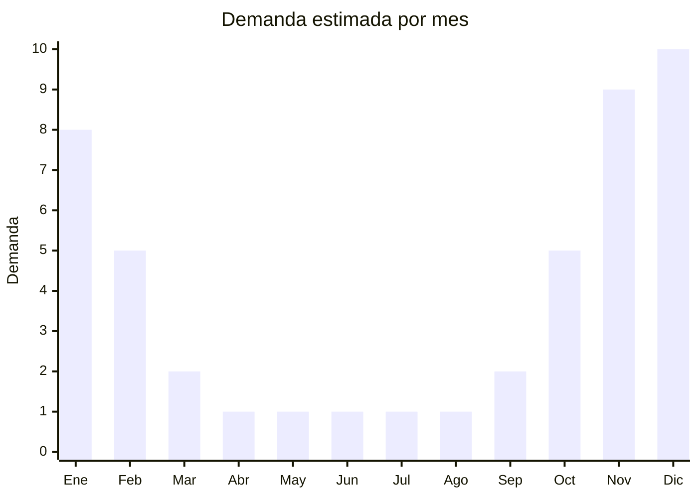

# Piletas plásticas (inflables y estructurales)

> **Capítulo NCM 39** — Plástico y sus manufacturas | **Temporada:** Verano (Dic–Feb)

## Qué es y por qué importarlo

Las piletas plásticas son EL producto estrella del verano argentino. Abarcan piletas inflables (de PVC con anillos de aire), piletas estructurales de lona (con estructura metálica y liner de PVC) y piletas infantiles con accesorios (tobogán, rociador). En un país donde millones de hogares tienen patio o terraza pero no pileta fija de material, las piletas plásticas son la solución accesible para combatir el calor veraniego. El mercado es masivo: se estiman ventas de cientos de miles de unidades por temporada en Argentina.

Bestway (marca del grupo chino Jilong) e Intex (marca estadounidense fabricada en China) dominan el mercado mundial y argentino de piletas plásticas. Sin embargo, hay espacio para marcas genéricas y marcas propias en segmentos de menor tamaño (infantiles, piletas de hasta 1000 litros) donde el consumidor prioriza precio sobre marca. Las piletas estructurales de lona de 3000-5000 litros son las más vendidas en Argentina para uso familiar, seguidas por las inflables infantiles con diseños atractivos.

La importación de piletas tiene una particularidad fundamental: son productos extremadamente voluminosos. Una pileta estructural de 3000 litros empacada ocupa un volumen considerable y solo es viable económicamente en contenedor completo (FCL). Esto implica una inversión inicial mayor pero márgenes brutos que pueden superar el 100-200% en plena temporada.

<Warning>
**MUY VOLUMINOSO — SOLO FCL.** Las piletas plásticas tienen un ratio CBM/peso muy alto (mucho volumen, poco peso). Un contenedor de 40' HC puede transportar aproximadamente 200-400 piletas según tamaño. La inversión inicial es significativa (USD 10,000-30,000 por FCL). No es un producto para principiantes.
</Warning>

## Datos clave

| Dato | Valor |
|------|-------|
| **Posiciones NCM típicas** | 3926.90.90 (manufacturas diversas de plástico), 9506.29.00 (artículos para deportes acuáticos) |
| **Derecho de importación** | 18-20% (DIE) + 3% tasa estadística |
| **Rango FOB típico** | USD 15.00 — USD 80.00 por unidad (según tamaño) |
| **Precio de venta en Argentina** | ARS 50.000 — ARS 300.000+ |
| **Margen bruto estimado** | 100% — 200% |
| **MOQ típico** | 100 — 500 unidades (FCL obligatorio) |
| **Demanda en MercadoLibre** | Masiva (estacional) |
| **Competencia en MercadoLibre** | Alta (Bestway, Intex dominan) |
| **Dificultad para importar** | Media-Alta (volumen, inversión, logística) |
| **Certificaciones necesarias** | IRAM si infantil (menores de 14 años) |
| **Antidumping** | No |

## Variantes y subtipos más comunes

| Subtipo / Variante | FOB aprox. | Venta AR aprox. | Nota |
|--------------------|-----------|-----------------|------|
| Inflable redonda 3m (tipo Bestway Fast Set) | USD 15.00 — 25.00 | ARS 50.000 — 90.000 | Entrada familiar |
| Estructural lona 1000L (2.4m x 1.5m) | USD 20.00 — 35.00 | ARS 70.000 — 120.000 | Popular departamentos |
| Estructural lona 4000L (3m x 2m x 0.75m) | USD 40.00 — 60.00 | ARS 150.000 — 250.000 | **Más vendido** familiar |
| Inflable infantil con tobogán/rociador | USD 20.00 — 40.00 | ARS 60.000 — 150.000 | Requiere IRAM |
| Kit pileta + bomba filtrante + cobertor | USD 50.00 — 80.00 | ARS 200.000 — 300.000+ | Mayor ticket, premium |

## Regulaciones y requisitos

<Tabs>
  <Tab title="Certificaciones">
    | Organismo | Requiere | Detalle |
    |-----------|----------|---------|
    | ARCA (Aduana) | Sí siempre | Despacho con posible verificación por volumen |
    | IRAM 3583 | **Sí, si es para menores de 14** | Piletas infantiles con tobogán/accesorios |
    | ANMAT | No | No aplica |
    | ENACOM | No | No es electrónico (la bomba filtrante puede requerir si es eléctrica) |

    **Recomendación:** Las piletas adultas/familiares (sin indicación de rango de edad infantil) no requieren IRAM. Las piletas explícitamente infantiles (con diseños para niños, tobogán, etc.) sí lo requieren. Consultar con despachante de aduanas la clasificación exacta antes de importar.
  </Tab>

  <Tab title="Etiquetado">
    | Requisito | Aplica |
    |-----------|--------|
    | Idioma español | Sí |
    | Datos del importador | Sí |
    | Capacidad en litros | Sí |
    | Dimensiones | Sí |
    | Instrucciones de armado | Sí (detalladas, con diagramas) |
    | Advertencias de seguridad | Sí ("No dejar niños sin supervisión") |
    | Composición / materiales | Sí (PVC, estructura metálica) |
    | País de origen | Sí |
    | Garantía legal 6 meses | Sí |
  </Tab>

  <Tab title="Restricciones">
    No hay restricciones de importación específicas ni antidumping para piletas plásticas.

    **Consideraciones importantes:**
    - Las **bombas filtrantes eléctricas** que se incluyen en kits pueden requerir intervención de ENACOM y verificar tensión (220V Argentina)
    - Las piletas infantiles caen bajo la norma IRAM 3583 de seguridad de juguetes
    - El PVC debe ser libre de ftalatos (verificar con el proveedor)
    - No hay licencias previas de importación
  </Tab>
</Tabs>

## Logística

| Dato | Valor |
|------|-------|
| **Peso típico por unidad** | 5 — 30 kg (según tamaño y estructura) |
| **Volumen típico** | **Muy Alto** (producto extremadamente voluminoso empacado) |
| **Fragilidad** | Baja (PVC enrollado, estructura metálica empacada) |
| **Envío recomendado** | **Marítimo FCL obligatorio** (40' o 40' HC) |
| **Tiempo total estimado** | 60 — 90 días (marítimo FCL) |
| **Baterías de litio** | No |
| **Requiere empaque especial** | No, pero cajas deben ser resistentes |

<Tip>
Combinar piletas con **accesorios** en el mismo contenedor para maximizar el uso del espacio: bombas filtrantes, cobertores solares, kits de limpieza, escaleras, lonas de piso. Los accesorios tienen menor volumen y mayor margen porcentual, y se venden como complemento natural de la pileta. Un FCL mixto (piletas + accesorios) puede ser más rentable que uno solo de piletas.
</Tip>

## Estacionalidad



| Aspecto | Detalle |
|---------|---------|
| **Meses pico** | Noviembre-Diciembre (compra anticipada + Navidad) y Enero (uso pleno) |
| **Meses valle** | Abril-Agosto (cero demanda, producto 100% estacional) |
| **Cuándo pedir** | Junio-Julio para que el FCL llegue en septiembre-octubre, con stock listo para noviembre |

## Ventajas y riesgos

<CardGroup cols={2}>
  <Card title="Ventajas" icon="circle-check">
    - Demanda masiva y predecible en verano
    - Producto estrella del mercado estacional argentino
    - Márgenes 100-200% en temporada alta
    - Kit pileta+accesorios sube el ticket promedio
    - Mercado enorme con espacio para marcas propias (segmentos chicos)
  </Card>
  <Card title="Riesgos" icon="triangle-exclamation">
    - **Inversión inicial alta** (FCL obligatorio, USD 10,000-30,000+)
    - Stock no vendido queda un año entero
    - Bestway e Intex dominan con marca fuerte
    - Reclamos por pinchazos/fugas en PVC de baja calidad
    - Bombas filtrantes pueden fallar (garantía compleja)
    - Almacenamiento voluminoso fuera de temporada
  </Card>
</CardGroup>

<Warning>
**No apto para importadores principiantes.** Las piletas requieren inversión significativa (FCL completo), gestión de garantía (pinchazos, bombas), espacio de almacenamiento considerable y capital de trabajo para absorber stock fuera de temporada. Recomendado para importadores con experiencia y canal de venta establecido.
</Warning>

## Palabras clave para buscar en Alibaba

```
inflatable swimming pool wholesale, frame pool PVC wholesale,
above ground swimming pool, children inflatable pool slide,
pool filter pump set, steel frame pool 3000L, PVC pool liner,
portable swimming pool family, Bestway pool OEM, splash pool kids
```

## Fuentes

- [MercadoLibre Argentina — Piletas plásticas inflables y estructurales](https://listado.mercadolibre.com.ar/pileta-plastica)
- [Alibaba — Swimming pool wholesale](https://www.alibaba.com/showroom/swimming-pool-wholesale.html)
- [IRAM — Norma IRAM 3583 Seguridad de juguetes](https://www.iram.org.ar)
