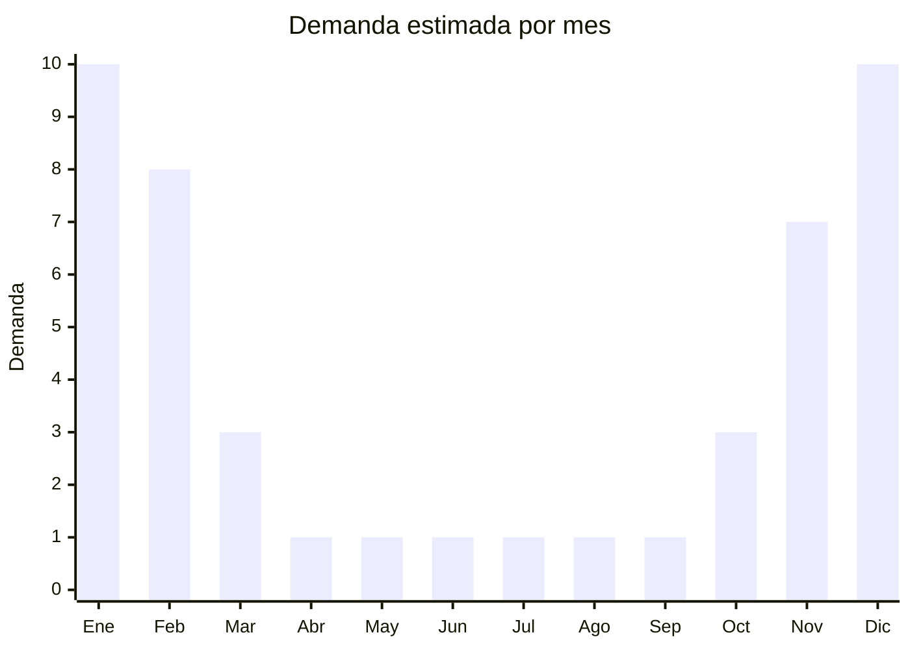

# Pelotas de playa

> **Capítulo NCM 40** — Caucho y sus manufacturas | **Temporada:** Verano (Dic–Feb)

## Qué es y por qué importarlo

Las pelotas de playa son uno de los productos más icónicos y universales del verano. Son esferas inflables de PVC livianas, coloridas y económicas, diseñadas para jugar en la playa, pileta, parque o jardín. Incluyen desde la clásica pelota multicolor de gajos hasta modelos con LED luminosos para jugar de noche, pelotas de water polo recreativas y sets multicolor para eventos/fiestas de verano.

Su gran atractivo como producto de importación radica en la combinación de costo FOB extremadamente bajo (desde USD 0.20 por unidad), alta rotación por compra impulsiva, y demanda predecible en temporada de verano. Son el complemento perfecto de otros inflables de verano: se pueden agregar como "bonus" en publicaciones de piletas o flotadores, o venderse en packs multicolor con margen atractivo. En Argentina, las pelotas de playa se venden en balnearios, piletas públicas, parques, kioscos de playa y por supuesto MercadoLibre.

China (Shantou, Guangdong) produce prácticamente todas las pelotas de playa del mundo. Los precios FOB son tan bajos que el costo de envío puede superar el costo del producto. Por esta razón, las pelotas de playa se importan generalmente como complemento de otros productos (flotadores, colchonetas, juguetes de agua) en el mismo envío LCL, para completar el CBM y optimizar el flete.

## Datos clave

| Dato | Valor |
|------|-------|
| **Posiciones NCM típicas** | 9506.62.00 (pelotas inflables) |
| **Derecho de importación** | 20% (DIE) + 3% tasa estadística |
| **Rango FOB típico** | USD 0.20 — USD 1.00 por unidad |
| **Precio de venta en Argentina** | ARS 1.500 — ARS 5.000 |
| **Margen bruto estimado** | 300% — 600% |
| **MOQ típico** | 500 — 2,000 unidades |
| **Demanda en MercadoLibre** | Alta (estacional) |
| **Competencia en MercadoLibre** | Media-Alta |
| **Dificultad para importar** | Fácil |
| **Certificaciones necesarias** | No requiere certificación especial |
| **Antidumping** | No |

## Variantes y subtipos más comunes

| Subtipo / Variante | FOB aprox. | Venta AR aprox. | Nota |
|--------------------|-----------|-----------------|------|
| Pelota playa 40cm clásica multicolor | USD 0.20 — 0.40 | ARS 1.500 — 3.000 | Básica, compra impulsiva |
| Pelota playa 60cm grande | USD 0.40 — 0.70 | ARS 2.500 — 4.000 | **Más vendido** |
| Pelota playa LED luminosa | USD 0.80 — 1.50 | ARS 3.500 — 6.000 | Novedad, fiestas nocturnas |
| Set x3 pelotas colores variados | USD 0.60 — 1.20 | ARS 3.000 — 5.000 | Pack familiar |
| Pelota water polo recreativa | USD 0.50 — 1.00 | ARS 2.000 — 4.000 | Uso en pileta |

## Regulaciones y requisitos

<Tabs>
  <Tab title="Certificaciones">
    | Organismo | Requiere | Detalle |
    |-----------|----------|---------|
    | ARCA (Aduana) | Sí siempre | Despacho estándar |
    | IRAM 3583 | Condicional | Si se comercializa como juguete para menores de 14 años |
    | ENACOM | No | No es electrónico (excepto modelo LED, que puede requerir) |

    **Recomendación:** Las pelotas de playa básicas (sin LED) no presentan riesgo regulatorio significativo. Si se comercializan como "artículo deportivo/recreativo" en lugar de "juguete", se evita el requisito IRAM. Las pelotas con LED podrían requerir intervención de ENACOM; verificar con despachante.
  </Tab>

  <Tab title="Etiquetado">
    | Requisito | Aplica |
    |-----------|--------|
    | Idioma español | Sí |
    | Datos del importador | Sí |
    | Composición / materiales | Sí (PVC) |
    | Diámetro inflada | Recomendado |
    | Advertencia supervisión infantil | Sí si se vende como juguete |
    | País de origen | Sí |
    | Garantía legal 6 meses | Sí |
  </Tab>

  <Tab title="Restricciones">
    Sin restricciones especiales de importación. No hay antidumping ni licencias previas para pelotas inflables.

    **Nota sobre pelotas con LED:** Si incluyen batería (generalmente LR44/AG13, no litio), verificar que la batería esté bien aislada para transporte marítimo. Las baterías de botón tipo alcalina no generan restricción de transporte significativa pero deben declararse.
  </Tab>
</Tabs>

## Logística

| Dato | Valor |
|------|-------|
| **Peso típico por unidad** | 0.05 — 0.15 kg (desinflada) |
| **Volumen típico** | Muy Bajo (desinfladas son planas) |
| **Fragilidad** | Baja (PVC flexible) |
| **Envío recomendado** | Marítimo LCL (como complemento de otros productos) |
| **Tiempo total estimado** | 45 — 75 días (marítimo) |
| **Baterías de litio** | No (modelos LED usan alcalinas) |
| **Requiere empaque especial** | No |

<Tip>
Las pelotas de playa son el **producto complemento ideal** para completar envíos LCL de flotadores y colchonetas. Por su bajísimo costo FOB y volumen desinflado mínimo, agregar 500-1,000 pelotas al pedido de inflables apenas impacta en el flete pero agrega línea de productos para vender. También funcionan como regalo promocional ("comprá un flotador y llevate una pelota gratis") para mejorar la conversión en MercadoLibre.
</Tip>

## Estacionalidad



| Aspecto | Detalle |
|---------|---------|
| **Meses pico** | Diciembre-Enero (Navidad + pleno verano, compra impulsiva en playa) |
| **Meses valle** | Abril-Septiembre (prácticamente cero demanda) |
| **Cuándo pedir** | Agosto-Septiembre junto con el pedido de flotadores/colchonetas |

## Ventajas y riesgos

<CardGroup cols={2}>
  <Card title="Ventajas" icon="circle-check">
    - Margen excepcional (300-600%)
    - Costo FOB mínimo, riesgo financiero bajo
    - Complemento ideal para otros productos de verano
    - Compra impulsiva, decisión instantánea
    - Sin regulación compleja (modelos básicos)
  </Card>
  <Card title="Riesgos" icon="triangle-exclamation">
    - 100% estacional (cero demanda fuera de verano)
    - Ticket bajo puede no justificar envío solo de pelotas
    - Calidad de PVC variable (olor, durabilidad)
    - Válvulas de baja calidad pierden aire rápido
    - Competencia en precio con importadores mayoristas
  </Card>
</CardGroup>

## Palabras clave para buscar en Alibaba

```
beach ball wholesale, inflatable beach ball PVC, beach ball 40cm 60cm,
LED beach ball glow, beach ball set multicolor, water polo ball inflatable,
beach ball bulk cheap, beach party ball wholesale, inflatable ball summer
```

## Fuentes

- [MercadoLibre Argentina — Pelotas de playa inflables](https://listado.mercadolibre.com.ar/pelota-playa-inflable)
- [Alibaba — Beach ball wholesale](https://www.alibaba.com/showroom/beach-ball-wholesale.html)
