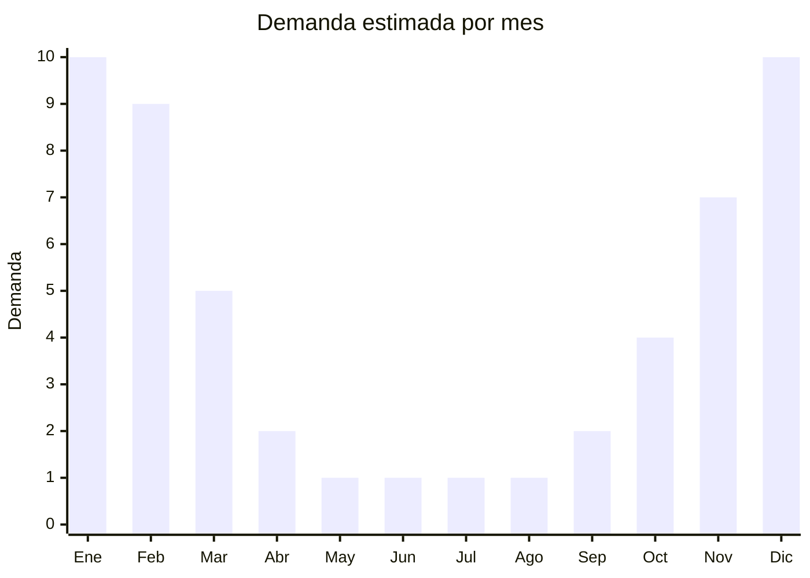

# Bolsos de playa (tote bags, malla, red)

> **Capítulo NCM 42** — Manufacturas de cuero, marroquinería | **Temporada:** Verano (Dic–Feb)

## Qué es y por qué importarlo

Los bolsos de playa son accesorios de gran tamaño diseñados para transportar toallas, protector solar, botellas de agua y pertenencias personales durante salidas a la playa, pileta o río. Incluyen tote bags (bolsos abiertos de asas largas), bolsos de red o malla (que permiten escurrir arena y agua) y modelos de rafia o PVC transparente. Son un producto de consumo masivo en verano, con alta rotación y recompra frecuente porque se desgastan con el sol, la arena y el agua salada.

China domina la producción mundial de bolsos de playa, con centros de manufactura en Guangzhou (Guangdong) y Yiwu (Zhejiang). Los materiales más comunes son rafia sintética, lona de algodón o poliéster, PVC transparente, malla de nylon y combinaciones de estos. El bajo costo FOB (USD 1 a 5) y los precios de venta en Argentina (ARS 5.000 a 15.000) generan márgenes brutos de 200% a 400%, convirtiéndolo en uno de los productos de verano más rentables para importadores.

La ventaja principal es que son productos livianos, compactos para el envío (se apilan planos), no requieren certificaciones especiales y tienen una demanda explosiva y predecible cada verano. El desafío es la alta competencia y la necesidad de diferenciarse con diseños atractivos, colores de tendencia y buena calidad de costura.

## Datos clave

| Dato | Valor |
|------|-------|
| **Posiciones NCM típicas** | 4202.22.20 (bolsos con superficie exterior de hojas de plástico o materia textil), 4202.29.00 (los demás bolsos) |
| **Derecho de importación** | 20% (DIE) + 3% tasa estadística |
| **Rango FOB típico** | USD 1.00 — USD 5.00 por unidad |
| **Precio de venta en Argentina** | ARS 5.000 — ARS 15.000 |
| **Margen bruto estimado** | 200% — 400% |
| **MOQ típico** | 200 — 1.000 unidades |
| **Demanda en MercadoLibre** | Muy Alta (estacional) |
| **Competencia en MercadoLibre** | Alta |
| **Dificultad para importar** | Fácil |
| **Certificaciones necesarias** | No requiere certificaciones especiales |
| **Antidumping** | No |

## Variantes y subtipos más comunes

| Subtipo / Variante | FOB aprox. | Venta AR aprox. | Nota |
|--------------------|-----------|-----------------|------|
| Tote bag lona básico | USD 1.00 — 2.00 | ARS 5.000 — 8.000 | **Más vendido**, personalizable |
| Bolso de malla/red | USD 1.00 — 2.50 | ARS 4.000 — 8.000 | Escurre arena, ideal familias |
| Bolso rafia sintética | USD 2.00 — 4.00 | ARS 7.000 — 12.000 | Estilo boho/natural, tendencia |
| Bolso PVC transparente | USD 1.50 — 3.00 | ARS 5.000 — 10.000 | Moda, seguridad en eventos |
| Tote bag XL con cierre | USD 3.00 — 5.00 | ARS 8.000 — 15.000 | Premium, mayor capacidad |

## Regulaciones y requisitos

<Tabs>
  <Tab title="Certificaciones">
    | Organismo | Requiere | Detalle |
    |-----------|----------|---------|
    | ARCA (Aduana) | Sí siempre | Despacho estándar |
    | ANMAT | No | No es cosmético ni alimento |
    | ENACOM | No | No es electrónico |
    | SENASA | No | No aplica (materiales sintéticos) |

    **Recomendación:** Solicitar al proveedor fichas técnicas de los materiales (composición textil) para facilitar la clasificación arancelaria. Si el bolso combina cuero genuino con tela, la clasificación puede variar dentro del capítulo 42.
  </Tab>

  <Tab title="Etiquetado">
    | Requisito | Aplica |
    |-----------|--------|
    | Idioma español | Sí |
    | Datos del importador | Sí |
    | Composición / materiales | Sí (indicar % de cada material) |
    | País de origen | Sí |
    | Instrucciones de cuidado | Recomendado |
  </Tab>

  <Tab title="Restricciones">
    Sin restricciones especiales de importación. No hay antidumping ni licencias previas para bolsos de playa.

    **Atención:** Si el bolso incluye materiales de origen animal real (cuero, piel) puede requerir documentación adicional de SENASA y clasificar en posiciones NCM diferentes dentro del capítulo 42.
  </Tab>
</Tabs>

## Logística

| Dato | Valor |
|------|-------|
| **Peso típico por unidad** | 0.15 — 0.50 kg |
| **Volumen típico** | Bajo (se pliegan y apilan planos) |
| **Fragilidad** | Muy baja |
| **Envío recomendado** | Marítimo LCL (volumen moderado) o aéreo para muestras |
| **Tiempo total estimado** | 45 — 70 días (marítimo) |
| **Baterías de litio** | No |
| **Requiere empaque especial** | No (bolsa polietileno individual) |

<Tip>
Los bolsos de playa se envían **plegados y apilados**, ocupando muy poco volumen por unidad. Un cartón estándar de 60x40x40 cm puede contener 40-60 bolsos tote. Esto permite enviar grandes cantidades en un solo LCL y reducir el costo unitario de flete significativamente.
</Tip>

## Estacionalidad



| Aspecto | Detalle |
|---------|---------|
| **Meses pico** | Noviembre-Febrero (verano, vacaciones, playa) |
| **Meses valle** | Mayo-Agosto (invierno, sin uso) |
| **Cuándo pedir** | Julio-Agosto para tener stock en noviembre |

## Ventajas y riesgos

<CardGroup cols={2}>
  <Card title="Ventajas" icon="circle-check">
    - Costo FOB bajísimo con márgenes enormes
    - Producto ultraliviano y compacto para envío
    - Sin barreras regulatorias ni certificaciones
    - Altísima demanda en verano, producto impulsivo
    - Ideal para marca propia (estampado/sublimación)
  </Card>
  <Card title="Riesgos" icon="triangle-exclamation">
    - Competencia muy alta (producto commodity)
    - Estacionalidad marcada: stock muerto en invierno
    - Calidad de costuras y asas varía mucho entre proveedores
    - Tendencias de diseño cambian cada temporada
    - Colores pueden desvanecerse con sol y agua salada
  </Card>
</CardGroup>

## Palabras clave para buscar en Alibaba

```
beach tote bag wholesale, mesh beach bag bulk, straw beach bag wholesale,
PVC transparent beach bag, canvas tote bag summer, woven raffia beach bag,
net beach bag family size, oversized beach tote custom logo
```

## Fuentes

- [MercadoLibre Argentina — Bolsos de playa](https://listado.mercadolibre.com.ar/bolso-playa)
- [Alibaba — Beach bag wholesale](https://www.alibaba.com/showroom/beach-bag-wholesale.html)
