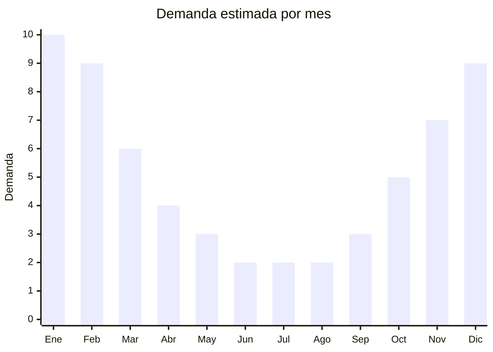

# Bolsos térmicos / lunch bags para playa

> **Capítulo NCM 42** — Manufacturas de cuero, marroquinería | **Temporada:** Verano (Dic–Feb)

## Qué es y por qué importarlo

Los bolsos térmicos (también llamados lunch bags, loncheras térmicas o cooler bags) son bolsos blandos con aislamiento térmico diseñados para mantener bebidas y alimentos fríos durante varias horas. Su estructura típica combina un exterior de poliéster resistente, un interior de aluminio reflectante (laminado PEVA o aluminio) y una capa intermedia de espuma aislante (EPE o PU). Son el complemento perfecto de las conservadoras rígidas del Capítulo 39, ofreciendo portabilidad y versatilidad para la playa, el trabajo, picnics y salidas al aire libre.

La producción se concentra en Guangzhou (Guangdong), donde las mismas fábricas que producen bolsos y mochilas fabrican líneas térmicas. El FOB oscila entre USD 2 y 6, y en Argentina se venden entre ARS 5.000 y ARS 15.000, con márgenes brutos del 200% al 350%. A diferencia de las conservadoras rígidas, los bolsos térmicos son plegables y extremadamente livianos, lo que reduce drásticamente el costo de flete por unidad.

El mercado argentino muestra una demanda creciente por bolsos térmicos, impulsada por tendencias de alimentación saludable (llevar vianda al trabajo), salidas familiares y la cultura de playa/río. La demanda pico coincide con el verano (diciembre a febrero), pero mantiene un piso de ventas todo el año por el uso diario como lonchera.

## Datos clave

| Dato | Valor |
|------|-------|
| **Posiciones NCM típicas** | 4202.92.00 (bolsos con superficie exterior de materia textil), 4202.12.20 (maletines y similares con exterior de plástico) |
| **Derecho de importación** | 20% (DIE) + 3% tasa estadística |
| **Rango FOB típico** | USD 2.00 — USD 6.00 por unidad |
| **Precio de venta en Argentina** | ARS 5.000 — ARS 15.000 |
| **Margen bruto estimado** | 200% — 350% |
| **MOQ típico** | 200 — 1.000 unidades |
| **Demanda en MercadoLibre** | Alta (estacional con piso anual) |
| **Competencia en MercadoLibre** | Media |
| **Dificultad para importar** | Fácil |
| **Certificaciones necesarias** | No requiere certificaciones especiales |
| **Antidumping** | No |

## Variantes y subtipos más comunes

| Subtipo / Variante | FOB aprox. | Venta AR aprox. | Nota |
|--------------------|-----------|-----------------|------|
| Lunch bag personal 5L | USD 2.00 — 3.00 | ARS 5.000 — 8.000 | **Más vendido**, uso diario |
| Bolso térmico mediano 10L | USD 3.00 — 4.50 | ARS 7.000 — 11.000 | Playa/picnic para 2-3 personas |
| Bolso térmico familiar 15-20L | USD 4.00 — 6.00 | ARS 10.000 — 15.000 | Salidas familiares, camping |
| Lunch bag con compartimentos | USD 3.00 — 5.00 | ARS 7.000 — 12.000 | Separación seco/frío |
| Mochila térmica | USD 4.00 — 6.00 | ARS 9.000 — 15.000 | Manos libres, delivery |

## Regulaciones y requisitos

<Tabs>
  <Tab title="Certificaciones">
    | Organismo | Requiere | Detalle |
    |-----------|----------|---------|
    | ARCA (Aduana) | Sí siempre | Despacho estándar |
    | ANMAT | No | Interior no tiene contacto directo con alimentos (se usan recipientes) |
    | ENACOM | No | No es electrónico |
    | SENASA | No | No aplica |

    **Recomendación:** Solicitar al proveedor certificado de material interior "food safe" o libre de BPA/ftalatos. Si bien no es obligatorio en Argentina para bolsos térmicos, refuerza la confianza del comprador y permite diferenciarse de la competencia.
  </Tab>

  <Tab title="Etiquetado">
    | Requisito | Aplica |
    |-----------|--------|
    | Idioma español | Sí |
    | Datos del importador | Sí |
    | Composición / materiales | Sí (indicar exterior, interior y aislante) |
    | Capacidad en litros | Sí |
    | País de origen | Sí |
    | Instrucciones de uso/cuidado | Recomendado |
  </Tab>

  <Tab title="Restricciones">
    Sin restricciones especiales de importación. No hay antidumping ni licencias previas para bolsos térmicos.

    **Atención:** Si el bolso térmico incluye sistema de refrigeración eléctrico (ej: módulo Peltier con batería) clasifica diferente y puede requerir intervención de ENACOM. Los modelos pasivos (sin electricidad) no tienen restricción alguna.
  </Tab>
</Tabs>

## Logística

| Dato | Valor |
|------|-------|
| **Peso típico por unidad** | 0.20 — 0.60 kg |
| **Volumen típico** | Bajo (plegables, se apilan planos) |
| **Fragilidad** | Muy baja |
| **Envío recomendado** | Marítimo LCL |
| **Tiempo total estimado** | 45 — 70 días (marítimo) |
| **Baterías de litio** | No (modelos pasivos) |
| **Requiere empaque especial** | No (bolsa polietileno individual) |

<Tip>
A diferencia de las conservadoras rígidas (Cap. 39) que son huecas y ocupan mucho CBM, los bolsos térmicos se **pliegan completamente** y ocupan una fracción del volumen. Combinar ambos productos en un mismo contenedor es una estrategia inteligente: los bolsos llenan los espacios vacíos entre las conservadoras rígidas, optimizando el CBM total del envío.
</Tip>

## Estacionalidad



| Aspecto | Detalle |
|---------|---------|
| **Meses pico** | Noviembre-Febrero (verano, playa, picnics) |
| **Meses valle** | Junio-Agosto (menor demanda, pero venta como lonchera) |
| **Cuándo pedir** | Julio-Agosto para tener stock en noviembre |

## Ventajas y riesgos

<CardGroup cols={2}>
  <Card title="Ventajas" icon="circle-check">
    - Costo FOB muy bajo con excelentes márgenes
    - Ultraliviano y plegable: flete económico
    - Demanda estacional fuerte + piso anual (uso como lonchera)
    - Sin barreras regulatorias
    - Complementa otros productos de verano (cross-selling)
  </Card>
  <Card title="Riesgos" icon="triangle-exclamation">
    - Interior de aluminio puede despegarse con el uso
    - Cierres de baja calidad son el punto débil
    - Capacidad térmica inferior a conservadoras rígidas
    - Competencia con marcas de supermercado
    - Olores del material interior en modelos baratos
  </Card>
</CardGroup>

## Palabras clave para buscar en Alibaba

```
insulated lunch bag wholesale, cooler bag beach, thermal lunch bag custom,
insulated cooler bag aluminium, picnic cooler bag wholesale, lunch tote bag insulated,
beach cooler bag soft, PEVA insulated bag bulk
```

## Fuentes

- [MercadoLibre Argentina — Bolsos térmicos](https://listado.mercadolibre.com.ar/bolso-termico)
- [Alibaba — Insulated cooler bag wholesale](https://www.alibaba.com/showroom/insulated-cooler-bag.html)
