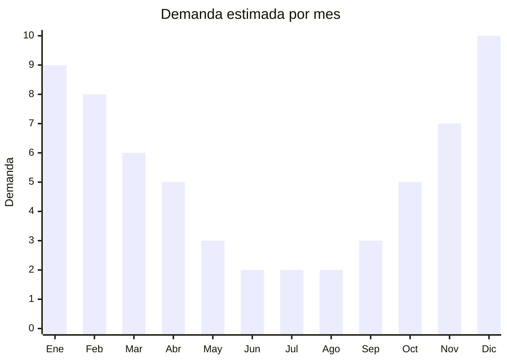

# Mochilas de trekking/hiking 30-60L

> **Capítulo NCM 42** — Manufacturas de cuero, marroquinería | **Temporada:** Verano (Dic–Feb)

## Qué es y por qué importarlo

Las mochilas de trekking o hiking son mochilas técnicas de gran capacidad (30 a 60 litros) diseñadas para caminatas de montaña, travesías y actividades al aire libre. Se caracterizan por tener estructura ergonómica con respaldo ventilado, cinturón lumbar acolchado, múltiples compartimentos, porta bastones, sistema de hidratación compatible y materiales resistentes al agua. Son un producto esencial para el turismo aventura que crece año tras año en Argentina.

El pico de demanda se concentra en verano y otoño (diciembre a abril), coincidiendo con la temporada de vacaciones y turismo activo en destinos como Patagonia, Córdoba, Mendoza, Bariloche y el norte argentino. Marcas reconocidas en el mercado argentino incluyen Montagne, National Geographic, Doite y Coleman, pero existe un amplio espacio para mochilas importadas de China con buena relación precio-calidad.

China fabrica mochilas de trekking para las principales marcas mundiales (Osprey, Deuter, The North Face) en fábricas de Fujian, Guangdong y Zhejiang. Las mismas fábricas producen modelos genéricos o de marca blanca con prestaciones similares a un FOB de USD 8 a 25, que en Argentina se venden entre ARS 25.000 y ARS 80.000, generando márgenes muy atractivos para el importador.

## Datos clave

| Dato | Valor |
|------|-------|
| **Posiciones NCM típicas** | 4202.92.00 (bolsos, mochilas con superficie exterior de hojas de plástico o materia textil) |
| **Derecho de importación** | 20% (DIE) + 3% tasa estadística |
| **Rango FOB típico** | USD 8.00 — USD 25.00 por unidad |
| **Precio de venta en Argentina** | ARS 25.000 — ARS 80.000 |
| **Margen bruto estimado** | 150% — 300% |
| **MOQ típico** | 100 — 500 unidades |
| **Demanda en MercadoLibre** | Alta (estacional con piso anual) |
| **Competencia en MercadoLibre** | Media-Alta |
| **Dificultad para importar** | Fácil |
| **Certificaciones necesarias** | No requiere certificaciones especiales |
| **Antidumping** | No |

## Variantes y subtipos más comunes

| Subtipo / Variante | FOB aprox. | Venta AR aprox. | Nota |
|--------------------|-----------|-----------------|------|
| Mochila 30L day-hike | USD 8.00 — 12.00 | ARS 25.000 — 40.000 | **Más vendida**, caminatas de un día |
| Mochila 40L travesía | USD 12.00 — 18.00 | ARS 35.000 — 55.000 | Multi-día, camping ligero |
| Mochila 50-60L expedición | USD 18.00 — 25.00 | ARS 50.000 — 80.000 | Travesías largas, camping |
| Mochila 30L con hidratación | USD 10.00 — 15.00 | ARS 30.000 — 50.000 | Compatible camelback, trail running |
| Mochila 40L con cubre-lluvia | USD 13.00 — 20.00 | ARS 38.000 — 60.000 | Incluye rain cover integrado |

## Regulaciones y requisitos

<Tabs>
  <Tab title="Certificaciones">
    | Organismo | Requiere | Detalle |
    |-----------|----------|---------|
    | ARCA (Aduana) | Sí siempre | Despacho estándar |
    | ANMAT | No | No aplica |
    | ENACOM | No | No es electrónico |
    | SENASA | No | No aplica |

    **Recomendación:** Solicitar al proveedor certificados de resistencia del material exterior (denier del nylon/poliéster), impermeabilidad (columna de agua en mm) y test de carga de las costuras. Los compradores de trekking son exigentes con las especificaciones técnicas.
  </Tab>

  <Tab title="Etiquetado">
    | Requisito | Aplica |
    |-----------|--------|
    | Idioma español | Sí |
    | Datos del importador | Sí |
    | Composición / materiales | Sí (indicar material exterior, interior y estructura) |
    | Capacidad en litros | Sí |
    | País de origen | Sí |
    | Garantía legal 6 meses | Sí |
    | Instrucciones de uso/ajuste | Recomendado |
  </Tab>

  <Tab title="Restricciones">
    Sin restricciones especiales de importación. No hay antidumping ni licencias previas para mochilas.

    **Atención:** Si la mochila incluye accesorios electrónicos integrados (panel solar, cargador USB con batería) puede requerir intervención de ENACOM y clasificar en posición NCM diferente. Las mochilas sin electrónica no tienen restricción alguna.
  </Tab>
</Tabs>

## Logística

| Dato | Valor |
|------|-------|
| **Peso típico por unidad** | 0.8 — 1.8 kg (según capacidad y estructura) |
| **Volumen típico** | Medio (se comprimen pero tienen estructura) |
| **Fragilidad** | Muy baja |
| **Envío recomendado** | Marítimo LCL o FCL según volumen |
| **Tiempo total estimado** | 50 — 75 días (marítimo) |
| **Baterías de litio** | No (modelos sin electrónica) |
| **Requiere empaque especial** | No (bolsa polietileno + cartón) |

<Tip>
Pedir al proveedor que las mochilas se envíen **comprimidas al vacío** dentro de sus cartones. Esto puede reducir el volumen hasta un 50%, permitiendo enviar más unidades por CBM. Verificar que las varillas internas del respaldo se retiren o plieguen para maximizar la compresión.
</Tip>

## Estacionalidad



| Aspecto | Detalle |
|---------|---------|
| **Meses pico** | Noviembre-Marzo (verano y otoño, turismo activo) |
| **Meses valle** | Junio-Agosto (invierno, menor actividad outdoor) |
| **Cuándo pedir** | Julio-Agosto para tener stock en noviembre |

## Ventajas y riesgos

<CardGroup cols={2}>
  <Card title="Ventajas" icon="circle-check">
    - Producto con demanda creciente (turismo aventura en auge)
    - Ticket promedio alto con buenos márgenes
    - No requiere certificaciones especiales
    - Menos estacional que productos de playa pura
    - Ideal para marca propia (nicho outdoor)
  </Card>
  <Card title="Riesgos" icon="triangle-exclamation">
    - Competencia con marcas posicionadas (Montagne, Doite, NatGeo)
    - Calidad de costuras y herrajes es crítica (devoluciones)
    - Cliente exigente que investiga especificaciones
    - Mayor inversión inicial vs. productos más baratos
    - Necesidad de variedad de talles/colores
  </Card>
</CardGroup>

## Palabras clave para buscar en Alibaba

```
hiking backpack 40L wholesale, trekking backpack waterproof, camping backpack 50L,
outdoor backpack with rain cover, mountaineering backpack bulk, hiking daypack 30L,
travel backpack ergonomic frame, hydration backpack hiking wholesale
```

## Fuentes

- [MercadoLibre Argentina — Mochilas trekking](https://listado.mercadolibre.com.ar/mochila-trekking)
- [Alibaba — Hiking backpack wholesale](https://www.alibaba.com/showroom/hiking-backpack-wholesale.html)
