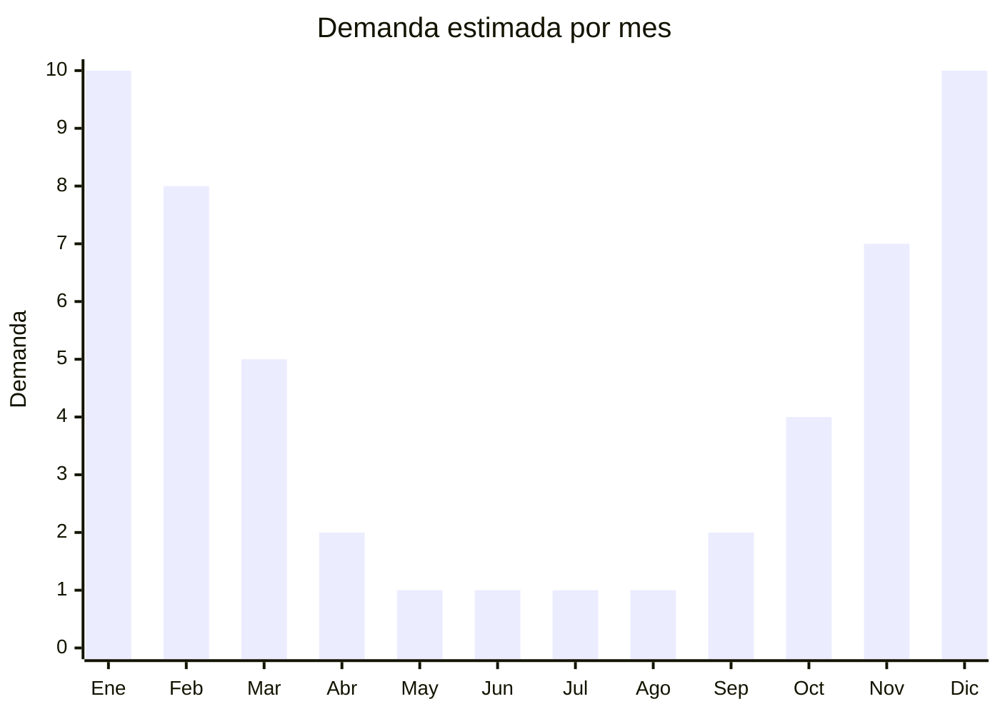

# Bolsos y canastos de playa en paja/mimbre

> **Capítulo NCM 46** — Manufacturas de espartería y cestería | **Temporada:** Verano (Dic–Feb)

## Qué es y por qué importarlo

Los bolsos y canastos de playa en paja, mimbre o rafia son accesorios de moda y funcionalidad que combinan el uso práctico para llevar pertenencias a la playa con una estética boho-chic muy demandada en redes sociales. Incluyen bolsos tipo cesta con asas, canastos rígidos con tapa, bolsos de rafia con detalles en cuero o tela, y modelos circular tipo "round bag" que se popularizaron como tendencia fashion.

La tendencia moda boho-playa ha impulsado fuertemente la demanda de estos productos en los últimos años. Ya no son solo funcionales: son accesorios de moda que se lucen en fotos de Instagram y TikTok. Esto permite un posicionamiento de precio más alto que los bolsos textiles comunes, con márgenes que pueden superar el 300%.

China produce estos artículos en centros especializados en cestería de Zhejiang, Shandong y Guangxi, trabajando con fibras naturales (paja, palma, junco, seagrass) y rafia sintética (papel trenzado). El FOB oscila entre USD 2 y 6, con precios de venta en Argentina de ARS 5.000 a ARS 15.000. Al igual que los sombreros de paja, los productos de fibra natural pueden requerir control fitosanitario de SENASA.

## Datos clave

| Dato | Valor |
|------|-------|
| **Posiciones NCM típicas** | 4602.19.00 (cestas y demás artículos de materia vegetal trenzada), 4602.11.00 (de bambú) |
| **Derecho de importación** | 18% (DIE) + 3% tasa estadística |
| **Rango FOB típico** | USD 2.00 — USD 6.00 por unidad |
| **Precio de venta en Argentina** | ARS 5.000 — ARS 15.000 |
| **Margen bruto estimado** | 200% — 350% |
| **MOQ típico** | 200 — 500 unidades |
| **Demanda en MercadoLibre** | Alta (estacional, creciente) |
| **Competencia en MercadoLibre** | Media |
| **Dificultad para importar** | Fácil-Media (posible SENASA) |
| **Certificaciones necesarias** | Posible intervención SENASA fitosanitaria para fibras naturales |
| **Antidumping** | No |

## Variantes y subtipos más comunes

| Subtipo / Variante | FOB aprox. | Venta AR aprox. | Nota |
|--------------------|-----------|-----------------|------|
| Bolso cesta con asas cortas | USD 2.00 — 4.00 | ARS 5.000 — 10.000 | **Más vendido**, clásico playa |
| Canasto rígido con tapa | USD 3.00 — 5.00 | ARS 7.000 — 12.000 | Estilo picnic, premium |
| Round bag circular | USD 3.00 — 6.00 | ARS 8.000 — 15.000 | Tendencia moda, fotos |
| Bolso rafia con asas largas | USD 2.50 — 4.50 | ARS 6.000 — 12.000 | Estilo tote, uso diario |
| Mini bolso cesta crossbody | USD 2.00 — 4.00 | ARS 5.000 — 10.000 | Accesorio moda, no solo playa |

## Regulaciones y requisitos

<Tabs>
  <Tab title="Certificaciones">
    | Organismo | Requiere | Detalle |
    |-----------|----------|---------|
    | ARCA (Aduana) | Sí siempre | Despacho estándar |
    | ANMAT | No | No aplica |
    | ENACOM | No | No es electrónico |
    | SENASA | Posible | Puede requerir control fitosanitario para fibras naturales |

    **Importante sobre SENASA:** Los bolsos de paja natural, mimbre, junco o seagrass pueden requerir certificado fitosanitario del país de origen y/o fumigación con bromuro de metilo en destino. SENASA inspecciona productos de origen vegetal para prevenir plagas. Los productos de rafia sintética (papel trenzado) no requieren intervención fitosanitaria. Confirmar con el despachante antes de embarcar.
  </Tab>

  <Tab title="Etiquetado">
    | Requisito | Aplica |
    |-----------|--------|
    | Idioma español | Sí |
    | Datos del importador | Sí |
    | Composición / materiales | Sí (indicar tipo de fibra y materiales complementarios) |
    | País de origen | Sí |
    | Instrucciones de cuidado | Recomendado (evitar humedad prolongada) |
  </Tab>

  <Tab title="Restricciones">
    No hay antidumping ni licencias previas para productos de cestería.

    **Atención:** Si el bolso combina cestería con componentes de cuero genuino, la clasificación arancelaria puede variar (Cap. 42 para marroquinería vs. Cap. 46 para cestería). El capítulo se define por el material que le confiere el carácter esencial al producto. Consultar con el despachante.
  </Tab>
</Tabs>

## Logística

| Dato | Valor |
|------|-------|
| **Peso típico por unidad** | 0.15 — 0.50 kg |
| **Volumen típico** | Medio-Alto (forma rígida, no se comprimen) |
| **Fragilidad** | Media-Alta (fibras naturales se quiebran si se aplastan) |
| **Envío recomendado** | Marítimo LCL con empaque reforzado |
| **Tiempo total estimado** | 50 — 75 días (marítimo) |
| **Baterías de litio** | No |
| **Requiere empaque especial** | Sí (papel burbuja + cartón con separadores) |

<Tip>
Los canastos y bolsos de cestería son **rígidos y no se comprimen**, por lo que ocupan más CBM que un bolso textil equivalente. Negociar con el proveedor que los modelos más pequeños se envíen **anidados** (uno dentro de otro) cuando la forma lo permita. Esto puede reducir el volumen total un 30-40%. Pedir fotos del empaque antes de aprobar el envío.
</Tip>

## Estacionalidad



| Aspecto | Detalle |
|---------|---------|
| **Meses pico** | Noviembre-Febrero (verano, playa, moda) |
| **Meses valle** | Mayo-Agosto (sin demanda) |
| **Cuándo pedir** | Julio-Agosto para tener stock en noviembre |

## Ventajas y riesgos

<CardGroup cols={2}>
  <Card title="Ventajas" icon="circle-check">
    - Tendencia moda boho-playa en alza constante
    - Posicionamiento premium posible (accesorio de moda)
    - Márgenes excelentes, especialmente en modelos fashion
    - Producto liviano con flete razonable por unidad
    - Diferenciación frente a bolsos textiles masivos
  </Card>
  <Card title="Riesgos" icon="triangle-exclamation">
    - SENASA puede requerir fumigación (costo y tiempo extra)
    - Producto frágil: fibras naturales se quiebran en transporte
    - Forma rígida ocupa más volumen que bolsos textiles
    - Estacionalidad marcada en ventas
    - Humedad en contenedor puede generar moho en fibras naturales
  </Card>
</CardGroup>

## Palabras clave para buscar en Alibaba

```
straw beach bag wholesale, wicker basket bag, rattan beach bag women,
woven straw tote bag, seagrass beach bag, round rattan bag wholesale,
raffia basket bag summer, handwoven straw bag bulk
```

## Fuentes

- [MercadoLibre Argentina — Bolsos de playa paja](https://listado.mercadolibre.com.ar/bolso-paja-playa)
- [Alibaba — Straw beach bag wholesale](https://www.alibaba.com/showroom/straw-beach-bag.html)
