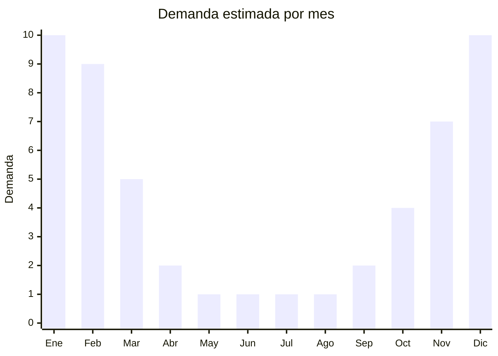

# Sombreros de paja/rafia para playa

> **Capítulo NCM 46** — Manufacturas de espartería y cestería | **Temporada:** Verano (Dic–Feb)

## Qué es y por qué importarlo

Los sombreros de paja o rafia para playa son accesorios tejidos con fibras naturales o sintéticas, diseñados para proteger del sol durante actividades al aire libre. Incluyen modelos clásicos de ala ancha, pamelas, sombreros tipo fedora playeros, capelinas y modelos rústicos estilo campo. Son un ícono del verano y un producto de altísima demanda estacional con márgenes excepcionales.

China es el principal productor mundial, con centros de manufactura en Zhejiang (especialmente la ciudad de Jiaxing) y Shandong. Las fábricas trabajan con paja natural (trigo, arroz), rafia natural (de palma), rafia sintética (papel trenzado) y combinaciones de materiales. El FOB oscila entre USD 1 y 4, mientras que en Argentina se venden entre ARS 3.000 y ARS 12.000, generando márgenes del 200% al 400%.

Un aspecto importante para el importador es la **clasificación arancelaria dual**: los sombreros tejidos de paja pueden clasificar en el Capítulo 46 (manufacturas de cestería, cuando el sombrero se considera una manufactura trenzada) o en el Capítulo 65 (sombreros y tocados). La clasificación depende del material y la construcción. Es fundamental consultar con el despachante de aduanas antes de importar para determinar la posición NCM correcta y evitar diferencias de derechos o retenciones.

## Datos clave

| Dato | Valor |
|------|-------|
| **Posiciones NCM típicas** | 4602.11.00 (sombreros de materia vegetal trenzada — cestería), 6504.00.00 (sombreros trenzados — sombreros) |
| **Derecho de importación** | 18-20% (DIE) + 3% tasa estadística (varía según clasificación) |
| **Rango FOB típico** | USD 1.00 — USD 4.00 por unidad |
| **Precio de venta en Argentina** | ARS 3.000 — ARS 12.000 |
| **Margen bruto estimado** | 200% — 400% |
| **MOQ típico** | 200 — 1.000 unidades |
| **Demanda en MercadoLibre** | Muy Alta (estacional) |
| **Competencia en MercadoLibre** | Alta |
| **Dificultad para importar** | Fácil-Media (clasificación arancelaria dual) |
| **Certificaciones necesarias** | Posible intervención SENASA fitosanitaria para fibras naturales |
| **Antidumping** | No |

## Variantes y subtipos más comunes

| Subtipo / Variante | FOB aprox. | Venta AR aprox. | Nota |
|--------------------|-----------|-----------------|------|
| Sombrero paja ala ancha mujer | USD 1.50 — 3.00 | ARS 4.000 — 10.000 | **Más vendido**, playa/moda |
| Capelina rafia natural | USD 2.00 — 4.00 | ARS 6.000 — 12.000 | Estilo elegante, fotos |
| Sombrero fedora playero | USD 1.50 — 3.00 | ARS 4.000 — 9.000 | Unisex, tendencia |
| Sombrero paja hombre ala media | USD 1.00 — 2.50 | ARS 3.000 — 7.000 | Estilo casual/campo |
| Sombrero paja infantil | USD 1.00 — 2.00 | ARS 3.000 — 6.000 | Con cintas decorativas |

## Regulaciones y requisitos

<Tabs>
  <Tab title="Certificaciones">
    | Organismo | Requiere | Detalle |
    |-----------|----------|---------|
    | ARCA (Aduana) | Sí siempre | Despacho estándar |
    | ANMAT | No | No aplica |
    | ENACOM | No | No es electrónico |
    | SENASA | Posible | Puede requerir control fitosanitario para fibras naturales |

    **Importante sobre SENASA:** Los sombreros de paja natural (trigo, arroz, palma) pueden requerir certificado fitosanitario de origen y/o fumigación en destino. SENASA controla productos de origen vegetal para prevenir el ingreso de plagas. Los sombreros de rafia sintética (papel trenzado) no requieren intervención fitosanitaria. Consultar con el despachante antes de embarcar.
  </Tab>

  <Tab title="Etiquetado">
    | Requisito | Aplica |
    |-----------|--------|
    | Idioma español | Sí |
    | Datos del importador | Sí |
    | Composición / materiales | Sí (indicar tipo de fibra: paja natural, rafia, papel) |
    | Talle/circunferencia | Recomendado |
    | País de origen | Sí |
    | Instrucciones de cuidado | Recomendado |
  </Tab>

  <Tab title="Restricciones">
    No hay antidumping ni licencias previas para sombreros de paja.

    **Atención clasificación arancelaria:** La posición NCM varía según el criterio de clasificación:
    - **Cap. 46** (cestería): cuando el sombrero se clasifica como manufactura de materia trenzable
    - **Cap. 65** (sombreros): cuando se clasifica como sombrero/tocado

    Consultar con el despachante de aduanas antes de importar. Una clasificación incorrecta puede generar diferencias de derechos y retención de mercadería.
  </Tab>
</Tabs>

## Logística

| Dato | Valor |
|------|-------|
| **Peso típico por unidad** | 0.08 — 0.25 kg |
| **Volumen típico** | Medio (no se pueden comprimir, forma rígida) |
| **Fragilidad** | Media (se deforman si se aplastan) |
| **Envío recomendado** | Marítimo LCL con empaque adecuado |
| **Tiempo total estimado** | 50 — 75 días (marítimo) |
| **Baterías de litio** | No |
| **Requiere empaque especial** | Sí (cajas con separadores para mantener forma) |

<Tip>
Los sombreros de paja son **frágiles en su forma**: se deforman si se aplastan. Exigir al proveedor empaque en cajas con separadores internos o apilamiento con relleno. Cada sombrero debe ir en bolsa individual y los cartones no deben superapilarse. Un sombrero deformado en tránsito es una pérdida directa porque no se puede vender.
</Tip>

## Estacionalidad



| Aspecto | Detalle |
|---------|---------|
| **Meses pico** | Noviembre-Febrero (verano, playa, vacaciones) |
| **Meses valle** | Mayo-Agosto (sin demanda) |
| **Cuándo pedir** | Julio-Agosto para tener stock en noviembre |

## Ventajas y riesgos

<CardGroup cols={2}>
  <Card title="Ventajas" icon="circle-check">
    - Costo FOB bajísimo con márgenes excepcionales
    - Producto icónico de verano con demanda masiva
    - Liviano (bajo peso = flete económico por unidad)
    - Tendencia moda sostenible/natural favorece fibras naturales
    - Amplia variedad de modelos y estilos
  </Card>
  <Card title="Riesgos" icon="triangle-exclamation">
    - Clasificación arancelaria dual (Cap. 46 vs. Cap. 65) genera incertidumbre
    - SENASA puede requerir fumigación para fibras naturales
    - Producto frágil: se deforma en transporte si no se empaca bien
    - Estacionalidad extrema: sin ventas en invierno
    - Competencia con producción nacional artesanal
  </Card>
</CardGroup>

## Palabras clave para buscar en Alibaba

```
straw hat wholesale, raffia beach hat women, wide brim straw hat summer,
sun hat straw wholesale, paper straw hat bulk, fedora straw hat beach,
floppy beach hat women, natural raffia hat wholesale
```

## Fuentes

- [MercadoLibre Argentina — Sombreros de paja](https://listado.mercadolibre.com.ar/sombrero-paja-playa)
- [Alibaba — Straw hat wholesale](https://www.alibaba.com/showroom/straw-hat-wholesale.html)
