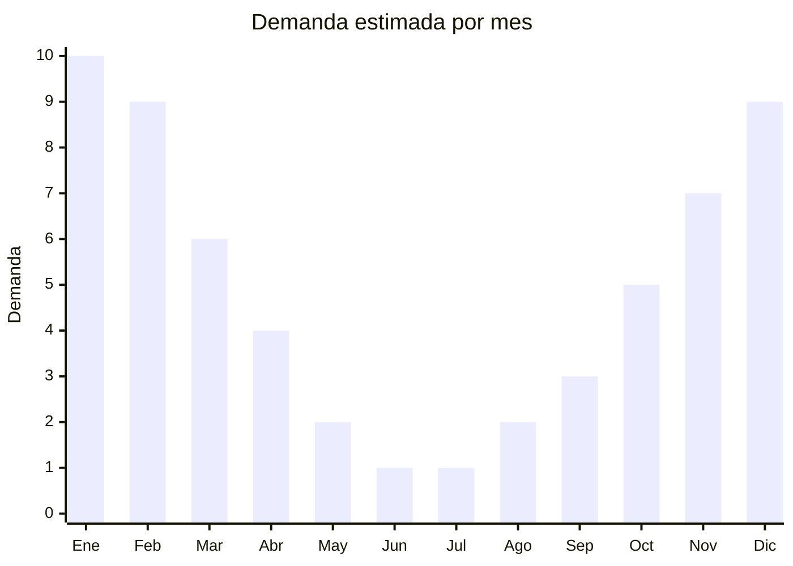

# Remeras y musculosas de verano

> **Capítulo NCM 61** — Prendas y complementos de vestir, de punto | **Temporada:** Verano (Dic–Feb)

## Qué es y por qué importarlo

Las remeras y musculosas de verano de punto incluyen camisetas de manga corta, tirantes (tank tops), musculosas sin mangas, crop tops y remeras oversized en tejidos livianos como jersey de algodón, viscosa, modal y mezclas con poliéster. Son las prendas más consumidas del verano argentino por su versatilidad: se usan para el día a día, la playa, el deporte y la salida nocturna.

China domina la producción mundial de camisetas de punto, con centros manufactureros en Guangzhou, Dongguan y Hangzhou que ofrecen desde básicos de algodón a USD 1.50 FOB hasta prendas con estampados sublimados o bordados a USD 4-5 FOB. El mercado argentino absorbe enormes volúmenes, y la producción local compite principalmente en el segmento medio-alto, dejando espacio para importados en el segmento económico y de moda rápida.

El negocio es atractivo por los márgenes y la rotación, pero requiere atención especial al antidumping vigente sobre textiles de punto de China y al cumplimiento del etiquetado IRAM 12560.

<Warning>
**ANTIDUMPING ACTIVO:** Argentina aplica derechos antidumping sobre prendas de punto de origen China. Verificar las NCM 6109.10 (camisetas de algodón) y 6109.90 (camisetas de otras fibras) contra la resolución vigente de CNCE. El sobrecosto puede ser significativo. Consultar con despachante antes de importar.
</Warning>

## Datos clave

| Dato | Valor |
|------|-------|
| **Posiciones NCM típicas** | 6109.10.00 (camisetas de algodón, de punto), 6109.90.00 (camisetas de otras fibras, de punto), 6110.20.00 (suéteres/pulóveres de algodón — musculosas) |
| **Derecho de importación** | 35% (DIE) + 3% tasa estadística |
| **Antidumping** | **Sí — verificar NCM específica contra resolución CNCE vigente** |
| **Rango FOB típico** | USD 1.50 — USD 5.00 por unidad |
| **Precio de venta en Argentina** | ARS 5.000 — ARS 18.000 |
| **Margen bruto estimado** | 200% — 350% (sin antidumping) |
| **MOQ típico** | 300 — 1.000 unidades (variado por talle/color) |
| **Demanda en MercadoLibre** | Muy Alta (estacional) |
| **Competencia en MercadoLibre** | Muy Alta |
| **Dificultad para importar** | Media-Alta (antidumping + etiquetado) |
| **Certificaciones necesarias** | Etiquetado textil IRAM 12560 obligatorio |

## Variantes y subtipos más comunes

| Subtipo / Variante | FOB aprox. | Venta AR aprox. | Nota |
|--------------------|-----------|-----------------|------|
| Remera básica algodón manga corta | USD 1.50 — 2.50 | ARS 5.000 — 10.000 | **Más vendida**, alto volumen |
| Musculosa / tank top mujer | USD 1.50 — 3.00 | ARS 5.000 — 12.000 | Muy popular en verano |
| Crop top mujer | USD 2.00 — 3.50 | ARS 6.000 — 14.000 | Tendencia moda joven |
| Remera oversize unisex | USD 2.00 — 4.00 | ARS 8.000 — 15.000 | Tendencia streetwear |
| Remera dry-fit / deportiva | USD 2.50 — 5.00 | ARS 8.000 — 18.000 | Poliéster, secado rápido |

## Regulaciones y requisitos

<Tabs>
  <Tab title="Certificaciones">
    | Organismo | Requiere | Detalle |
    |-----------|----------|---------|
    | ARCA (Aduana) | Sí siempre | Despacho con canal textil |
    | CNCE (Antidumping) | **Sí — verificar** | Medidas antidumping vigentes sobre textiles de punto de China |
    | INTI / IRAM | Sí | Etiquetado textil IRAM 12560 obligatorio |
    | ANMAT | No | No aplica |
    | ENACOM | No | No aplica |

    **Recomendación:** Solicitar al proveedor chino el detalle exacto de composición de fibras (porcentaje de algodón, poliéster, viscosa, elastano) para la clasificación arancelaria correcta. La diferencia entre 100% algodón y mezcla puede cambiar la NCM y la aplicación de antidumping.
  </Tab>

  <Tab title="Etiquetado">
    | Requisito | Aplica |
    |-----------|--------|
    | Idioma español | Sí (obligatorio) |
    | Datos del importador | Sí (razón social, CUIT, domicilio) |
    | Composición de fibras (%) | **Sí — IRAM 12560** (ej: 100% algodón, o 65% poliéster 35% algodón) |
    | Talles (sistema argentino) | Sí |
    | País de origen | Sí |
    | Instrucciones de lavado | Sí (símbolos ISO) |
    | Garantía legal 6 meses | Sí |

    <Warning>
    **IRAM 12560 es obligatorio.** Cada prenda debe tener etiqueta cosida con composición porcentual de fibras, instrucciones de cuidado, talle, país de origen y datos del importador. Se puede solicitar al proveedor chino que cosa las etiquetas en origen (más económico) o hacerlo localmente antes de la venta.
    </Warning>
  </Tab>

  <Tab title="Restricciones">
    **Antidumping sobre textiles de China:** Las remeras de punto (NCM 6109) son una de las posiciones más vigiladas. El derecho antidumping adicional puede superar el 50% del valor FOB según la sub-posición exacta.

    **Licencias No Automáticas (LNA):** Textiles del Cap. 61 requieren LNA, sumando 30-60 días adicionales al proceso.

    **Alternativa:** Bangladesh y Vietnam son alternativas viables con precios FOB competitivos y sin antidumping. Muchas fábricas de estos países producen calidad comparable para marcas internacionales.
  </Tab>
</Tabs>

## Logística

| Dato | Valor |
|------|-------|
| **Peso típico por unidad** | 0.12 — 0.25 kg |
| **Volumen típico** | Bajo (prendas livianas, alta densidad por caja) |
| **Fragilidad** | Nula |
| **Envío recomendado** | Marítimo LCL o aéreo para urgencias |
| **Tiempo total estimado** | 30 — 45 días (aéreo) / 60 — 90 días (marítimo + LNA) |
| **Baterías de litio** | No |
| **Requiere empaque especial** | No (bolsa individual con hang tag) |

<Tip>
Para remeras básicas en volumen, solicitar al proveedor **embalaje comprimido al vacío**. Un cartón estándar de 60x40x30 cm puede contener 80-120 remeras comprimidas vs. 40-50 dobladas normalmente. Esto reduce el CBM drásticamente y baja el costo de flete marítimo o aéreo.
</Tip>

## Estacionalidad



| Aspecto | Detalle |
|---------|---------|
| **Meses pico** | Diciembre-Febrero (verano pleno, vacaciones) |
| **Meses valle** | Junio-Agosto (invierno, mínima demanda de manga corta) |
| **Cuándo pedir** | Julio-Agosto para stock disponible en noviembre |

## Ventajas y riesgos

<CardGroup cols={2}>
  <Card title="Ventajas" icon="circle-check">
    - Producto de consumo masivo, altísima rotación
    - Extremadamente liviano, bajo costo de flete
    - Variedad infinita de diseños y estampados
    - Ideal para marca propia con etiqueta personalizada
    - Demanda sostenida oct-mar (6 meses de venta fuerte)
  </Card>
  <Card title="Riesgos" icon="triangle-exclamation">
    - **Antidumping puede hacer inviable la operación**
    - Competencia extrema en segmento económico
    - Talles chinos difieren de talles argentinos (curva de talles crítica)
    - Calidad de tela variable (gramaje, encogimiento)
    - LNA demora el despacho
  </Card>
</CardGroup>

## Palabras clave para buscar en Alibaba

```
t-shirt wholesale blank, tank top women wholesale, muscle tee men bulk,
crop top wholesale, oversized t-shirt unisex, cotton tee OEM manufacturer,
viscose tank top summer, dry fit t-shirt wholesale China
```

## Fuentes

- [MercadoLibre Argentina — Remeras y musculosas](https://listado.mercadolibre.com.ar/remera-musculosa)
- [Alibaba — T-shirt wholesale](https://www.alibaba.com/showroom/t-shirt-wholesale.html)
- [CNCE — Medidas antidumping vigentes](https://www.argentina.gob.ar/cnce)
- [IRAM 12560 — Etiquetado textil](https://www.iram.org.ar)
