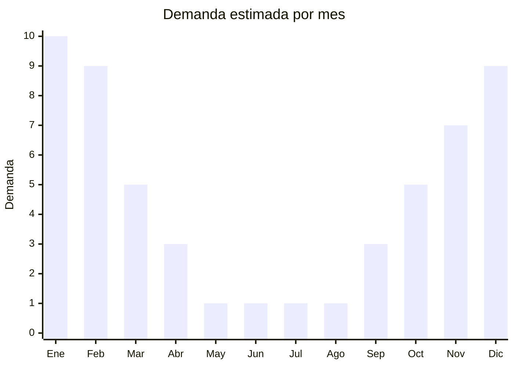

# Shorts y bermudas de punto

> **Capítulo NCM 61** — Prendas y complementos de vestir, de punto | **Temporada:** Verano (Dic–Feb)

## Qué es y por qué importarlo

Los shorts y bermudas de punto son prendas cortas confeccionadas en tejido de punto, utilizadas tanto para baño como para uso casual en verano. Incluyen boardshorts elastizados (poliéster/elastano de punto), bermudas de algodón tipo french terry, shorts deportivos de punto y bermudas casuales de french terry o jersey. Se diferencian de los shorts de tela plana (Cap. 62) por su construcción en tejido de punto, que les otorga mayor elasticidad y comodidad.

China produce shorts de punto en enormes volúmenes, con fábricas en Guangdong, Fujian y Zhejiang especializadas en prendas de baño y deportivas. Los precios FOB son muy competitivos, desde USD 2 por shorts básicos hasta USD 6 por modelos con sublimación completa o tecnología de secado rápido. El mercado argentino tiene alta demanda de bermudas casuales y boardshorts durante todo el verano, tanto para playa como para uso urbano.

El principal obstáculo es el régimen antidumping argentino sobre textiles de punto de China, que encarece la operación. Sin embargo, los márgenes de venta en temporada alta pueden compensar este sobrecosto.

<Warning>
**ANTIDUMPING ACTIVO:** Argentina aplica derechos antidumping sobre prendas de punto de origen China. Verificar las NCM 6103.43 / 6104.63 (pantalones cortos de fibras sintéticas de punto) y posiciones relacionadas contra la resolución vigente de CNCE. Consultar con despachante antes de importar.
</Warning>

## Datos clave

| Dato | Valor |
|------|-------|
| **Posiciones NCM típicas** | 6103.43.00 (pantalones cortos hombre, fibras sintéticas, punto), 6104.63.00 (pantalones cortos mujer, fibras sintéticas, punto), 6103.42.00 (algodón, hombre), 6104.62.00 (algodón, mujer) |
| **Derecho de importación** | 35% (DIE) + 3% tasa estadística |
| **Antidumping** | **Sí — verificar NCM específica contra resolución CNCE vigente** |
| **Rango FOB típico** | USD 2.00 — USD 6.00 por unidad |
| **Precio de venta en Argentina** | ARS 5.000 — ARS 15.000 |
| **Margen bruto estimado** | 150% — 300% (sin antidumping) |
| **MOQ típico** | 300 — 1.000 unidades |
| **Demanda en MercadoLibre** | Alta (estacional) |
| **Competencia en MercadoLibre** | Alta |
| **Dificultad para importar** | Media-Alta (antidumping + etiquetado) |
| **Certificaciones necesarias** | Etiquetado textil IRAM 12560 obligatorio |

## Variantes y subtipos más comunes

| Subtipo / Variante | FOB aprox. | Venta AR aprox. | Nota |
|--------------------|-----------|-----------------|------|
| Boardshort elastizado baño | USD 2.50 — 5.00 | ARS 6.000 — 15.000 | **Más vendido**, sublimado |
| Bermuda french terry algodón | USD 2.50 — 4.50 | ARS 6.000 — 12.000 | Casual urbano, muy versátil |
| Short deportivo hombre | USD 2.00 — 4.00 | ARS 5.000 — 10.000 | Running, gym, playa |
| Short mujer jersey/algodón | USD 2.00 — 3.50 | ARS 5.000 — 10.000 | Casual, pijama, playa |
| Bermuda cargo punto | USD 3.00 — 6.00 | ARS 8.000 — 15.000 | Con bolsillos, streetwear |

## Regulaciones y requisitos

<Tabs>
  <Tab title="Certificaciones">
    | Organismo | Requiere | Detalle |
    |-----------|----------|---------|
    | ARCA (Aduana) | Sí siempre | Despacho con canal textil |
    | CNCE (Antidumping) | **Sí — verificar** | Medidas antidumping vigentes sobre prendas de punto de China |
    | INTI / IRAM | Sí | Etiquetado textil IRAM 12560 obligatorio |
    | ANMAT | No | No aplica |
    | ENACOM | No | No aplica |

    **Recomendación:** Pedir al proveedor la ficha técnica con composición exacta de fibras. Un short de "polyester" puede ser 100% poliéster o mezcla con elastano, y cada composición puede tener NCM y tratamiento antidumping diferente.
  </Tab>

  <Tab title="Etiquetado">
    | Requisito | Aplica |
    |-----------|--------|
    | Idioma español | Sí (obligatorio) |
    | Datos del importador | Sí (razón social, CUIT, domicilio) |
    | Composición de fibras (%) | **Sí — IRAM 12560** (ej: 92% poliéster, 8% elastano) |
    | Talles (sistema argentino) | Sí |
    | País de origen | Sí |
    | Instrucciones de lavado | Sí (símbolos ISO) |
    | Garantía legal 6 meses | Sí |

    <Warning>
    **IRAM 12560 es obligatorio.** Toda prenda textil importada debe cumplir con el etiquetado de composición, cuidado, talle y origen. Incumplir puede resultar en retención aduanera y multas.
    </Warning>
  </Tab>

  <Tab title="Restricciones">
    **Antidumping sobre textiles de China:** Las prendas de punto del Cap. 61 están sujetas a medidas antidumping. El derecho adicional varía según la NCM exacta y puede representar un sobrecosto del 20% al 80% sobre el FOB.

    **Licencias No Automáticas (LNA):** Requeridas para textiles del Cap. 61, agregan 30-60 días al trámite de importación.

    **Alternativa:** Bangladesh, Vietnam y Pakistán ofrecen shorts y bermudas de punto sin antidumping y con precios FOB competitivos. Verificar acuerdos comerciales vigentes.
  </Tab>
</Tabs>

## Logística

| Dato | Valor |
|------|-------|
| **Peso típico por unidad** | 0.15 — 0.30 kg |
| **Volumen típico** | Bajo (prendas livianas y compactas) |
| **Fragilidad** | Nula |
| **Envío recomendado** | Marítimo LCL o aéreo para reposiciones |
| **Tiempo total estimado** | 30 — 45 días (aéreo) / 60 — 90 días (marítimo + LNA) |
| **Baterías de litio** | No |
| **Requiere empaque especial** | No (bolsa individual con hang tag) |

<Tip>
Para boardshorts sublimados, solicitar al proveedor que incluya el **diseño/estampado exclusivo** como parte del MOQ. La sublimación en China cuesta apenas USD 0.30-0.50 adicional por prenda y permite diferenciarse de la competencia con diseños propios que no se encuentran en el mercado local.
</Tip>

## Estacionalidad



| Aspecto | Detalle |
|---------|---------|
| **Meses pico** | Diciembre-Febrero (verano, playa, vacaciones) |
| **Meses valle** | Mayo-Agosto (invierno, sin demanda) |
| **Cuándo pedir** | Julio-Agosto para recibir en octubre-noviembre |

## Ventajas y riesgos

<CardGroup cols={2}>
  <Card title="Ventajas" icon="circle-check">
    - Alta demanda estacional predecible
    - Producto liviano, flete bajo por unidad
    - Bermudas casuales tienen demanda extendida (oct-mar)
    - Sublimación permite diseños exclusivos a bajo costo
    - Boardshorts sirven para baño y uso urbano (versatilidad)
  </Card>
  <Card title="Riesgos" icon="triangle-exclamation">
    - **Antidumping incrementa costos significativamente**
    - Curva de talles: talle chino vs. argentino genera confusión
    - Estacionalidad fuerte: stock sobrante difícil de liquidar
    - Calidad de elásticos y costuras (verificar resistencia al cloro)
    - LNA puede retrasar el ingreso de mercadería
  </Card>
</CardGroup>

## Palabras clave para buscar en Alibaba

```
board shorts wholesale, men swim shorts knit, bermuda shorts wholesale,
french terry shorts bulk, casual shorts summer men, boardshort sublimation,
women knit shorts wholesale, athletic shorts wholesale China
```

## Fuentes

- [MercadoLibre Argentina — Bermudas y shorts](https://listado.mercadolibre.com.ar/bermuda-short)
- [Alibaba — Board shorts wholesale](https://www.alibaba.com/showroom/board-shorts-wholesale.html)
- [CNCE — Medidas antidumping vigentes](https://www.argentina.gob.ar/cnce)
- [IRAM 12560 — Etiquetado textil](https://www.iram.org.ar)
