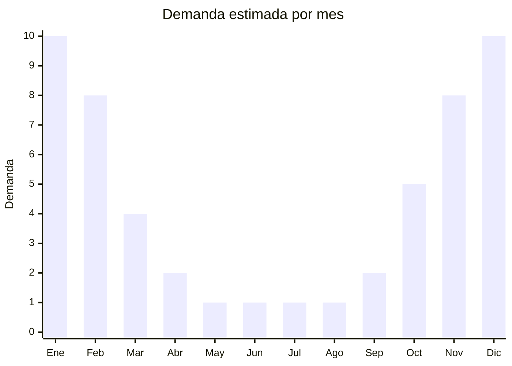

# Trajes de baño y mallas de punto

> **Capítulo NCM 61** — Prendas y complementos de vestir, de punto | **Temporada:** Verano (Dic–Feb)

## Qué es y por qué importarlo

Los trajes de baño de punto incluyen bikinis (dos piezas), enterizas (una pieza), sungas y mallas para hombre y mujer, confeccionados en tejido de punto con fibras sintéticas como poliéster, nylon (poliamida) y elastano (lycra/spandex). A diferencia de los trajes de baño de tela plana (Cap. 62), los de punto tienen mayor elasticidad y adaptabilidad al cuerpo, lo que los convierte en la opción dominante del mercado.

China es el mayor productor mundial de trajes de baño, con clusters especializados en Jinjiang (Fujian), Shantou y Guangdong. Estas zonas producen tanto para marcas internacionales como para exportación genérica con MOQ accesibles. El mercado argentino consume millones de unidades por temporada, y la producción local no alcanza a cubrir la demanda, especialmente en segmentos económicos y de moda rápida.

La ventaja de importar trajes de baño es el margen extraordinario en temporada: un bikini con FOB de USD 3-5 puede venderse a ARS 15.000-25.000 en diciembre-enero. El desafío principal son los derechos antidumping que Argentina aplica a textiles de origen chino, que pueden incrementar significativamente el costo de nacionalización.

<Warning>
**ANTIDUMPING ACTIVO:** Argentina aplica derechos antidumping sobre indumentaria de punto de origen China. Verificar la NCM exacta (6112.31 para trajes de baño de fibras sintéticas de punto femenino, 6112.39 para otras fibras) contra la lista vigente de CNCE. El derecho antidumping puede agregar entre un 20% y un 90% adicional al valor FOB según la posición. Consultar con despachante antes de importar.
</Warning>

## Datos clave

| Dato | Valor |
|------|-------|
| **Posiciones NCM típicas** | 6112.31.00 (trajes de baño de fibras sintéticas, femenino), 6112.39.00 (otros), 6112.41.00 (trajes de baño femenino de fibras sintéticas) |
| **Derecho de importación** | 35% (DIE) + 3% tasa estadística |
| **Antidumping** | **Sí — verificar NCM específica contra resolución CNCE vigente** |
| **Rango FOB típico** | USD 2.00 — USD 8.00 por unidad |
| **Precio de venta en Argentina** | ARS 8.000 — ARS 30.000 |
| **Margen bruto estimado** | 200% — 400% (sin antidumping) |
| **MOQ típico** | 200 — 1.000 unidades (variado por color/talle) |
| **Demanda en MercadoLibre** | Muy Alta (estacional extrema) |
| **Competencia en MercadoLibre** | Alta |
| **Dificultad para importar** | Media-Alta (antidumping + etiquetado) |
| **Certificaciones necesarias** | Etiquetado textil IRAM 12560 obligatorio |

## Variantes y subtipos más comunes

| Subtipo / Variante | FOB aprox. | Venta AR aprox. | Nota |
|--------------------|-----------|-----------------|------|
| Bikini básico 2 piezas | USD 2.00 — 4.00 | ARS 8.000 — 15.000 | **Más vendido**, alto volumen |
| Bikini con diseño/estampado | USD 3.00 — 5.00 | ARS 12.000 — 20.000 | Moda, tendencia |
| Enteriza / malla femenina | USD 4.00 — 8.00 | ARS 15.000 — 30.000 | Mayor valor unitario |
| Sunga / slip hombre | USD 2.00 — 3.50 | ARS 8.000 — 15.000 | Mercado más estable |
| Bikini deportivo / surf | USD 4.00 — 6.00 | ARS 15.000 — 25.000 | Nicho fitness/deporte |

## Regulaciones y requisitos

<Tabs>
  <Tab title="Certificaciones">
    | Organismo | Requiere | Detalle |
    |-----------|----------|---------|
    | ARCA (Aduana) | Sí siempre | Despacho estándar con canal textil |
    | CNCE (Antidumping) | **Sí — verificar** | Resolución antidumping vigente sobre textiles de punto de China |
    | INTI / IRAM | Sí | Etiquetado textil según IRAM 12560 obligatorio |
    | ANMAT | No | No aplica |
    | ENACOM | No | No aplica |

    **Recomendación:** Antes de realizar el pedido, confirmar con un despachante de aduanas la NCM exacta y si tiene derecho antidumping vigente. La diferencia puede hacer inviable la operación. Solicitar muestras con composición exacta de fibras para clasificación correcta.
  </Tab>

  <Tab title="Etiquetado">
    | Requisito | Aplica |
    |-----------|--------|
    | Idioma español | Sí (obligatorio) |
    | Datos del importador | Sí (razón social, CUIT, domicilio) |
    | Composición de fibras (%) | **Sí — IRAM 12560** (ej: 82% poliamida, 18% elastano) |
    | Talles (sistema argentino) | Sí |
    | País de origen | Sí |
    | Instrucciones de lavado | Sí (símbolos ISO) |
    | Garantía legal 6 meses | Sí |

    <Warning>
    **IRAM 12560 es obligatorio** para toda prenda textil importada. El etiquetado debe indicar composición porcentual de fibras, instrucciones de cuidado con simbología, talle, país de origen y datos del importador. El incumplimiento puede resultar en retención de la mercadería en aduana.
    </Warning>
  </Tab>

  <Tab title="Restricciones">
    **Antidumping sobre textiles de China:** Argentina mantiene medidas antidumping sobre diversas prendas de punto originarias de China. La medida se aplica como un derecho adicional (porcentual o específico en USD/kg) sobre el valor FOB declarado.

    **Licencias No Automáticas (LNA):** Los textiles del Cap. 61 están sujetos a Licencias No Automáticas de importación, lo que agrega entre 30 y 60 días al trámite.

    **Alternativa:** Considerar proveedores en Bangladesh, Vietnam o Camboya donde el antidumping generalmente no aplica, aunque los precios FOB pueden ser ligeramente superiores.
  </Tab>
</Tabs>

## Logística

| Dato | Valor |
|------|-------|
| **Peso típico por unidad** | 0.10 — 0.25 kg |
| **Volumen típico** | Bajo (prendas livianas, alta densidad por caja) |
| **Fragilidad** | Nula |
| **Envío recomendado** | Aéreo o marítimo LCL (según volumen) |
| **Tiempo total estimado** | 30 — 45 días (aéreo) / 60 — 90 días (marítimo + LNA) |
| **Baterías de litio** | No |
| **Requiere empaque especial** | No (bolsa individual con hang tag) |

<Tip>
Los trajes de baño son extremadamente livianos y compactos. Un cartón de 60x40x40 cm puede contener entre 100 y 200 unidades. Esto hace que el envío aéreo sea viable para primeras importaciones o reposiciones urgentes en plena temporada, con costo de flete proporcionalmente bajo respecto al valor de la mercadería.
</Tip>

## Estacionalidad



| Aspecto | Detalle |
|---------|---------|
| **Meses pico** | Diciembre-Febrero (verano, vacaciones, playa) |
| **Meses valle** | Mayo-Agosto (sin demanda, fuera de temporada) |
| **Cuándo pedir** | Julio-Agosto para tener stock listo en noviembre |

## Ventajas y riesgos

<CardGroup cols={2}>
  <Card title="Ventajas" icon="circle-check">
    - Margen excepcional en temporada alta
    - Producto liviano, bajo costo de flete
    - Alta rotación en dic-ene-feb
    - Variedad infinita de diseños/colores
    - Ideal para venta online (fácil envío al comprador)
  </Card>
  <Card title="Riesgos" icon="triangle-exclamation">
    - **Antidumping puede duplicar el costo**
    - Estacionalidad extrema: stock sobrante pierde valor
    - Talles y calces: alta tasa de devolución
    - Competencia feroz en temporada
    - LNA agrega demora al despacho
  </Card>
</CardGroup>

## Palabras clave para buscar en Alibaba

```
bikini wholesale China, swimsuit women wholesale, swimwear OEM factory,
one piece swimsuit bulk, men swim trunks knitted, bikini set lycra spandex,
swimwear Jinjiang manufacturer, bathing suit private label
```

## Fuentes

- [MercadoLibre Argentina — Trajes de baño](https://listado.mercadolibre.com.ar/traje-de-bano)
- [Alibaba — Swimwear wholesale](https://www.alibaba.com/showroom/swimwear-wholesale.html)
- [CNCE — Medidas antidumping vigentes](https://www.argentina.gob.ar/cnce)
- [IRAM 12560 — Etiquetado textil](https://www.iram.org.ar)
