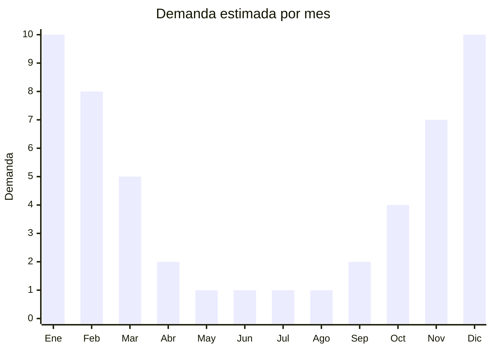

# Camisas hawaianas y tropicales

> **Capítulo NCM 62** — Prendas y complementos de vestir, excepto los de punto | **Temporada:** Verano (Dic–Feb)

## Qué es y por qué importarlo

Las camisas hawaianas (también llamadas camisas tropicales, aloha shirts o camisas de resort) son camisas de manga corta confeccionadas en tela plana liviana (viscosa, rayón, poliéster o algodón), con estampados florales, tropicales, de palmeras, frutas o patrones abstractos coloridos. Son una prenda icónica de la moda masculina de verano que ha experimentado un resurgimiento masivo en los últimos años, impulsada por las tendencias streetwear y la moda casual.

China, especialmente Guangzhou y Dongguan, produce camisas hawaianas en enormes volúmenes con estampados de altísima calidad gracias a la sublimación y la impresión digital. Los precios FOB de USD 3-6 permiten posicionar el producto en un rango accesible de ARS 8.000-20.000 en el mercado argentino, donde marcas como Ayres, Key Biscayne o Etiqueta Negra venden camisas similares a precios superiores.

El producto tiene un perfil de importación atractivo: es liviano, no requiere talle exacto (corte holgado por naturaleza), permite diferenciación vía diseños exclusivos y tiene demanda creciente. Como toda prenda del Cap. 62, el antidumping sobre origen chino es el principal desafío.

<Warning>
**ANTIDUMPING ACTIVO:** Argentina aplica derechos antidumping sobre prendas de origen China. Verificar las NCM 6205.20 (camisas de algodón hombre), 6205.30 (camisas de fibras sintéticas/artificiales hombre) contra la resolución vigente de CNCE. El sobrecosto antidumping puede impactar significativamente en el margen. Consultar con despachante antes de importar.
</Warning>

## Datos clave

| Dato | Valor |
|------|-------|
| **Posiciones NCM típicas** | 6205.20.00 (camisas hombre algodón, tela plana), 6205.30.00 (camisas hombre fibras sintéticas/artificiales), 6206.30.00 (camisas mujer algodón), 6206.40.00 (camisas mujer fibras sintéticas/artificiales) |
| **Derecho de importación** | 35% (DIE) + 3% tasa estadística |
| **Antidumping** | **Sí — verificar NCM específica contra resolución CNCE vigente** |
| **Rango FOB típico** | USD 3.00 — USD 6.00 por unidad |
| **Precio de venta en Argentina** | ARS 8.000 — ARS 20.000 |
| **Margen bruto estimado** | 150% — 280% (sin antidumping) |
| **MOQ típico** | 200 — 500 unidades (por diseño/talle) |
| **Demanda en MercadoLibre** | Alta (estacional, tendencia creciente) |
| **Competencia en MercadoLibre** | Media-Alta |
| **Dificultad para importar** | Media-Alta (antidumping + etiquetado) |
| **Certificaciones necesarias** | Etiquetado textil IRAM 12560 obligatorio |

## Variantes y subtipos más comunes

| Subtipo / Variante | FOB aprox. | Venta AR aprox. | Nota |
|--------------------|-----------|-----------------|------|
| Hawaiana viscosa estampada hombre | USD 3.00 — 5.00 | ARS 8.000 — 15.000 | **Más vendida**, caída suave |
| Hawaiana poliéster sublimada | USD 3.00 — 4.50 | ARS 8.000 — 14.000 | Resistente, no arruga |
| Hawaiana algodón premium | USD 4.00 — 6.00 | ARS 12.000 — 20.000 | Percepción de calidad superior |
| Camisa tropical oversize unisex | USD 3.50 — 5.50 | ARS 10.000 — 18.000 | Tendencia streetwear |
| Set camisa + short a juego | USD 5.00 — 9.00 | ARS 15.000 — 28.000 | Conjunto playa, alto valor percibido |

## Regulaciones y requisitos

<Tabs>
  <Tab title="Certificaciones">
    | Organismo | Requiere | Detalle |
    |-----------|----------|---------|
    | ARCA (Aduana) | Sí siempre | Despacho con canal textil |
    | CNCE (Antidumping) | **Sí — verificar** | Medidas antidumping vigentes sobre camisas de origen China |
    | INTI / IRAM | Sí | Etiquetado textil IRAM 12560 obligatorio |
    | ANMAT | No | No aplica |
    | ENACOM | No | No aplica |

    **Recomendación:** Las camisas de viscosa (fibra artificial, NCM 6205.30) pueden tener tratamiento antidumping diferente a las de algodón (NCM 6205.20). La viscosa es la fibra preferida para camisas hawaianas por su caída y frescura, y puede tener menor impacto antidumping. Confirmar con despachante la NCM exacta.
  </Tab>

  <Tab title="Etiquetado">
    | Requisito | Aplica |
    |-----------|--------|
    | Idioma español | Sí (obligatorio) |
    | Datos del importador | Sí (razón social, CUIT, domicilio) |
    | Composición de fibras (%) | **Sí — IRAM 12560** (ej: 100% viscosa, o 70% viscosa 30% poliéster) |
    | Talles (sistema argentino) | Sí |
    | País de origen | Sí |
    | Instrucciones de lavado | Sí (símbolos ISO) |
    | Garantía legal 6 meses | Sí |

    <Warning>
    **IRAM 12560 es obligatorio.** Las camisas deben llevar etiqueta cosida indicando composición exacta, instrucciones de cuidado, talle, país de origen y datos del importador. La viscosa debe indicarse como "viscosa" (no "rayón" ni "seda vegetal").
    </Warning>
  </Tab>

  <Tab title="Restricciones">
    **Antidumping sobre textiles de China:** Las camisas del Cap. 62 están sujetas a medidas antidumping de origen China. El derecho adicional varía según la NCM y la fibra.

    **Licencias No Automáticas (LNA):** Las camisas del Cap. 62 requieren LNA, sumando 30-60 días al trámite.

    **Alternativa:** India produce camisas de algodón y viscosa de excelente calidad sin antidumping, y es el segundo productor mundial de viscosa. Indonesia y Vietnam también son opciones viables.
  </Tab>
</Tabs>

## Logística

| Dato | Valor |
|------|-------|
| **Peso típico por unidad** | 0.15 — 0.25 kg |
| **Volumen típico** | Bajo (prendas livianas, se doblan compactas) |
| **Fragilidad** | Nula |
| **Envío recomendado** | Marítimo LCL o aéreo para reposiciones |
| **Tiempo total estimado** | 30 — 45 días (aéreo) / 60 — 90 días (marítimo + LNA) |
| **Baterías de litio** | No |
| **Requiere empaque especial** | No (bolsa individual con hang tag) |

<Tip>
El **set camisa + short a juego** (matching set) tiene un valor percibido muy superior a las piezas por separado. El costo FOB del set es apenas USD 5-9 pero se vende a ARS 15.000-28.000 porque se percibe como un "outfit completo de verano". Es la forma más rentable de importar camisas hawaianas y diferenciar la oferta.
</Tip>

## Estacionalidad



| Aspecto | Detalle |
|---------|---------|
| **Meses pico** | Diciembre-Febrero (verano, fiestas, vacaciones) |
| **Meses valle** | Mayo-Agosto (sin demanda de manga corta tropical) |
| **Cuándo pedir** | Julio-Agosto para stock listo en noviembre |

## Ventajas y riesgos

<CardGroup cols={2}>
  <Card title="Ventajas" icon="circle-check">
    - Tendencia de moda creciente (streetwear, casual premium)
    - Corte holgado reduce problemas de talle
    - Diseños exclusivos diferencian de la competencia
    - Sets camisa+short multiplican el ticket promedio
    - Producto ideal para marca propia (private label)
  </Card>
  <Card title="Riesgos" icon="triangle-exclamation">
    - **Antidumping sobre origen China**
    - Viscosa puede encogerse si no se lava correctamente (indicar en etiqueta)
    - Estacionalidad marcada: difícil vender en invierno
    - Calidad de estampado variable (sublimación vs. screen vs. digital)
    - Competencia creciente por popularidad de la tendencia
  </Card>
</CardGroup>

## Palabras clave para buscar en Alibaba

```
hawaiian shirt men wholesale, tropical shirt viscose, aloha shirt men bulk,
printed camp collar shirt, resort shirt wholesale, beach shirt men factory,
floral shirt short sleeve, matching set shirt shorts tropical
```

## Fuentes

- [MercadoLibre Argentina — Camisas hawaianas](https://listado.mercadolibre.com.ar/camisa-hawaiana)
- [Alibaba — Hawaiian shirt wholesale](https://www.alibaba.com/showroom/hawaiian-shirt-wholesale.html)
- [CNCE — Medidas antidumping vigentes](https://www.argentina.gob.ar/cnce)
- [IRAM 12560 — Etiquetado textil](https://www.iram.org.ar)
