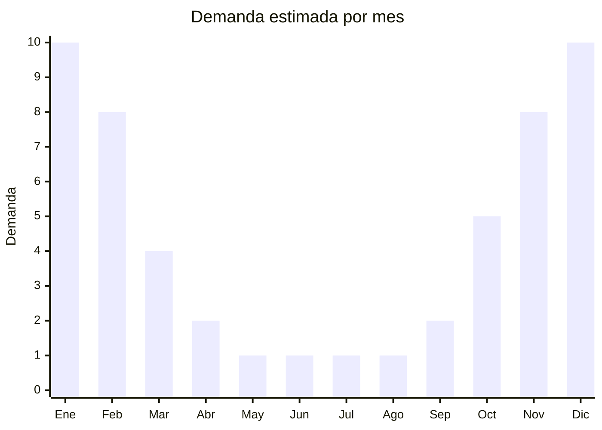

# Shorts de baño y boardshorts de tela

> **Capítulo NCM 62** — Prendas y complementos de vestir, excepto los de punto | **Temporada:** Verano (Dic–Feb)

## Qué es y por qué importarlo

Los shorts de baño de tela plana son prendas cortas confeccionadas en tejido plano (no de punto), principalmente en poliéster microfilamento, nylon taslan o nylon ripstop, con forro interior de malla. Se diferencian de los shorts de punto (Cap. 61) por el tipo de tejido: el tejido plano les da una caída más estructurada y un secado ultra rápido. Los boardshorts de tela son el formato dominante en el mercado masculino de baño en Argentina.

El mercado está fuertemente orientado al público masculino. Las marcas líderes en Argentina (Billabong, Quiksilver, Rusty, Rip Curl) venden boardshorts de tela a precios elevados (ARS 20.000-50.000), lo que deja un enorme espacio para importadores que ofrecen modelos genéricos o de marca propia a ARS 5.000-15.000. China produce la gran mayoría de estos shorts, con fábricas en Guangdong, Fujian y Zhejiang que manejan desde básicos lisos hasta sublimaciones fotorrealistas complejas.

El producto es ideal para importar por su ligereza, alta demanda estacional y márgenes atractivos. Sin embargo, el antidumping sobre textiles de China requiere una planificación cuidadosa del costo.

<Warning>
**ANTIDUMPING ACTIVO:** Argentina aplica derechos antidumping sobre prendas de origen China, incluidas las de tela plana del Cap. 62. Verificar las NCM 6203.43 (pantalones cortos hombre, fibras sintéticas) y 6204.63 (mujer) contra la resolución vigente de CNCE. El sobrecosto antidumping puede impactar significativamente el margen. Consultar con despachante antes de importar.
</Warning>

## Datos clave

| Dato | Valor |
|------|-------|
| **Posiciones NCM típicas** | 6203.43.00 (pantalones cortos hombre, fibras sintéticas, tela plana), 6204.63.00 (pantalones cortos mujer, fibras sintéticas, tela plana) |
| **Derecho de importación** | 35% (DIE) + 3% tasa estadística |
| **Antidumping** | **Sí — verificar NCM específica contra resolución CNCE vigente** |
| **Rango FOB típico** | USD 2.00 — USD 5.00 por unidad |
| **Precio de venta en Argentina** | ARS 5.000 — ARS 15.000 |
| **Margen bruto estimado** | 150% — 300% (sin antidumping) |
| **MOQ típico** | 300 — 1.000 unidades |
| **Demanda en MercadoLibre** | Alta (estacional, predomina masculino) |
| **Competencia en MercadoLibre** | Alta |
| **Dificultad para importar** | Media-Alta (antidumping + etiquetado) |
| **Certificaciones necesarias** | Etiquetado textil IRAM 12560 obligatorio |

## Variantes y subtipos más comunes

| Subtipo / Variante | FOB aprox. | Venta AR aprox. | Nota |
|--------------------|-----------|-----------------|------|
| Boardshort liso básico | USD 2.00 — 3.00 | ARS 5.000 — 8.000 | Económico, alto volumen |
| Boardshort sublimado estampado | USD 3.00 — 4.50 | ARS 8.000 — 13.000 | **Más vendido**, diseños tropicales |
| Short baño con elástico cintura | USD 2.00 — 3.50 | ARS 5.000 — 10.000 | Práctico, sin cordón |
| Boardshort largo (debajo rodilla) | USD 3.00 — 5.00 | ARS 8.000 — 15.000 | Estilo surf, 21" |
| Short baño niño | USD 1.50 — 3.00 | ARS 4.000 — 8.000 | Infantil, colores vivos |

## Regulaciones y requisitos

<Tabs>
  <Tab title="Certificaciones">
    | Organismo | Requiere | Detalle |
    |-----------|----------|---------|
    | ARCA (Aduana) | Sí siempre | Despacho con canal textil |
    | CNCE (Antidumping) | **Sí — verificar** | Medidas antidumping vigentes sobre prendas de tela plana de China |
    | INTI / IRAM | Sí | Etiquetado textil IRAM 12560 obligatorio |
    | ANMAT | No | No aplica |
    | ENACOM | No | No aplica |

    **Recomendación:** Verificar si el forro interior de malla del short puede cambiar la clasificación arancelaria. Algunos shorts con forro de punto podrían clasificarse parcialmente bajo Cap. 61. La clasificación exacta impacta en el arancel y antidumping aplicable.
  </Tab>

  <Tab title="Etiquetado">
    | Requisito | Aplica |
    |-----------|--------|
    | Idioma español | Sí (obligatorio) |
    | Datos del importador | Sí (razón social, CUIT, domicilio) |
    | Composición de fibras (%) | **Sí — IRAM 12560** (ej: tela exterior 100% poliéster, forro 100% poliéster) |
    | Talles (sistema argentino) | Sí |
    | País de origen | Sí |
    | Instrucciones de lavado | Sí (símbolos ISO) |
    | Garantía legal 6 meses | Sí |

    <Warning>
    **IRAM 12560 es obligatorio.** Para shorts con forro, se debe indicar la composición de la tela exterior Y del forro por separado. Ej: "Exterior: 100% poliéster. Forro: 100% poliéster malla".
    </Warning>
  </Tab>

  <Tab title="Restricciones">
    **Antidumping sobre textiles de China:** Las prendas de tela plana del Cap. 62 también están sujetas a medidas antidumping. Verificar la resolución vigente de CNCE para la NCM específica del producto.

    **Licencias No Automáticas (LNA):** Requeridas para textiles del Cap. 62, agregan 30-60 días al proceso de importación.

    **Alternativa:** Bangladesh, Vietnam y Camboya producen boardshorts de calidad comparable sin antidumping. Especialmente Bangladesh tiene costos competitivos en shorts de poliéster y nylon.
  </Tab>
</Tabs>

## Logística

| Dato | Valor |
|------|-------|
| **Peso típico por unidad** | 0.15 — 0.30 kg |
| **Volumen típico** | Bajo (prendas livianas, compactas) |
| **Fragilidad** | Nula |
| **Envío recomendado** | Marítimo LCL o aéreo para primeras compras |
| **Tiempo total estimado** | 30 — 45 días (aéreo) / 60 — 90 días (marítimo + LNA) |
| **Baterías de litio** | No |
| **Requiere empaque especial** | No (bolsa individual con hang tag) |

<Tip>
Los boardshorts de nylon taslan tienen **mejor secado y tacto** que los de poliéster puro, y en el mercado argentino se perciben como de mayor calidad. La diferencia de costo FOB es mínima (USD 0.30-0.50 más por unidad) pero permite posicionar el producto en un rango de precio superior y diferenciarse de la competencia de poliéster básico.
</Tip>

## Estacionalidad



| Aspecto | Detalle |
|---------|---------|
| **Meses pico** | Diciembre-Febrero (verano, playa, pileta) |
| **Meses valle** | Mayo-Agosto (sin demanda) |
| **Cuándo pedir** | Julio-Agosto para tener stock en noviembre |

## Ventajas y riesgos

<CardGroup cols={2}>
  <Card title="Ventajas" icon="circle-check">
    - Demanda masiva y predecible en verano
    - Producto liviano, bajo costo de flete
    - Sublimación permite diseños únicos sin costo extra significativo
    - Mercado masculino con compra recurrente (varios shorts por temporada)
    - Secado rápido como valor agregado real
  </Card>
  <Card title="Riesgos" icon="triangle-exclamation">
    - **Antidumping encarece la operación**
    - Estacionalidad extrema: stock sobrante sin salida hasta siguiente verano
    - Competencia con marcas surf posicionadas (Quiksilver, Billabong)
    - Calidad de costuras y ojales (punto débil en modelos económicos)
    - Decoloración con cloro en shorts de baja calidad
  </Card>
</CardGroup>

## Palabras clave para buscar en Alibaba

```
board shorts men wholesale, swim trunks woven fabric, beach shorts polyester,
nylon taslan swim shorts, sublimation boardshort factory, men swim shorts bulk,
surf shorts wholesale China, quick dry beach shorts OEM
```

## Fuentes

- [MercadoLibre Argentina — Shorts de baño hombre](https://listado.mercadolibre.com.ar/short-bano-hombre)
- [Alibaba — Board shorts wholesale](https://www.alibaba.com/showroom/board-shorts-wholesale.html)
- [CNCE — Medidas antidumping vigentes](https://www.argentina.gob.ar/cnce)
- [IRAM 12560 — Etiquetado textil](https://www.iram.org.ar)
